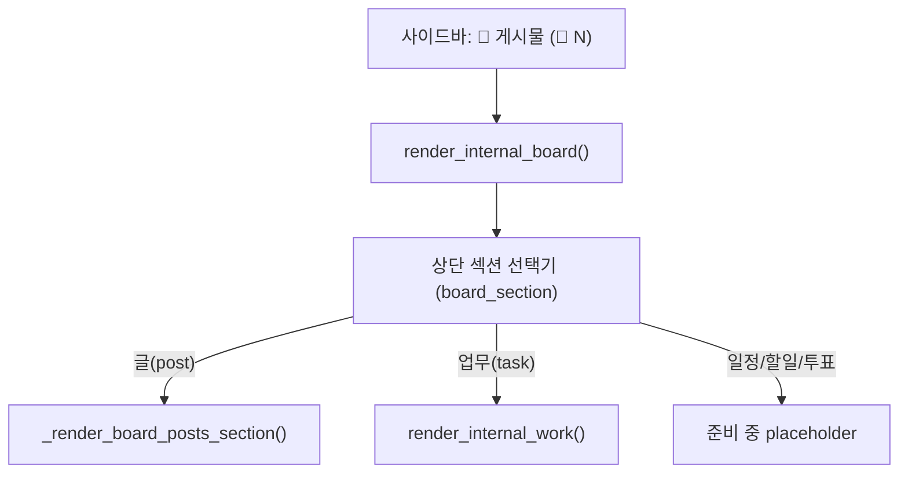

## 목표

- `📝 게시물` 페이지를 단일 허브로 통합. 상단 가로 섹션 선택기(글 / 업무 / 일정 / 할일 / 투표)에서 **업무**를 누르면 기존 `render_internal_work()` 본문이 그 자리에 렌더.
- 사이드바 `📋 사내 업무` 메뉴 제거, `🔔` 미확인 알림 뱃지는 `📝 게시물` 버튼으로 이동.
- 일정/할일/투표는 비활성 플레이스홀더(레지스트리)로 두어 나중에 `enabled=True` + `render_fn`만 연결하면 켜지도록 확장.

## 구조 (통합 후)



## 변경 사항

### 1. 섹션 레지스트리 + 디스패치 — [app.py](app.py) `render_internal_board()` (15840~)

현재 `with st.expander("✍️ 게시물 작성")` 안의 `st.tabs([...])` 서브탭(15876~15883)을 제거하고, 페이지 상단에 가로 섹션 선택기를 둡니다. 공통 헤더는 중립화하고 각 섹션이 자체 본문을 렌더.

```python
st.header("📋 사내 게시판")
BOARD_SECTIONS = [
    ("post", "📝 글", True),
    ("task", "✅ 업무", True),
    ("sched", "📅 일정", False),
    ("todo", "☑️ 할일", False),
    ("vote", "🗳️ 투표", False),
]
labels = [lbl for _, lbl, _ in BOARD_SECTIONS]
# 진입 시 task 선호 플래그(사이드바 리다이렉트용) 반영
default_idx = 1 if st.session_state.pop("board_goto_task", False) else 0
choice = st.radio("섹션", labels, index=default_idx, horizontal=True,
                  label_visibility="collapsed", key="board_section_label")
sec_key = next(k for k, lbl, _ in BOARD_SECTIONS if lbl == choice)
enabled = next(e for k, _, e in BOARD_SECTIONS if k == sec_key)
```

- `sec_key == "post"` → 아래 2번 `_render_board_posts_section(...)` 호출
- `sec_key == "task"` 그리고 enabled → `render_internal_work()` 호출 (자체 테이블 ensure·헤더·검색·핀·알림 그대로 사용)
- 그 외(비활성) → `st.info(f"'{choice}' 기능은 준비 중입니다.")`

(가로 탭 모양 유지를 위해 `st.segmented_control`이 가능한 버전이면 그걸 우선 사용, 아니면 위 `st.radio(horizontal=True)`로 폴백.)

### 2. 글 섹션 본문 추출 — [app.py](app.py)

현재 `render_internal_board` 본문 중 글 작성폼 + 검색 + 목록 부분(15875~15925, 단 서브탭 제외)을 `_render_board_posts_section(me_uname, store_name, role, store_id)`로 추출. 작성 영역은 `_render_new_post_form` 하나만 호출(서브탭 없음). 동작/위젯 키는 그대로 유지.

### 3. 사이드바·라우팅 정리 — [app.py](app.py) 22322~22325, 22378~22384

- `📋 사내 업무` 버튼(22322~22323) 제거.
- `📝 게시물` 버튼에 기존 `_badge`(🔔 미확인 수) 부착: `st.sidebar.button(f"📝 게시물{_badge}", ...)`.
- 레거시 상태 호환: `active_admin_page == "internal_work"` 분기(22378~22380)는 `st.session_state["board_goto_task"]=True` 후 `render_internal_board()` 호출로 리다이렉트(또는 해당 분기에서 `active_admin_page="internal_board"`로 치환).

### 4. 확장성 (투표/할일 나중에)

- 위 `BOARD_SECTIONS` 레지스트리에 향후 `render_fn`을 추가하는 형태로 확장(예: `("vote","🗳️ 투표", True, _render_vote_section)`). 활성화 시 디스패치에서 `enabled` 분기만 함수 호출로 바꾸면 됨 — 신규 백엔드는 `post_board.py` 패턴(테이블·로더·CRUD·캐시)을 그대로 따름.
- DB는 기능 추가 시 `SUPABASE_APP_VOTES.sql` / `SUPABASE_APP_TODOS.sql` 신규 + 자동생성 목록 등록(현 `SUPABASE_APP_POSTS.sql` 방식 동일). 이번 작업 범위에는 미포함(플레이스홀더만).

## 검증 기준

- 게시물 페이지 진입 → '글' 기본, 작성/댓글/첨부/검색/태그/핀 기존대로 동작.
- '업무' 선택 → 기존 사내 업무(등록·하위업무·간트·댓글·첨부·알림·기밀 카테고리) 전부 동작, 회귀 없음.
- 사이드바에서 `📋 사내 업무` 사라지고 `📝 게시물`에 🔔 뱃지 표시. 알림 카운트 정확.
- 일정/할일/투표 선택 시 '준비 중' 안내만 표시.