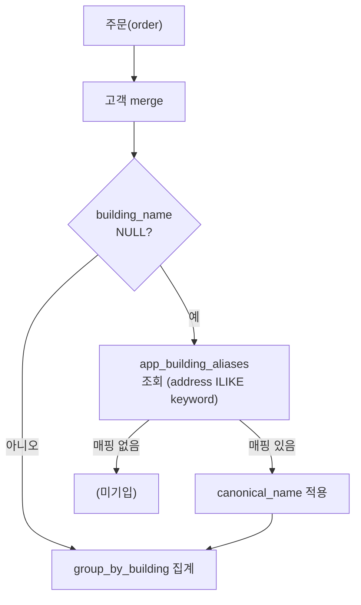

# Building Alias Mapping 구현 계획

## 현재 문제

- `app_customers.building_name` 은 `road_address.building_name` 에서만 채워짐
- 신규 입주 아파트는 도로명 주소 미생성 → `building_name = NULL`
- `group_by_building()` 은 NULL 행을 탈락시켜 매출 누락

## 구현 구조



## Step 1 — Supabase 테이블 생성

새 SQL 파일 `SUPABASE_APP_BUILDING_ALIASES.sql`:

```sql
CREATE TABLE IF NOT EXISTS app_building_aliases (
  id          BIGSERIAL PRIMARY KEY,
  store_name  TEXT NOT NULL,          -- 매장 격리
  keyword     TEXT NOT NULL,          -- 주소 부분 일치 검색어 (예: '달천이파크')
  building_name TEXT NOT NULL,        -- 정식 건물명 (예: '달천이파크1차아파트')
  created_at  TIMESTAMPTZ DEFAULT now(),
  UNIQUE(store_name, keyword)
);
```

## Step 2 — sales_report_service.py 수정

- `_fetch_building_aliases(store_keys)` 함수 추가: `app_building_aliases` 조회 → `{keyword: canonical_name}` dict 반환
- `group_by_building(orders, customers, aliases)` 시그니처 변경:
  - `building_name` NULL인 행에 대해 `address` 컬럼을 alias dict 키워드와 `in` 비교 (pandas `str.contains`)
  - 매칭 시 `canonical_name` 으로 채움
- `build_dataset()` 에서 `aliases = _fetch_building_aliases(store_keys)` 호출 후 전달

핵심 변경 (`sales_report_service.py` line 476~490):

```python
def group_by_building(orders, customers, aliases=None, top=10):
    cust = customers[["id", "building_name", "address"]].rename(columns={"id": "customer_id"})
    df = orders.merge(cust, on="customer_id", how="left")
    df["building_name"] = df["building_name"].fillna("").astype(str).str.strip()
    # alias fallback
    if aliases:
        mask = df["building_name"] == ""
        for kw, canonical in aliases.items():
            hit = mask & df["address"].fillna("").str.contains(kw, case=False, na=False)
            df.loc[hit, "building_name"] = canonical
            mask = mask & ~hit   # 이미 매핑된 행 제외
    df = df[df["building_name"] != ""]
    ...
```

## Step 3 — app.py 관리자 UI 추가

위치: `관리자메뉴` 탭 또는 `AI 세일즈 리포트 > 설정` 섹션 (기존 탭에 expander 추가)

UI 구성:
- `st.expander("🏢 건물명 별칭 관리 (신규 입주 아파트)")` 안에:
  - 현재 alias 목록 `st.dataframe`
  - `st.text_input` 키워드 + `st.text_input` 정식 건물명 + "추가" 버튼
  - 삭제 버튼 (행 선택 후)
- Supabase `app_building_aliases` upsert/delete

## Step 4 — 고객 UPDATE 시 building_name 동기화 (보너스 버그 픽스)

`app.py` line ~26945: 주소 수정 저장 시 `building_name`, `sigungu` 등 지역 컬럼도 함께 갱신 (현재 `lat/lon` 만 갱신 중)

## 관련 파일

- [`sales_report_service.py`](sales_report_service.py): `group_by_building`, `build_dataset` 수정
- [`app.py`](app.py): 관리자 UI 추가 (관리자메뉴 탭), 고객 주소 UPDATE 수정
- 신규: `SUPABASE_APP_BUILDING_ALIASES.sql`
