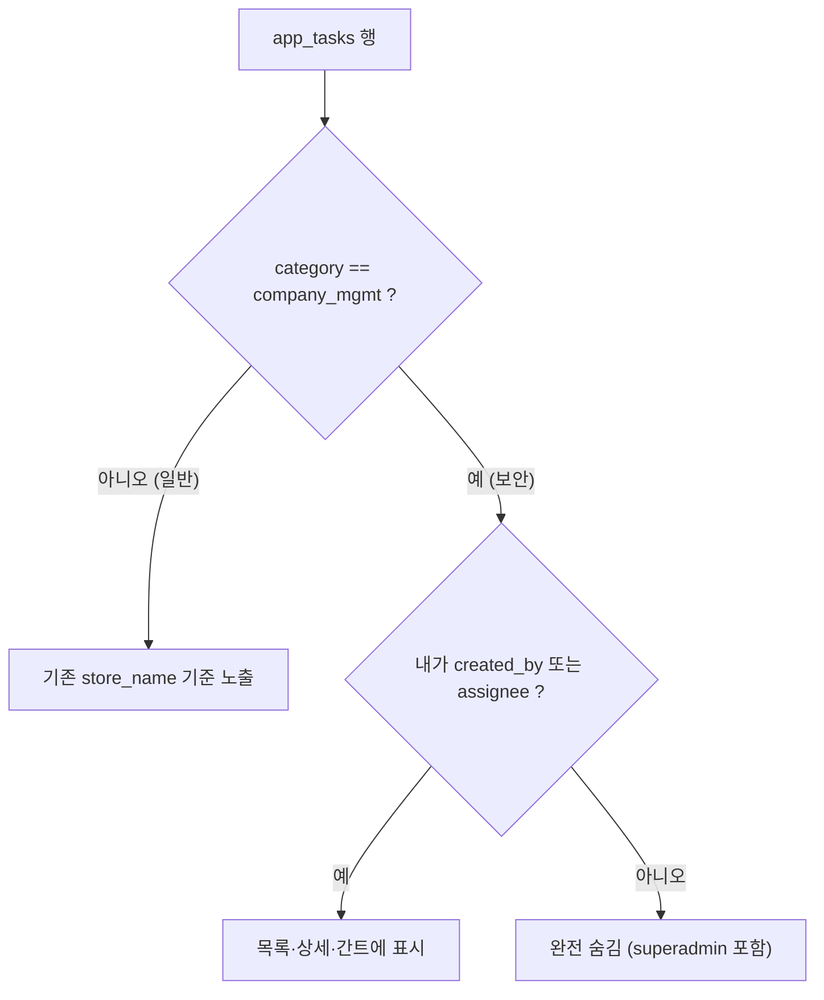

## 회사 경영(보안) 업무 카테고리 추가 플랜

기존 계획 문서 [docs/plans/internal_task_approval_doc_2955b627.plan.md](docs/plans/internal_task_approval_doc_2955b627.plan.md)의 권한 모델(§7)을 확장한다.

### 확정된 정책
- 보안 카테고리는 `회사 경영` 1종 고정 (코드값 `company_mgmt`).
- 가시성: **작성자(created_by) + 지정된 담당자(assignee)만**. 매장 무관, superadmin 자동 열람 없음(본인이 작성/담당인 경우에만 보임).
- 생성 권한: `superadmin` + `store_admin`. 일반 `user`는 보안 업무 생성 불가.
- 담당자 지정: 다른 매장 관리자/직원까지 **교차 지정 가능**.

### 가시성 모델

### 1. DB 스키마 (신규 파일 + 수동 1회 실행)
- 신규 `SUPABASE_APP_TASKS_CATEGORY.sql`:
  - `ALTER TABLE app_tasks ADD COLUMN IF NOT EXISTS category TEXT;`
  - `CREATE INDEX IF NOT EXISTS idx_app_tasks_category ON app_tasks(category);`
- [app.py](app.py) L531·L595 두 SQL 목록에 파일명 등록 (신규 배포 자동 반영용).
- 기존 운영 DB는 `app_tasks`가 이미 있어 자동 DDL이 단축 반환되므로 Supabase SQL Editor에서 1회 수동 실행 필요. (DB 스키마 변경 → 사용자 확인 후 진행)

### 2. 백엔드 [task_board.py](task_board.py)
- 상수 추가: `CONFIDENTIAL_CATEGORY = "company_mgmt"`, `CATEGORY_LABELS = {"company_mgmt": "회사 경영(보안)"}`.
- `create_task(...)`에 `category: str | None = None` 파라미터 추가 → insert row에 `"category"` 포함. 알림은 기존대로 담당자에게만 발송(누출 없음).
- `load_tasks_cached(...)`: 반환 직전 `category != CONFIDENTIAL_CATEGORY` 행만 남기도록 필터(일반 목록에서 보안 업무 제외 — superadmin 포함).
- 신규 `load_my_confidential_tasks_cached(me_uname, include_done=False)`:
  - `app_task_assignees`에서 `employee_username == me_uname`인 task_id 수집
  - `app_tasks`에서 `category == company_mgmt` 조회 후 `created_by == me_uname OR id in 내_task_ids`로 필터·중복 제거
- `clear_task_caches()`에 신규 로더 `.clear()` 추가.

### 3. 화면 [app.py](app.py) `render_internal_work` (L14346 부근)
- 목록 구성을 병합으로 변경:
  - 일반: `_tb.load_tasks_cached(...)` (보안 제외됨)
  - 보안: `_tb.load_my_confidential_tasks_cached(me_uname, include_done=show_done)`
  - `tasks = 일반 + 보안` (id 기준 dedupe) 후 기존 status_filter 적용
- 트리/간트는 이 병합 리스트만 사용하므로 추가 누출 없음 (orphan child는 기존 `extra_roots` 보강 경로가 처리).

### 4. 신규 업무 폼 `_render_new_task_form` (L14936)
- `role in (store_admin, superadmin)`일 때만 카테고리 선택 노출: `["(일반 업무)", "회사 경영(보안)"]`.
- 보안 선택 시:
  - 담당자 후보 = 교차 매장 전체 (아래 `_internal_work_employee_options(cross_store=True)`)
  - 상위 업무 후보 = 내가 볼 수 있는 보안 업무만
  - `🔒 작성자와 지정 담당자에게만 보입니다` 캡션 표시
- `create_task(..., category=...)` 전달. store_name은 작성자 매장 그대로 기록(가시성은 무시).

### 5. 후보 헬퍼 보강
- `_internal_work_employee_options(store_id, role, cross_store=False)` (L15023): `cross_store=True`이고 role이 관리자급이면 전 직원 반환(현재 superadmin 경로 재사용).
- `_internal_work_parent_options(...)` (L15049): 보안 생성용 분기 추가 — 보안일 때 `load_my_confidential_tasks_cached` 결과만 후보로.

### 6. 상세/표시 보강
- `_render_task_card` (L15056): 보안 업무에 `🔒 회사 경영` 뱃지 표시.
- `_render_task_detail` (L15208): 담당자 추가 셀렉트가 보안 업무면 교차 매장 후보를 쓰도록 동일 분기 적용(담당자 추가 시 신규 인원에게 알림 → 의도된 동작).

### 검증 기준
- store_admin A가 다른 매장 store_admin B를 담당자로 보안 업무 생성 → B 목록/간트에 보임, 같은 매장 일반 직원 C에게는 안 보임.
- 미지정 superadmin의 일반 목록에 해당 보안 업무 미표시.
- 상위 업무 셀렉트·간트차트에 타인의 보안 업무 제목 미노출.
- 기존 일반 업무 동작·매장 가시성 변화 없음.

### 미해결/주의
- 보안 업무의 하위 업무 카테고리 처리: MVP는 하위 업무 생성 시 상위 카테고리를 자동 상속(보안 상위 → 보안 하위). 폼에서 상위가 보안이면 category 자동 지정.
- 카카오 친구톡 알림 본문에 제목 포함 — 수신자가 담당자뿐이라 누출 아님(현행 유지).
