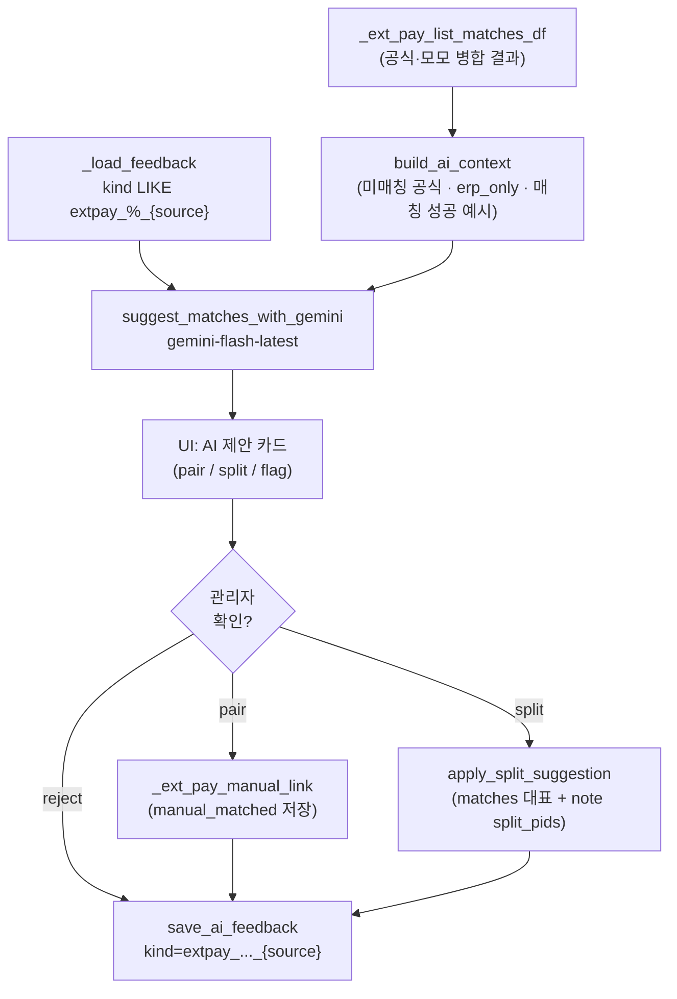

# AI 유사 매칭 (외부결제 대사)

## 배경

`_ext_pay_match_onnuri` / `_ext_pay_match_ulsanpay` / `_ext_pay_match_card` / `_ext_pay_match_mainpay` 는 규칙 기반. 실측상 여전히 `official_only` / `ambiguous` / `amount_mismatch` / `erp_only` 가 남는다. 원가 대사에는 이미 [`import_cost_reconcile.py`](import_cost_reconcile.py) `suggest_with_gemini` 가 있고, 관리자 UI 에서 "Gemini 분할·이상 제안" 버튼으로 호출한다. 동일 패턴을 외부결제 대사에 적용해, 담당자 소명 요청 전에 유사 매칭을 시도한다.

## 결정 사항 (확정)

- **대상 소스**: 온누리 우선 파일럿 → 검증 후 울산페이/카드/메인페이 순차 확장. 코드는 처음부터 `source` 인자로 4종 모두 지원하되, UI 활성화는 온누리에서 시작.
- **피드백 저장**: 기존 [`app_import_ai_feedback`](SUPABASE_APP_IMPORT_AI_FEEDBACK.sql) 재사용. 스키마 변경 없음. `kind` 값에 소스 접미사를 붙여 소스별 분리: `extpay_pair_onnuri`, `extpay_split_onnuri`, `extpay_flag_onnuri`, `..._ulsanpay`, `..._card`, `..._mainpay`.
- **피드백 조회 격리**: [`import_cost_reconcile.py`](import_cost_reconcile.py) 의 `load_ai_feedback` 은 kind 필터가 없어 원가 대사 예시가 섞인다. 새 파일 안에 자체 로더 `_load_feedback(sc, db, source)` 를 두어 `kind LIKE 'extpay_%_{source}'` 로만 뽑는다. 원가 대사 함수는 건드리지 않음.
- **자동 적용 없음**: 모든 제안은 관리자 승인 후에만 `_ext_pay_manual_link` (기존) 로 저장. 원가 대사와 동일한 UX.

## 학습 메커니즘의 실제 (기대치 정렬)

- 이 계획의 학습은 **파인튜닝이 아니라 in-context few-shot**. 매 호출마다 프롬프트에 accepted 8건 + rejected 4건 = 12건 예시가 들어감.
- 소스별 분리로 **원가 대사 사례가 외부결제 대사 프롬프트에 섞이지 않음** (오탐 방지).
- 시간이 지날수록 최근 12건이 계속 갱신되어 매장·소스별 최신 패턴을 반영. 다만 **12건이 상한**이라 무한 향상은 아니고, 매장 특화 오탐이 반복되면 억제되는 수준.
- 규칙 편입(3회+ accepted 패턴을 매칭 함수로 승격)은 이번 계획 범위 밖. 후속 계획으로 다룬다.

## 흐름



## 신규 파일: `ext_pay_ai_reconcile.py`

원가 대사 파일과 같은 위치, 같은 스타일. `httpx` 만 사용 (SDK 미의존).

```python
def build_ai_context(df, source: str, *, max_official: int = 60, max_erp_only: int = 60,
                    max_examples: int = 12) -> dict:
    """df 에서 AI 에 넘길 컨텍스트 dict 를 만든다.
    - unmatched_official: [{row_id, tx_date, tx_time, last4, approval, amount,
      buyer_masked, tx_status, result_code}]
    - erp_only: [{payment_id, order_id, payment_date, amount, method, card_company,
      approval, customer_masked, employee_names}]
    - matched_examples: [{official:{...}, payment:{...}}]  # matched_ok 정답 예시
    """


def _load_feedback(sc, db_filename: str, source: str,
                   *, accept_n: int = 8, reject_n: int = 4) -> list[dict]:
    """kind LIKE 'extpay_%_{source}' 필터로 해당 소스 피드백만 조회.
    - accepted 8건 + rejected 4건 반환. import_cost_reconcile 은 건드리지 않음."""


def _save_feedback(sc, db_filename: str, kind_base: str, source: str,
                   payload: dict, decision: str, decided_by: str) -> bool:
    """kind = f'{kind_base}_{source}' 로 저장. kind_base ∈ {extpay_pair, extpay_split, extpay_flag}"""


def suggest_matches_with_gemini(*, api_key: str, source: str, context: dict,
                                 feedback: list[dict], timeout: float = 30.0) -> dict:
    """반환 스키마 (원가 대사 함수와 동일 톤):
    {
      "pairs":  [{"row_id": int, "payment_id": int,
                  "reason": str, "confidence": float}],
      "splits": [{"row_id": int, "payment_ids": [int],
                  "reason": str, "confidence": float}],
      "flags":  [{"row_id": int|None, "payment_id": int|None,
                  "type": str, "reason": str, "confidence": float}],
      "error": str|None
    }
    """


def apply_pair_suggestion(sc, db_filename: str, source: str, row_id: int,
                          payment_id: int, matched_by: str, note: str) -> tuple[bool, str|None]:
    """기존 _ext_pay_manual_link 를 호출. note 에 'AI 유사매칭' 프리픽스."""


def apply_split_suggestion(sc, db_filename: str, source: str, row_id: int,
                           payment_ids: list[int], matched_by: str,
                           note: str) -> tuple[bool, str|None]:
    """대표 payment_id 는 최대 금액, 나머지는 _ext_pay_encode_split_pids 로 note 인코딩.
    result_code='split_matched' 로 upsert (row_id UNIQUE). 기존 split 저장 형식과 호환."""
```

프롬프트 요지 (원가 대사와 동일한 톤):
- 도메인 설명: "외부결제 대사. 공식 파일과 모모 결제를 잇는다."
- 판단 기준: 승인번호 일치, 전화 뒤4 일치, 결제일 ±2일, 구매자 마스킹 이름 부분 매치, 시각 일치, 같은 주문의 분할결제.
- 확실하지 않으면 넣지 마라. 확신 < 0.5 는 skip.
- JSON 만 반환. 자동 확정하지 않음.
- 프롬프트 12,000자 제한 + `responseMimeType=application/json`.

개인정보 마스킹:
- 고객명은 이미 df 의 `구매자` 컬럼이 마스킹. 이름을 AI 로 넘기기 전에 성만 남기고 마스킹 확장 (`장상국` → `장*국`).
- 전화번호는 마지막 4자리만 넘김. 앞자리 미전송.
- 매장 db_filename 은 넘기지 않음.

## UI 통합: `_render_external_pay_admin_section`

수동 매칭 UI 위에 신규 expander.

```
결과 표 + 캡션
└ 🤖 AI 유사 매칭 제안 (Gemini)  ← 신규
└ 🔧 공식 행 수동 매칭
└ 📬 매출·입력담당 소명 요청
└ 💵 ERP-only 수기 확인
```

로직:
1. `role in ("store_admin", "superadmin")` 이고 `GEMINI_API_KEY` 존재 시에만 활성.
2. 소스 게이팅: 온누리 파일럿 단계에서는 `sel_src == "onnuri"` 에서만 노출. 다른 소스는 "곧 지원" 캡션.
3. "AI 제안 생성" 버튼 → `build_ai_context(df, sel_src)` → `suggest_matches_with_gemini` → `st.session_state[f"extpay_ai::{sel_db}::{sel_src}"]` 캐시.
4. pair 카드: `2026-09-06 · 1,330,000원 · 온누리 · 구매자 최*형 · 뒤4 2380 → #pid13964 (신뢰 0.82) · 사유: ...` + 확인/거절 버튼.
5. split 카드: 대표+참여 payment_id 들, 합계 표시 + 확인/거절.
6. flag 는 검토용 표시만. 승인·거절 클릭 시 피드백만 저장.
7. 확인 시 `apply_pair_suggestion` 또는 `apply_split_suggestion` 실행 후 `_save_feedback(kind_base="extpay_pair"|"extpay_split", source=sel_src, decision="accepted")`. 화면 rerun.
8. 거절 시 `_save_feedback(..., decision="rejected")` 만.

버튼 키: `extpay_ai_pair_ok::{sel_db}::{sel_src}::{row_id}::{payment_id}` 형태로 세션 충돌 방지.

## 비용·rate limit

- 수동 트리거만 (자동 호출 없음).
- 세션 캐시로 재조회 시 재호출 방지 (사용자가 "다시 생성" 버튼 별도 제공).
- 프롬프트 12,000자 제한.
- 컨텍스트 상한: 미매칭 공식 60건, erp_only 60건, matched 성공 예시 12건.

## 검증 시나리오

1. 첨부 케이스: 공식 A(2380, 1,890,000) + 공식 B(2380, 1,330,000) + 결제 13963(last4=2380) + 결제 13964(last4=1710).
   - 이번 2패스 로직으로 이미 동일 주문 fallback 매칭이 될 것. AI 는 남은 케이스에 대해서만 제안.
2. 완전 신규 케이스: 승인번호 오타·마스킹 이름만 있는 건 - AI 가 이름+금액+일자 조합으로 후보 제안.
3. Skip 확인: 확신 < 0.5 항목은 결과에서 제외되는지 프롬프트 규칙 검증.
4. UI 반복성: 확인 클릭 후 해당 카드가 목록에서 사라지고 `matched_matched` 로 결과 표에 반영되는지.
5. 피드백 저장: `app_import_ai_feedback` 에 `kind='extpay_pair_onnuri'` 로 5건 이상 쌓이는지, `_load_feedback(source='onnuri')` 이 정확히 그 12건만 반환하는지 (원가 대사의 `kind='merge'` 는 제외), 다음 호출 시 프롬프트 examples 에 포함되는지.

## 후속 작업 (이번 계획 밖)

- 신규 온누리 결제 입력 UX 개선: last4 필드에 `실제 전화번호 뒤4` 힌트·검증 + 거래시각 입력 강제. 별도 계획.
- AI 매칭 확장: 울산페이·카드·메인페이 UI 활성화. 온누리 검증 후 진행.
- 규칙 편입 워크플로우: 3회+ accepted 되는 패턴을 대시보드로 노출해 관리자가 매칭 함수(`_ext_pay_match_*`) 로 승격하는 흐름. 이렇게 해야 AI 없이도 실질 정확성이 시간에 따라 오른다.
