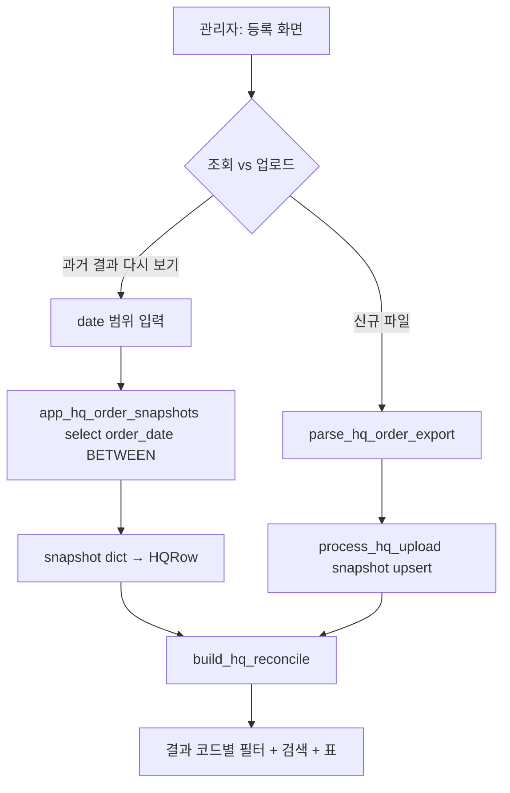

# HQ 원가대사 UI 개편 + 저장 이력 날짜 재조회

## 목표

1. 파일 재업로드 없이 **이미 저장된 대사 결과를 날짜로 다시 조회**.
2. UI를 **리드고객 관리 스타일**로 (결과별 `st.radio` 필터 + 검색 + 카운터).
3. **출고번호 컬럼** 제거, 대사표 가독성 개선.

## 데이터 흐름

## 파일별 변경

### [hq_order_reconcile_service.py](hq_order_reconcile_service.py)

- 추가: `load_snapshots(client, db_filename, date_from, date_to) -> list[dict]`
  - `app_hq_order_snapshots` 를 `order_date` 범위로 select (페이징).
- 추가: `snapshots_to_hqrows(snapshot_rows: list[dict]) -> list[HQRow]`
  - `HQRow` 필드로 매핑 (`_parse_date`, `_phone_digits` 재사용). `identity_key` 는 기존 파서와 동일 규칙 (`phone1_digits` 있으면 last-10, 없으면 `NAME:` + 정규화).
- 수정: `reconcile_to_dataframe` `_cols` 에서 `"출고번호"` 제거, out dict 에서도 삭제. `build_review_excel` 은 그대로 (엑셀 다운로드에는 남길지 여부는 UI 요구 밖 — 컬럼은 없어도 sheet에는 남겨도 OK. 우선 UI 표에서만 제거).
- `__all__` 에 `load_snapshots`, `snapshots_to_hqrows` 추가.

### [app.py](app.py) `_render_admin_hq_upload` (8302~8481)

전면 재구성 (기존 업로드/저장 로직·`_render_hq_cost_edit_panel`·`_render_hq_display_manual_match` 호출은 그대로 유지).

레이아웃:

1. `st.header("📥 ERP 파일 등록 & 원가 대사")`
2. `st.tabs(["🔎 저장된 대사 조회", "📤 새 파일 업로드"])`
   - 탭 1 이 기본. 여기서 날짜 검색·결과 필터·표.
   - 탭 2 는 지금 있는 업로드/미리보기/저장 흐름을 이동.
3. **탭 1 — 저장된 대사 조회** (`_render_hq_history_view`):
   - 상단 요약 카드 5개 (전체/원가일치/원가불일치/본사만/전시수동) — 리드 상단 카운터 스타일 (`st.columns` + `st.metric`).
   - 필터 행 1 (`st.columns([1.2,1.2,3,1.5,1])`):
     - `date_input` 시작일 / 종료일 (기본: 오늘 −60일 ~ 오늘, 데이터가 있는 최소~최대 범위로 clamp)
     - 검색 text_input `"고객명·전화·담당 검색"`
     - 담당 selectbox `["(전체)"] + 스냅샷에서 뽑은 유니크 담당명`
     - 새로고침 버튼 (스냅샷 캐시 클리어)
   - 필터 행 2 (`st.radio(horizontal=True, label_visibility="collapsed")`) — 결과별:
     - 옵션: `"전체", "원가 일치", "원가 불일치", "원가 미입력", "본사만 있음", "전시판매 수동매칭"` → 내부 코드 매핑 `{"전체":None,"원가 일치":"ok","원가 불일치":"cost_mismatch","원가 미입력":"cost_blank","본사만 있음":"hq_only","전시판매 수동매칭":"unresolved"}`
   - 대사표: `reconcile_to_dataframe(report)` (출고번호 제거된 뒤) 를 필터·검색어 적용해 표시. `_hq_money_styler` 로 금액 컬럼 콤마.
   - 표 아래 기존 `_render_hq_cost_edit_panel(db_filename, report, cache_key="history")` / `_render_hq_display_manual_match(report, "history")` 유지 — 확정 후 다시 조회하면 결과가 갱신됨.
   - 캐싱: `st.session_state[f"hq_hist::{db_filename}::{from}::{to}"] = report` 로 리런 시 재쿼리 방지. 새로고침 버튼이 지움.
4. **탭 2 — 새 파일 업로드**: 지금 있는 8336~8481 로직을 함수 하나로 뽑아 그대로 호출. 실행 후 `st.success("스냅샷 저장 완료. 조회 탭에서 결과를 확인하세요.")` 안내만 추가.

### 결과 필터 매핑 근거

`build_hq_reconcile` 이 지정하는 `result_code` (`hq_order_reconcile_service.py` 1090~1128):

- `ok`, `cost_mismatch`, `cost_blank` → 매칭 성공
- `hq_only` → 앱 주문 없음
- `unresolved` → 전시판매 자동 실패

→ 라디오 5개 + `"전체"` 로 커버. 이미 카운트가 `report.counts` 에 있어 카드 값도 재사용.

## Todos

- [ ] `load_snapshots` / `snapshots_to_hqrows` 추가 + `__all__` 갱신
- [ ] `reconcile_to_dataframe` 에서 `"출고번호"` 컬럼 제거
- [ ] `_render_admin_hq_upload` 를 tabs 로 재구성 (`_render_hq_history_view`, `_render_hq_new_upload` 로 분리)
- [ ] history 뷰: 날짜/검색/담당/결과 라디오 필터 + 카운터 + 표 + 확정/수동매칭 패널 호출
- [ ] 새 업로드 뷰: 기존 파싱·저장·대사 흐름 이동, 완료 후 "조회 탭에서 확인" 안내
- [ ] 문법 확인 → git add/commit/push (Korean conventional commit)