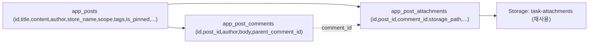

## 사내 게시판 + 태그/검색/핀 추가 플랜

기존 사내 업무판([task_board.py](task_board.py), [app.py](app.py) `render_internal_work` L14162)과 동일 패턴을 따르되, 담당자/상태/알림 없는 단순 게시판을 신설한다. 첨부 표시 헬퍼(`_render_attachment_inline` L14677, `_render_upload_preview` L14701, `_fetch_attachment_bytes_cached`)와 Storage 버킷 `task-attachments`를 재사용한다.

### 확정 정책
- 작성 UI는 첨부 이미지처럼 상단 탭(글/업무/일정/할일/투표) 표시. 이번엔 "글"만 기능 구현, 나머지 탭은 "준비 중" 안내만.
- 태그·키워드 검색·상단 고정(핀)은 게시판 + 기존 사내업무 모두에 적용.
- 게시물 열람 범위는 작성 시 선택: 매장별(`scope='store'`, 자기 매장만·superadmin 전체) 또는 전체공용(`scope='company'`, 전 직원).
- 비밀번호 등은 일반 글 본문 + "ID&PW" 등 태그로 저장(암호화는 범위 밖, 평문 저장 주의 캡션 표기).

### 데이터 모델

### 1. DB 스키마 (신규 + 멱등 ALTER)
- 신규 `SUPABASE_APP_POSTS.sql`:
  - `app_posts`: id, title, content, author, store_name(NULL=전체공용), scope TEXT('store'/'company'), tags TEXT(쉼표구분), is_pinned BOOL DEFAULT false, created_at, updated_at
  - `app_post_comments`: id, post_id FK ON DELETE CASCADE, author, body, parent_comment_id NULL, created_at
  - `app_post_attachments`: id, post_id FK, comment_id NULL FK(app_post_comments), storage_path, mime_type, original_name, byte_size, uploaded_by, uploaded_at
  - 인덱스 + RLS `Allow all` (앱 레벨 가시성 필터링)
- 신규 `SUPABASE_APP_TASKS_TAGS.sql`:
  - `ALTER TABLE app_tasks ADD COLUMN IF NOT EXISTS tags TEXT;`
  - `ALTER TABLE app_tasks ADD COLUMN IF NOT EXISTS is_pinned BOOLEAN DEFAULT false;`
- [app.py](app.py) L531·L596 SQL 목록 두 곳에 두 파일 등록. 기존 운영 DB는 Supabase SQL Editor에서 1회 수동 실행 필요.

### 2. 백엔드 신규 모듈 `post_board.py`
task_board.py 패턴 축소판(알림/친구톡/담당자 없음). `ATTACHMENT_BUCKET="task-attachments"` 재사용.
- `load_posts_cached(store_name, me_role)`: scope='company' OR (scope='store' AND store_name 일치) — superadmin은 전체. is_pinned DESC, created_at DESC 정렬.
- `create_post(title, content, author, store_name, scope, tags, is_pinned)`, `update_post`, `delete_post`, `toggle_post_pin(post_id, value)`
- `post_comment(post_id, author, body, parent_comment_id)` → app_post_comments
- `load_post_comments_cached`, `load_post_attachments_cached`
- `attach_file(post_id, comment_id, uploaded_file, uploaded_by)` → app_post_attachments (attach_file L497 로직 복제, 테이블만 교체)
- `clear_post_caches()`

### 3. 게시판 화면 [app.py](app.py)
- 사이드바: 사내 업무 버튼(L21840) 아래 `📝 게시물` 추가 → `active_admin_page="internal_board"`, 라우팅 분기(L21894 부근)에 `render_internal_board()`.
- 신규 `render_internal_board()`:
  - 작성 영역(이미지 스타일): `st.tabs(["글","업무","일정","할일","투표"])`. "글" 탭만 폼(제목·내용·첨부 업로더(폼 밖 미리보기)·태그 입력·열람범위 selectbox(매장별/전체공용)·상단고정 체크·등록). 나머지 탭은 "준비 중입니다" 캡션.
  - 검색/필터 바: 키워드 `st.text_input`(제목·본문·태그 부분일치) + 태그 `st.multiselect`(기존 태그 수집).
  - 목록: 고정(📌) 글 먼저, 그다음 최신순. 각 글 = 카드/expander(본문, 태그 칩, 첨부 갤러리 `_render_attachment_inline` 재사용, 댓글 트리 + 댓글 입력, 작성자/관리자만 수정·삭제, 관리자 핀 토글).
  - 댓글 입력은 `_render_comment_input`(task 전용, L14721)을 본떠 게시판용 `_render_post_comment_input` 신설(`post_board.post_comment`/`attach_file` 호출).

### 4. 사내업무에 태그/검색/핀 적용 (기존 메뉴 수정)
- [task_board.py](task_board.py) `create_task`(L271): `tags`, `is_pinned` 파라미터 추가 + insert row 포함 + 컬럼 미존재 PGRST204 폴백(기존 category 폴백과 동일 패턴). `load_tasks_cached`/`load_my_confidential_tasks_cached` select에 `tags,is_pinned` 추가(구 스키마 폴백 포함). `update_task_fields`로 핀 토글 지원.
- [app.py](app.py) `_render_new_task_form`(L14946): 태그 입력 + 상단고정 체크 추가 → `create_task(..., tags=, is_pinned=)`.
- `render_internal_work`(L14346 부근): 키워드 검색창 + 태그 multiselect 추가, 핀 먼저 정렬. `_render_task_card`: 태그 칩·📌 표시, 관리자 핀 토글.

### 5. 재사용/주의
- 첨부 표시는 `_render_attachment_inline`/`_fetch_attachment_bytes_cached`가 테이블 비종속이라 그대로 사용. 업로드 경로 prefix는 `post_{id}/...`로 분리.
- 태그는 쉼표구분 TEXT로 단순화(소규모), 정규화 테이블 미도입. 파싱 헬퍼로 공백/중복 제거.
- 비밀번호 평문 저장 — 카드 상단에 "민감정보는 열람범위·태그 주의" 캡션. 암호화는 범위 밖.

### 검증 기준
- 게시물 작성→댓글·이미지 첨부→재로그인 후에도 유지.
- 전체공용 글은 전 직원, 매장별 글은 해당 매장(+superadmin)만 열람.
- 키워드/태그 검색이 게시판·사내업무 양쪽에서 동작, 핀 글이 상단 노출.
- 기존 사내업무 동작·보안 카테고리 가시성 회귀 없음. 마이그레이션 전 DB에서도 기존 목록 정상(폴백).
