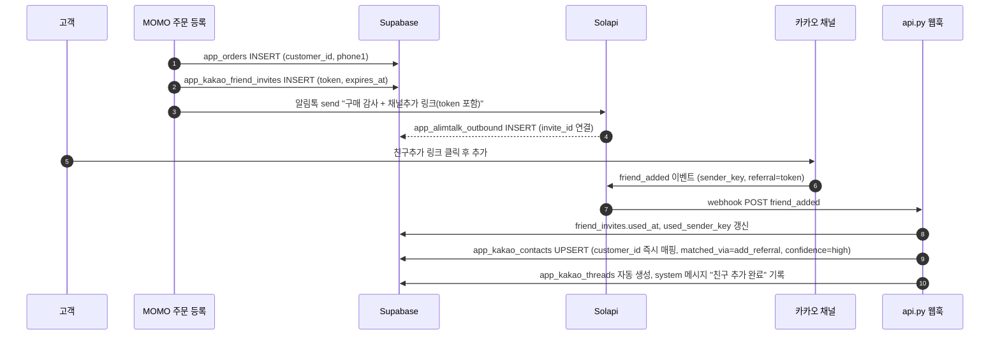
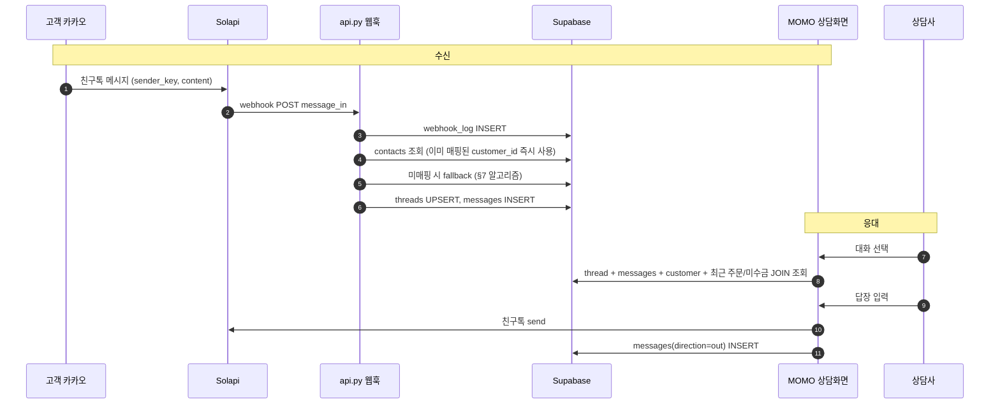
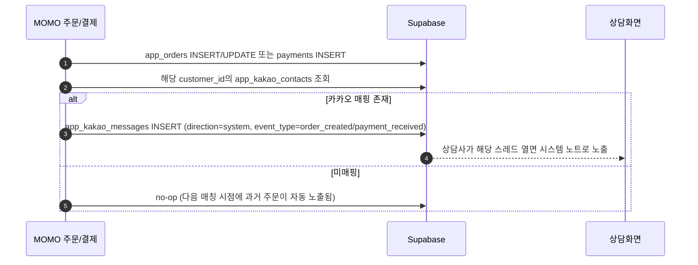

# 카카오톡 상담 연동 플랜

## 1. 목표
- 채널톡 의존 축소. 카카오톡 비즈니스 채널을 1차 고객 상담 창구로 사용.
- 카카오 메시지를 받는 즉시 **상담사 화면 옆에 해당 고객의 구매 이력·잔금·최근 주문이 자동 표시**.
- 발송(알림톡)·수신(친구톡 회신)을 모두 MOMO 내부에서 처리.

## 2. 채택 방향 (변경 가능)
- **메시지 채널**: Solapi 카카오 친구톡 양방향 (이미 `crm_automation.py` L196–240에서 Solapi ATA 사용 중이므로 신청·인프라 재활용).
- **상담 UI**: Streamlit 사이드바에 `kakao_consult` 신규 페이지(`app.py` L17564~L17638 라우팅에 추가).
- **매칭 1차 범위 (강화됨)**:
  1. **구매 직후 친구추가 유도 알림톡** — 구매 완료 시 알림톡 본문에 고객별 1회용 referral 토큰이 포함된 "채널 추가" 링크 발송. 친구추가 webhook의 referral 파라미터로 토큰을 받으면 즉시 `customer_id` 매핑(가장 신뢰도 높은 자동매칭).
  2. **알림톡 회신 phone1 ↔ sender_key 추정 매칭** — referral 매칭에 실패한 경우 fallback.
  3. **챗봇 환영 메시지의 전화번호 입력** — 위 둘 실패 시 자동 응답으로 본인확인 유도.
  4. **상담사 수동 검색 매칭** — 최종 보루.
- **양방향 sync 보장**: 매칭이 완료된 sender_key는 영구 저장되며, 이후 발생하는 모든 주문·미수금·상담 이력이 `customer_id`로 단일하게 연결되어 양쪽 채널에서 동일하게 조회된다(§11 참조).

대안 정리는 문서 본문에 옵션 B(채널톡 유지)·C(카카오 i)·D(챗봇)도 함께 기록해 미래 의사결정에 활용.

## 3. 데이터 모델 (Supabase 신규)

| 테이블 | 핵심 컬럼 |
|---|---|
| `app_kakao_contacts` | id, sender_key(UNIQUE), customer_id NULLABLE FK→app_customers.id, store_name, matched_via(`add_referral`/`auto_atareply`/`bot_phone`/`manual`), matched_at, match_confidence(`high`/`medium`/`low`), kakao_nickname, added_at(친구추가 시각), unfollowed_at NULLABLE, created_at |
| `app_kakao_friend_invites` | id, customer_id FK, store_name, referral_token(UNIQUE 32B), short_url, issued_at, expires_at, used_at NULLABLE, used_sender_key NULLABLE, channel(`post_purchase`/`receipt`/`manual_resend`) — 구매 후 발급되는 1회용 친구추가 초대 토큰 |
| `app_kakao_threads` | id, contact_id FK, status(`open`/`pending`/`closed`), assigned_to, last_message_at, last_inbound_at, unread_count, created_at |
| `app_kakao_messages` | id, thread_id FK, direction(`in`/`out`/`system`), content, attachments JSONB, sent_at, raw_payload JSONB, sender(상담사 id 또는 NULL), event_type NULLABLE(`order_created`/`payment_received`/`refund` 등 시스템 노트 분류) |
| `app_kakao_webhook_log` | id, received_at, event_type(`friend_added`/`friend_removed`/`message_in`/`delivery`), payload JSONB, processed BOOL, error TEXT |
| `app_alimtalk_outbound` | id, phone1, customer_id, sent_at, template_code, message_id, invite_id NULLABLE FK→app_kakao_friend_invites.id (친구추가 유도 알림톡인 경우 연결) |

RLS 정책은 기존 `app_customers`·`app_orders`와 동일한 패턴(store_name/db_filename 기반)으로 작성. SQL 파일은 `SUPABASE_APP_KAKAO_CONSULT.sql` 신설, 기존 `_supabase_run_app_tables_sql`(`app.py` L531 부근)에 등록해 부팅 시 자동 실행.

## 4. 메시지 흐름

### 4-1. 구매 → 친구추가 자동 매칭 (신규 핵심 흐름)

### 4-2. 상담 발송·수신 흐름

### 4-3. 주문 발생 → 상담 스레드 자동 sync (양방향 sync 핵심)

## 5. 신규/수정 코드 위치

- 신규: `SUPABASE_APP_KAKAO_CONSULT.sql`
- 신규: `kakao_consult.py` — Solapi 발송 래퍼, 매칭 로직, 캐시된 로더(`load_kakao_threads_cached`, `load_thread_messages_cached`), 친구추가 토큰 생성·검증 헬퍼(`issue_friend_invite`, `consume_referral_token`), 시스템 노트 기록기(`append_system_event`)
- 수정: `api.py` — Solapi 웹훅 엔드포인트 2종:
  - `/webhook/solapi/kakao/message` (인바운드 메시지)
  - `/webhook/solapi/kakao/friend` (친구추가·차단 이벤트, referral 토큰 처리)
- 수정: `app.py`
  - L531 부근 `_supabase_run_app_tables_sql` 리스트에 신규 SQL 추가
  - L17564~L17587 사이 사이드바 버튼: "💬 카카오 상담"(role: store_admin 이상)
  - L17607~L17638 라우팅 분기: `if active_admin_page == "kakao_consult": render_kakao_consult(...); return`
  - 신규 함수 `render_kakao_consult()` — 좌(스레드 리스트) / 우(메시지 + 고객 카드 + 답장 입력) 2열 레이아웃
  - **주문 등록 직후 친구추가 알림톡 트리거**: `_supabase_insert_order` 또는 그 호출부(`render_*` 주문 저장 성공 블록)에서 `issue_friend_invite(customer_id)` 호출 후 알림톡 발송. 기존 채널톡 동기화처럼 백그라운드 스레드로 분리.
  - **주문/결제 → 상담 스레드 sync**: 주문 INSERT, 위약금 처리, 결제 등록 성공 블록에서 `append_system_event(customer_id, event_type, summary)` 호출. 호출 지점은 `app.py` 내 주문·결제 저장 직후 `st.success` 분기들(예: 위약금 L12852 부근, 결제 등록 함수들).
- 수정: `crm_automation.py` — 친구추가 유도 알림톡 템플릿 발송 함수 추가(ATA payload에 `link_kakao` 버튼 + token URL 포함).
- 영향 없음(읽기만): `load_customers_cached`(L1685), `_get_customers_by_ids_supabase`(L877), 주문 로딩 함수들

## 6. UI 스케치(상담 화면)
- 좌측: `status=open` 스레드 리스트. 미매칭은 노란 배지, 미응답 5분↑ 빨간 배지, 매칭 confidence가 `low`/`medium`이면 회색 자물쇠 아이콘으로 재확인 유도.
- 우측 상단: 고객 카드 — 이름·phone1·**총 누적 매출·미수금·최근 주문 3건(클릭 시 상세)**·친구추가 일자. 미매칭이면 검색창 + "이 고객으로 연결" 버튼.
- 우측 중단: 메시지 타임라인 (in/out 말풍선, system 노트는 회색 박스로 "🛒 5/26 새 주문 #12345 발생 — 280,000원" 형태로 인라인 표시).
- 우측 하단: 텍스트 입력 + 템플릿 빠른 발송 + "스레드 종료" 버튼.
- **고객 카드 내 "카카오 친구추가 링크 재발송" 버튼** — 미매칭 또는 차단 후 재초대용. 클릭 시 새 referral 토큰 발급 + 알림톡 자동 발송.

## 7. 매칭 알고리즘 (우선순위 순)

### 7-1. 친구추가 이벤트 (`friend_added`) 도착 시
1. payload에 `referral` 토큰이 있으면 `app_kakao_friend_invites`에서 조회 → `used_at IS NULL` & `expires_at > now()`면 즉시 `customer_id`로 contacts 매핑(`matched_via=add_referral`, `confidence=high`). 토큰을 `used_at`/`used_sender_key`로 마킹해 재사용 방지.
2. 토큰이 없거나 만료/사용됨이면 contacts를 `customer_id=NULL`로만 생성하고 fallback 단계로 진행.

### 7-2. 인바운드 메시지 (`message_in`) 도착 시
1. sender_key로 `app_kakao_contacts` 조회 → 매핑 있으면 종료.
2. **추가 fallback A (시간 근접)**: 최근 24h `app_alimtalk_outbound` 중 phone1으로 발송된 최신 레코드의 customer_id로 매핑(`matched_via=auto_atareply`, `confidence=medium`). 같은 시간대 발송이 여러 phone에 갔다면 confidence를 `low`로 낮추고 상담사 확인 대기.
3. **추가 fallback B (챗봇)**: 시스템이 자동 응답으로 "주문 조회를 위해 가입 시 전화번호 끝 4자리를 입력해 주세요" 발송 → 다음 메시지에서 phone1 끝자리 매칭 1건이면 자동 연결(`matched_via=bot_phone`, `confidence=medium`).
4. **수동 매칭**: 상담사 검색 후 "이 고객으로 연결" 버튼(`matched_via=manual`, `confidence=high`).

### 7-3. 친구 차단 (`friend_removed`)
- `app_kakao_contacts.unfollowed_at` 갱신. customer_id 매핑은 보존(다시 친구추가 시 sender_key 일치하면 즉시 복구). 진행 중 스레드는 `pending`으로 자동 전환.

## 8. 운영 고려사항
- 채널톡 병행 기간(예: 4주) 동안 두 채널을 모두 모니터링하는 통합 받은편지함 추가는 v2.
- 미응답 SLA 알람: Streamlit 단독으론 푸시 어려움 → Slack/Telegram webhook 또는 이메일로 추후 확장.
- 비용: Solapi 친구톡 발송 단가 + 사업자 카카오 채널 검수 필요(이미 알림톡을 쓰고 있다면 신청만 추가).
- 개인정보: 메시지 본문 저장 정책(보관 기간) 합의 후 RLS·암호화 결정.

## 9. 작업 산출물
- 워크스페이스 루트에 **`KAKAO_CONSULTATION_PLAN.md`** 작성 — 위 1~8 내용을 한국어 정리. 옵션 B/C/D 비교 표 포함. 코드 변경은 없음.
- 사용자가 방향 확정 후 별도 작업으로 SQL·코드 구현 착수.

## 10. 검증 기준
- 문서가 워크스페이스에 생성되고 1~11장이 모두 채워져 있다.
- 옵션 비교 표, 데이터 모델 표(친구추가 invites 포함), 3종 메시지 흐름 다이어그램, 신규/수정 코드 위치가 명시되어 있다.
- 1차 MVP 범위(친구추가 referral 매칭, 알림톡 회신 매칭, 수동 매칭, 발송, 수신, 고객카드, 주문→상담 sync) 체크리스트가 정리되어 있다.

## 11. 양방향 sync 보장 설계

### 11-1. 단일 진실 원천
- 모든 고객 식별의 기준은 `app_customers.id` (customer_id). `app_kakao_contacts.customer_id`가 채워진 순간부터 카카오 sender_key는 우리 고객과 1:1 결합된다.
- 카카오에서 발생한 모든 이벤트는 contact를 통해 customer_id로 환원, MOMO에서 발생한 모든 주문·결제는 customer_id를 통해 카카오 상담 스레드로 환원된다.

### 11-2. MOMO → 카카오 방향 (주문/결제 발생 시)
- `_supabase_insert_order`, 결제 등록, 위약금, 환불, 미수금 발생 등 **돈이 움직이는 모든 저장 분기 직후** `append_system_event(customer_id, event_type, summary, amount)` 호출.
- 함수는 customer_id로 contacts 조회 → 매핑돼 있으면 해당 스레드(없으면 신규 생성, `status=closed` 초기값)에 `direction='system'` 메시지 INSERT.
- 매핑이 없으면 큐 테이블 없이 그냥 skip. 향후 친구추가 매칭이 일어나는 순간 고객 카드가 과거 주문을 그대로 보여주므로 정보 손실 없음.

### 11-3. 카카오 → MOMO 방향 (상담 메시지 발생 시)
- 모든 메시지는 contact → customer_id로 묶여 저장. 고객 상세 화면(`render_customer_balance` L14409)에 **"최근 카카오 상담"** 섹션을 추가해 messages 최근 5건을 표시.
- 상담 종료 시 작성한 메모는 `app_kakao_threads.note`(추가 필요)에 저장, 고객 카드에서 같이 보임.

### 11-4. 신뢰성 보장 장치
- 모든 웹훅은 `app_kakao_webhook_log`에 raw로 먼저 저장 후 처리. 실패 시 `processed=false`로 남기고 관리자 화면에서 재처리 버튼 제공.
- system 이벤트 INSERT는 트리거가 아니라 애플리케이션 레이어에서 처리(테스트 가능, 명시적 호출). 누락 방지를 위해 PR 체크리스트에 "주문/결제 저장 분기 추가 시 append_system_event 호출 여부" 항목 명시.
- referral 토큰은 32바이트 url-safe 랜덤, TTL 30일, 1회용. 추측 공격 차단을 위해 발급 시 `customer_id ↔ store_name`만 묶고 token 자체는 일방향.

### 11-5. 마이그레이션 / 백필
- 이미 채널톡으로 상담 중인 고객은 `sync_channel_talk_customer`(L894) 패턴을 참고해 **기존 phone1 기준으로 카카오 친구추가 알림톡 일괄 발송**하는 일회성 스크립트 작성. 결과는 invites 테이블로 추적.
