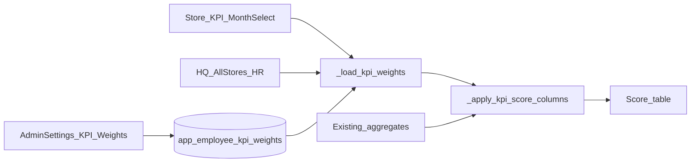

# 직원 평가 가중치 월별/매장별 설정

## 확정 규칙

- 기간 단위: **연월(`YYYY-MM`) 고정** (하루 단위 기간 없음)
- 스코프 2종:
  - 매장: `db_filename` = 해당 매장
  - 전체 매장 통합: `db_filename` = `__all__` (센티널)
- 설정 없을 때 fallback: **70 / 15 / 5 / 10**
- 단일 매장 KPI: 그 매장 + 선택 연월 weight
- 전체 매장 통합 평가: **매장별 weight를 섞지 않음**. `__all__` + 해당 연월만 사용 (없으면 기본값)
- 과거 월 조회: **그 연월에 저장된 행** 사용 (현재 설정으로 소급하지 않음)
- 다월 범위 HR 리포트([`_superadmin_tab2_hr_store_employees`](app.py)): 집계 금액은 기존처럼 기간 합산 유지. 점수는 **종료월(ey, em)** 의 스코프 weight를 한 번 적용. 캡션에 「다월 조회 시 종료월 가중치 적용」 명시

## 데이터

새 파일 [`SUPABASE_APP_EMPLOYEE_KPI_WEIGHTS.sql`](SUPABASE_APP_EMPLOYEE_KPI_WEIGHTS.sql):

```sql
CREATE TABLE IF NOT EXISTS app_employee_kpi_weights (
  id BIGSERIAL PRIMARY KEY,
  db_filename TEXT NOT NULL,          -- 매장 db 또는 '__all__'
  year_month TEXT NOT NULL,           -- 'YYYY-MM'
  w_revenue NUMERIC NOT NULL DEFAULT 70,
  w_margin  NUMERIC NOT NULL DEFAULT 15,
  w_display NUMERIC NOT NULL DEFAULT 5,
  w_cash    NUMERIC NOT NULL DEFAULT 10,
  updated_by TEXT,
  updated_at TIMESTAMPTZ DEFAULT now(),
  UNIQUE (db_filename, year_month)
);
```

RLS는 기존 테이블과 동일하게 allow-all 정책.

## 코드 구조 (집계 로직 비침습)

[`app.py`](app.py)에 얇은 레이어만 추가:

| 함수 | 역할 |
|------|------|
| `DEFAULT_KPI_WEIGHTS` | `{revenue:70, margin:15, display:5, cash:10}` |
| `KPI_WEIGHTS_ALL_SCOPE = "__all__"` | 전체통합 키 |
| `_load_kpi_weights(db_filename, year, month)` | Supabase 1건 조회, 없으면 기본값 |
| `_save_kpi_weights(...)` | upsert, 합=100 검증 |
| `_apply_kpi_score_columns(emp_df, w)` | `revenue/margin/display/kpi_receipt` 비율 × weight → 점수 열·종합 (컬럼명에 실제 weight 반영) |

집계 함수(`_kpi_employee_totals_from_sales_slice`, `_aggregate_cash_collected_by_employee`)는 **수정하지 않음**.

적용 지점 (하드코딩 `* 70` 등만 교체):

1. [`_render_kpi_section`](app.py) (~31112): `sel_y, sel_m` + `db_filename`으로 weight 로드 후 `_apply_kpi_score_columns`
2. [`_superadmin_tab2_hr_store_employees`](app.py) (~9981):  
   - `전체 매장 통합` → `_load_kpi_weights("__all__", ey, em)`  
   - 개별 매장 → 해당 `db_filename` + 종료 연월  
3. 컬럼 config / caption / FAQ(~25096)의 고정 `70/15/5/10` 문구를 **로드된 weight**로 동적 표기



## 관리자 설정 UI

[`render_admin_settings`](app.py)의 플레이스홀더 **「7. 기타 설정」**을 **「7. 직원 평가 가중치 (월별)」**로 교체:

- 대상 선택: `전체 매장 통합` + 매장 목록 (`store_admin`은 자기 매장만; `superadmin`은 전체+`__all__`)
- 연/월 선택 (number/select)
- 네 항목 number_input (기본 70/15/5/10 또는 저장된 값)
- 합계 실시간 표시, **합 ≠ 100이면 저장 비활성/에러**
- 저장 → upsert; 목록에 해당 스코프의 최근 설정 테이블 + 삭제(선택월 초기화→기본값 복귀)

## 수동 배포

Streamlit Cloud 반영 전 Supabase SQL Editor에서 `SUPABASE_APP_EMPLOYEE_KPI_WEIGHTS.sql` 실행 필요 (앱만으로는 테이블 미생성).

## 검증

- 설정 없는 월: 기존과 동일 70/15/5/10
- A매장 2026-08만 60/20/10/10 저장 → 해당 매장 8월 KPI만 변경, 7월·B매장 불변
- `__all__` 2026-08 변경 → HR「전체 매장 통합」8월(또는 종료월 8월 범위)만 반영, 개별 매장 KPI는 매장 설정 유지
- 다월 범위: 종료월 weight 사용 + 캡션 확인
