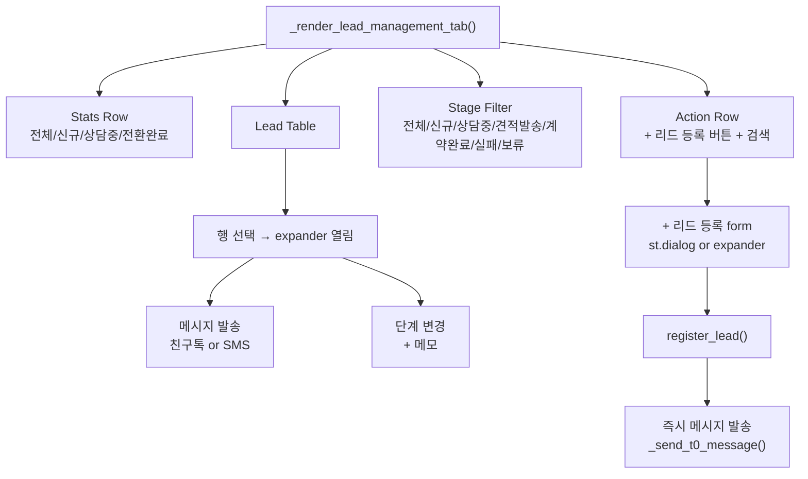
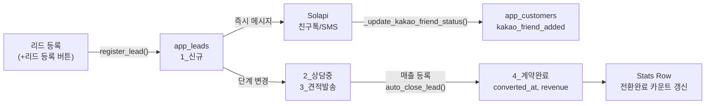

# Lead Management 리드 관리 전면 개편 계획

## 변경 범위 요약

- [`SUPABASE_APP_LEADS.sql`](SUPABASE_APP_LEADS.sql) — 단계 CHECK 제약 수정
- 새 파일 `SUPABASE_APP_LEADS_STAGE_MIGRATION.sql` — 기존 데이터 마이그레이션 SQL
- [`lead_manager.py`](lead_manager.py) — 단계 상수 및 필터 업데이트
- [`crm_automation.py`](crm_automation.py) — `_render_lead_registration_tab()` 전면 교체
- [`app.py`](app.py) — 하드코딩된 단계명 참조 수정

---

## 1. 리드 단계 재정의

| 새 단계 값 | 표시명 | 기존 값 |
|---|---|---|
| `1_신규` | 신규 | `1_신규유입` |
| `2_상담중` | 상담중 | `2_자료발송` |
| `3_견적발송` | 견적발송 | `3_매장방문` |
| `4_계약완료` | 계약완료 | `4_계약완료` (유지) |
| `5_실패` | 실패 | `5_계약실패` |
| `6_보류` | 보류 | 신규 추가 |

**마이그레이션 SQL** (Supabase SQL Editor에서 실행):
```sql
-- CHECK 제약 교체
ALTER TABLE app_leads DROP CONSTRAINT IF EXISTS app_leads_lead_stage_check;
ALTER TABLE app_leads ADD CONSTRAINT app_leads_lead_stage_check
  CHECK (lead_stage IN ('1_신규','2_상담중','3_견적발송','4_계약완료','5_실패','6_보류'));

-- 기존 데이터 마이그레이션
UPDATE app_leads SET lead_stage = '1_신규'    WHERE lead_stage = '1_신규유입';
UPDATE app_leads SET lead_stage = '2_상담중'  WHERE lead_stage = '2_자료발송';
UPDATE app_leads SET lead_stage = '3_견적발송' WHERE lead_stage = '3_매장방문';
UPDATE app_leads SET lead_stage = '5_실패'    WHERE lead_stage = '5_계약실패';
```

---

## 2. 새 리드 관리 UI 구조



---

## 3. Stats Row

`app_leads` 를 `store_name` 기준으로 단건 집계 쿼리:
- 전체 리드 수
- 신규(`1_신규`) 수
- 상담중(`2_상담중`) 수
- 전환완료(`4_계약완료`) 수, 전환율(%)

---

## 4. 리드 테이블

각 행에 expander 형태로 액션 패널 노출:

**메시지 발송 패널**
```python
# send_friendtalk() 또는 send_sms() 직접 호출
channel = st.radio("채널", ["친구톡", "SMS"])
msg = st.text_area("메시지", value=f"안녕하세요 {name}님...")
if st.button("발송"):
    if channel == "친구톡":
        result = send_friendtalk(phone, msg)
    else:
        result = send_sms(phone, msg)
    _update_kakao_friend_status(cid, phone, result["status"])
    # app_customer_messages 이력 기록
```

**단계 변경 패널**
```python
new_stage = st.selectbox("단계 변경", LEAD_STAGES)
memo = st.text_input("메모")
# Supabase PATCH: lead_stage, contact_memo, updated_at
```

---

## 5. 자동 계약 전환 연결

`auto_close_lead()` 는 이미 `app.py` 매출 등록 완료 시점에 호출됩니다. 단계값만 `'4_계약완료'`로 유지하면 기존 로직 그대로 동작합니다.

`lead_manager.py` 에서 수정 필요한 하드코딩 참조:
- `auto_close_lead()` 내 `NOT IN ('4_계약완료', '5_계약실패')` → `NOT IN ('4_계약완료', '5_실패')`
- `register_lead()` 내 `lead_stage: "1_신규유입"` → `"1_신규"`

---

## 6. 데이터 흐름 전체


