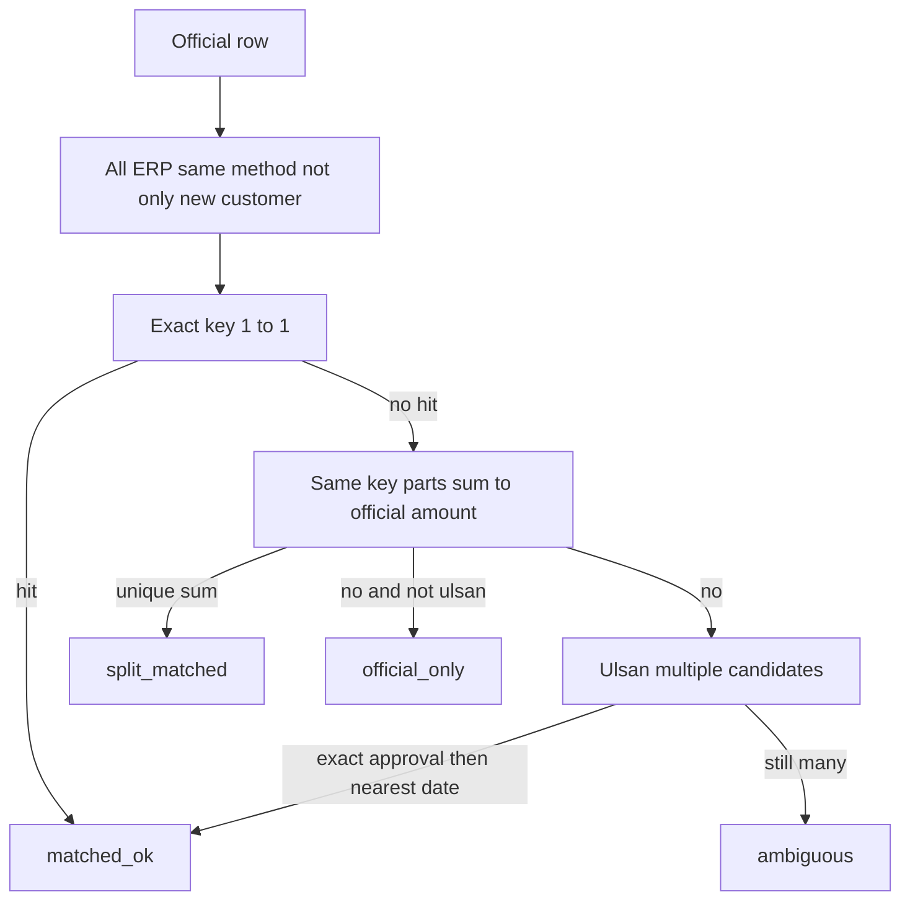

# 온누리·울산페이 미매칭 축소

삼산점 실측: 온누리 공식 170건 중 `official_only` 62건, 울산페이 899건 중 26건 + `ambiguous` 18건. 오탐 없이 줄일 수 있는 구간만 손본다.

## 하지 않는 것

- 끝4/승인 없이 날짜+금액만으로 자동 매칭 (온누리 유일 후보 0건, 울산페이 50만원 중복)
- 온누리 거래시각 전건 필수 (모모 시각 0.4%, 온누리 ambiguous 0건)
- 날짜 창 ±2일 확대 (근거 1건)
- `matched_ok` / `manual_matched` 재작성

## 매칭 흐름 (변경 후)

## 1. 후보를 전체 온누리·지역화폐로 확대

대상: [`app.py`](app.py) `_ext_pay_match_onnuri` (약 3928행), `_ext_pay_match_ulsanpay` (약 4238행), `_ext_pay_unmatched_erp_pays` (약 5238행).

- 온누리/울산페이에서 `_is_new_customer_sale` / `_ext_pay_new_customer_order_ids` 필터를 제거한다. 카드/메인페이와 동일하게 해당 수단의 양수 결제 전체를 후보로 쓴다.
- 주문 row(`_order`)는 고객명 표시용으로만 유지. 주문이 없는 결제는 지금처럼 제외.
- 실측 회복: 온누리 정확 키인데 기존고객이라 빠진 **5건**.
- 부작용: 검증 기간 안 `모모에만 존재`가 늘어날 수 있다 (삼산 온누리 9/1~9/18 미사용 60건 중 공식 없는 54건). 이는 숨기던 누락을 드러내는 것이므로 유지한다.

## 2. 기존 미결 행 재매칭

현재 매칭 함수는 `app_external_pay_matches`에 이미 있는 `row_id`는 건너뛴다. 필터만 바꿔도 기존 `official_only`는 그대로다.

- 헬퍼 `_ext_pay_rematch_open_rows(sc, db, source)` 추가.
- `result_code IN (official_only, ambiguous, amount_mismatch, official_canceled, 미매칭)` 인 매칭만 삭제 후 `_ext_pay_match_*` 재실행.
- `matched_ok` / `manual_matched` / `split_matched`는 유지.
- [`_ext_pay_list_matches_df`](app.py)의 울산페이 zeropad/relink 호출 옆에 온누리·울산페이만 이 헬퍼를 넣는다. 업로드 직후 매칭과도 호환.

## 3. 분할결제 합산 (1 공식 : N 모모)

`UNIQUE(row_id)`는 유지. 매칭 1행에 대표 `payment_id`(가장 큰 금액)만 넣고, 나머지 payment_id는 `used_payment_ids`에서 소모해 `erp_only`로 안 나오게 한다.

온누리: 같은 날 + 같은 끝4, 미사용 양수 결제들의 합 = 공식 금액, 그리고 그 조합이 유일하면 `split_matched`.
울산페이: 같은 승인번호, 미사용 양수 결제 합 = 공식 절대금액이면 동일.

실측: 온누리 3건 (180+220=40만, 26+11+47.2=84.2만, 소액합=100만), 울산페이 1건 (449000+51000=500000).

- `note` 예: `분할 2건 합 400,000 (180,000+220,000)`
- [`_ext_pay_list_matches_df`](app.py) 표시: `모모입력금액`을 분할 합계로, 결과 라벨 `분할 합산 일치`
- 합이 안 맞는 금액 불일치는 지금처럼 `amount_mismatch` (자동 추측 금지)

## 4. 울산페이 ambiguous 해소

`_ext_pay_match_ulsanpay`에서 후보가 2건 이상일 때 min(id)로 임시 매칭하지 않는다.

우선순위:
1. `_ext_pay_norm_approval6` **정확 일치**만 남긴다. `_ext_pay_approval_alts`는 정확 일치가 0건일 때만 사용 (float `43927` → `043927` vs `439270` 충돌 완화)
2. 공식 `tx_date`와 `payment_date` 간격이 가장 작은 1건
3. 그래도 2건 이상이면 `ambiguous` 유지 (오탐 금지)

실측: ambiguous 18건 + 그 공식 행을 가리키는 미사용 모모 29건이 같이 줄어들 여지가 있다.

## 5. UI

[`_render_external_pay_admin_section`](app.py) 결과 맵에 `split_matched` → `분할 합산 일치` 추가. 하단 캡션 한 줄. 식별자 안내를 “신규고객만”에서 “해당 수단 전체”로 수정.

## 검증 (삼산점, 코딩 후 재조회)

- 온누리 `official_only` 62 → 대략 54 전후 (5+3 회복, F2 33건은 그대로)
- 울산페이 `official_only` 26 → 25 (분할 1건), `ambiguous` 18 감소
- 기존 `matched_ok` 건수·payment_id 불변
- 날짜+금액만으로 붙은 신규 행이 0건인지 샘플 확인
- 온누리 9/15 끝4 `5086` 40만, 9/13 끝4 `3516` 84.2만, 울산 8/9 승인 `985103` 50만이 `split_matched`인지 확인
