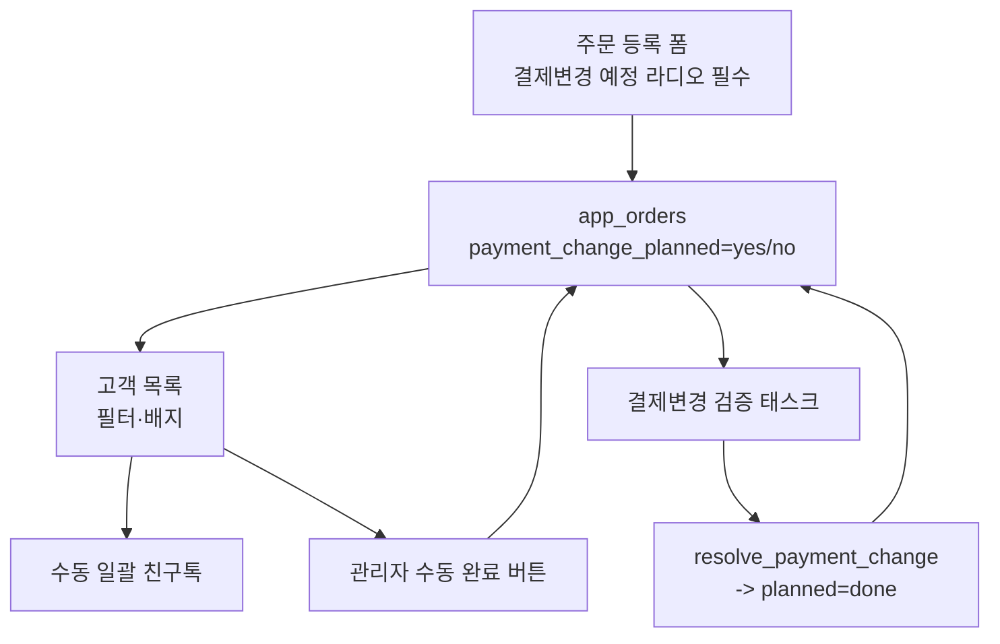

# 결제변경 예정·완료 관리 + 사업자별 결제 표기

## 범위 요약
- 필수 라디오("예정 / 아니오"), 기본값 없음, `app_orders`에 새 컬럼 저장.
- 고객 목록에 필터·배지·수동 일괄 문자 발송(친구톡) 기능 신설.
- 완료 처리: 결제변경 검증 태스크 resolved 시 자동 + 관리자 수동 버튼 병행.
- 외부 결제 업로드에 사업자 선택 → 매칭된 `app_payments`에 사업자명 저장·표시.

## 데이터 모델 변경 (Supabase)
관리자에게 실행할 SQL을 별도로 제공하고, 앱은 컬럼이 없으면 조용히 fallback 하도록 `try/except` 방어.

- `app_orders`
  - `payment_change_planned` `text` NULL 허용. 값: `yes` / `no` / `done`.
  - `payment_change_completed_at` `timestamptz` NULL.
  - `payment_change_completed_by` `text` NULL.
- `app_stores`
  - `businesses` `text[]` 또는 `jsonb`. 예: `["에몬스울산전시장","에몬스리빙울산"]`. 매장별 편집 가능.
- `app_external_pay_batches`
  - `business_name` `text` NULL (업로드 시 선택 값).
- `app_payments`
  - `business_name` `text` NULL (매칭·수기 등록 시 상속·입력).

## Phase 1 · 주문 등록 폼 (필수 라디오)

- 파일: [app.py](app.py) 36480 근처, 폼 렌더링 위치.
- 결제 슬롯 위·아래 어느 곳이든 시각적으로 눈에 띄는 자리에 추가.
- Streamlit `st.radio("결제변경 예정", options=["예정","아니오"], index=None, horizontal=True, key=...)`.
- 검증: `index=None` 이면 등록 버튼 눌러도 `st.error("결제변경 예정 여부를 선택해 주세요.")` + `st.stop()`.
- `order_payload`에 다음 값을 포함:

```python
order_payload["payment_change_planned"] = "yes" if planned == "예정" else "no"
```

- 저장 실패 방어: `_insert_order_supabase` payload에 컬럼이 미존재하면 재시도(현재 다른 스키마 fallback 로직과 동일 패턴 사용).

## Phase 2 · 고객 목록 필터·배지

- 파일: [app.py](app.py) `_load_customers_supabase_cached` 등 고객 목록 로딩 함수와 렌더링 부분.
- 고객이 아니라 "주문" 단위 상태이므로 목록 로직에서 주문 상태를 조인해 flag를 붙인다.
  - 조회 최적화: 주문에서 `db_filename` + `payment_change_planned in ('yes','done')` 만 필터해 `customer_id` set 을 뽑고, 고객 목록에 배지·필터로 활용.
- 필터 UI: 상단에 `st.radio("결제변경 상태", ["전체","예정","완료","해당 없음"], horizontal=True)`.
- 각 고객 행 옆에 배지: `🟡 결제변경 예정 N건` / `🟢 결제변경 완료 N건`.

## Phase 3 · 결제변경 완료 처리 (자동 + 수동)

- 자동 처리: [task_board.py](task_board.py) `resolve_payment_change` 함수 안에서 태스크의 `sale_id` 로 `app_orders.payment_change_planned` 를 `done` 으로 업데이트(현재 값이 `yes` 인 경우에만).

```python
client.table("app_orders").update({
    "payment_change_planned": "done",
    "payment_change_completed_at": _utcnow_iso(),
    "payment_change_completed_by": verifier,
}).eq("id", sale_id).eq("payment_change_planned", "yes").execute()
```

- 수동 처리: 고객 목록의 결제변경 예정 배지 옆에 관리자만 노출되는 "완료 처리" 버튼. 눌리면 위와 동일 업데이트 + activity 로그.
- 되돌리기: superadmin 만 `done -> yes` 로 되돌릴 수 있는 미니 UI (실수 복구용). 필수 아님, 여유가 되면.

## Phase 4 · 수동 일괄 문자 발송

- 파일: [solapi_sender.py](solapi_sender.py) `send_friendtalk` 재사용.
- 위치: 고객 목록 상단 "결제변경 예정" 필터 활성화 시 `📢 선택 고객에게 안내 문자 발송` 확장 패널.
- 흐름:
  1. 목록에서 체크박스로 대상 고객 다중 선택.
  2. 템플릿 미리보기(고객명·매장명 치환) + 편집 가능한 `text_area`.
  3. `📤 발송` 버튼 → 각 고객 phone 으로 친구톡 시도, 실패건은 SMS fallback(현재 solapi 통합 흐름과 동일).
  4. 발송 결과를 `app_notifications` 테이블에 `type="pcr_reminder"` 로 남겨 이력 추적.
- 대량 발송 안전장치: 1회 발송 상한(예: 50건) + 발송 전 확인 다이얼로그.

## Phase 5 · 사업자 매핑 & 외부 결제 업로드

- 매장 관리자 설정 화면에 "사업자 목록" 편집 UI 추가 (`app_stores.businesses`).
  - 삼산점 예시: `["에몬스울산전시장","에몬스리빙울산"]`.
- 외부 결제 파일 업로드 UI(온누리/지역화폐/카드/메인페이 각각):
  - 사업자 선택 `selectbox` 필수. 옵션은 현재 매장 사업자 목록. 옵션 미선택 시 업로드 버튼 비활성.
- 파일: [app.py](app.py) `_ext_pay_insert_batch_and_rows` (3545 근처).
  - 배치 저장 시 payload 에 `business_name` 추가.
  - 이후 매칭 성공 시 `app_payments.business_name` 을 배치의 `business_name` 으로 채움 (`_ext_pay_apply_match` / `_ext_pay_manual_link_*` 두 경로 모두).
- 결제 목록 UI(결제 내역 조회 및 수정 등)에 "사업자" 열 추가. 값이 없는 옛 행은 공란 표시.

## 흐름 다이어그램




## 마이그레이션 SQL 예시 (배포 시 관리자에게 안내)

```sql
alter table app_orders add column if not exists payment_change_planned text;
alter table app_orders add column if not exists payment_change_completed_at timestamptz;
alter table app_orders add column if not exists payment_change_completed_by text;
create index if not exists idx_orders_pcr_planned on app_orders(payment_change_planned);

alter table app_stores add column if not exists businesses jsonb default '[]'::jsonb;

alter table app_external_pay_batches add column if not exists business_name text;
alter table app_payments add column if not exists business_name text;
```

## 검증 계획

1. 주문 등록 → 라디오 미선택 시 등록 차단 확인.
2. 라디오 "예정" 저장 → 고객 목록에서 배지·필터로 보이는지 확인.
3. 결제변경 검증 태스크 resolve → 해당 주문 `payment_change_planned = done` 자동 반영.
4. 수동 완료 버튼 → `done` 반영.
5. 외부 결제 파일 업로드 시 사업자 미선택 → 버튼 비활성.
6. 사업자 선택 후 업로드·매칭 → `app_payments.business_name` 세팅, 화면 열에 표시.
7. 결제변경 예정 필터에서 대상 3~5명 선택 → 친구톡 미리보기 → 테스트 발송(내 계정) → 이력 저장 확인.

## 리스크·주의

- 컬럼이 아직 DB 에 없으면 삽입 실패. 앱은 fallback 하도록 방어하고, 배포 노트에 SQL 우선 실행을 강조.
- 대량 문자 발송 비용/스팸 리스크. 상한과 확인 다이얼로그 필수. 초기에는 1회 50건 제한 권장.
- 사업자 자동 추론(파일 파싱) 은 이번 범위 밖. 오분류 방지를 위해 업로드 시 사용자가 반드시 선택.
- 옛 주문(컬럼 도입 이전)은 값이 `NULL` 이라 "해당 없음" 카테고리로 표시. 강제 소급 안 함.
