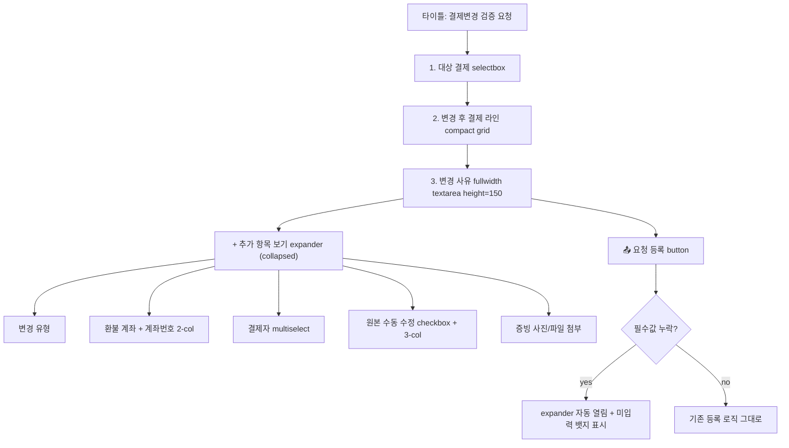

## 결제변경 검증 요청 폼 UI/UX 개선 (기능 변경 없음)

**대상 함수**: [app.py](app.py) `_render_payment_change_verify_entry` (라인 30832~31405)

### 적용 원칙

- 기존 입력 필드/검증/저장 로직은 **1 line도 수정하지 않는다**
- 세션 키/위젯 key는 **그대로 유지** (session_state 호환성 보존)
- 레이아웃만 재배치 — `st.columns`, `st.expander`, `st.container`, `st.markdown`, `st.divider` 변경

### 변경 후 레이아웃 (Repattern 스타일)



### 상세 변경 내역

#### 1. 핵심 3단 구조로 재편 (라인 30870 `with st.container(border=True):` 내부)
- **A. 대상 결제** — `st.selectbox` 그대로 (한 줄, 전체폭)
- **B. 변경 후 결제** 섹션:
  - 섹션 제목을 `st.markdown("**변경 후 결제**")`로 유지, 서브 캡션 간결화
  - **참고 이력/원본 안내**: 기존 `st.caption` / `st.info` 호출을 `st.container(height=72, border=True)` 안의 `st.markdown`으로 교체 → 긴 텍스트도 **스크롤 가능**
  - 라인 그리드: 현재 `[1.4, 1.4, 1.6, 1.4, 0.4]` → **`[1.1, 1.3, 1.6, 1.3, 0.3]`** 로 압축, 라벨 축약(`결제날짜 #1` → `날짜 #1`, `결제수단 #1` → `수단 #1`, `결제금액 #1` → `금액 #1`)
  - 온누리 거래시간 전용 행: 기존 그대로 유지
- **C. 변경 사유** — `st.text_area` fullwidth, `height=90 → 150` (스크롤 공간 확보)

#### 2. "➕ 추가 항목 보기" expander (기본 접힘)
라인 30985~31213 사이의 보조/필수 필드들을 `st.expander("➕ 추가 항목 보기", expanded=False)`로 묶음:
- `변경 유형` selectbox (라인 30985)
- `환불 계좌 (은행·예금주) *` + `계좌번호 *` → `st.columns([1, 1])` 2-col full width (라인 31191~31201 재배치)
- `결제자 *` multiselect (라인 31204)
- `원본 수동 수정` checkbox + 3-col 필드 (라인 30953~30974)
- `📎 증빙 사진/파일 첨부` (라인 31216)

#### 3. 필수 필드 누락 시 UX
```python
_required_missing = (not refund_bank) or (not refund_account) or (not pcr_assignees)
_expander_label = "➕ 추가 항목 보기" + (" ⚠️ 필수 미입력" if _required_missing else "")
with st.expander(_expander_label, expanded=_required_missing):
```
- 필수(*) 필드 중 1개라도 비어 있으면 라벨에 `⚠️ 필수 미입력` 뱃지 + expander **자동 열림**
- `can_submit` 로직은 **변경 없음** — 기존 검증이 그대로 작동

#### 4. 긴 텍스트 스크롤 처리
- `참고 이력` (라인 30948, `st.caption`) → `st.container(height=72, border=True)` + markdown
- `원본(이력)` info banner (라인 30951, `st.info`) → 동일 패턴
- `등록될 원본` caption (라인 30980) → 동일 패턴
- `변경 사유` textarea height 90 → **150** (텍스트 많아지면 자동 스크롤바)

#### 5. 시각적 구분
- 섹션 사이에 `st.divider()` 삽입 (대상 결제 ↔ 변경 후 결제 ↔ 변경 사유 ↔ expander ↔ 등록 버튼)
- 섹션 제목 폰트 통일: `st.markdown("##### ...")` 유지

### 비변경 (중요)

- `_pcr_duplicate_approval_errors` / `_pcr_approval_key` — 그대로
- `_onnuri_time_input` / `_onnuri_compose_ident` — 그대로
- 요청 등록(line 31183~31405) 로직 전부 — 그대로
- 세션 state 키 (`pcr_amt_*`, `pcr_meth_*`, `pcr_onnuri_last4_*`, `pcr_onnuri_time_*`, `pcr_refund_bank_*`, `pcr_refund_account_*`, `pcr_assignees_*`, `pcr_files_*` 등) — 전부 유지
- Supabase/SQLite 쿼리·업로드·history insert — 전혀 손대지 않음

### 검증 방법
1. `python -c "import py_compile; py_compile.compile('app.py', doraise=True)"` compile OK
2. 로컬 Streamlit 실행 → 결제변경/환불요청 폼 열기 → 핵심 3 영역만 상시 보이는지 확인
3. 추가 항목 비워둔 채 "요청 등록" 클릭 → expander 자동 열림 + 라벨 뱃지 표시
4. 필수값 채운 뒤 요청 등록 → 기존과 동일하게 태스크 생성 확인
5. 긴 사유 (10줄+) 입력 → textarea 내부 스크롤 작동 확인
