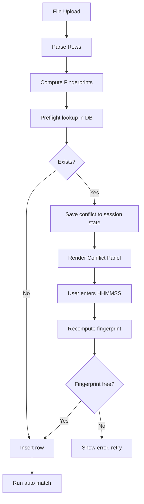

## 1. Verification result (already done)

Supabase 조회 결과, `store_1.db` (울산 삼산점)에서 `approval_code='005379'` 로 저장된 울산페이 행은 정확히 1건이다.

- id=261, tx_date=2026-08-01, tx_time=09:02:56, amount=500,000
- fingerprint = ulsanpay|store_1.db|2026-08-01|09:02:56||500000||005379
- 최초 업로드 배치: 2026-08-14 09:39:14 (테스트 파일 3.xlsx)
- 이번 2026-09-18 10:15:48 파일(189건)은 정상 신규 등록 완료. 같은 파일을 10:16:16 에 재업로드해서 189/189 skip 된 이력이 있음.

즉 005379는 진짜 중복이며 skip 처리가 로직상 맞다. 문제는 어떤 행과 충돌하는지·정말 별개 거래인지 확인할 방법이 없어 "등록 불가"로 오인되는 UX. 추가로 6자리 승인번호는 실제 재사용(현재 DB 899행 중 12쌍이 서로 다른 tx_date 에서 승인번호 재사용) 되므로 안전판이 필요.

## 2. Flow

## 3. File touch points

### 3.1 [SUPABASE_APP_EXTERNAL_PAY_MATCH.sql](SUPABASE_APP_EXTERNAL_PAY_MATCH.sql)
- 스키마 변경 없음. 기존 fingerprint UNIQUE 그대로 사용.
- Optional: `manual_time_override BOOLEAN DEFAULT FALSE` 컬럼 추가하여 수기 보정 건 추적. 코드는 컬럼 부재 시 fallback (카드 컬럼 fallback 패턴 동일).

### 3.2 [app.py](app.py) backend refactor

`_ext_pay_insert_batch_and_rows` (app.py:3454) 를 두 단계로 분리·확장:

- 신규 `_ext_pay_dryrun_conflicts(sc, db_filename, source, rows) -> (fresh, conflicts)`
  - 각 행 fingerprint 계산 후 `app_external_pay_rows.select(...).in_("fingerprint", chunks)` 로 조회
  - 반환: fresh 목록 + conflicts=[{parsed, existing}, ...]

- `_ext_pay_insert_batch_and_rows` 는 dryrun 을 먼저 실행 → fresh 만 삽입 → conflicts 는 반환값에 포함
  - 시그니처: 기존 (inserted, skipped_before_date, skipped_duplicate, error) → (..., conflicts). 호출부 1곳만 갱신.

- 신규 `_ext_pay_normalize_time_input(raw: str) -> (hhmmss: str | None, error: str | None)`
  - 입력 자동 포맷팅. 다음 케이스를 모두 `HH:MM:SS` 로 통일:
    - `13:27:39` / `13.27.39` / `13-27-39` / `13 27 39` → `13:27:39`
    - `132739` (숫자 6자리) → `13:27:39`
    - `1327` (숫자 4자리) → `13:27:00`
    - `13:27` → `13:27:00`
    - `9:2:5` → `09:02:05`
    - 앞뒤 공백·전각콜론(`：`) 허용
  - 알고리즘:
    1. `s = raw.strip().replace("：", ":")`; 콜론이 있으면 기존 로직: `parts = re.split(r"[:.\-\s]+", s)` → 각 파트 `int()` → zero-pad
    2. 콜론이 없으면 `digits = re.sub(r"\D", "", s)` 후 길이별 처리 (6→HH:MM:SS, 4→HH:MM:00, 그 외 error)
    3. 최종 결과에 대해 `^(?:[01]\d|2[0-3]):[0-5]\d:[0-5]\d$` 재검증
  - 실패 시 `error="시각 형식이 올바르지 않습니다. 예: 13:27:39 또는 132739"` 반환

- 신규 `_ext_pay_reinsert_with_time_override(db_filename, source, batch_id, parsed_row, new_tx_time)`
  - 진입 즉시 `_ext_pay_normalize_time_input` 호출로 자동 포맷팅. 정규화 실패 시 즉시 오류 반환.
  - parsed_row.copy 에 정규화된 tx_time 대입 → fingerprint 재계산
  - raw_json 에 manual_time_override 정보 병합 (from/to/by)
  - insert 시도, 23505 재발 시 사용자에게 재입력 유도

### 3.3 [app.py](app.py) admin UI

`_render_external_pay_admin_section` (app.py:30502) 업로드 실행 블록(app.py:30648~) 개선:

1. `_ext_pay_insert_batch_and_rows` 결과 conflicts 를 `st.session_state[f"extpay_conflicts_{sel_db}_{_src_key}"]` 저장
2. 결과 배너에 "중복 skip N건 - 아래 상세 확인 후 별개 거래면 시각 재입력하여 등록" 문구 추가
3. 새 렌더러 `_render_ext_pay_conflict_panel(sel_db, sel_src, me_uname)` 를 "검증 결과" 위에 배치
   - `st.expander("중복 skip 된 행 상세 (N건)", expanded=True)`
   - 각 conflict 2열 표시: 이번 파일 행 vs 기존 DB 행 (tx_date/time/amount/approval + source별 field)
   - 하단 라디오 [skip 유지 | 별개 거래로 강제 등록]
   - 시각 입력: `st.text_input("정확한 거래시각", placeholder="13:27:39 또는 132739", help="콜론 없이 6자리 숫자만 입력해도 자동으로 HH:MM:SS 로 변환됩니다")`
   - 입력값 프리뷰: 사용자가 입력 후 즉시 옆에 `st.caption(f"→ 저장될 시각: {normalized}")` 로 정규화 결과 미리보기 (Streamlit rerun 특성상 저장 버튼 직전 재실행에서 표시)
   - 저장 시 `_ext_pay_normalize_time_input` 자동 호출 → 실패 시 `st.error` 로 예시 포함 안내 → 성공 시 `_ext_pay_reinsert_with_time_override` 호출 → session state 갱신 + `_match_fn_by[sel_src]` 재실행 + `st.rerun()`
   - 재중복 발생 시 `st.error("정규화된 시각이 기존 다른 행과 여전히 충돌합니다. 다른 초 값을 시도하세요.")`

### 3.4 Fingerprint 확장 여부
거래시각 재입력만으로 지문 유일화가 되므로 접미어 필드나 fingerprint 함수 변경 없음. 4개 소스 모두 fingerprint 에 tx_time 이 포함되어 자연 커버.

## 4. UI 시나리오 (울산페이 005379)

1. 8월 포함 9월 원장 업로드 → skip 배너
2. "중복 skip 된 행 상세" expander 자동 오픈:
   - 파일: 2026-08-01 09:02:56 500,000 승인 005379
   - DB: id=261, 최초 배치 2026-08-14 09:39:14 (테스트 파일 3.xlsx)
3. 별개 거래로 판단 시 예: 09:02:57 입력 → [별개 등록] → 새 fingerprint 로 성공 → 자동 매칭 재실행
4. 아니면 [skip 유지] → 완료

## 5. Verification

1. 문제 파일 재업로드 → conflict 패널 노출 확인
2. 임의 시각 재입력 → 삽입 성공, raw_json.manual_time_override 기록
3. 자동 포맷 케이스 스모크 (`_ext_pay_normalize_time_input` 단위 테스트 겸):
   - `132739` → `13:27:39`
   - `9:2:5` → `09:02:05`
   - `13.27.39` → `13:27:39`
   - `13:27` → `13:27:00`
   - `1327` → `13:27:00`
   - `abc` / `25:00:00` / `999999` → error 반환
4. 재입력 시각이 기존 다른 행과 겹치면 → 재중복 에러
5. 온누리/카드/메인페이 각각 인위적 중복으로 동일 동작 확인

## 6. Out of scope

- Excel 시리얼 float 파싱 근본 수정은 별도 이슈 (사용자 재입력으로 커버 가능)
- 매장별 승인번호 자체 UNIQUE 제약은 6자리 재사용 특성상 부적합, 지문 방식 유지