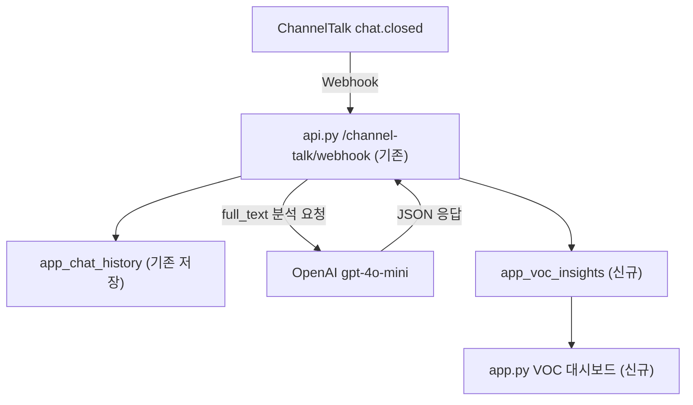

# AI 기반 채널톡 VOC 분석 시스템 구현 계획

## 현황 파악

`api.py` 에 `/channel-talk/webhook` 엔드포인트가 **이미 존재**합니다 (line 1359).
현재 동작:
1. `chat.closed` 이벤트 수신
2. ChannelTalk Open API로 대화 전문(`full_text`) 수집
3. `app_chat_history` 테이블에 저장

AI 분석 + 신규 테이블 저장 + 대시보드만 추가하면 됩니다.

## 데이터 흐름



## 변경 파일

### 1. `SUPABASE_APP_VOC_INSIGHTS.sql` (신규 SQL 파일)

```sql
CREATE TABLE IF NOT EXISTS app_voc_insights (
  id               BIGSERIAL PRIMARY KEY,
  chat_id          TEXT UNIQUE,
  customer_phone   TEXT,
  handled_by       TEXT,
  is_claim         BOOLEAN,
  complaint_category TEXT,
  product_idea     TEXT,
  summary          TEXT,
  sentiment        TEXT,   -- '긍정' / '중립' / '부정'
  raw_json         JSONB,
  analyzed_at      TIMESTAMPTZ DEFAULT now()
);
ALTER TABLE app_voc_insights DISABLE ROW LEVEL SECURITY;
```

### 2. [`api.py`](api.py) — 기존 webhook에 OpenAI 분석 추가

`app_chat_history` 저장 직후 (line ~1428) 아래 로직 삽입:

```python
openai_key = os.environ.get("OPENAI_API_KEY", "")
if full_text and openai_key:
    import openai
    client_ai = openai.AsyncOpenAI(api_key=openai_key)
    prompt = (
        "다음은 가구 쇼핑몰 고객 상담 대화입니다.\n"
        "아래 항목을 분석해 JSON으로만 응답하세요:\n"
        "- is_claim: bool (클레임 여부)\n"
        "- complaint_category: str (배송/제품불량/가격/응대/기타/없음)\n"
        "- product_idea: str (신제품·개선 아이디어, 없으면 빈 문자열)\n"
        "- summary: str (대화 1줄 요약)\n"
        "- sentiment: str (긍정/중립/부정)\n\n"
        f"대화:\n{full_text[:3000]}"
    )
    resp_ai = await client_ai.chat.completions.create(
        model="gpt-4o-mini",
        messages=[{"role": "user", "content": prompt}],
        response_format={"type": "json_object"},
        temperature=0,
    )
    ai_data = json.loads(resp_ai.choices[0].message.content)
    # app_voc_insights 저장
    await client.post(_supa_url("app_voc_insights"), ...)
```

### 3. [`requirements.txt`](requirements.txt)

`openai>=1.30.0` 한 줄 추가.

### 4. [`app.py`](app.py) — VOC 대시보드 신규 함수 + 라우팅

**`render_voc_dashboard()` 함수 추가** — `render_document_library` 함수 근처에 배치.

주요 UI 구성:
- 날짜 필터 (기간 선택)
- KPI 카드 3개: 총 상담 건수, 클레임 건수, 클레임율(%)
- `plotly` 파이 차트: 불만 카테고리 분포
- `plotly` 막대 차트: 감정 분포 (긍정/중립/부정)
- 신제품 아이디어 리스트
- 전체 데이터 테이블 (`st.dataframe`)

**사이드바 버튼 추가** (line ~25828, ERP 섹션 내):
```python
if role in ("store_admin", "superadmin"):
    if st.sidebar.button("📊 고객의 소리(VOC)", width='stretch'):
        st.session_state["active_admin_page"] = "voc_dashboard"
```

**라우팅 추가** (line ~25900):
```python
if role in ("store_admin", "superadmin") and \
   st.session_state.get("active_admin_page") == "voc_dashboard":
    render_voc_dashboard()
    return
```

## Render 환경변수 설정 필요

`OPENAI_API_KEY` 를 Render 대시보드 → Environment Variables에 추가 필요.
