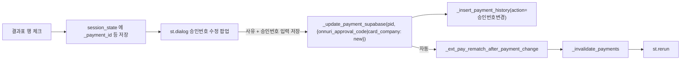

# 결제대사 승인번호 팝업 수정

## 결정 사항
- UX: 결과표에서 행 체크박스 선택 → 팝업 자동 open (버튼 1회 추가 클릭 없음).
- 범위: 온누리·지역화폐·신용/체크카드·메인페이 전 수단. 현금/계좌이체 등 승인번호 개념이 없는 행은 선택해도 팝업에서 "수정 불가" 안내만 띄움.
- 수정 가능 필드: 승인번호 1개 (+ 온누리는 거래시각 HHMMSS 부가 입력, 기존 `_onnuri_parse_time_input` 재사용). 금액·수단·날짜·고객·주문은 전부 읽기 전용.

## 데이터·백엔드 흐름 (전부 기존 코드 재사용)



- 승인번호 저장 컬럼은 수단별로 다름:
  - 온누리(전자) → `app_payments.onnuri_approval_code` (`{뒤4}` 또는 `{뒤4}-{HHMMSS}`)
  - 지역화폐·신용/체크카드·메인페이 → `app_payments.card_company` (각 포맷: 6자리 / 8자리 / 8자리)
- `_update_payment_supabase` 가 이미 `onnuri_approval_code` / `card_company` 변경을 감지해 `_ext_pay_rematch_after_payment_change` 를 호출한다 ([app.py 8853-8871](app.py)). 재매칭 로직은 그대로.

## 파일별 변경

### 1) 결과표에 행 선택 활성화 — [app.py](app.py) 약 33745행

현재:
```
st.dataframe(
    _show.style.apply(_hl_fabricated, axis=1),
    width="stretch",
    hide_index=True,
    column_config=_cfg,
)
```

바꿀 것:
- `key=f"extpay_result_sel_{sel_db}_{sel_src}"`, `on_select="rerun"`, `selection_mode="single-row"` 추가.
- 반환값에서 `selection.rows[0]` → 원본 `df.iloc[row_idx]` 로 접근해 `_payment_id`, `_order_id`, `_customer_id`, `_payment_method`, `_amount_int`, 그리고 공식일자/구매자/결과 코드 등 메타를 뽑는다.
- 메타를 `st.session_state["_extpay_appr_edit_target"] = {...}` 에 저장.

### 2) 팝업 자동 open 트리거 — [app.py](app.py) 결과표 바로 아래 신규 블록

```python
_t = st.session_state.get("_extpay_appr_edit_target")
if _t and _t.get("_src_key") == (sel_db, sel_src) and _t.get("_payment_id"):
    _open_dialog(
        f"승인번호 수정 · 결제 #{_t['_payment_id']}",
        lambda: _render_approval_edit_dialog_impl(_t),
        width="medium",
    )
    st.session_state.pop("_extpay_appr_edit_target", None)
```
- `_open_dialog` 는 이미 [app.py 14521](app.py) 에 공통 헬퍼로 존재. `ui_dialogs.open_dialog` 로 위임.
- 세션 키에서 `pop` 하므로 팝업은 선택 1회당 1번만 열림 (닫은 뒤 같은 행을 다시 선택하면 다시 열린다).

### 3) 팝업 본문 — [app.py](app.py) 신규 함수 `_render_approval_edit_dialog_impl(meta: dict)`

- 상단 요약 (읽기 전용): 공식일자, 공식금액, 구매자, 결과 코드 라벨, 모모 결제ID/주문ID, 현재 승인번호.
- 수단별 입력:
  - 온누리(전자): `뒤4` `st.text_input(max_chars=4)` + `거래시각` `st.text_input(placeholder="181529 또는 18:15:29")`. 조립: `_onnuri_parse_time_input` → `{뒤4}` 또는 `{뒤4}-{HHMMSS}`.
  - 지역화폐: `승인번호 6자리` text_input.
  - 신용/체크카드: `승인번호 8자리` text_input.
  - 메인페이: `승인번호 8자리` text_input.
  - 그 외 (현금 등): 안내만 표시하고 저장 버튼 비활성.
- `사유` text_input (5자 이상) — 기존 패턴과 동일.
- 중복 검증 (저장 전): 온누리는 `_onnuri_check_duplicate_phone4_date_time`, 지역화폐는 `_ulsan_approval_already_used` (`exclude_payment_id=pid`) — 둘 다 기존 함수.
- 저장:
  - 수단별로 payload 조립.
  - 온누리면 `{"onnuri_approval_code": new_code}`, 나머지는 `{"card_company": new_code}`.
  - `_update_payment_supabase(pid, payload)` 호출 (실패 시 `st.error` 후 return).
  - `_insert_payment_history(None, order_id, cust_name, action_type="승인번호변경", old, new, reason, db_filename=sel_db)` — 이력 저장.
  - `_invalidate_payments()` → `st.rerun()`.
- 변경 사항 없음 가드: `_norm_code(new) == _norm_code(old)` 면 저장 차단 ("변경 사항이 없습니다"), 기존 [app.py 42150-42166](app.py) 와 동일 로직 축소판.

### 4) 수정 가능 수단 가드

- `_payment_method` 가 "온누리(전자)/온누리/신용카드/체크카드/메인페이/지역화폐" 중 하나일 때만 입력란 활성. 그 외에는 안내 caption + 저장 버튼 숨김.
- 음수 결제(상계 전표)는 선택되어도 입력란 비활성 — 기존 [app.py 41802-41806](app.py) 의 음수 전표 수정 금지 정책과 일관.

## 재매칭·캐시 흐름 (추가 작업 불필요)
- `_update_payment_supabase` 내부에서:
  - `onnuri_approval_code`/`card_company` 등 매칭 필드 변경 시 `_ext_pay_rematch_after_payment_change` 자동 실행 ([app.py 8853-8871](app.py)).
  - 결제 캐시 clear 포함.
- `st.rerun()` 후 결과표가 새 매칭 결과(예: "온누리 취소·모모 잔존" → "금액일치")로 다시 그려짐.

## 검증 체크리스트
1. 결과표에서 "온누리 취소·모모 잔존" 행 체크 → 팝업 자동 open.
2. 팝업에 공식일자·금액·결제ID·현재 승인번호 요약이 보이고, 입력란은 **승인번호(+시각)** 와 사유 2종만.
3. 올바른 뒤4+시각 입력 후 저장 → 토스트 + 팝업 닫힘 + 결과표에서 해당 행이 `금액일치` 로 바뀜.
4. 음수 상계 전표 행을 선택하면 팝업에서 입력란이 비활성.
5. `app_payment_history` 에 `action_type="승인번호변경"` 레코드 1건 생성.
6. 금액·수단·날짜·고객 정보는 어떤 경로로도 수정되지 않음 (음수 상계 전표가 새로 생기지 않음).
