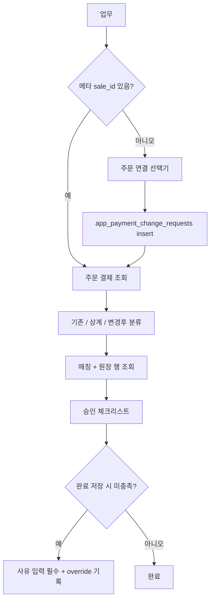

# 결제변경 승인 검증 화면

## 현재 문제 (업무 #45 김하라 실데이터 기준)

- 업무가 `general`이고 결제변경 메타가 없어 `sale_id`를 모릅니다. 그래서 주문 결제를 못 불러오고, 본문에서 뽑은 금액(4,887,000)이 전/후 양쪽에 똑같이 찍힙니다.
- 실제로는 주문 987에 결제가 다 있습니다.
  - 기존: 계좌이체 4,387,000(#13749, 9/1)과 500,000
  - 상계: 계좌이체 -4,387,000(#15085)과 -500,000(#15086), 10/2
  - 변경 후: 온누리 4,887,000, 승인번호 `0325`(#15087), 10/2 17:47
- `_pcr_classify_order_pays`는 원본 결제 ID 1건만 기준으로 나눕니다. 그래서 원본이 여러 건이거나 원본 ID가 없으면 전/후가 틀어집니다.
- 원장(`app_external_pay_rows`)의 거래일·거래시각·승인번호·금액을 화면에 보여 주지 않습니다. 매칭 라벨만 나옵니다.
- 승인해도 되는지 한눈에 판단할 요약이 없고, 완료는 아무 조건 없이 저장됩니다.

## 목표 화면

```
[결제변경 검증] 김하라 · 주문 #987 (store_1)            [승인 불가: 2개 미충족]
-- 기존 결제 ------------------------------ 검증 --
 4,387,000 계좌이체  결제일 09-01  등록 09-01 16:52   원장 없음 (수기 확인 대상)
   └ 상계 -4,387,000  10-02 17:44 등록               상계 확인
 500,000 계좌이체    ...
-- 변경 후 결제 ----------------------------------
 4,887,000 온누리  승인 0325  결제일 10-02  등록 10-02 17:47
   원장: 10-02 17:46:12 · 승인 ****0325 · 4,887,000 · 정상   [금액일치]
   (원장 미매칭이면: 미검증 - 온누리 파일 업로드 후 재검증 필요)
-- 금액 대사 -------------------------------------
 기존 합계 4,887,000 / 상계 합계 -4,887,000 / 변경 후 합계 4,887,000 -> 일치
-- 승인 체크리스트 -------------------------------
 [v] 주문 연결  [v] 기존 결제 전액 상계  [v] 금액 일치
 [x] 변경 후 결제 원장 매칭  [ ] 원장 없는 수단(이체/현금) 수기 확인
```

## 구현 단계 (모두 [app.py](app.py))

1. **주문 연결 선택기 (일반 업무용)**
   - 메타에 `sale_id`가 없으면 패널 위에 고객명 검색(제목에서 추정한 이름이 기본값)을 띄우고, 고객 선택 후 주문(주문일·총액)을 고릅니다. 그다음 "이 주문으로 연결"을 누릅니다.
   - 연결하면 `app_payment_change_requests`에 `task_id, db_filename, sale_id, customer_name, change_type='change', reason=description`을 insert합니다. 기존 테이블이라 스키마 변경은 없습니다. activity `payment_change_linked`를 남깁니다.
   - 권한: 작성자, 담당자, store_admin, superadmin.

2. **전/후 분류 재작성: `_pcr_classify_order_pays`**
   - 기준 시점은 가장 이른 음수(상계) 결제의 `created_at`입니다.
   - 기존 결제: 기준 시점 전의 양수 결제입니다. 원본 결제 ID가 있으면 그것을 우선하고, 없으면 상계와 (수단, 금액)으로 짝지어진 양수를 고릅니다.
   - 상계: 음수 결제입니다. 각 건이 어느 기존 결제를 취소한 것인지 짝을 표시합니다.
   - 변경 후: 기준 시점 이후의 양수 결제입니다. activity `new_payment_ids`가 있으면 그것을 우선합니다.

3. **원장 상세 조회: `_pcr_bulk_match_details`**
   - `app_external_pay_matches.row_id`로 `app_external_pay_rows`를 한 번에 조회해서 `tx_date, tx_time, approval_code, amount, tx_status`를 붙입니다.
   - 결제 블록에 원장 한 줄을 추가합니다. 원장 승인번호와 모모 승인번호가 다르면 빨간 경고를 띄웁니다.

4. **결제 블록 표시 보강: `_pcr_render_pay_block`**
   - 결제일, 등록시각(`created_at`을 KST `MM-DD HH:MM`로), 승인번호, 수단별 거래시간을 보여 줍니다.
   - 검증 상태는 세 가지 중 하나로 표시합니다.
     - 원장 매칭: 결과 라벨
     - 미검증: 해당 원장 업로드 필요
     - 원장 없는 수단(계좌이체/현금): 수기 확인 대상
   - 빈 bullet(`-` 라벨)이 나오지 않게 고칩니다.
   - 상계 행도 같은 블록으로 표시하고, 원장 취소 매칭 여부를 함께 보여 줍니다.

5. **금액 대사와 승인 체크리스트: 새 함수 `_pcr_approval_checklist(ctx) -> list[(label, ok, detail)]`**
   - 주문 연결
   - 기존 결제 전액 상계
   - 상계 합계와 변경 후 합계 일치(환불형은 변경 후 0 허용)
   - 원장 대상 결제(기존·변경 후)가 모두 원장에 매칭됨
   - 원장 없는 수단이 있으면 "수기 확인" 체크박스. 결재자가 체크하면 activity로 기록합니다.
   - 헤더 배지: "승인 가능" 또는 "승인 불가: N개 미충족"

6. **완료 시 경고 + 사유 필수 (업무 수정 폼, ~33697)**
   - 결제변경 패널이 보이는 업무에서 상태를 완료로 저장할 때 체크리스트 미충족 항목이 있으면, 폼에 "미충족 승인 사유"를 받습니다.
   - 사유가 비어 있으면 저장을 막고 `st.error`로 미충족 항목을 보여 줍니다.
   - 사유가 있으면 저장하고 activity `payment_change_override`에 `{failed_items, reason}`를 남깁니다. `verify_note`에도 저장합니다.
   - 체크리스트 결과는 패널에서 `st.session_state[f"pcr_chk_{tid}"]`에 넣어 폼과 공유합니다.

## 데이터 흐름



## 검증

- #45: 주문 987을 연결하면 기존 2건, 상계 2건, 온누리 4,887,000(`0325`)이 나오고 합계가 일치해야 합니다. 온누리 원장이 매칭돼 있지 않으면 체크리스트에 미충족이 떠야 합니다.
- #44(김장희, 주문 10361): 카드 1,359,000이 상계되고 변경 후 온누리 1건, 지역화폐 2건이 원장 시각·승인번호와 함께 표시돼야 합니다.
- 미충족 상태로 완료를 사유 없이 저장하면 막히고, 사유를 쓰면 저장되며 activity가 남아야 합니다.
- `py_compile app.py task_board.py`를 통과한 뒤 커밋하고 push합니다.

## 범위 밖

- 계좌이체·현금 은행 거래내역 업로드(원장화)는 하지 않습니다. 이번에는 수기 확인 체크로 처리합니다.