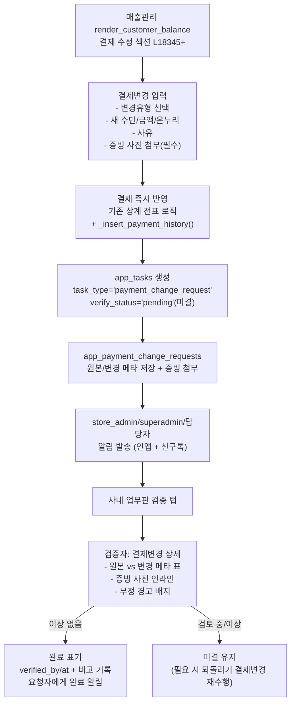

# 매출관리 ↔ 사내 업무 결제변경 연동 계획

## 현황 분석

기존 관련 테이블/코드:
- [`SUPABASE_ORDERS_PAYMENTS.sql`](SUPABASE_ORDERS_PAYMENTS.sql): `app_payments` (payment_method, onnuri_approval_code, amount 등), `app_orders`
- [`SUPABASE_APP_PAYMENT_HISTORY.sql`](SUPABASE_APP_PAYMENT_HISTORY.sql): `app_payment_history` (변경 이력, receipt_image_path, old/new JSONB)
- [`SUPABASE_APP_EDIT_REQUESTS.sql`](SUPABASE_APP_EDIT_REQUESTS.sql): `app_edit_requests` (승인 워크플로우 기반 존재)
- [`SUPABASE_APP_TASKS.sql`](SUPABASE_APP_TASKS.sql): `app_tasks` + `app_task_attachments` (이미 운영 중)
- `app.py` L4183 `_insert_payment_history()`: 결제 변경 이력 기록 함수 존재
- `app.py` L4888 `render_payment_history_monitor()`: 결제 변경 모니터링 화면 존재

## 데이터 모델 변경

### 1. `app_tasks` 컬럼 추가 (ALTER)
```sql
ALTER TABLE app_tasks ADD COLUMN IF NOT EXISTS task_type TEXT DEFAULT 'general';
-- 'general' | 'payment_change_request'
ALTER TABLE app_tasks ADD COLUMN IF NOT EXISTS verify_status TEXT DEFAULT NULL;
-- NULL(일반 업무) | 'pending'(미결) | 'resolved'(완료)
ALTER TABLE app_tasks ADD COLUMN IF NOT EXISTS verified_by TEXT DEFAULT NULL;
ALTER TABLE app_tasks ADD COLUMN IF NOT EXISTS verified_at TIMESTAMPTZ DEFAULT NULL;
ALTER TABLE app_tasks ADD COLUMN IF NOT EXISTS verify_note TEXT DEFAULT NULL;
```

비고: 결제는 즉시 반영되므로 `verify_status`는 결제 자체를 막지 않고 "검증 완료/미결"만 표시. 반려(rejected) 개념 없음 — 문제가 있으면 검증자가 별도 결제변경(되돌리기)을 다시 수행하고 비고에 사유 기록.

### 2. 신규 테이블 `app_payment_change_requests`
```sql
CREATE TABLE IF NOT EXISTS app_payment_change_requests (
    id               BIGSERIAL PRIMARY KEY,
    task_id          BIGINT NOT NULL REFERENCES app_tasks(id) ON DELETE CASCADE,
    db_filename      TEXT NOT NULL,
    sale_id          BIGINT NOT NULL,          -- app_orders.id
    payment_id       BIGINT,                   -- app_payments.id (NULL이면 신규 결제)
    customer_name    TEXT,
    change_type      TEXT NOT NULL,
    -- 'refund' | 'cancel_card' | 'cancel_transfer' | 'method_change' | 'onnuri_change'
    original_amount  BIGINT,
    original_method  TEXT,
    original_onnuri  TEXT,                    -- onnuri_approval_code
    new_amount       BIGINT,
    new_method       TEXT,
    new_onnuri       TEXT,
    reason           TEXT NOT NULL,
    created_at       TIMESTAMPTZ DEFAULT now()
);
```

신규 SQL 파일: `SUPABASE_APP_PAYMENT_CHANGE_REQUESTS.sql`

## 흐름 다이어그램



## 부정행위 방지 체크포인트

| 검사 | 구현 |
|---|---|
| 증빙 필수 | 원본/신규 결제 증빙 사진 미첨부 시 저장 버튼 비활성화 |
| 요청자=검증자 분리 | `can_resolve` 로직: 검증 대상 태스크의 요청자(`created_by`)와 현재 로그인 사용자가 동일하면 완료 버튼 숨김 (셀프 검증 차단) |
| 금액 범위 | 환불/취소 금액이 원본 결제 금액 초과 시 경고 배지 표시 |
| 활동 로그 | 결제변경 생성·완료 표기 시 `app_task_activity`에 actor·payload 기록 (감사 추적) |
| 이력 보존 | 결제 반영 시 기존 `_insert_payment_history()`로 `app_payment_history`에 병행 기록 (변경 전/후 JSONB) |
| 미결 추적 | 검증 안 된 결제변경은 `verify_status='pending'`으로 남아 관리자 대시보드 뱃지에 계속 노출 |

## 구현 파일 및 변경 위치

### 신규 파일
- `SUPABASE_APP_PAYMENT_CHANGE_REQUESTS.sql`: 위 테이블 DDL + `app_tasks` ALTER + RLS

### `task_board.py` 추가 함수
```python
def create_payment_change_task(sale_id, payment_id, customer_name, change_type,
                                original_payment, new_payment, reason,
                                created_by, store_name, db_filename) -> tuple[int|None, str|None]:
    # create_task(task_type='payment_change_request', verify_status='pending')
    # → app_payment_change_requests INSERT → store_admin/superadmin/담당자 알림
    # (결제 자체 반영은 app.py 기존 로직이 이미 수행한 뒤 호출됨)

def resolve_payment_change(task_id, verifier, note=None) -> tuple[bool, str|None]:
    # verify_status='resolved', verified_by/verified_at/verify_note 기록
    # → app_task_activity 로그 → 요청자에게 '검증 완료' 알림

def load_payment_change_meta(task_id) -> dict|None:
    # app_payment_change_requests에서 task_id로 원본/변경 메타 조회

def load_pending_payment_verifications(store_name, role) -> list[dict]:
    # task_type='payment_change_request' AND verify_status='pending' 목록 (미결 뱃지용)
```

### `app.py` 변경

**A. 매출관리 화면 내 결제변경 버튼 추가**

정확한 진입점 (탐색 확인): `render_customer_balance` (L17635) → 탭1 "일반 고객 및 데이터 수정" → `📝 주문 수정 & 결제 관리` expander → `💳 결제 내역 조회 및 수정` 섹션 (L18345~18868). 초과결제 탭(L18883+)도 동일 패턴.

주의 — 현재 운영 방식(L15877): "결제 수정 승인 워크플로우 제거 → 직접 수정". 결제 변경은 상계 전표 방식(기존 `-amount` INSERT 후 새 `+amount` INSERT, L18648~18719)으로 즉시 반영됨. 이번 작업은 이 직접 수정 경로를 대체하는 게 아니라, "사내 업무 승인이 필요한 결제변경"을 별도 버튼으로 추가하는 것. (기존 직접 수정 UI는 그대로 두고 그 옆에 요청 버튼 추가)

각 결제 행 수정 블록(L18345+)에 버튼 삽입:

```python
if st.button("💳 사내 결제변경 요청", key=f"pcr_{payment_id}"):
    st.session_state["pcr_sale_id"] = order_id        # = app_payment_history.sale_id
    st.session_state["pcr_payment_id"] = payment_id
    st.session_state["pcr_open"] = True
```

별도 `_render_payment_change_request_form(sale_row, payment_row, me_uname, store_name, db_filename)` 함수:
- 변경유형 선택: `st.selectbox` (환불, 카드취소, 이체취소, 결제수단변경, 온누리변경)
- 결제 정보 자동 채워짐(읽기 전용): 결제번호, 고객명, 금액, 결제수단, 온누리 승인번호
- 새 결제 정보 입력(변경 후): 수단, 금액, 온누리 번호
- 사유 입력 (필수)
- 원본 증빙 사진 첨부 (필수, 미첨부 시 제출 비활성화)
- 새 결제 증빙 첨부 (선택)
- 제출 → `_tb.create_payment_change_task()` 호출

**B. 사내 업무판 `_render_task_detail` 내 결제변경 전용 섹션**

`task_type == 'payment_change_request'` 이면 상단에 전용 카드 표시:
- 결제 메타 인라인 표 (원본 vs 변경 후)
- 증빙 이미지 인라인 갤러리 (기존 `_render_attachment_inline` 재사용)
- 부정행위 경고 배지 (금액 초과 등)
- 완료/미결 결재 버튼 (`can_resolve` = 관리자/담당자 AND 요청자 본인 아님)
- 완료 시 비고(`verify_note`) 입력

**C. `_supabase_run_app_tables_sql`** (L531)에 `SUPABASE_APP_PAYMENT_CHANGE_REQUESTS.sql` 등록 → 자동 테이블 생성

**D. `render_internal_work` 상단에 "결제변경 미결 검증" 뱃지 추가**

```python
pending = _tb.load_pending_payment_verifications(store_name, role)
if pending:
    st.warning(f"💳 결제변경 미결 검증 {len(pending)}건 — 증빙 확인 후 완료 처리해 주세요.")
```

## 구현 순서

1. `SUPABASE_APP_PAYMENT_CHANGE_REQUESTS.sql` 작성 (DDL + `app_tasks` ALTER + RLS)
2. `task_board.py` — `create_payment_change_task`, `resolve_payment_change`, `load_payment_change_meta`, `load_pending_payment_verifications` 추가
3. `app.py` — `render_customer_balance` 결제 수정 섹션(L18345+)에서 결제변경 저장 직후 `create_payment_change_task()` 자동 호출 (증빙 사진 첨부 입력 추가)
4. `app.py` — `_render_task_detail` 내 결제변경 전용 UI + 완료/미결 결재 버튼
5. `app.py` — `render_internal_work` 상단 미결 검증 뱃지
6. `_supabase_run_app_tables_sql` 등록

## 확정된 설계 결정

- 결제는 기존 로직대로 즉시 반영 (차단 없음). 사내 업무는 사후 검증용 — `verify_status` 완료/미결만 추적 (apply_mode=record_only).
- 모든 결제변경을 검증 대상으로 통일하지 않고, 우선 환불/카드취소/이체취소/결제수단변경/온누리변경 5종에 대해 검증 태스크 생성 (사용자 선택 유형 기준).

## 확정된 알림 대상

- 검증 태스크 알림 수신: superadmin + 매장관리자 + 지정 결제 담당자. 단 결제변경을 올린 요청자(`created_by`) 본인은 셀프 검증 방지를 위해 완료 버튼에서 제외(알림은 받되 본인 건 완료 처리 불가).
