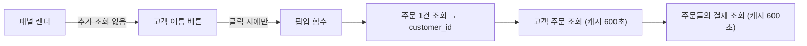

# 결제변경 창 정리와 고객 결제 팝업

대상 파일: [app.py](app.py) 하나만 수정합니다. DB 스키마는 바꾸지 않고, 조회만 추가합니다.

## 1) 이번 결제변경 내역만 표시

`_render_payment_change_verify_panel`의 결제 전 창에서 지금 "기존 유지" 태그가 붙는 결제를 빼고 그리지 않습니다.
- 결제 전 창에는 다음만 남깁니다.
  - 원 결제: 메타의 `payment_id`와 같은 결제
  - 상계 전표와 수단·금액이 맞아 "변경 대상 · 상계됨"으로 짝지어진 양수 결제
  - 상계(취소) 전표
- 결제 후 창은 지금 분류(상계 전표보다 나중에 등록된 양수 결제)를 그대로 씁니다.
- 결제 전 헤더의 합계는 표시되는 변경 대상 결제만 더합니다.
- #49에 적용하면 이렇게 됩니다.
  - 결제 전: 954,000원 신용카드(14478)와 상계 -954,000원(15143)
  - 결제 후: 500,000원(15144)과 454,000원(15145)
  - 9/5 300,000원, 9/19 온누리 2건, 42,000원은 숨겨집니다.

이렇게 하면 결제 블록 수가 줄어, 블록마다 실행되던 원장 후보 조회(`_pcr_ledger_candidates`)도 함께 줄어듭니다.

## 1-1) 결제 전/후 블록에 결제 상세를 그대로 유지

이번 변경분은 결제 전 창과 결제 후 창 모두, 결제 한 건당 지금 나오는 상세를 빠짐없이 유지합니다. 이미 구현된 `_pcr_render_pay_block`을 그대로 쓰고, 이번 작업에서 이 줄을 빼지 않습니다.
- 금액과 결제수단
- 카드사(신용카드·체크카드)
- 결제ID
- 결제일
- 승인번호(없으면 "승인번호 미입력")
- 거래시간(온누리·지역화폐처럼 승인번호에 시각이 들어 있는 경우)
- 모모 등록 시각(한국 시간)과 입력자
- 원장 검증 결과: 매칭되면 원장 거래 일시·승인번호·금액·카드사·승인/취소 구분, 미검증이면 미검증 표시와 원장 후보 또는 업로드 안내

첨부 이미지의 500,000원 지역화폐 블록 기준으로, 결제 후 창에는 "500,000원 · 지역화폐 / 결제ID 15144 · 결제일 2026-10-03 · 승인번호 319849 / 모모 등록 2026-10-03 17:18:23 · 김승찬 / 미검증"이 그대로 보입니다. 결제 전 창의 954,000원 신용카드와 상계 전표도 같은 항목으로 보입니다.

## 2) 고객 이름 클릭 시 전체 결제 팝업

- 패널 헤더(`#### 💳 결제변경 검증 · {change_label}` 아래)에 `고객: [이름]` 버튼을 추가합니다. `st.button(type="tertiary")`로 링크처럼 보이게 하고, 이름은 메타의 `customer_name`을 씁니다.
- 클릭하면 `@st.dialog("고객 전체 결제 내역", width="large")` 팝업 함수 `_pcr_customer_payments_dialog(db, sale_id, customer_name)`를 엽니다.
- 팝업 내용은 "결제 내역 조회 및 수정"과 같은 형식이고, 읽기 전용입니다(수정 폼 없음).
  - 주문별 헤더: `주문 #id | 계약일 | 배송일 | 총액 | 잔금 | 복합결제`
  - 결제 표 열: 결제ID, 결제일, 금액, 수단, 카드사/승인번호, 수수료, 복합결제
  - 이번 결제변경 주문(`sale_id`)은 처음부터 펼치고, 다른 주문은 접어 둡니다.
- 표 포맷이 두 화면에서 똑같도록, "결제 내역 조회 및 수정"에 있던 표 포맷 코드(~44160 부근, 복합결제 마킹·온누리 승인번호 대체·카드사 미입력 처리)를 `_format_order_payments_display(pay_list) -> (DataFrame, cols)` 헬퍼로 빼냅니다. 그리고 두 곳에서 같이 호출합니다. 기존 화면의 결과는 바뀌지 않습니다.

## 3) 속도 영향 최소화

- 팝업 데이터는 버튼을 눌렀을 때만 조회합니다. 패널을 그릴 때는 쿼리가 하나도 늘지 않습니다.
- 팝업은 이미 캐시가 있는 기존 함수를 재사용합니다.
  - `_get_order_supabase`: customer_id 얻기용, 1건
  - `_load_orders_by_customer_ids_supabase`: ttl=600
  - `_load_payments_by_order_ids_supabase`: ttl=600, 결제 내역 화면과 같은 캐시
- 잔금은 따로 조회하지 않고, 주문 총액에서 결제 합계를 빼서 계산합니다.
- 검증창 쪽 조회 부담을 줄입니다.
  - `_pcr_bulk_match_details`에 `@st.cache_data(ttl=60, show_spinner=False)`를 붙입니다. 지금은 캐시가 없어, 업무 상세를 다시 그릴 때마다 Supabase를 2번 조회합니다. 함수 안의 `st.warning`은 `logging` 경고로 바꾸고, 빈 결과를 돌려줍니다.
  - 원장 후보 조회(`_pcr_ledger_candidates`, ttl=60)는 결제 후 블록과 변경 대상 블록에서만 실행됩니다. 1번 덕분에 블록 수 자체가 줄어듭니다.
- 원장 업로드나 재매칭이 끝나면 `_pcr_bulk_match_details.clear()`와 `_pcr_ledger_candidates.clear()`를 호출합니다. 업로드 직후에도 검증창에 바로 반영되게 하기 위해서이며, 기존 업로드 완료 지점 1곳에 넣습니다.

## 확인 방법
- `python -m py_compile app.py`
- #49 화면에서 결제 전은 2블록(원 결제와 상계), 결제 후는 2블록만 나오는지 봅니다.
- 고객 이름을 누르면 팝업에 주문 #10206의 8건 표가 "결제 내역 조회 및 수정"과 같은 내용으로 나오는지 봅니다.
- 팝업을 열기 전후로 업무 목록과 상세가 느려지지 않는지 봅니다. 상세를 다시 열었을 때 캐시 덕분에 매칭 조회가 다시 실행되지 않아야 합니다.
- 마지막으로 커밋·푸시합니다.