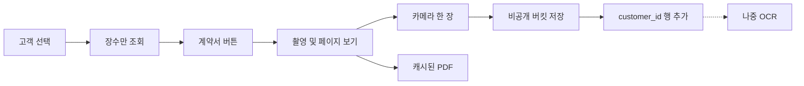

# 고객 계약서 촬영·보관

대상은 [app.py](app.py)의 고객 선택 화면(결제 내역 조회, 고객을 고른 직후 약 43546행)과 새 저장 모듈입니다. 업무 첨부([task_board.py](task_board.py) `attach_file`, 버킷 `task-attachments`)와 같은 Supabase Storage 방식을 쓰되, 계약서는 별도 버킷과 별도 테이블로 격리합니다. 업무 첨부 20MB 제한·task_id 경로에 계약을 섞지 않습니다.

이 작업은 새 테이블과 Storage 버킷이 필요합니다. 구현 전에 스키마 변경 확인을 한 번 더 받습니다.

## OCR이 되는지

됩니다. 다만 1차 목표(고객을 누르면 그 계약서가 바로 나오는 것)에는 OCR이 필요 없습니다.

- 인쇄된 양식의 글자(상호, 품목, 금액 인쇄분)는 한국어 OCR로 읽을 수 있습니다. 손글씨 금액, 서명, 도장은 틀리는 경우가 많아서 검색 보조로만 씁니다.
- 사진을 저장한 뒤에 백그라운드로 읽습니다. 촬영 저장이 OCR을 기다리지 않습니다.
- 연결된 MCP 중 OCR을 하는 도구는 없습니다. Bright Data, Google Drive, Figma, Slack은 이 기능과 맞지 않습니다. Google Drive에 파일을 두면 조회가 한 단계 더 느려지므로 쓰지 않습니다.
- OCR을 켤 때는 서버 API 하나만 고릅니다. 한국어 서류는 네이버 Clova OCR 또는 Google Document AI. 키는 `st.secrets`에만 둡니다. 1차 구현에는 API를 넣지 않습니다.

## PC 입력 후 휴대폰 촬영

신규 매출은 PC에서 먼저 저장합니다. 휴대폰은 그 다음에 계약서만 찍습니다. 두 기기는 고객 이름과 전화번호로 만납니다. QR이나 기기 간 자동 넘김은 없습니다.

1. PC 신규 매출에 고객명, 전화번호, 주소를 입력하고 저장합니다.
2. 저장되면 그 고객은 계약서 0장입니다. 직원이 휴대폰 계약서 화면을 엽니다.
3. 방금 저장한 이름을 검색하면 카드에 "계약서 없음"이 보입니다. 카드를 누릅니다.
4. 폰을 세로로 들고 A4 가이드 안에 계약서를 맞춰 찍습니다. 저장 즉시 크기가 맞춰지고 PDF가 다시 만들어집니다.
5. PC에서 그 고객의 계약서를 열면 세로 A4 PDF가 보입니다.

휴대폰에서 기존 "고객 및 잔금 관리"로 들어가면 탭, 고객 선택 상자, 주문 수정 폼이 한 화면에 겹칩니다. 계약서를 찍으려는 직원은 그 화면을 거치지 않습니다. 화면 너비 767px 이하이거나 User-Agent가 모바일이면, 앱을 열자마자 아래 4화면만 보입니다. PC의 고객 화면에는 이름 아래 "계약서" 버튼만 두고, 누르면 같은 촬영 화면을 다이얼로그로 엽니다. 저장 규칙(버킷, 테이블, PDF, OCR)은 양쪽이 같습니다.

찍기 난이도의 기준은 이렇습니다. 고객 카드를 누른 뒤, 엄지로 누르는 버튼은 항상 하나이고 높이 72px, 화면 폭 전체입니다. 저장 확인, 파일 이름, 페이지 번호 입력은 없습니다. 셔터를 누르면 그 고객에게 바로 저장하고, 같은 화면에 머뭅니다. 다음 장도 같은 버튼을 다시 누릅니다.

Streamlit `st.camera_input`은 쓰지 않습니다. 미리보기가 작고, 찍은 뒤 확인이 한 번 더 붙으며, 그 위에 가이드 선을 올릴 수 없습니다. 폰 기본 카메라도 우리 선을 그릴 수 없습니다. 그래서 "계약서 찍기"는 앱 안의 전체 화면 미리보기를 엽니다.

### 촬영 중 가이드

- 후면 카메라 영상을 화면 전체에 띄웁니다. 서버로 영상을 보내지 않습니다. 셔터를 누르기 전까지 네트워크 요청은 없습니다.
- 화면 한가운데에 A4 비율(가로:세로 = 1:1.414)의 네 모서리 괄호를 흰색으로 그립니다. 괄호 밖은 살짝 어둡게 해 계약서가 들어가야 할 칸이 보이게 합니다.
- 안내 한 줄은 "계약서 네 모서리를 선 안에 맞추세요"입니다.
- 선은 보여 주기만 합니다. 저장 이미지는 선 안쪽으로 자르지 않습니다. 종이가 조금만 비뚤어도 글자가 잘리지 않게, 카메라가 본 화면 전체를 저장합니다.
- 폰은 세운 채로 찍습니다. 가로로 돌리라는 안내와 가로 가이드는 없습니다. 가이드는 항상 세로 A4입니다.
- 아래 셔터 하나만 있습니다. 누르면 그 프레임을 바로 저장하고 화면 4로 돌아갑니다. 다시 맞추는 확인 화면은 없습니다.
- 카메라 권한이 거절되거나 이 화면에서 카메라를 열지 못하면, 안내 한 줄("이 폰에서는 가이드 없이 기본 카메라로 찍습니다") 뒤에 폰 기본 카메라로 넘깁니다. 저장 규칙은 같습니다.
- 갤러리에서 가져오기는 가이드 화면이 아니라, 찍기 전 화면의 작은 글씨로만 둡니다.

### 화면 1. 고객 찾기

사이드바, 탭, 표를 그리지 않습니다. 상단 제목은 "계약서"입니다. 그 아래 높이 56px 검색창 하나만 있습니다. placeholder는 "이름 또는 전화번호"입니다. 안내 한 줄은 "고객을 고르면 바로 촬영합니다"입니다.

검색은 입력이 멈춘 뒤 300ms에 기존 고객 조회(이름, phone1, phone2, 매장)를 호출합니다. 결과는 최대 20명입니다. 빈 칸이면 최근 촬영 고객 5명만 보여주고, 매장 고객 전체를 받지 않습니다. 계약서 이미지 바이트는 이 화면에서 받지 않습니다. 장수 숫자만 받습니다.

### 화면 2. 검색 결과

한 줄이 카드입니다. 높이 88px 이상, 폭 전체입니다. 카드 안은 이름(굵게), 전화번호, 오른쪽 장수("계약서 2장" 또는 "계약서 없음")입니다. 카드 전체를 누르면 화면 3으로 갑니다. 같은 전화번호로 합쳐진 고객은 카드 하나에 모으고, 장수는 합친 id 기준으로 셉니다. 0명이면 "없는 고객입니다. 이름을 다시 확인하세요"만 보여 주고, 이 화면에서 신규 고객을 만들지 않습니다. 신규 등록은 기존 PC 화면 일입니다.

### 화면 3. 찍기 전

위: "고객 검색"으로 화면 1에 돌아갑니다. 이름과 전화번호를 크게 보여 잘못된 고객에게 찍는 일을 막습니다. 아래 고정 영역은 파란 버튼 "계약서 찍기" 하나와, 그 밑 작은 글씨 "갤러리에서 가져오기"입니다. 계약서가 없는 고객은 썸네일 자리를 비워 둡니다. 스크롤해서 버튼을 찾지 않게, 버튼은 화면 하단에 고정합니다. 본문에는 버튼 높이만큼 아래 여백을 둡니다. 이 버튼을 누르면 위 "촬영 중 가이드" 전체 화면이 열립니다.

### 화면 4. 저장 직후, 다음 장

카메라에서 돌아오면 미리보기 확인 화면을 만들지 않습니다. 저장이 끝나면 초록 줄 "N장 저장됨"과 방금 장의 썸네일이 붙고, 하단 버튼 문구만 "다음 장 찍기"로 바뀝니다. 고객 이름, 검색 결과, 버튼 위치는 그대로입니다. 직원이 종이 다음 페이지로 넘기고 같은 자리를 다시 누르면 됩니다.

썸네일은 가로로 나열하고 각 장 아래에 "1장", "2장"만 씁니다. "이 장 다시 찍기"는 마지막 장 썸네일 아래에만 작은 글씨로 둡니다. 누르면 그 `page_no`의 파일만 교체합니다. 이전 장을 지우는 버튼은 기본 화면에 두지 않습니다. 잘못 올린 장 삭제는 썸네일을 길게 누르거나 "더보기" 안에 넣습니다.

하단 두 번째 버튼 "PDF로 보기"는 2장 이상일 때만 찍기 버튼 아래에 둡니다. 0장, 1장일 때는 숨겨 찍기 버튼만 남깁니다.

### 실패할 때

- 카메라 권한이 없으면 "설정에서 카메라 허용 후 다시 눌러 주세요"를 버튼 위에 한 줄로 띄웁니다. 다른 화면으로 보내지 않습니다.
- 저장 실패(네트워크, 20MB 초과)면 그 장을 버린 것으로 세지 않고, "저장 실패. 같은 버튼으로 다시 찍어 주세요"를 띄웁니다. 성공 장수는 그대로입니다.
- 저장 중에는 버튼 문구를 "저장 중"으로 바꾸고 비활성화합니다. 두 번 눌러 같은 사진이 두 장이 되지 않게 합니다.

### PC에서 보는 계약서

계약서는 전부 세로 A4입니다. PC에서 열면 회전 버튼 없이 그 방향으로 바로 보여야 합니다. 직원이 폰을 가로로 돌릴 필요도 없습니다.

저장할 때 방향을 고정합니다.

- 촬영은 폰을 세로로 든 상태만 사용합니다. 가이드도 세로 A4만 그립니다.
- 저장 직전에 EXIF 회전값을 픽셀에 적용한 뒤 EXIF를 제거합니다. PC와 PDF가 회전 정보를 무시해도 글자가 옆으로 눕지 않습니다.
- 적용 후 가로가 세로보다 길면 시계 방향으로 90도 돌려 세로로 맞춥니다. 갤러리에서 가져온 사진도 같습니다. 계약서는 세로 A4만 있으므로 가로 원본을 그대로 두지 않습니다.
- 썸네일도 같은 방향으로 만듭니다. 폰의 장 목록에서 먼저 보이는 작은 그림이 가로이면, 본문을 열기 전에 잘못된 장으로 오해합니다.

용량을 저장 시점에 맞춥니다. 폰 카메라 원본은 한 장이 4~8MB인 경우가 많아서, 그 파일을 그대로 두면 PC에서 다시 열 때 느립니다. PDF로만 감싸도 안의 사진이 그대로면 용량은 줄지 않습니다.

- 방향 보정 직후 세로 A4 픽셀로 줄입니다. 긴 변 2339px(A4, 200dpi), JPEG 품질 80입니다. 카메라가 12MP여도 저장 파일은 이 크기입니다.
- 한 장이 1MB를 넘으면 품질만 70으로 한 번 더 낮춥니다. 그 이상 원본은 보관하지 않습니다.
- 장당 크기는 대략 300~700KB로 모입니다. 고객이 달라도, 폰이 달라도 저장 규격은 같습니다.
- 이 줄어든 JPEG로 그 고객의 PDF를 저장 요청 안에서 다시 만듭니다. 페이지는 A4 세로입니다. 파일은 `{customer_id}/contract.pdf` 한 개입니다. 장을 추가하거나 다시 찍으면 이 PDF만 다시 만듭니다.
- PDF 재생성이 실패해도 이미 줄어든 장은 남습니다. 그때만 장 이미지를 보여 줍니다.

PC에서 다시 열 때는 이 PDF 한 파일입니다. 카메라 JPEG를 장마다 받지 않습니다.

- 이름 아래 "계약서 N장"을 누르면 저장된 PDF가 열립니다. 페이지는 위에서 아래로 세로 A4입니다.
- 칸보다 넓게 퍼뜨리거나 가로로 채우지 않습니다. 여백은 흰색입니다.
- 방향을 맞추는 버튼은 없습니다. 저장 때 이미 세로로 맞춥니다.
- 폰의 촬영 화면 장 목록만 긴 변 480px 썸네일을 씁니다. PC 본문은 PDF입니다.

### PC

PC 고객 화면([app.py](app.py) 고객 선택 직후, 약 43546행)에는 이름 아래에 "계약서 N장" 버튼만 있습니다. 누르면 위 세로 A4 보기와, 필요하면 촬영 버튼이 다이얼로그로 열립니다. PC에서 새로 찍을 때도 저장 규칙은 같고, 결과는 세로 A4로 보입니다. 파일 선택도 허용하며, 선택한 파일도 저장 전에 세로로 맞춥니다.

## 1차: 앱에서 찍어 그 고객에 저장

고객을 고른 뒤의 저장은 모바일 화면 4와 같습니다.

- "계약서 찍기"는 앱 안 전체 화면 카메라와 A4 네 모서리 가이드를 엽니다. 권한이 없으면 폰 기본 카메라로 넘깁니다. 이미 찍힌 사진은 "갤러리에서 가져오기"로만 넣습니다. `st.camera_input`은 쓰지 않습니다.
- 촬영 즉시 비공개 버킷 `customer-contracts`에 저장하고 `app_customer_contracts`에 한 행을 넣습니다. 경로는 `{db_filename}/{customer_id}/{uuid}.jpg`. 저장 전에 세로 A4, 긴 변 2339px, JPEG 품질 80으로 줄입니다. 카메라 원본은 남기지 않습니다.
- 같은 요청에서 그 고객의 `contract.pdf`를 줄어든 장들로 다시 만듭니다. PC에서 다시 열 때는 이 PDF만 받습니다.
- 같은 고객의 다음 장은 `page_no`를 1씩 올립니다. 주문(`order_id`)이 선택된 상태면 그 주문에 연결하고, 없으면 고객 단위로만 보관합니다. 모바일 촬영 화면에는 주문 선택 상자를 두지 않습니다.
- 저장 응답에는 원본 이미지를 다시 내려받지 않습니다. 화면에는 썸네일(긴 변 480px)만 그립니다.

테이블 초안:

- `id`, `db_filename`, `customer_id`, `order_id`(없을 수 있음), `page_no`
- `storage_path`, `thumb_path`, `mime_type`, `byte_size`
- `uploaded_by`, `created_at`
- `ocr_status`(기본 `skipped`), `ocr_text`(비움). 2차에서만 채웁니다.

조회는 `customer_id` + `db_filename` 인덱스 한 번입니다. 전화번호가 같은 중복 고객은 기존 `all_cids` 병합과 같이 묶어서 보여 줍니다.

## 계약서 버튼에서 보이는 것

- PC에서 다시 열면 자동으로 만들어진 PDF 한 파일입니다. 카메라가 찍은 고해상도 JPEG를 장마다 열지 않습니다.
- PDF가 아직 없으면, 이미 크기를 맞춘 장을 세로 A4 칸에 이어 보여 줍니다.
- 합치기는 `img2pdf`입니다. 이미 줄어든 JPEG를 다시 압축하지 않습니다. 의존성이 없으면 추가합니다.

## 검색

- 1차 검색은 이미 있는 고객 검색(이름, 전화)입니다. 고객을 고르면 계약서가 따라옵니다. 계약서 더미를 스캔하지 않습니다.
- 2차에서만 `ocr_text`를 채워, 계약서 문구(품목, 금액)로 고객을 찾는 검색을 추가합니다. 업로드 API와 분리된 작업으로 돌리고, 실패해도 사진은 유지됩니다. 상태만 `failed`로 남깁니다.

## 속도

계약서 기능이 매출, 잔금, 사내업무, 결제변경 화면을 느리게 만들지 않게 하는 규칙입니다. 촬영 화면의 카메라 영상은 폰 안에서만 돌고, 셔터 전까지 서버로 보내지 않습니다.

- 계약서 조회와 저장 함수는 "계약서" 화면이 열려 있을 때만 호출합니다. 다른 메뉴의 rerun 경로에는 계약서 쿼리를 넣지 않습니다.
- 검색 결과는 최대 20명입니다. 장수는 그 20명의 id로 `count` 쿼리 한 번만 합니다. 고객마다 쿼리하지 않습니다.
- 고객·잔금 목록 표에는 계약서 조회를 붙이지 않습니다. PC에서는 지금 선택된 고객 한 명의 장수만 조회합니다.
- 목록과 검색은 이미지 바이트를 받지 않습니다. 폰의 장 목록만 썸네일을 받습니다. PC에서 계약서를 열 때는 PDF 한 파일만 받습니다.
- 크기 축소와 PDF 재생성은 그 장을 저장하는 요청 안에서만 합니다. 다른 사용자의 화면 로드와 무관합니다. 카메라 원본은 저장하지 않습니다.
- 저장 때 `st.cache_data.clear()`처럼 앱 전체 캐시를 비우지 않습니다. 그 고객의 장수 캐시만 지웁니다.
- OCR은 1차에 없습니다. 촬영 저장이 글자 인식을 기다리지 않습니다.

## 확인

- 휴대폰으로 앱을 열면 계약서 검색 화면만 나오는지 봅니다. 탭과 주문 수정 폼이 앞에 있으면 실패입니다.
- 고객 카드를 누르고 "계약서 찍기" 한 번과 카메라 셔터 한 번으로 1장이 저장되는지 봅니다. 저장 확인 버튼이 있으면 실패입니다.
- 저장 직후 같은 화면에서 버튼이 "다음 장 찍기"로 바뀌고, 2장을 더 찍어도 고객 검색으로 돌아가지 않는지 봅니다.
- 새로고침 후 그 고객 카드에만 장수가 오르는지, 다른 고객에는 사진이 없는지 봅니다.
- PDF 버튼이 촬영 순서와 같은 파일을 여는지 봅니다.
- 고객 목록을 열 때 계약서 이미지를 미리 받지 않는지 네트워크로 확인합니다.
- 매출·잔금·사내업무 화면을 열고 닫을 때 계약서 테이블 요청이 나가지 않는지 확인합니다.
- 촬영 화면에서 셔터 전에 네 모서리 가이드가 세로 A4로 보이는지, 저장 사진이 가이드 밖으로 잘리지 않는지 봅니다. 카메라 권한이 없으면 기본 카메라로 넘어가는지 봅니다.
- PC에서 계약서를 열면 PDF 한 파일이 열리고, 모든 페이지가 세로 A4인지 봅니다. 폰을 가로로 돌리거나 회전 버튼을 누르지 않아도 글자 위가 화면 위에 있어야 합니다.
- 저장 후 한 장 용량이 1MB를 넘지 않는지 봅니다. 12MP로 찍어도 저장된 파일은 긴 변 2339px이어야 합니다.
