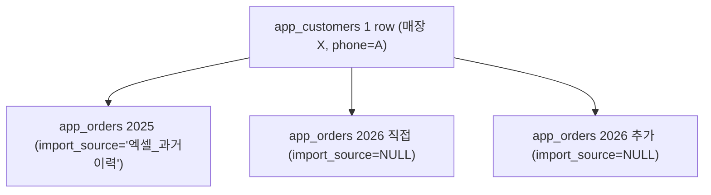
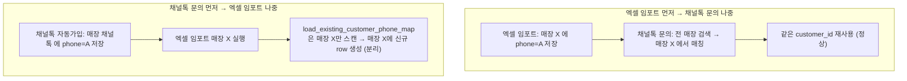
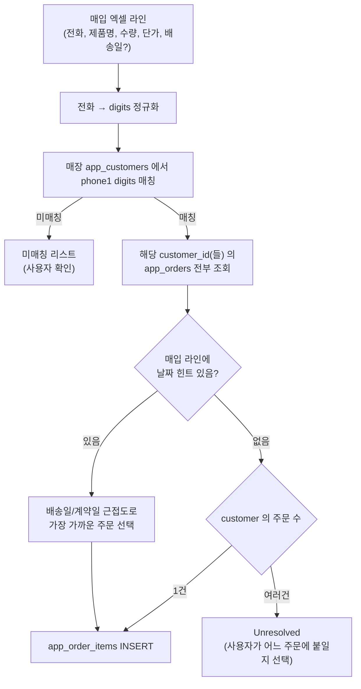

## 현재 상태 (이미 완료된 부분)

- 매입 원장 통합 임포트 — [legacy_purchase_import_service.py](legacy_purchase_import_service.py), [app.py](app.py) `_render_legacy_purchase_bulk_import` (고객 및 잔금 관리)
- `app_order_items` · 채널톡 phone 이관 · unresolved 수동 선택 · 주문 상세 라인 표시
- `legacy_import_service.py` / `_render_legacy_order_bulk_import` 는 없음
- **시나리오 4·5 (배송일 원가 대사 + Gemini 제안)** 구현: [import_cost_reconcile.py](import_cost_reconcile.py), `SUPABASE_APP_IMPORT_AI_FEEDBACK.sql` (Supabase에서 실행 필요). 매출 입력 저장 경로는 미변경.

## 추가로 다뤄야 할 3가지 시나리오

### 시나리오 1: 모모 직접 등록 고객 vs 매출 엑셀 임포트 고객이 겹치는 경우

이미 자동 통합됨. [legacy_import_service.py](legacy_import_service.py) `load_existing_customer_phone_map` 이 매장의 기존 app_customers 를 스캔해서 phone1(digits) 기준으로 매칭. 매칭되면 기존 customer_id 재사용, 매칭 안되면 신규 생성.

**결과 데이터 모델:**


지도·AI 리포트·고객 검색 모두 하나의 customer_id 로 통합 조회.

**주의점:** 임포트 후 앱에서 신규매출 등록할 때 "기존 고객 검색" 을 눌러야 재사용됨(자동 매칭 없음). 검색 없이 새로 등록하면 별개 row 가 생기지만, 앱 고객관리 탭의 phone1 alias 로직([app.py](app.py) L26676) 이 조회 시 자동 통합함.

### 시나리오 2: 채널톡 인바운드 자동 매칭

**현재 로직**([api.py](api.py) `_ct_get_or_create_customer` L1130):
- `phone1` OR `phone2` 를 5가지 포맷 변형으로 검색 (`_phone_variants` L1120)
- `store_name` 필터 없음 — 전 매장 스캔
- 매칭 실패 시 `store_name='채널톡'` 매장에 자동 가입

**엑셀 임포트 순서별 결과:**



**시나리오 B 해결 방안**: 매출 임포트 시 phone map 을 확장.

**개선 지점** [legacy_import_service.py](legacy_import_service.py) `load_existing_customer_phone_map`:
- 현재: `WHERE store_name = ?` 한 매장만 조회
- 변경: 대상 매장 phone map 을 만든 뒤, `store_name='채널톡'` 매장에서 phone map 을 추가로 조회. 매입 대상 매장에 없고 채널톡 매장에 있는 경우:
  - 그 채널톡 매장 고객 row 의 `store_name` 을 대상 매장으로 UPDATE (row 이전)
  - `source` 는 `채널톡_자동가입 → 엑셀_과거이력_병합` 등으로 갱신
  - 그 id 를 phone map 에 편입 → 이후 재구매 통합 로직이 자연스럽게 잡음

이렇게 하면 채널톡 자동가입 row 가 별도로 남지 않고, 실제 매장으로 정식 편입됨. 임포트 미리보기에서 "채널톡에서 병합될 고객 수" 를 별도 지표로 표시.

### 시나리오 3: 매입 상세 라인 아이템 임포트 (신규 기능)

기존 매출 데이터는 `app_orders.category='소파, 침대'` 처럼 카테고리 CSV 만 있음. 매입 엑셀은 라인 아이템 단위 상세 (제품명, 모델, 수량, 단가, 옵션 등) 를 가지고 있음. 사용자 답변에 따르면:
- 한 주문에 여러 라인 가능
- 매입 엑셀에 명시 주문번호 없음, **전화번호 기준으로 매칭** (고객명이 다르더라도 phone1 digits 로 통합)

#### 3.1 신규 테이블 스키마 `SUPABASE_APP_ORDER_ITEMS.sql`

```sql
CREATE TABLE IF NOT EXISTS app_order_items (
    id BIGSERIAL PRIMARY KEY,
    order_id BIGINT NOT NULL,
    db_filename TEXT NOT NULL,
    product_name TEXT NOT NULL,
    model_code TEXT,
    option_detail TEXT,
    quantity INT DEFAULT 1,
    unit_cost NUMERIC,
    unit_price NUMERIC,
    supplier TEXT,
    purchase_date DATE,
    import_source TEXT,
    created_at TIMESTAMPTZ DEFAULT NOW()
);
CREATE INDEX IF NOT EXISTS idx_app_order_items_order ON app_order_items(order_id);
CREATE INDEX IF NOT EXISTS idx_app_order_items_tenant ON app_order_items(db_filename);
```

order_id 로 `app_orders` 와 1:N 연결. 기존 orders 스키마·마진 계산은 건드리지 않음.

#### 3.2 매입 임포트 매칭 알고리즘



**미매칭 처리 옵션 (사용자 선택):**
- (a) 스킵 (기본)
- (b) 신규 customer + 신규 주문 자동 생성 후 붙이기 — 매출 데이터가 아직 안 들어온 케이스용

**미리보기 지표:**
- 자동 매칭 라인 수 / Unresolved 라인 수 / 미매칭 라인 수
- 매장별 · 연도별 매입 총액
- **매출 vs 매입 정합성**: 각 order_id 별로 `app_orders.cost_price` (매출 임포트에 저장된 출고가 합계) vs 라인 아이템 `sum(unit_cost * quantity)` 차이 표시. 큰 차이가 있으면 노란 경고. (참고 정보이며, 자동으로 값을 수정하지는 않음.)

#### 3.3 신규 파일과 UI

- **[legacy_purchase_import_service.py](legacy_purchase_import_service.py)** (신규)
  - `parse_excel`, `auto_suggest_mapping`, `build_preview`, `commit_import` 등 매출 임포트와 대칭 구조
  - `TARGET_FIELDS`: phone1(필수), product_name(필수), quantity, unit_cost, unit_price, model_code, option_detail, supplier, purchase_date, order_date_hint
- **[app.py](app.py)** 고객관리 탭에 신규 expander `"매입 상세 아이템 일괄 임포트"` 추가 (매출 임포트 아래)
  - 매출 임포트와 동일한 흐름: 업로드 → 매핑 → 미리보기 → 확정
  - 미리보기에 자동/Unresolved/미매칭 분류 표
  - Unresolved 는 인라인 selectbox 로 어느 order_id 에 붙일지 지정 후 저장

#### 3.4 주문 상세 화면에 라인 아이템 표시

기존 주문 상세(고객 클릭 시 나오는 주문 내역) 화면에 `app_order_items` 를 join 해서 라인 아이템 목록을 하위 표로 표시. category 컬럼은 그대로 두고, 라인 아이템이 있는 주문은 "제품 상세 (N건)" expander 를 추가.

## 구현 순서 (todos)

1. 채널톡 자동가입 매장의 phone 을 매출 임포트에 통합하는 로직 확장 (매출 임포트 개선)
2. `app_order_items` SQL 마이그레이션 파일 작성
3. 매입 임포트 서비스 모듈(`legacy_purchase_import_service.py`) 작성
4. 매입 임포트 UI 를 고객관리 탭에 추가 (매출 임포트 아래)
5. Unresolved 라인의 수동 선택(inline selectbox) UI
6. 주문 상세 화면에 line items 표시 (읽기 전용)
7. 실 데이터 일부로 매입 임포트 검증 (매출-매입 정합성 지표 확인)

## 리스크 및 주의

- **채널톡 매장 row 이동은 되돌리기 어렵다.** 매출 임포트 미리보기에 "채널톡→매장X 로 이관될 고객 수" 를 명시하고, 확정 체크박스를 별도로 두어 실수 방지.
- **매입 임포트는 데이터 소유권이 다르다.** app_orders 를 수정하지 않고 app_order_items 만 INSERT. 기존 매출 KPI·마진율 계산에 영향 없음.
- **미매칭 라인 자동 생성 옵션**을 켜면 매출 데이터 없이 매입만 있는 주문이 생겨 대시보드에 노이즈가 될 수 있음. 기본값 OFF, 사용자 명시 opt-in.

## 시나리오 4·5 (구현됨)

- 등록일 우선 매칭, 미스 시 배송일 폴백. 같은 앱 주문에 분할 배송 원가 합산.
- 입력원가 vs 본사원가 표·관리자 알림. 헤더 미변경. 입력판매가 있으면 역산 숨김.
- Gemini 제안은 확인 후에만 합산. 확인/거절은 `app_import_ai_feedback`.
- 신규매출·결제·주문수정 저장 경로는 변경하지 않음.
