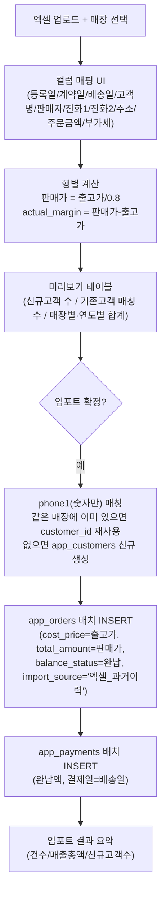

## 배경 확인 사항 (조사 결과)

- `app_customers`: 테넌트 키 `store_name`, 중복 판별 인덱스 `store_name+phone1`. 주소 입력 시 카카오 지오코딩으로 `latitude/longitude/sigungu/bname/road_name/building_name` 자동 채움 (`_supabase_insert_customer`, [app.py](app.py) L2926).
- `app_orders`: 테넌트 키 `db_filename`. 마진율은 **판매가 기준** `(total_amount - cost_price - display_cost_amount) / total_amount` ([sales_report_service.py](sales_report_service.py) L417, [app.py](app.py) L1607). `balance_status`는 결제 합계 대비 잔금으로 결정.
- 기존 신규매출 등록 화면은 전화번호로 **자동 매칭하지 않음** — "기존 고객 검색"을 수동으로 선택해야 재사용됨 ([app.py](app.py) L25545). 고객 엑셀 일괄등록(L26511)은 고객만 생성하고 주문은 만들지 않음. **주문 엑셀 일괄 임포트 기능은 현재 없음** — 신규 기능.
- `app_stores`가 `store_name ↔ db_filename` 1:1 매핑을 관리 ([SUPABASE_APP_TABLES.sql](SUPABASE_APP_TABLES.sql) L6).
- AI 리포트 KPI는 기간 필터가 있어 안전하지만, `collect_risks`의 `total_unpaid_all`과 경영대시보드/마케팅 인사이트의 "전체 로드" 화면은 과거 주문도 그대로 합산 — 과거 주문을 **완납 처리**해야 미수금 화면이 왜곡되지 않음.

## 확정된 결정사항 (사용자 확인 완료)

- **매장 분류**: 매장별로 엑셀 파일이 따로 있음 → 업로드 시 매장을 선택하면 그 파일 전체가 해당 매장으로 저장됨.
- **마진 역산 공식**: 판매가 = 출고가 / (1 − 0.20) = 출고가 / 0.8 (기존 앱의 "판매가 기준" 마진 정의와 동일).
- **저장 위치**: `app_customers`/`app_orders`에 직접 통합 저장 (지도·대시보드·AI 리포트에 노출). `balance_status='완납'`으로 처리.
- **구현 형태**: 앱 내 재사용 가능한 업로드 UI (1회성 스크립트가 아님. 앞으로도 추가 엑셀을 계속 넣을 수 있어야 함).

## 설계

### 1. 데이터 흐름



### 2. 컬럼 매핑 (이미지 기준 추정, UI에서 사용자가 직접 확인/조정)

- 계약일 → `app_orders.order_date`
- 배송일 → `app_orders.delivery_date`
- 고객명 → `app_customers.name`
- 전화1/전화2 → `app_customers.phone1/phone2` (dedup 키는 phone1)
- 주소(+주소2 보조) → `app_customers.address`
- 주문금액(출고가) → `app_orders.cost_price` (원본 보존), 역산 판매가 → `app_orders.total_amount`
- 판매자(대리점) → `app_orders.employee_names` (자유 텍스트로 저장, 현재 직원 매칭 여부와 무관하게 이력 표시용)
- 주문구분 → 임포트 필터용 체크박스 (예: "주문"만 포함, "회수/교환" 등은 기본 제외하고 필요시 포함 선택)

고정 매핑이 아니라 **드롭다운으로 엑셀 컬럼 ↔ 목표 필드를 사용자가 지정**하는 방식으로 만들어, 매장별 파일 포맷이 조금씩 달라도 대응 가능하게 한다.

### 3. 신규 UI 위치

`app.py` 고객관리 탭에 "🗂 과거 구매내역 일괄 임포트" 섹션을 신규 함수(`_render_legacy_order_bulk_import`)로 추가 (기존 고객 엑셀 일괄등록, [app.py](app.py) L26511 옆). 흐름:
1. 매장 선택 (superadmin: 전체 매장 드롭다운 / 매장 관리자: 본인 매장 고정)
2. 엑셀 업로드 → 컬럼 매핑 select box
3. 마진율 입력 (기본 20%, 수정 가능)
4. 주문구분 필터 체크박스
5. "미리보기 생성" → 계산된 데이터프레임 표시 (판매가, 신규/기존 고객 여부, 매장·연도별 합계)
6. "임포트 확정" 버튼 → 실제 INSERT 수행 (버튼 클릭 전까지 DB 변경 없음)
7. 결과 요약 (성공/스킵/실패 건수)

### 4. 신규 마이그레이션 (경량, 추적용)

과거 대량 데이터 임포트는 사고 시 롤백/식별이 필요하므로, 추적 컬럼을 하나 추가:

```sql
ALTER TABLE app_orders ADD COLUMN IF NOT EXISTS import_source TEXT;
```

`app_customers.source`는 이미 존재하므로 재사용 (`'엑셀'` 대신 `'엑셀_과거이력'` 등으로 구분).

### 5. 중복/재실행 방지

- 같은 파일을 두 번 업로드해도 중복 저장되지 않도록, 임포트 전 해당 매장의 기존 `app_orders`에서 `(customer_id, order_date, cost_price)` 조합이 이미 있으면 스킵.
- 고객 dedup은 `phone1`(숫자만 정규화) 기준, 같은 매장 내에서만 매칭 — 기존 앱 컨벤션과 동일.

### 6. 지오코딩

임포트 시점에는 지오코딩을 수행하지 않는다(수천 건 일괄 API 호출로 인한 카카오 API 레이트리밋 위험). 기존 지도 화면의 지연 지오코딩 로직(`_build_map_data_with_geocoding`)이 최초 조회 시 자동으로 채우고 저장하므로 그대로 활용.

## 구현 순서 (todos)

1. `app_orders.import_source` 컬럼 추가 SQL 작성 (`SUPABASE_APP_ORDERS_IMPORT_SOURCE.sql`) — 사용자가 Supabase에서 직접 실행
2. 컬럼 매핑 + 마진 역산 계산 유틸 함수 작성
3. 미리보기(dry-run) 데이터프레임 생성 로직 (신규/기존 고객 판별, 매장·연도별 합계)
4. 확정 임포트 로직 (고객 upsert → 주문 배치 insert → 결제 배치 insert)
5. `app.py` 고객관리 탭에 UI 섹션 추가 및 기존 화면과 시각적 통일
6. 실제 엑셀 샘플(또는 사용자 제공 실 데이터 일부)로 임포트 테스트 후 지도/AI 리포트에서 정상 노출 확인
