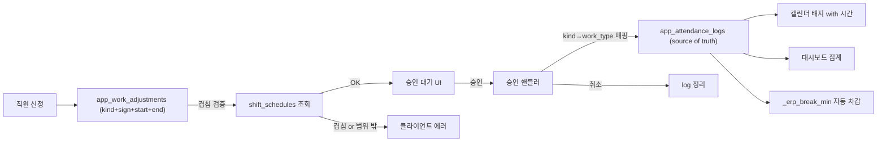

# 근태 관리 모듈 리팩터 플랜

## 조사 결과 요약 (문제 근원)

- 캘린더 "조퇴" 배지의 진짜 원인은 `_erp_tab_adjustment_approvals` 승인 핸들러 (`app.py` L16434-L16439): `sign=='-'` 이면 kind 상관없이 `work_type='조퇴'` 로 `app_attendance_logs` INSERT. 포상 · 여름휴가 · 장기근속 · etc(-) 승인 시 캘린더에 "조퇴" 배지가 뜸.
- 승인 취소 로직 (L16539) 은 `추가근무/회의` log만 제거 → `sign='-'` 취소해도 조퇴 log 잔존.
- `_erp_break_min` (L9679) 함수는 존재하지만 `_erp_compute_worked_minutes` (L9948) / `_erp_compute_shift_overage` (L10927) 에는 미적용 → 캘린더/대시보드 vs 근무일정 UI 숫자 불일치.
- `_erp_tab_attendance_input` (L13951) 은 메뉴 라우팅에서 이미 분리된 고아 함수.
- 신청 시 shift 겹침 검사 없음 (`_erp_tab_my_attendance` L16830-16871).
- `early_leave` kind는 `_ERP_ADJ_KINDS` (L10461) 에 없음.
- v2 잔여계산 함수 (`_erp_compute_monthly_remaining_v2`, `_erp_sum_approved_adjustments`) 는 정의만 있고 미사용.
- 캘린더는 `app_work_adjustments` 를 직접 안 읽고 log만 봄 → 승인된 신청의 "시간대" 정보가 로그의 `start_time/end_time`을 통해 이미 저장되고 있음(L16449-16450). 배지 렌더에 시간 표시만 붙이면 됨.

## 확정 결정사항 (사용자 응답)

- 조기퇴근 UX: **(A)** 실제 퇴근 시각만 입력 → 시스템이 `퇴근시각 ~ shift.end` 를 자동으로 `-분수` 계산.
- Legacy 정리: **(C)** 자동 생성된 잘못된 조퇴 로그를 삭제 후 재동기화.

---

## 데이터 흐름 (신규)



---

## Phase 1 · 신청 kind → work_type 매핑 재정비 (핵심 버그 픽스)

**목표**: `sign='-'` 승인이 무조건 "조퇴"로 저장되는 버그 제거.

- [app.py](app.py) L10461 `_ERP_ADJ_KINDS` 에 `early_leave` 추가 (기본 sign='-').
- [app.py](app.py) L16434-16439 매핑 테이블을 kind별로 명시화:

```python
_WT_MAP = {
    "overtime": "추가근무",
    "meeting": "회의",
    "early_leave": "조퇴",
    "summer_vacation": "여름휴가",
    "reward": "포상",
    "long_service": "장기근속",
}
_wt = _WT_MAP.get(kind, "특이사항")  # etc 는 "특이사항"
```

- `_ERP_BADGE_COLORS` 딕셔너리에 신규 label 색상 추가 (여름휴가/포상/장기근속/특이사항).

**검증**: 새 kind별 승인 → 캘린더 배지 라벨이 kind와 정확히 일치.

## Phase 2 · 승인 취소/반려 시 log 정리 확장

**목표**: 승인 취소 후 캘린더에 잔존 배지 제거.

- [app.py](app.py) L16539 취소 핸들러의 log 삭제 조건을 kind 전체로 확장 (현재 `추가근무/회의`만 → `조퇴/여름휴가/포상/장기근속/특이사항` 포함).
- 매칭 키: `(home_db_filename, employee_name, log_date, work_type, diff_minutes)`.

**검증**: 각 kind 승인 → 취소 → 캘린더 배지 사라짐 확인.

## Phase 3 · 조기퇴근 UI (approach A)

- [app.py](app.py) `_erp_tab_my_attendance` (L16765~) 에 조기퇴근 신청 폼 추가:
  - 입력: 날짜 + **실제 퇴근 시각 하나만**.
  - 계산: 시스템이 해당 날짜 `app_shift_schedules` 조회 → `shift.end - actual_end` = `minutes` 로 자동 산출. shift 없거나 실제 퇴근시각이 shift.end 이후면 에러.
  - 저장: `kind='early_leave', sign='-', start_time=actual_end, end_time=shift.end, minutes=차이`.
- 캘린더 배지: `조퇴 15:00` 형식 (start_time 표시).

## Phase 3.5 · 내 신청 내역 월별 조회

**목표**: `내 신청 내역` 이 오늘 기준 이번 달만 보이는 제약 해소 → 과거 월 조회 가능.

- [app.py](app.py) `_erp_tab_my_attendance` L16891 "📋 내 신청 내역" 헤더 직전에 연·월 선택기 추가:
  - `st.columns([1, 1, 3])` 로 배치, `st.number_input("연도", value=today.year)` + `st.number_input("월", 1, 12, today.month)`.
  - `_hist_ym = f"{y:04d}-{m:02d}"` 로 재계산.
- 기존 L16893 `_erp_list_my_adjustments(current_db, me_name, ym)` → `_erp_list_my_adjustments(current_db, me_name, _hist_ym)` 로 변경.
- 헤더 문구 및 빈 상태 문구를 선택된 월로 갱신 ("**해당 월(YYYY-MM)**에 등록한 신청이 없습니다.").
- 상단 잔여 카드·+/- 신청 폼은 오늘 기준 `ym` 그대로 유지 (수정 대상 아님).

**검증**: 월 변경 → 해당 월 내역만 표시, 잔여 카드는 여전히 이번 달 기준.

## Phase 4 · 법정휴게시간 통일 적용

**목표**: 근무시간 계산 전 경로가 동일한 휴게 정책을 사용.

- [app.py](app.py) L9948 `_erp_compute_worked_minutes` 에 `_erp_break_min` 차감 반영.
- [app.py](app.py) L10927 `_erp_compute_shift_overage` 에도 반영 (표준시간 · 실제시간 각각 차감 후 비교).
- L9990 주석 오류 정정 ("60분" → 로직에 맞게 "4h+ 30분, 8h+ 60분").
- 정기근무일정 UI (`_erp_tab_shift_plan`) 상단에 "이번 일정 실근무 예상: 8시간 30분 (휴게 1h 차감)" 실시간 표시.

**검증**:
- 10:00~14:30 shift → raw 270분, break 30분 → 실근무 240분 (4h)
- 10:00~19:00 shift → raw 540분, break 60분 → 실근무 480분 (8h)
- 근무일정 UI · 캘린더 카운터 · 연간 대시보드 세 곳의 값이 동일해야 함.

## Phase 5 · 시간 겹침 검증 (신규 헬퍼)

- [app.py](app.py) 에 `_erp_validate_adjustment_time(db, emp, date, start, end, kind)` 추가:
  - `overtime`, `meeting`, `etc(+)`: shift 시간과 **겹치면 에러** ("기본 근무시간과 중복됩니다: 10:00~19:00").
  - `early_leave`: `start >= shift.start AND end == shift.end` (shift **안**이어야 함).
  - 하루 종일 kind (여름휴가/포상/장기근속): 검사 스킵.
  - 다른 pending/approved adjustment 와 겹침도 함께 검사.
- `_erp_tab_my_attendance` 저장 전 호출 → 실패 시 `st.error`.

## Phase 6 · 캘린더 시간 배지 강화

- [app.py](app.py) `_erp_tab_calendar` L13126-13154 배지 렌더 조건 수정:
  - `work_type in ("추가근무", "회의", "조퇴")` 이고 `start_time/end_time` 존재 시 → `"연장근무 18:00-20:00"` 형식 표시.
  - 하루 종일 kind (여름휴가/포상/장기근속) → 시간 표시 없이 라벨만.

## Phase 6.5 · 월별 캘린더 카운터에 "월 계획 근무시간" 추가

**목표**: 캘린더 상단 카운터 위젯에 해당 월의 총 계획 근무시간(shift 합산) 을 노출 → 직원이 "이번 달 몇 시간 잡혀 있는지" 한눈에 확인.

- [app.py](app.py) L12790-12815 카운터 위젯을 확장:
  - 현재 표시: `목표 173h (주 40h) | 누적 8.0h (4.6%) | 잔여 +165.0h`
  - 신규 표시: `목표 173h | 계획 168h | 누적 8.0h (4.6%) | 잔여 +165.0h`
- 계산: 해당 월 `app_shift_schedules` 조회 → `_ctr_target_emp` 기준 필터 → 각 shift 의 `(end - start) - _erp_break_min(raw)` 합산.
- 이미 `all_shifts` 를 L12822-12828 에서 로드하므로, 카운터 위젯을 shifts 로드 **뒤로** 이동하거나, 별도 `_erp_sum_planned_minutes(db, emp, ym)` 헬퍼를 신설 (권장 — 캐시 가능).
- 신규 헬퍼:

```python
@st.cache_data(ttl=60)
def _erp_sum_planned_minutes(employee_name: str, ym: str) -> int:
    """해당 월 app_shift_schedules 합산 (전 매장, 휴게 차감 반영)."""
```

- Phase 4 (휴게 통일) 완료 후 진행 — 동일 `_erp_break_min` 사용을 보장.

**검증**: shift 3개 (10:00~19:00, 10:00~14:30, 10:00~20:00) → 480 + 240 + 540 = 1260분 = 21h.

## Phase 7 · 특이사항 결재 UX 정리 (`etc` kind)

- `etc` 라벨을 "**특이사항 결재**"로 변경.
- 입력: +/- 선택 + 분수 + **사유 필수**.
- 안내 문구 예시: "휴게시간 미사용 +30분 / 무단 지각 -20분 / 시스템 오작동 보정".
- 승인 시 log에 저장되어 대시보드 총 근무시간에 자동 ± 반영.

## Phase 8 · 대시보드 집계 재검증 (수식 · 이중카운트 방지)

### 핵심 수식 (사용자 확정)

```
실제근무시간 = 정상근무 + 연장근무 - 단축근무 + 연차(휴가시간)
잔여시간     = 필요근무시간 - 실제근무시간
```

- **`+` 카테고리 (실제근무에 가산)**: 정상근무, 추가근무(overtime), 회의(meeting), 시차사용, 포상시간
- **`-` 카테고리 (실제근무에서 차감)**: 조퇴(early_leave), 지각
- **인정근무 (400h/일 단위 별도 가산)**: 연차 480분, 반차 240분, 여름휴가·포상·장기근속 (일 단위 or 분 단위)

**중요**: 단축근무는 **필요근무시간**에서 빼는 것이 아니라 **실제근무시간**에서 뺀다. 그래야 `잔여 = 필요 - (정상 - 단축)` 로 조퇴한 만큼 잔여가 늘어 더 채워야 함이 반영됨.

### 단일 소스 원칙

승인된 신청은 `app_attendance_logs` 로 materialize 되므로, 집계는 **오직 logs만** 참조. `app_work_adjustments` 는 승인 상태·대기 큐·사유 조회용으로만 사용.

### 이중카운트 근원 (현재 버그)

[app.py](app.py) `_erp_compute_yearly_breakdown` L10727-10737 에서 `app_work_adjustments (approved)` 를 `short_adj_min` / `overtime_adj_min` 에 합산 → 동시에 승인 핸들러 (L16457) 가 만든 log 도 L10801-10829 에서 카운트되어 **동일 이벤트가 두 소스에서 이중 집계**된다. Auto-synced 태그 (`[자동-*]`) 가 없는 수동 승인 flow에서 특히 발생.

### 픽스 (concrete)

- [app.py](app.py) `_erp_compute_yearly_breakdown` (L10671):
  - **L10712-10739 의 adjustments 조회·합산 블록 제거** (또는 `deductions/additions` UI 상세보기용으로만 남기고 `short_adj_min`/`overtime_adj_min` 은 0 유지).
  - L10884-10887 재확인: `short_min = short_min_logs` (adj 항 제거), `overtime_min = overtime_min_logs`.
  - Auto-synced 특수 처리 (L10805-10808) 도 제거 (adj 미사용이면 필요 없음).
- [app.py](app.py) `_erp_compute_monthly_remaining` (L9981):
  - 이미 logs 기준 → 수식 명시화 주석 추가.
  - `worked_min` 이 실제로 `정상 + 연장 - 단축 + 연차` 로 계산됨을 명시 (조퇴 log 의 `_actual` 이 이미 단축 반영된 값).
- 미사용 v2 함수 (`_erp_compute_monthly_remaining_v2`, `_erp_sum_approved_adjustments`) 삭제.

### 검증 시나리오 (verifiable)

각 시나리오에 대해 monthly · yearly 두 함수의 결과가 **동일 데이터로 동일 잔여** 를 뱉어야 한다.

**시나리오 A — 조기퇴근**:
- Shift: 2026-07-01 10:00~19:00 (raw 540분, break 60분 → 실근무 480)
- 조기퇴근 신청 승인: 15:00 퇴근 (240분 조퇴)
- 승인 핸들러가 log INSERT: work_type='조퇴', start=10:00, end=15:00, diff_minutes=240
- 기대치: 정상 240(10~15, break 없음) + 단축 0 = 실제근무 240. (다른 해석: 정상 480 - 단축 240 = 240)
- Yearly breakdown: `normal_min=240`, `short_min=0`, `actual=240`. **단, adj를 참조하지 않아야 정확**.

**시나리오 B — 연장근무**:
- Shift: 10:00~19:00 (480)
- 연장근무 신청 승인: 19:00~21:00 (120분)
- 승인 log INSERT: work_type='추가근무', diff_minutes=120
- 기대치: 정상 480 + 연장 120 = 실제근무 600.
- Yearly: `normal_min=480, overtime_min=120, actual=600`.

**시나리오 C — 여름휴가**:
- Shift 없음 (그날 휴가)
- 여름휴가 승인: 일 단위 (또는 480분)
- 승인 log INSERT: work_type='여름휴가', diff_minutes=480
- 기대치: 여름휴가 480 (leave_min 성격) → 인정근무 480, 잔여 480 감소.
- Yearly: `leave_min` 또는 별도 카테고리로 480 추가.

각 시나리오에서 **monthly.worked_min == yearly.actual_total_min** 이어야 한다 (같은 월 기준).

## Phase 9 · 불필요 코드 제거

- [app.py](app.py) L13951 `_erp_tab_attendance_input` **함수 전체 삭제** (라우팅 참조 없음, 조퇴 수동 입력 폼).
- `_erp_upsert_auto_adjustment` (L10974) 내 `diff < 0` 분기 삭제 (호출부 없음, 단축근무 신청 폐지 잔재).
- 관련 주석 정리.

## Phase 10 · Legacy 데이터 정리 (SQL 마이그레이션)

신규 파일 `SUPABASE_APP_ATTENDANCE_CLEANUP.sql`:

```sql
-- 1) 자동 생성 조퇴 로그 (source_tag prefix 로 식별) 삭제
DELETE FROM app_attendance_logs
WHERE work_type = '조퇴'
  AND (note LIKE '[자동-정기근무]%' OR note LIKE '[자동-캘린더]%');

-- 2) 자동 생성 pending sign='-' adjustments 삭제 (단축근무 신청 폐지 잔재)
DELETE FROM app_work_adjustments
WHERE status = 'pending'
  AND sign = '-'
  AND (reason LIKE '[자동-정기근무]%' OR reason LIKE '[자동-캘린더]%');

-- 3) 잘못 분류된 approved 조퇴 로그를 kind에 맞게 재분류
-- (adjustments 를 조인해 kind 참조)
UPDATE app_attendance_logs l
SET work_type = CASE a.kind
  WHEN 'summer_vacation' THEN '여름휴가'
  WHEN 'reward' THEN '포상'
  WHEN 'long_service' THEN '장기근속'
  WHEN 'early_leave' THEN '조퇴'
  ELSE '특이사항'
END
FROM app_work_adjustments a
WHERE l.work_type = '조퇴'
  AND l.employee_name = a.employee_name
  AND l.log_date = a.target_date
  AND a.status = 'approved'
  AND a.sign = '-'
  AND a.kind IN ('summer_vacation','reward','long_service','etc');
```

- 앱 부팅 시 `_supabase_run_app_tables_sql` 자동 실행 목록에 등록.
- `근태관리.md` "SQL 마이그레이션 실행 순서"에 추가.

---

## 성공 기준 (verifiable)

1. 관리자가 여름휴가 승인 → 캘린더에 "여름휴가" 배지 (조퇴 아님).
2. 정기근무 10:00~19:00 저장 → UI/캘린더/대시보드 모두 "실근무 480분" 표시 (휴게 60분 차감 통일).
3. 연장근무 신청 시간이 shift와 겹치면 저장 차단 + 명시적 에러.
4. 조기퇴근 15:00 신청 → 캘린더에 "조퇴 15:00" 배지 + 대시보드 총 근무시간에서 -180분.
5. approved `overtime +120분` 하나에 대해 yearly breakdown 의 `overtime_min == 120` (이중카운트 없음).
6. 승인 → 취소 시 캘린더 배지 완전 제거.
7. 기존 잘못 분류된 조퇴 배지가 SQL 마이그레이션 후 정상 라벨로 변경됨.
8. **수식 검증**: 시나리오 A/B/C 각각에서 `실제근무 = 정상 + 연장 - 단축 + 연차` 가 그대로 반영되고, **`_erp_compute_monthly_remaining.worked_min` == `_erp_compute_yearly_breakdown.actual_total_min`** (같은 기간·직원 기준).
9. **월 계획 근무시간 표시**: 캘린더 상단 카운터에 "계획 XXXh" 항목이 표시되고, `_erp_sum_planned_minutes` 결과가 캘린더에 표시된 shift 배지들의 실근무시간 합계와 일치.

## 롤아웃 순서 (안전)

1. SQL 마이그레이션 파일 작성 (실행은 사용자가 검토 후)
2. Phase 1-2 (매핑 · 취소) → 신규 승인부터 정합성 확보
3. Phase 3 · 3.5 (조기퇴근 UI + 내 신청 내역 월별 조회) — 같은 함수 수정이므로 묶음 커밋
4. Phase 4 (휴게 통일) — 숫자 변경 파급 큼, 별도 커밋
5. Phase 5 · 6 · 6.5 (겹침 검증 + 캘린더 시간 배지 + 계획 시간 카운터) — 캘린더 관련 묶음 커밋
6. Phase 7-9 (UX · 코드 정리)
7. Phase 10 SQL 실행 → 재검증

각 단계 커밋 후 `ReadLints` 및 관련 함수 스팟체크.
