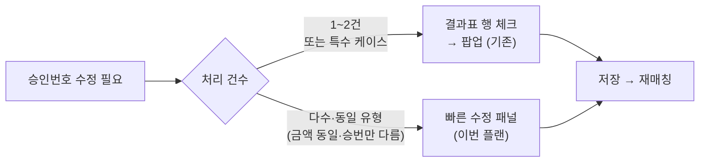
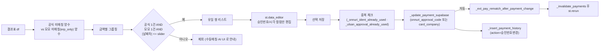

# 금액 동일·승인번호만 다름 — 빠른 수정 패널

## 결정 사항 (확정)
- 자동 제안 범위: 유일 쌍만 — 금액 X 가 공식 1건 AND 모모 1건일 때만 테이블에 노출. 1:N / N:M 은 기존 수동매칭/AI 유사매칭 UI 로 분리.
- 날짜 유사도: 공식일자 vs 모모 결제일 차이가 설정 slider 범위 이내 (기본 3일, 범위 1~30일).
- 대상 수단: 1차 온누리 + 울산페이 (사용자 명시 "원래 온누리/울산페이 레코드만 확인"). 카드/메인페이는 동일 패턴으로 후속 확장.
- 핵심 UX: 공식 쪽은 전부 읽기 전용, 모모 쪽은 승인번호/시각만 편집 가능. 공식 승인번호 디폴트값으로 자동 pre-fill → 그대로 저장만 눌러도 매칭 성사.
- 흔한 금액(1,000,000 등) 자동 제외: 유일 쌍 기준이면 자연히 걸러짐 (양쪽에 2+건이면 유일 쌍 아님). 추가 블랙리스트 불필요.

## 0) 선행 작업 — 기존 팝업 미작동 원인 조사·수정 (사용자 보고)

**현재 상태**: 커밋 `f43c03c` 로 "결과표 행 선택 → 승인번호 수정 팝업" 로직을 넣었지만 사용자가 "팝업이 안 열린다" 고 보고. 이번 플랜 2) 다건 배치 패널이 **단건 팝업 로직을 전제**로 하므로 먼저 수정해야 함.

### 가능한 원인 (우선순위 순)
1. **클릭 위치 오해**: Streamlit `selection_mode="single-row"` 는 좌측 라디오 인디케이터 또는 행 바디 어디든 클릭 시 선택. 사용자가 셀 텍스트를 더블클릭(편집 모드 진입) 하거나 "엑셀 다운로드" 버튼 근처만 눌렀을 수 있음.
2. **Styler + on_select 호환성**: `_show.style.apply(_hl_fabricated, axis=1)` 로 Styler 를 전달. Streamlit 1.54.0 에서 Styler + `on_select="rerun"` 조합이 selection event 를 흘려버리는 사례 가능성.
3. **`_sel_event.selection.rows` 액세스 실패**: Streamlit 1.54 에서 반환 객체 구조가 `event.selection.rows` 가 아닐 수 있음 — 과거엔 `event["selection"]["rows"]` 였음.
4. **배포 지연 / 캐시 문제**: Streamlit Cloud 재시작·브라우저 캐시로 신규 커밋 미반영.
5. **스크립트 상단에서 `st.cache_data` / fragment 가 이 블록 재실행을 막음**: `_render_external_pay_admin_section` 자체는 fragment 가 아니지만, 상위 호출부가 fragment 일 수 있음.

### 진단 단계 (코드 수정 전 1회 실행)
- `st.dataframe(...)` 호출 바로 아래에 임시 debug caption 추가:
  ```python
  st.caption(f"🐞 DEBUG: _sel_event type={type(_sel_event).__name__} · rows={list(getattr(getattr(_sel_event, 'selection', None), 'rows', []) or [])} · last_opened={st.session_state.get(_last_opened_key)} · target_set={'_extpay_appr_edit_target' in st.session_state}")
  ```
- 사용자에게:
  1. 결과표가 보이는 상태에서 DEBUG caption 의 `rows=[]` 확인.
  2. 결과표 **좌측 라디오 인디케이터** 클릭 (셀 텍스트가 아님) → caption 이 `rows=[N]` 으로 바뀌면 selection 자체는 OK.
  3. 그래도 팝업이 안 열리면 `target_set=True` 인지 확인 → `_open_dialog` 쪽 문제.
  4. caption 이 `rows=[]` 로 유지되면 Styler 또는 Streamlit 버전 호환성 문제 — 아래 수정 방향 적용.

### 수정 방향 (진단 결과에 따라 1개 선택)

#### 수정안 A — Styler 제거 (최소 변경)
```python
_sel_event = st.dataframe(
    _show,                                   # Styler 제거
    width="stretch",
    hide_index=True,
    column_config=_cfg,
    on_select="rerun",
    selection_mode="single-row",
    key=_sel_key,
)
```
- `_fabricated` 배경색을 포기하거나, `_hl_fabricated` 컬러를 `column_config` 의 각 셀 포매터로 대체 (손실 적음).

#### 수정안 B — Fallback UX 추가 (가장 확실)
결과표 선택이 안 돼도 **반드시 작동하는 2nd 경로** 를 하단에 추가:
```python
if "_payment_id" in df.columns:
    _editable = df[df["_payment_id"].notna() & (df["_payment_id"] > 0)].copy()
    _options = [
        (int(_r["_payment_id"]), f"#{int(_r['_payment_id'])} · {_r.get('공식일자') or _r.get('ERP일자')} · {_r.get('공식금액') or _r.get('ERP금액')}원 · {_r.get('고객명') or _r.get('구매자') or ''}")
        for _, _r in _editable.iterrows()
    ]
    _pid_pick = st.selectbox(
        "✏️ 승인번호 수정할 결제 선택 (결과표 체크가 안 될 때)",
        options=[o[0] for o in _options],
        format_func=lambda k: dict(_options).get(k, str(k)),
        index=None,
        placeholder="결제 ID 선택...",
        key=f"extpay_appr_pick_{sel_db}_{sel_src}",
    )
    if _pid_pick and st.button("팝업 열기", key=f"extpay_appr_open_btn_{sel_db}_{sel_src}"):
        _row_idx = _editable.index[_editable["_payment_id"] == _pid_pick][0]
        # 기존 meta 수집 로직과 동일하게 _extpay_appr_edit_target 세팅 + st.rerun
```
- 결과표 체크박스가 작동하든 안 하든 **반드시 열림** 보장.
- 사용자가 "체크해서 열리는 방법" 과 "선택해서 열리는 방법" 2가지를 모두 가짐.

#### 수정안 C — Streamlit API 호환성 보강
`_sel_event.selection.rows` 가 안 되면 dict 접근도 시도:
```python
try:
    _sel_obj = getattr(_sel_event, "selection", None) or (_sel_event.get("selection") if isinstance(_sel_event, dict) else None)
    _sel_rows = list((getattr(_sel_obj, "rows", None) if _sel_obj and not isinstance(_sel_obj, dict) else (_sel_obj or {}).get("rows", [])) or [])
except Exception:
    _sel_rows = []
```

### 선택 전략
- **진단 결과 `rows=[]` 로 유지됨** → 수정안 A (Styler 제거) 적용 → 재검증.
- **여전히 안 됨** → 수정안 B (Fallback selectbox) 를 **추가로** 넣음 (A 는 유지).
- **최악의 경우** 수정안 B 만으로도 UX 는 완성됨 — 결과표 선택은 포기 가능.

### 검증
1. DEBUG caption 으로 selection event 실시간 확인 (수정 후엔 제거).
2. 수정 후: 결과표 라디오 클릭 → 팝업 open 재현.
3. Fallback selectbox + 버튼 클릭 → 팝업 open 재현.
4. 팝업에서 저장 → `st.rerun` → 결과표 갱신 → selection 상태 초기화 확인.

---

## 기존 UX 와의 관계 — 단건 팝업 vs 다건 배치 패널

이번 패널은 **방금 추가된 "결과표 행 체크 → 승인번호 수정 팝업"** 과 역할 분담됨 (중복 아님). *(단, 위 섹션 0) 에서 미작동 원인을 먼저 해결해야 역할 분담이 성립.)*

### 단건 (기존, 이미 커밋됨): "결과표 행 체크 → 승인번호 수정 팝업"
- 결제대사 결과표에서 **아무 1행이든** 체크박스 클릭 시 즉시 열림.
- 상단 요약 블록이 바로 그 "모모 잔존 레코드의 정체" 를 노출:
  - **모모 결제 ID** (= `app_payments.id`)
  - **주문 ID** (= `app_orders.id`)
  - **결제일 / 금액 / 수단 / 고객명 / 구매자(공식)**
- 예: 삼산점 2026-09-01 · 456,000 · 뒤4=7565 · 김*우 행 → 체크박스 클릭만으로 그 영수증이 모모의 어느 결제·주문·고객인지 즉시 파악.
- 적합 상황: **특정 1건만** 직접 조사해서 수정하고 싶을 때.

### 다건 배치 (이번 플랜): "금액 동일·승인번호만 다름 — 빠른 수정"
- 공식·모모 양쪽에서 "같은 금액 각 1건 유일 쌍" 을 자동으로 쌍지어 **한 화면에 N행** 노출.
- 공식 쪽 뒤4/승인번호가 모모 쪽에 pre-fill 되어 **그대로 저장 버튼 1클릭** 으로 N건 일괄 수정.
- 적합 상황: **학성점·삼산점처럼 같은 유형의 승인번호 오입력이 수십 건** 쌓인 경우 — 하나씩 팝업 열어 처리하면 비효율.

### 선택 기준



- 두 UI 모두 저장 백엔드는 동일 (`_update_payment_supabase` → 자동 `_ext_pay_rematch_after_payment_change` → `_insert_payment_history(action="승인번호변경")`).
- 결과적으로 동일한 데이터 변경·동일한 이력·동일한 재매칭을 유발하지만, 접근 방식만 "1건 깊이 조사" vs "N건 유일 쌍 일괄" 로 다름.

## 데이터 흐름



## 파일별 변경 — 모두 [app.py](app.py) 1개 파일

### 1) 유일 쌍 추출 헬퍼 (신규) — `_render_external_pay_admin_section` 바로 앞

```python
def _ext_pay_find_unique_amount_pairs(
    df: "pd.DataFrame", sel_src: str, *, date_tol_days: int,
) -> list[dict]:
    """금액 동일·공식 1건·모모 1건·|날짜차|<=tol 인 유일 쌍만 반환."""
```
- 공식 미매칭 셋: `결과 in {official_only, 미매칭, amount_mismatch, official_canceled}` AND `공식금액 > 0`
- 모모 미매칭 셋: `결과 == erp_only` AND `_amount_int > 0`
- 금액을 int(공식금액)·int(_amount_int) 로 정규화해 defaultdict 로 묶음
- 각 amount 키에 대해 `len(off_list) == 1 and len(erp_list) == 1` 체크
- 날짜차 계산: `공식일자` 와 `ERP일자` 를 date 로 파싱 → `abs((off - erp).days) <= date_tol_days`
- 반환: `[{"off": off_row_dict, "erp": erp_row_dict, "amount": amt, "day_diff": N}, ...]`
- 정렬: `(day_diff asc, amount desc)` — 날짜가 가까울수록 신뢰도 상향

### 2) 빠른 수정 UI (신규) — 같은 파일 바로 뒤

```python
def _render_ext_pay_quick_approval_fix(
    sel_db: str, sel_src: str, df: "pd.DataFrame", me_uname: str,
) -> None:
    """금액 동일·승인번호만 다른 유일 쌍을 st.data_editor 로 노출·일괄 저장."""
```
- `sel_src not in ("onnuri", "ulsanpay")` 이면 return.
- expander: `금액 동일·승인번호만 다름 — 빠른 수정 (N건 후보)` default expanded=True 로 눈에 띄게.
- 날짜 slider: `st.slider("날짜 허용 ±일", 1, 30, 3)` + 재조회.
- `_ext_pay_find_unique_amount_pairs(...)` 호출.
- 결과 N건 테이블을 `st.data_editor` 로 렌더:
  - 공식 쪽 (읽기 전용): `공식일자, 공식금액, 공식 뒤4 or 승인번호, 공식 시각(온누리), 구매자, 공식취소여부`
  - 모모 쪽 (읽기 전용): `결제일, 수단, 현재 뒤4(온누리) / 현재 승인번호(울산), 현재 시각(온누리), 고객명`
  - 편집 가능 셀:
    - 온누리: `새 뒤4` (4자리 text, 공식 뒤4 pre-fill), `새 시각` (HHMMSS text, 공식 시각 pre-fill)
    - 울산페이: `새 승인번호` (6자리 text, 공식 승인번호 pre-fill)
    - `사용` (체크박스, 공식 승인번호가 모모 승인번호와 다르면 default True)
  - `column_config`: 편집 가능한 열만 활성화, 나머지는 `disabled=True`.
  - `key=f"extpay_quick_fix_editor_{sel_db}_{sel_src}"` 로 세션 보존.
- 하단: `체크된 행만 저장 (N건)` 버튼 + `사유 공통 (기본값: 금액일치·승인번호 빠른 수정)` text_input.
- 저장 루프:
  - 체크된 각 행에 대해 payload 조립:
    - 온누리: `_onnuri_compose_ident(new_last4, new_time, require_time=False)` → `{"onnuri_approval_code": ident}`
    - 울산: `_ext_pay_norm_approval6(new_appr)` → `{"card_company": norm6}`
  - 포맷 검증 실패 / 변경 없음 → skip (warning 리스트 수집)
  - 중복 검증:
    - 온누리: `_onnuri_ident_already_used(sel_db, last4, amount, payment_date, exclude_payment_id=pid, tx_time=parsed_tm)`
    - 울산: `_ulsan_approval_already_used(sel_db, norm6, exclude_payment_id=pid)`
  - `_update_payment_supabase(sel_db, pid, payload)` → 자동으로 `_ext_pay_rematch_after_payment_change` 실행
  - `_insert_payment_history(None, order_id, cust_name, "승인번호변경", old, new, reason, db_filename=sel_db)`
- 결과 toast: `저장 N건 · 포맷 오류 M건 · 중복 K건 · DB 실패 L건` + 상세 리스트는 `st.expander` 에.
- 마무리: `_invalidate_payments()` → `st.rerun()`.

### 3) 호출 위치 — `_render_external_pay_admin_section` 안

[app.py](app.py) 약 34145행 (현재 `_render_ext_pay_ai_similar_match(sel_db, sel_src, df, me_uname)` 호출 직전) 에:
```python
_render_ext_pay_quick_approval_fix(sel_db, sel_src, df, me_uname)
_render_ext_pay_ai_similar_match(sel_db, sel_src, df, me_uname)
```
- 승인번호 수정 팝업(결과표 행 체크) 바로 다음 섹션, AI 유사매칭·수동매칭 보다 위 → 가장 쉬운 액션부터 보여줌.

## 공식취소 행 경고 (안전장치)
- 공식 쪽이 `is_cancel=True` (취소된 공식 레코드) 인 경우: 모모 승인번호를 공식 승인번호와 맞춰도 결과는 `matched_ok(공식 취소·ERP도 취소흔적)` 가 아니라 여전히 `official_canceled` 유지 가능 (모모 결제가 양수인 한). 체크박스 default 를 False 로 두고 행 라벨에 `공식 취소 — 모모도 취소/환불 처리 필요` 안내.

## 재매칭·캐시 (추가 작업 없음, 기존 재사용)
- `_update_payment_supabase` 가 `onnuri_approval_code` / `card_company` 변경 감지 시 `_ext_pay_rematch_after_payment_change` 를 자동 호출 ([app.py 8853-8871](app.py)).
- `_invalidate_payments()` + `st.rerun()` → 결과표가 새 매칭 결과(예: `official_canceled` → `matched_ok`) 로 다시 그려짐.

## 흔한 금액 자동 제외 — 왜 추가 로직 불필요한가
- 1,000,000 처럼 매장에서 자주 등장하는 금액은 공식 쪽·모모 쪽 각각 2건 이상 → `len(off_list)==1 AND len(erp_list)==1` 조건에서 자동 탈락.
- 810,000 처럼 희소한 금액은 양쪽 각 1건 → 유일 쌍으로 자동 매칭 후보에 포함.
- 결과적으로 사용자 요구(흔한 금액 제외) 가 자연스럽게 충족됨.

## 검증 체크리스트
1. 학성점/삼산점 중 하나 선택 + 온누리 소스 선택 → 빠른 수정 패널에 유일 쌍 N건 노출.
2. 1,000,000 금액 행이 양쪽에 다수 존재해도 테이블에 안 보임.
3. 810,000 처럼 양쪽 각 1건 금액 → 테이블에 1행, `사용` 체크박스 default True.
4. 뒤4/승인번호가 공식 쪽 값으로 pre-fill 됨 → 그대로 저장 버튼 누르면 저장.
5. 저장 후 결과표에서 해당 공식 행이 `금액일치(matched_ok)` 로 전환.
6. `app_payment_history` 에 `action_type="승인번호변경"` 레코드 N건 생성.
7. 울산페이도 동일하게 동작 (6자리 승인번호).
8. 금액·수단·결제일자는 어떤 경로로도 수정되지 않음.
9. 공식 취소 행은 `사용` default False + 경고 label.

## 확장 포인트 (후속 작업, 이번 플랜 범위 외)
- 신용/체크카드 + 메인페이: `sel_src in ("card", "mainpay")` 분기만 추가하면 동일 패턴 재사용. 8자리 숫자 입력, `card_company` payload.
- 날짜 완전일치만 보는 "엄격 모드" 토글 (slider=0).
- 저장 성공 후 N건 중 재매칭 성공률 리포트 (optional).
