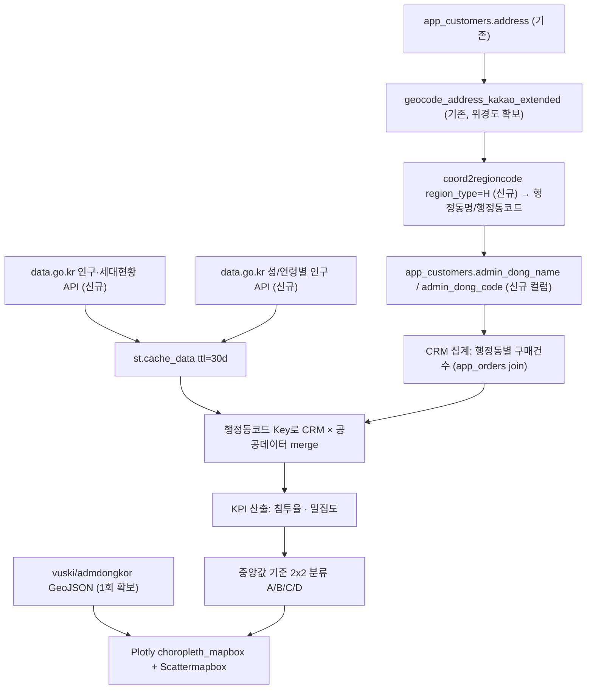
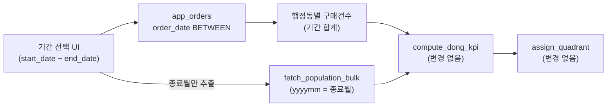
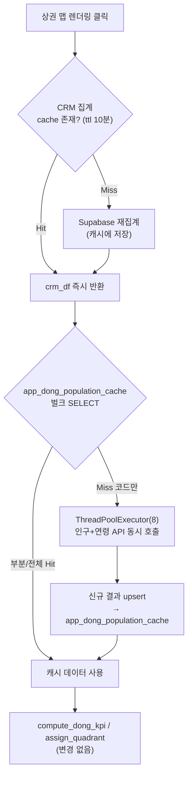
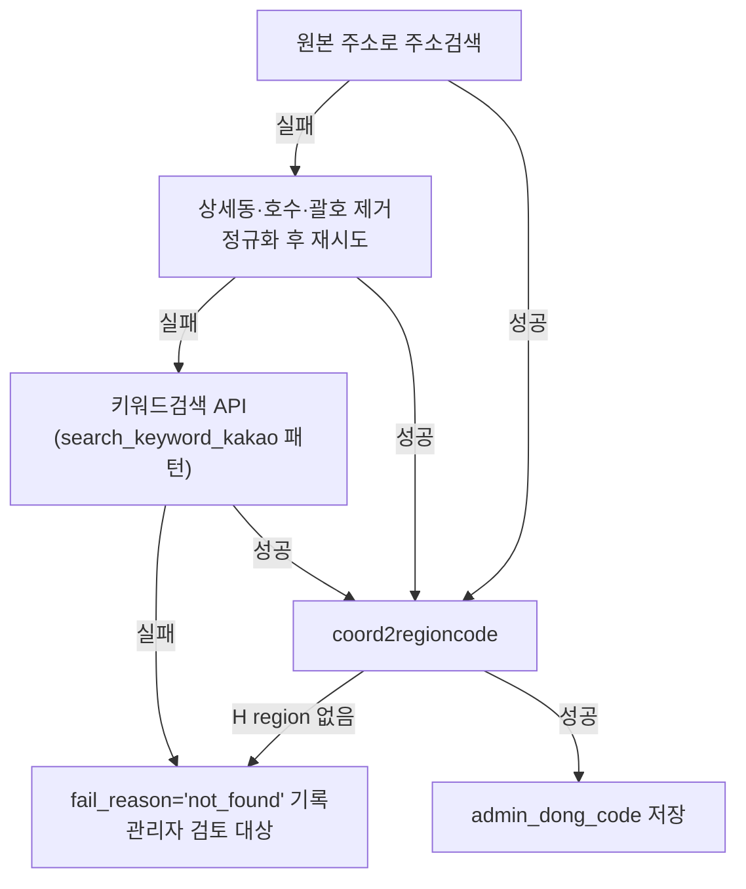

# 동 단위 상권 퍼포먼스 맵 — 마스터 플랜

## 0. 기존 코드베이스 실사 결과 (재사용/충돌 지점)

| 항목 | 기존 코드 | 재사용 방안 |
|---|---|---|
| 카카오 주소 지오코딩 | [app.py](app.py) `geocode_address_kakao_extended()` (6305행) — 주소→위경도+`sigungu`(시군구)+**`bname`(법정동)**+도로명+건물명 | 위경도 획득까지는 그대로 재사용. 단 `bname`은 **법정동**이라 행정동 인구 API의 Key와 다를 수 있음 → 신규 단계 필요 (1.2절) |
| 카카오 API 키 관리 | `_get_kakao_rest_key()` (app.py, `geocode_address_kakao_extended` 내부에서 사용) | 그대로 재사용 |
| 공공데이터포털 연동 선례 | [elevator_inspection.py](elevator_inspection.py) — `apis.data.go.kr` 호출, `_get_service_key_diagnostic()`(158행)로 `st.secrets["elevator_api"]["service_key"]` → env var 순서로 키 로드, 진단 UI 포함 | **동일 패턴**으로 신규 `[population_api]` secrets 섹션 + 진단 함수 작성 (일관성) |
| 지역 정적 매핑 | `_KR_SIDO_SIGUNGU_MAP`(app.py 7180행), `elevator_inspection.py` `SIDO_TO_SIGUNGU`(79행) | 시도 필터 UI에 재사용 |
| Plotly/폴리움 지도 | `_build_map_data_with_geocoding()`(6908행), folium 지도(7062행, 8262행) — 개별 마커 지도만 존재, **폴리곤 choropleth 없음** | 이번 기능이 최초의 폴리곤 기반 지도 — `requirements.txt`에 `plotly==6.5.2` 이미 있어 추가 설치 불필요 |
| GeoJSON 경계 데이터 | 리포지토리 내 `.geojson` 파일 **0건** (신규 확보 필요) | 1.1절 참고 |

**중요 발견 (계획에 반영)**: 기존 `bname` 필드는 카카오 주소검색 API의 지번주소 객체에서 나온 **법정동**명이며, 행정동과 항상 1:1이 아니다 (예: 하나의 행정동이 여러 법정동을 포괄). 행안부 인구 API는 **행정동** 기준이므로, 법정동 `bname`을 그대로 키로 쓰면 인구 데이터와 오조인될 수 있다. → 별도의 **행정동 변환 단계**(카카오 `coord2regioncode.json`, `region_type=H`)를 새로 추가한다.

---

## 1. 프로젝트 개요 및 기술 스택

- **언어/프레임워크**: Python 3.x, Streamlit (기존 `app.py` 사이드바에 신규 메뉴로 진입)
- **신규 모듈**: `dong_commercial_map.py` (엘리베이터 점검 모듈과 동일하게 독립 모듈로 분리, `app.py`에서 지연 import)
- **데이터 처리**: Pandas (기존), Requests (기존). **GeoPandas는 선택사항** — Plotly `choropleth_mapbox`는 raw GeoJSON dict만으로 동작하므로 MVP에서는 GeoPandas 없이 `json` 모듈로 충분. 향후 공간 연산(포함 여부 판정 등)이 필요해지면 추가.
- **외부 API**:
  - 카카오 로컬 API — 주소→좌표(`/v2/local/search/address.json`, 기존) + 좌표→행정동(`/v2/local/geo/coord2regioncode.json`, 신규)
  - 행정안전부 공공데이터포털(data.go.kr) — 행정동별 인구·세대현황 API (카탈로그 `15108065`), 행정동별 성/연령별 인구수 API (3040 인구수용, **정확한 카탈로그 ID는 Phase 3 착수 시 data.go.kr에서 재확인 필요** — "행정안전부_행정동별(통반단위) 성/연령별 주민등록 인구수"로 검색 확인됨)
- **시각화**: Plotly `px.choropleth_mapbox` (배경 폴리곤) + `go.Scattermapbox` (버블 오버레이). `mapbox_style="carto-positron"` 사용 시 Mapbox 액세스 토큰 불필요 (무료 오픈 스타일).
- **경계 데이터(GeoJSON)**: 행정동 경계는 공공데이터포털에 직접 API가 없고 shapefile/geojson 다운로드 형태로 제공됨. 국내 표준으로 널리 쓰이는 **[vuski/admdongkor](https://github.com/vuski/admdongkor)** (SGIS 기반 행정동 경계, WGS84, 행정동코드 포함, MIT 라이선스) GeoJSON을 1회 다운로드해 리포지토리에 저장하는 방식을 채택 (Phase 1).

---

## 2. 데이터 파이프라인 및 전처리 아키텍처



### 2.1 내부 데이터: CRM 주소 → 행정동 변환

`dong_commercial_map.py` 신규 함수:

```python
def geocode_to_admin_dong(address: str, lat: float | None = None, lon: float | None = None) -> dict | None:
    """주소(또는 이미 확보한 위경도)로 행정동명·행정동코드를 조회.
    1) lat/lon 이 없으면 geocode_address_kakao_extended() 재사용해 좌표 확보
    2) 카카오 coord2regioncode.json?x={lon}&y={lat} 호출, region_type == 'H' 인 결과에서
       region_1depth_name(시도)+region_2depth_name(시군구)+region_3depth_name(행정동명), code(행정동코드) 추출
    반환: {"admin_dong_name": str, "admin_dong_code": str, "sigungu": str} 또는 None
    """
```

- 기존 `geocode_address_kakao_extended`가 이미 좌표를 얻으므로, **1회 주소 지오코딩 시 좌표+법정동(bname)+행정동을 한 번에 확보**하도록 `_build_map_data_with_geocoding`과 유사하게 결합 호출 → API 호출 횟수 증가 없음(좌표 재사용).
- **영속 저장**: `app_customers`에 `admin_dong_name TEXT`, `admin_dong_code TEXT` 컬럼 추가 (`SUPABASE_APP_CUSTOMERS_ADMIN_DONG.sql` 신규). 기존 `sigungu`/`bname`과 동일하게 최초 조회 시 1회 저장, 이후 재호출 없음.
- **백필 UI**: 상권 맵 페이지에 "미변환 고객 일괄 행정동 변환" 버튼 — `product_taxonomy_service`의 전체선택/배치 처리 UX(기존 구현)와 동일한 패턴으로, 카카오 API Rate Limit(초당 호출 제한)을 고려해 청크 단위(예: 100건)로 처리 + 진행률 표시.
- 실측 데이터 기준: `app_customers.address` 커버리지가 매장별 98~99.9%이므로 이 단계만으로 대부분의 고객이 행정동에 매핑됨.

### 2.2 외부 데이터: 행정동별 인구·세대현황

```python
POPULATION_API_BASE = "https://apis.data.go.kr/1741000/admmSttusReturn/selectAdmmSttusReturn"  # 확인 필요 — Phase 3 착수 시 Swagger 명세로 정확한 endpoint·파라미터명 재검증

@st.cache_data(ttl=60 * 60 * 24 * 30)  # 30일 캐싱 (월 1회 갱신 데이터)
def fetch_admin_dong_population(admin_dong_code: str, yyyymm: str) -> dict | None:
    """행정동코드+통계년월로 총인구수, 세대수 조회."""

@st.cache_data(ttl=60 * 60 * 24 * 30)
def fetch_admin_dong_age_population(admin_dong_code: str, yyyymm: str) -> dict | None:
    """행정동코드+통계년월로 3040(30~49세) 인구수, 전체 인구수 조회."""
```

- 인증키 관리는 `elevator_inspection._get_service_key_diagnostic()`과 동일 패턴: `.streamlit/secrets.toml`에 `[population_api]` `service_key` 신규 섹션 + 진단 UI(연결 테스트 버튼)로 이식.
- **정확한 응답 필드명(JSON)과 파라미터명(행정기관코드 자릿수, 통계년월 형식 등)은 Phase 3 시작 시 공공데이터포털 Swagger 명세를 직접 조회해 확정** — 지금 단계에서 필드명을 추정해 코드를 확정하면 실제 연동 시 재작업 위험이 있어, 이 부분만 "확인 후 확정"으로 명시.

### 2.3 데이터 병합

- CRM 행정동별 집계(`admin_dong_code` groupby, 구매건수) + 공공데이터(행정동코드별 세대수/총인구/3040인구)를 `admin_dong_code`를 Key로 `pd.merge(how="left")`.
- 카카오 `coord2regioncode`의 행정동코드(10자리, H타입)와 행안부 API의 "행정기관코드" 자릿수가 다를 수 있음(행안부는 보통 8~10자리, 뒤 붙는 접미사 상이) → Phase 2에서 실제 응답값 1건을 받아 두 코드 형식을 직접 대조해 필요 시 zero-padding/trim 매핑 함수 작성.

---

## 3. 비즈니스 핵심 지표(KPI) 산출 로직

```python
def compute_dong_kpi(crm_counts: pd.DataFrame, population: pd.DataFrame) -> pd.DataFrame:
    """crm_counts: [admin_dong_code, admin_dong_name, purchase_count]
       population: [admin_dong_code, total_households, total_population, age_30_49_population]
       반환: 위 컬럼 + penetration_rate, target_density, quadrant(A/B/C/D)
    """
    df = crm_counts.merge(population, on="admin_dong_code", how="left")
    # 세대수 0 또는 결측 시 분모 오류 방지
    df["total_households"] = df["total_households"].replace(0, pd.NA)
    df["penetration_rate"] = (df["purchase_count"] / df["total_households"] * 100).fillna(0)
    df["total_population"] = df["total_population"].replace(0, pd.NA)
    df["target_density"] = (df["age_30_49_population"] / df["total_population"] * 100).fillna(0)
    return df
```

- 시장 침투율 = (당사 구매 건수 / 해당 행정동 총 세대수) × 100
- 타겟 밀집도 = (해당 행정동의 **UI에서 선택된 연령대 합산 인구수** / 해당 행정동 총 인구수) × 100. 기본 선택은 30·40·50대(=핵심 인구), 사용자는 10대~70대 이상 범위에서 자유롭게 조합 가능 (Phase 16). 세대수 기준 특정 연령대 세대 추출이 공공데이터로 불가하므로 인구 비율로 우회.

---

## 4. 2x2 매트릭스 클러스터링 및 시각화 방안

```python
def assign_quadrant(df: pd.DataFrame) -> pd.DataFrame:
    med_pen = df["penetration_rate"].median()
    med_den = df["target_density"].median()

    def _label(row) -> str:
        high_pen = row["penetration_rate"] >= med_pen
        high_den = row["target_density"] >= med_den
        if high_pen and high_den:
            return "A"  # 고침투 · 고밀집 — 핵심 상권, 방어
        if (not high_pen) and high_den:
            return "B"  # 저침투 · 고밀집 — 잠재/개척 상권, 마케팅 우선 투입
        if high_pen and (not high_den):
            return "C"  # 고침투 · 저밀집 — 성숙/포화 상권, 유지 관리
        return "D"       # 저침투 · 저밀집 — 저우선 상권

    df["quadrant"] = df.apply(_label, axis=1)
    return df
```

- **시각화 구조**:
  1. 배경 폴리곤(`px.choropleth_mapbox`) — `color="penetration_rate"`, `geojson=admdong_geojson`, `locations="admin_dong_code"`, `featureidkey="properties.adm_cd"` (실제 GeoJSON 속성명은 Phase 1에서 다운로드한 파일 스키마로 확정)
  2. 버블 오버레이(`go.Scattermapbox`) — 각 행정동 중심점(centroid, GeoJSON에서 계산 또는 사전 산출) 위에 `marker=dict(size=target_density 스케일링, color=quadrant별 색상)`
  3. `fig.add_trace()`로 두 트레이스를 같은 Figure에 결합, `mapbox_style="carto-positron"`, `mapbox_zoom`/`mapbox_center`는 매장 위치 기준 자동 설정
  4. 보조 차트: `px.scatter(df, x="penetration_rate", y="target_density", color="quadrant", text="admin_dong_name")` + 중앙값 위치에 `add_vline`/`add_hline` — 지도만으로는 판별이 어려운 4분면 경계를 명확히 보여주는 정량 차트 (지도 아래 나란히 배치)
  5. Hover: 행정동명, 침투율(%), 밀집도(%), 그룹(A/B/C/D), 구매건수, 세대수 표시

---

## 5. API 트래픽 및 성능 최적화 전략

- **인구/세대현황 데이터**: `@st.cache_data(ttl=60*60*24*30)` (30일) — 월 1회만 실호출, 나머지는 Streamlit 메모리 캐시 재사용. 캐시 키는 함수 인자(`admin_dong_code`, `yyyymm`) 기준으로 자동 분리되므로 행정동 단위 개별 캐싱이 자연히 이루어짐.
- **배치 호출**: 대상 행정동이 통상 수십~백여 개 수준(매장 상권 반경 내)이므로, 최초 캐시 미스 시에도 순차 호출로 충분 (병렬화 불필요, Rate Limit 안전).
- **지오코딩(카카오) API**: 실시간 호출 대상은 아니지만, 신규 고객 등록 시에는 즉시 호출·영속 저장(2.1절)하여 이후 재호출을 원천 차단. 기존 고객 백필은 수동 트리거 버튼 + 청크 처리로 제어.
- **GeoJSON 폴리곤**: 정적 파일이므로 앱 시작 시 1회 로드 후 `@st.cache_resource`로 세션 전역 캐싱 (파일 자체가 안 바뀌므로 `ttl` 불필요).

---

## 6. 단계별 개발 마일스톤

- **Phase 1 — 기본 UI 레이아웃 + GeoJSON 확보**
  - `dong_commercial_map.py` 신규 모듈 생성, `app.py` 사이드바에 메뉴 항목 추가 (엘리베이터 점검 진입 패턴과 동일하게 지연 import)
  - vuski/admdongkor GeoJSON 다운로드 → 매장이 위치한 시도(울산·경남 등)만 필터링해 `data/admdong_boundary.geojson`으로 저장 (전국 파일은 용량이 크므로 초기 스코프를 서비스 지역으로 제한, 신규 매장 확장 시 파일 갱신)
  - 기본 페이지 골격: 매장 선택, 기준월(yyyymm) 선택 UI만 배치, 빈 지도 렌더링까지 확인

- **Phase 2 — CRM 주소 → 행정동 변환 파이프라인**
  - `SUPABASE_APP_CUSTOMERS_ADMIN_DONG.sql` 작성·적용 (`admin_dong_name`, `admin_dong_code` 컬럼)
  - `geocode_to_admin_dong()` 구현, 카카오 `coord2regioncode` 응답 실제 구조 확인(1건 테스트 호출로 `region_type=H`값 검증)
  - 백필 배치 UI 구현 (기존 taxonomy 어드민의 "전체 선택" UX 재사용)

- **Phase 3 — 행안부 공공 API 연동, 전처리, 캐싱**
  - data.go.kr 활용신청 → 인증키 발급 확인, Swagger 명세로 정확한 endpoint/파라미터/응답 필드명 재검증 (카탈로그 15108065 + 성/연령별 API)
  - `[population_api]` secrets 섹션 추가, `elevator_inspection._get_service_key_diagnostic()` 패턴 이식
  - `fetch_admin_dong_population`/`fetch_admin_dong_age_population` 구현 + `@st.cache_data(ttl="30d")` 적용
  - 카카오 행정동코드 ↔ 행안부 행정기관코드 형식 대조 및 매핑 함수 확정

- **Phase 4 — 데이터 병합 및 KPI/2x2 클러스터링**
  - `compute_dong_kpi()`, `assign_quadrant()` 구현
  - 엣지 케이스 처리: 세대수/인구수 0 또는 결측, 구매 0건 행정동(전체 목록에는 포함하되 침투율 0%)

- **Phase 5 — Plotly Mapbox 렌더링, 인터랙션, 디버깅**
  - `choropleth_mapbox` + `Scattermapbox` 결합 렌더링
  - Hover 툴팁, 4분면 보조 산점도, 범례
  - 실제 매장(울산삼산점/울산학성점) 데이터로 종단 테스트 — 특히 울산학성점은 과거 임포트 고객 5,150명 중 주소 커버리지 99.9%이므로 행정동 변환 대상 규모가 크므로 백필 배치 처리 성능 확인

---

## 7. [추가 요구사항] 단일월 스냅샷 → 사용자 지정 기간(예: 1년) 기반 침투율 분석 전환

### 7.1 배경 및 현재 구현의 문제점

실사 결과, 구현체([dong_commercial_map.py](dong_commercial_map.py))는 이미 다음과 같이 동작 중이다.

- `aggregate_purchase_count_by_dong(client, store_keys)` (680행) — **`order_date` 필터가 전혀 없어 `app_orders` 전체 기간(all-time) 구매건수**를 행정동별로 집계한다.
- `render_dong_commercial_map()` (857행) — `yyyymm` 텍스트 입력 하나만 받아 인구·세대 API 조회에만 사용한다 (구매건수 집계 기간과는 무관).

즉 현재는 "전체기간 누적 구매건수 ÷ 특정 1개월 세대수" 를 침투율로 쓰고 있어, 사용자가 원하는 **"최근 1년 등 명시적 기간의 구매건수 ÷ 세대수"** 비교(예: 삼산동 vs 신정1동, 같은 기간 기준 침투력 비교)가 불가능하다. 기간을 명시적으로 통제할 수 없으면 매장 오픈 시점이 다른 두 행정동을 비교할 때도 왜곡이 생긴다.

### 7.2 설계 결정 (사용자 확인 완료)

| 항목 | 결정 |
|---|---|
| 기간 선택 UI | `st.date_input` 시작일~종료일 범위 선택 (프리셋 없이 자유 선택) |
| 인구·세대(분모) 기준 시점 | 기간 **종료월** 1개 시점만 조회 (API 호출 최소화, 인구는 월별로 거의 변하지 않으므로 충분) |
| 2x2 매트릭스(A/B/C/D) 로직 | 그대로 유지 — 침투율·밀집도 계산에 들어가는 구매건수만 기간 집계로 교체, 중앙값 분류 로직(`assign_quadrant`)은 불변 |

### 7.3 데이터 흐름 변경



### 7.4 구체적 코드 변경 지점

**1) [dong_commercial_map.py](dong_commercial_map.py) `aggregate_purchase_count_by_dong()` (680행)** — 시그니처에 `start_date`/`end_date` 추가, `_paginated_select` 필터에 기간 조건 추가:

```python
def aggregate_purchase_count_by_dong(
    client, store_keys: list[str], start_date: str, end_date: str,
) -> pd.DataFrame:
    """지정 기간(order_date BETWEEN start_date AND end_date)의 구매건수를 행정동별 집계."""
    orders = _paginated_select(
        client, "app_orders", "id, customer_id, db_filename, order_date",
        filters=[
            ("in_", "db_filename", store_keys),
            ("gte", "order_date", start_date),
            ("lte", "order_date", end_date),
        ],
    )
    ...
```

`order_date` 는 `app.py` 3048행에서 `.eq("order_date", order_date_str)` 로 문자열 등치 비교되는 컬럼이므로 ISO 형식(`YYYY-MM-DD`) 문자열로 `gte`/`lte` 비교가 그대로 동작한다.

**2) `render_dong_commercial_map()` (857행)** — `yyyymm` 텍스트 입력을 기간 범위 선택으로 교체:

```python
with c2:
    today = pd.Timestamp.now()
    period_range = st.date_input(
        "분석 기간 (구매건수 집계 구간)",
        value=((today - pd.DateOffset(years=1)).date(), today.date()),
        help="이 기간의 구매건수를 행정동별로 합산해 침투율을 계산합니다. "
             "인구·세대 데이터는 종료월 기준 1회만 조회합니다.",
        key="dcm_period_range",
    )
# period_range 가 (start, end) 튜플인지 검증 후:
start_date, end_date = period_range
yyyymm = end_date.strftime("%Y%m")  # 인구 API는 종료월 스냅샷만 사용
```

**3) 호출부 수정**: `crm_df = aggregate_purchase_count_by_dong(client, sel_dbfns, start_date.isoformat(), end_date.isoformat())`

**4) UI 문구 보강**: `_render_summary_metrics`/`_render_map`/`_render_table` 상단에 `st.caption(f"📅 분석 기간: {start_date} ~ {end_date} · 인구 기준월: {yyyymm}")` 추가해, 침투율이 "이 기간" 기준임을 명시. 표의 `purchase_count` 컬럼 헤더도 "구매건수(기간내)"로 라벨 변경.

### 7.5 엣지 케이스

- `order_date` 가 NULL인 과거 임포트 주문은 기간 필터에서 자동 제외됨 → 백필/데이터 정합성 이슈가 아니라 "기간 밖" 처리이므로 별도 예외처리 불필요, 단 요약 영역에 "기간 필터 제외 건수"를 참고용으로 표기할 수 있음(선택 사항).
- 기간이 3개월 미만으로 짧을 경우 구매건수 자체가 적어 침투율이 0에 가까운 행정동이 많아질 수 있음 — 기존처럼 구매 0건 행정동도 결과에 포함(침투율 0%)하는 방침 유지.
- KPI 계산(`compute_dong_kpi`), 클러스터링(`assign_quadrant`) 함수 본체는 변경하지 않음 — 입력으로 들어오는 `crm_counts` 의 `purchase_count` 의미만 "전체기간" → "선택 기간" 으로 바뀔 뿐.

---

## 8. [추가 요구사항] 렌더링 속도 개선 — 인구 데이터 사전 캐시 다운로드

### 8.1 현재 병목 진단 (실사 결과)

| 위치 | 문제 | 영향 |
|---|---|---|
| `fetch_population_bulk()` ([dong_commercial_map.py](dong_commercial_map.py) 814행) | 행정동 코드 리스트를 **순차 for-loop**로 인구 API + 연령 API 2회씩 개별 호출. 내부 함수는 `@st.cache_data(ttl=30d)` 이지만 **최초 호출(캐시 미스) 시엔 그대로 순차 대기** | 행정동 N개 × 2회 네트워크 왕복 (~0.3~1초/회) → N=100이면 60~200초 소요 |
| `aggregate_purchase_count_by_dong()` (680행) | **캐싱 전혀 없음** — "상권 맵 렌더링" 버튼을 누를 때마다 `app_orders`/`app_customers` 페이지네이션 재조회 | 동일 매장·기간을 재렌더링해도 매번 Supabase 풀스캔 |
| `st.cache_data(ttl=30d)` 캐시의 한계 | Streamlit 인메모리 캐시는 **서버 프로세스 재시작(재배포) 시 전부 소실** | 배포마다 전체 행정동을 다시 콜드 스타트로 순차 호출 |

### 8.2 해결 전략

**A. 영구 캐시 테이블 신설 (Supabase) — "미리 다운로드"**

신규 `SUPABASE_APP_DONG_POPULATION_CACHE.sql`:

```sql
CREATE TABLE IF NOT EXISTS app_dong_population_cache (
    admin_dong_code       TEXT NOT NULL,
    yyyymm                TEXT NOT NULL,
    total_population      INTEGER DEFAULT 0,
    total_households      INTEGER DEFAULT 0,
    age_30_49_population  INTEGER DEFAULT 0,
    fetched_at             TIMESTAMPTZ DEFAULT now(),
    PRIMARY KEY (admin_dong_code, yyyymm)
);
```

- 서버 재배포에도 살아남는 **영구 캐시** — 재배포마다 전체 재조회하는 문제 해소.
- `fetch_population_bulk(client, admin_dong_codes, yyyymm)` 을 캐시-우선 구조로 변경:
  1. `client.table("app_dong_population_cache").select("*").in_("admin_dong_code", codes).eq("yyyymm", yyyymm)` 로 **1회 벌크 SELECT** → 캐시 적중분 확보
  2. 미스난 코드만 남겨 실 API 호출 (8.2-B 참고)
  3. 신규로 받아온 결과를 `.upsert(rows, on_conflict="admin_dong_code,yyyymm")` 로 테이블에 저장 (기존 프로젝트의 `app.py` 1859행 등과 동일한 upsert 패턴 재사용)
- **"🔄 전체 캐시 미리 채우기" 버튼** (관리자용, 진단 패널 하단) — `app_customers` 전체에서 distinct `admin_dong_code` 를 뽑아 선택한 `yyyymm` 데이터를 한 번에 프리페치. 이후 어떤 매장·기간을 선택해도 (같은 종료월이면) 즉시 캐시 히트.

**B. 캐시 미스 시 병렬 호출**

- 미스난 행정동 코드에 대해 `concurrent.futures.ThreadPoolExecutor(max_workers=8)` 로 인구 API + 연령 API 를 동시 호출.
- `requests` 호출은 GIL 해제 구간(네트워크 I/O 대기)이 대부분이므로 스레드 병렬화로 실질적 단축 효과가 큼 (순차 대비 최대 8배).

**C. CRM 구매건수 집계 캐싱**

- `aggregate_purchase_count_by_dong()` 결과를 `st.cache_data(ttl=600, show_spinner=False)` 로 감싸 매장 목록(tuple)+기간(start/end date)을 캐시 키로 사용.
- 캐시를 우회해 최신 데이터를 강제로 다시 볼 수 있는 "🔄 최신 데이터로 새로고침" 체크박스/버튼 병행 제공 (당일 신규 주문 반영 등).

### 8.3 데이터 흐름 (개선 후)



### 8.4 예상 효과

| 상황 | 기존 | 개선 후 |
|---|---|---|
| 콜드 스타트 (캐시 테이블 비어있음, 행정동 100개) | 순차 200회 호출 (~60~200초) | 병렬 8-way (~10~25초) |
| 웜 스타트 (사전 캐시 채우기 완료) | 여전히 매번 API 순차 호출 | DB 벌크 SELECT 1회 (~1초 이내), API 호출 0회 |
| 동일 매장·기간 재렌더링 | Supabase 전체 재집계 | 10분 캐시 적중 시 즉시 응답 |
| 서버 재배포 직후 | 전체 행정동 콜드 스타트 재발생 | 영구 캐시 테이블 유지 → 즉시 웜 상태 |

### 8.5 구현 지점 요약

| 파일 | 변경 |
|---|---|
| `SUPABASE_APP_DONG_POPULATION_CACHE.sql` (신규) | 캐시 테이블 DDL |
| [dong_commercial_map.py](dong_commercial_map.py) `fetch_population_bulk()` (814행) | 캐시-우선 조회 + 병렬 미스 호출 + upsert 로 재작성, `client` 파라미터 추가 |
| [dong_commercial_map.py](dong_commercial_map.py) `aggregate_purchase_count_by_dong()` (680행) | `st.cache_data(ttl=600)` 래핑 (7절의 기간 파라미터 추가와 함께 적용) |
| [dong_commercial_map.py](dong_commercial_map.py) `render_dong_commercial_map()` (857행) | "전체 캐시 미리 채우기" 버튼 + 새로고침 옵션 UI 추가 |

---

## 9. [추가 요구사항] 행정동 매핑 실패 고객 보완

### 9.1 현재 구조의 근본 문제 (실사 결과)

`geocode_to_admin_dong()` ([dong_commercial_map.py](dong_commercial_map.py) 254행)은 아래 4개 실패 지점에서 모두 **동일하게 `None`**을 반환한다 — 어느 단계에서 왜 실패했는지 정보가 전부 소실된다.

1. 카카오 REST 키 없음
2. `_kakao_address_to_coord()` — 주소검색 API가 0건/HTTP 오류
3. `coord2regioncode.json` 호출 자체가 HTTP 오류
4. 응답에 `region_type == "H"` (행정동) 문서가 없음

그리고 `backfill_admin_dong_batch()` (753행)에서:

```python
if not info or not info.get("admin_dong_code"):
    result["failed"] += 1   # ← 사유 기록 없음
```

`admin_dong_code` 는 여전히 NULL 로 남고, `_fetch_customers_needing_admin_dong()` (737행)은 `admin_dong_code IS NULL` 인 고객을 다시 뽑아온다 → **똑같이 실패할 주소를 다음 배치에서 또 재시도**하는 무한 루프. 실패 원인을 사람이 알 방법도, 재시도를 건너뛸 방법도 없다.

### 9.2 해결 전략

**A. 실패 사유 추적 (진단 기반 마련)**

신규 컬럼 (`SUPABASE_APP_CUSTOMERS_ADMIN_DONG_FAIL.sql`):

```sql
ALTER TABLE app_customers ADD COLUMN IF NOT EXISTS admin_dong_fail_reason TEXT;
ALTER TABLE app_customers ADD COLUMN IF NOT EXISTS admin_dong_fail_at TIMESTAMPTZ;
ALTER TABLE app_customers ADD COLUMN IF NOT EXISTS admin_dong_fail_count INTEGER DEFAULT 0;
```

`geocode_to_admin_dong()` 반환값을 dict 로 통일해 실패 단계를 명시:

```python
# 성공: {"ok": True, "admin_dong_name": ..., "admin_dong_code": ..., ...}
# 실패: {"ok": False, "fail_stage": "no_kakao_key" | "address_not_found" |
#        "coord2region_http_error" | "no_h_region" | "rate_limited", "fail_detail": str}
```

**B. 다단계 재시도 체인** (1차 실패 시에만 순차 적용, 불필요한 API 낭비 방지)



- 정규화 예: `"울산 남구 삼산동 123-4 삼산아파트 101동 202호"` → 상세동/호수·`(...)` 제거 → `"울산 남구 삼산동 123-4"` 재시도.
- 키워드검색 폴백은 `app.py` 6252행 `search_keyword_kakao()` 와 동일한 방식으로 `dong_commercial_map.py` 에 독립 구현 (순환 import 방지, 기존 패턴 재사용).

**C. 일시 오류(재시도 가능) vs 영구 실패 구분**

- HTTP 429/5xx → `fail_reason="rate_limited"`, `admin_dong_code` 는 NULL 유지 → 다음 배치에서 **자동 재시도 대상 유지**.
- 주소검색 0건(모든 폴백 실패) → `fail_reason="not_found"`, `admin_dong_fail_at` 기록 → `_fetch_customers_needing_admin_dong()` 조회 조건에 "최근 7일 내 not_found 로 기록된 건은 제외" 추가해 **동일 주소 무한 재시도 방지** (수동 "강제 재시도" 버튼은 예외적으로 허용).

**D. 관리자 수동 교정 UI**

- 백필 패널에 실패 사유별 브레이크다운: `not_found N건 / rate_limited N건 / no_h_region N건` 카운트 표시.
- 실패 고객 목록 + 각 행에 "주소 수정 후 재시도" 인라인 입력 + 버튼, 또는 `build_geojson_index()` 의 행정동명 목록에서 **수동으로 행정동 직접 지정** selectbox (주소 지오코딩이 근본적으로 불가능한 케이스의 최후 수단).

### 9.3 KPI 화면에서의 투명성

- 상권 맵 요약(`_render_summary_metrics`)에 "미매핑 고객 N명 (전체 대비 X%)" 을 명시적으로 표기해, 침투율 계산이 실제 고객 커버리지의 몇 %를 반영하는지 사용자가 인지할 수 있게 한다.

### 9.4 구현 지점 요약

| 파일 | 변경 |
|---|---|
| `SUPABASE_APP_CUSTOMERS_ADMIN_DONG_FAIL.sql` (신규) | `admin_dong_fail_reason`/`admin_dong_fail_at`/`admin_dong_fail_count` 컬럼 추가 |
| [dong_commercial_map.py](dong_commercial_map.py) `geocode_to_admin_dong()` (254행) | 반환 구조를 `{"ok", "fail_stage", ...}` 로 확장, 정규화 재시도 + 키워드검색 폴백 추가 |
| [dong_commercial_map.py](dong_commercial_map.py) `backfill_admin_dong_batch()` (753행) | 실패 시 사유 저장, rate_limited/not_found 구분 처리 |
| [dong_commercial_map.py](dong_commercial_map.py) `_fetch_customers_needing_admin_dong()` (737행) | 조회 조건에 "최근 N일 내 not_found 제외" 추가 |
| [dong_commercial_map.py](dong_commercial_map.py) `_render_backfill_panel()` | 실패 사유 브레이크다운 + 수동 교정 UI 추가 |
| [dong_commercial_map.py](dong_commercial_map.py) `_render_summary_metrics()` | 미매핑 고객 비율 표기 추가 |
