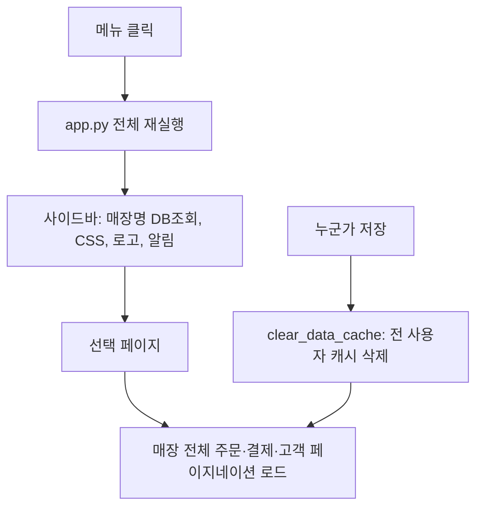

# 로딩 속도 개선 계획

## 현재 확인된 원인

- 데이터 규모: 삼산점 `store_1.db`는 주문 1,062건·결제 5,098건입니다. `store_2.db`는 주문 7,310건·결제 8,127건입니다. 1,000건씩 끊어 받으므로 화면 하나에 왕복이 약 20회 필요하고, 1회에 로컬 기준 약 75ms가 걸립니다.
- 메뉴를 바꿀 때마다 [app.py](app.py) 전체가 다시 실행되고, 페이지 본문 전에 `main()`(약 43335행)이 아래 작업을 매번 반복합니다.
  - `get_store_display_name`(14261행)이 캐시 없이 매번 Supabase `app_stores`를 조회합니다.
  - CSS 4종과 sticky-header CSS를 매번 주입합니다. favicon과 로고는 매번 디스크에서 읽어 base64로 변환합니다(81–98행, 6317–6328행).
  - `count_unread_notifications`의 캐시 유지 시간이 15초라 자주 다시 조회합니다.
  - ERP 아이콘, 즐겨찾기, 홈 버튼은 `st.rerun()`을 추가로 호출해 스크립트가 2번 돕니다(476, 509, 517, 43453, 43478행).
- 고객 및 잔금 관리(`render_customer_balance`)
  - 탭 2~4용 데이터를 어느 탭을 보든 매번 매장 전체로 불러옵니다.

```41470:41474:app.py
    order_cols_d10 = "id, customer_id, order_date, ..."
    _shared_orders_d10 = load_orders_cached(db_filename, order_cols_d10, limit=None)
    _shared_payments_d10 = load_payments_cached(db_filename)
    _shared_customers_d10 = load_customers_cached(db_filename, limit=None, col_list="id, name, phone1")
```

  - 고객 한 명을 선택해도 컬럼 구성이 다른 매장 전체 주문과 전체 결제를 다시 불러온 뒤 화면에서 걸러냅니다(40166–40173행). 컬럼 구성이 달라 캐시도 공유되지 않습니다.
- `clear_data_cache()`(7554행)가 약 49곳에서 호출됩니다. 캐시는 서버 전체가 공유하므로, 한 명이 저장하면 모든 사용자·모든 매장의 주문·결제·고객·매장·직원 캐시가 비워집니다. 다음 화면은 처음부터 다시 불러옵니다.
- 대시보드와 잔금 빠른등록(36609행)도 매장 전체를 불러오고, `_load_orders_as_sales`(6709행)는 전체 주문을 받은 뒤 날짜를 화면에서 거릅니다.



## 0단계: 측정

- 기존 `_PcrPerfTimer`(7615행)로 `main()` 앞부분, 사이드바, 각 `render_*`, 주요 로더에 계측 구간을 넣습니다. 이 타이머는 `_pcr_perf_debug` 세션 플래그가 켜진 경우에만 동작합니다.
- 관리자 화면에 성능 측정 켜기 토글을 추가합니다. 켜면 구간별 ms를 화면 하단에 표로 보여줍니다.
- 개선 전 기준값을 기록합니다. 대상은 메뉴 전환, 고객 및 잔금 관리 진입, 고객 선택, 대시보드입니다.

## 1단계: 빠른 개선 (데이터 결과에 영향 없음)

- `get_store_display_name`에 `@st.cache_data(ttl=3600)`를 적용합니다. 매장 변경 시 무효화 목록에도 추가합니다.
- favicon과 로고의 base64 변환을 `@st.cache_resource`로 1회만 수행합니다. CSS 문자열은 상수로 만들어 재사용합니다.
- 알림 카운트 TTL을 15초에서 60초로 늘립니다. 새 알림은 기존 15분 하트비트와 페이지 이동 때 반영됩니다.
- 즐겨찾기·ERP 레일·홈의 추가 `st.rerun()`은 `on_click` 콜백으로 바꿔 한 번만 실행되게 합니다. 동작과 이동 결과는 그대로입니다.

## 2단계: 고객·잔금 화면 서버 필터 (체감 효과 가장 큼)

- 고객을 선택하면 `customer_id` 기준으로 서버에서 필터링해, 해당 고객의 주문과 그 주문들의 결제만 가져오는 로더를 추가합니다. 새 함수는 `_load_orders_by_customers`, `_load_payments_by_orders`이고, 캐시 유지 시간은 600초입니다. 40166–40173행의 전체 로드를 이 함수로 교체합니다.
- 탭 2~4 공용 데이터는 실제로 그 탭을 열었을 때만 불러옵니다. 방법은 둘 중 하나입니다.
  - `st.tabs` 대신 `st.segmented_control`로 선택한 탭만 렌더합니다.
  - 각 탭 본문을 `@st.fragment`로 감싸 해당 탭 안에서만 다시 실행되게 합니다.
- D-10 미수 탭은 `delivery_date` 기간 조건을 서버 쿼리에 넣습니다.
- 잔금 빠른등록(36609행)에도 같은 고객 단위 로더를 씁니다.

## 3단계: 캐시 무효화 범위 축소

- `clear_data_cache()` 호출부 약 49곳을 도메인별 함수로 바꿉니다. 결제 저장은 `_invalidate_payments`, 주문 저장은 `_invalidate_orders`, 고객 저장은 `_invalidate_customers`만 호출합니다. 매장·직원·사용자 캐시는 해당 설정을 바꿀 때만 비웁니다.
- 가능하면 로더 캐시 키에 `db_filename`을 분리해 넣습니다. 한 매장의 저장이 다른 매장 캐시를 비우지 않게 합니다. 예: 매장별 버전 번호를 `session_state`와 캐시 인자로 전달합니다.
- 결과 보장: 저장한 사람은 저장 직후 항상 최신 데이터를 봅니다. 해당 매장 캐시를 무효화하기 때문입니다.

## 4단계: 대시보드·매출 로더

- `_load_orders_as_sales`에 기간 조건(`order_date` gte/lte)을 서버 쿼리로 넣고, 매출 조회를 해당 기간 주문 id로만 제한합니다.
- [sales_report_service.py](sales_report_service.py)의 `_fetch_orders/payments/sales`에 페이지네이션을 추가합니다. 지금은 1,000건을 넘으면 결과가 잘립니다.

## 5단계 (선택, 큰 구조 변경)

- `st.navigation` 멀티페이지로 나누면 메뉴마다 필요한 코드만 실행됩니다. [app.py](app.py) 분리가 필요한 대규모 작업이라, 1~4단계 측정 결과를 보고 결정합니다.

## 검증

- 0단계 측정표로 각 단계 전후 ms를 비교합니다. 목표는 메뉴 전환 1초 이내, 고객 선택 1초 이내입니다.
- 결과 동일성 확인
  - 고객 잔금·결제 내역·미수 탭 건수와 합계가 개선 전과 같은지, 삼산점과 `store_2.db`에서 비교합니다.
  - 결제 저장 직후 화면에 즉시 반영되는지 확인합니다.
  - 다른 매장 캐시가 유지되는지 확인합니다.

## 원칙

- 단계마다 따로 커밋해 문제가 생기면 해당 단계만 되돌립니다.
- DB 스키마와 저장 로직(INSERT/UPDATE)은 바꾸지 않습니다. 읽기 경로와 캐시만 수정합니다.