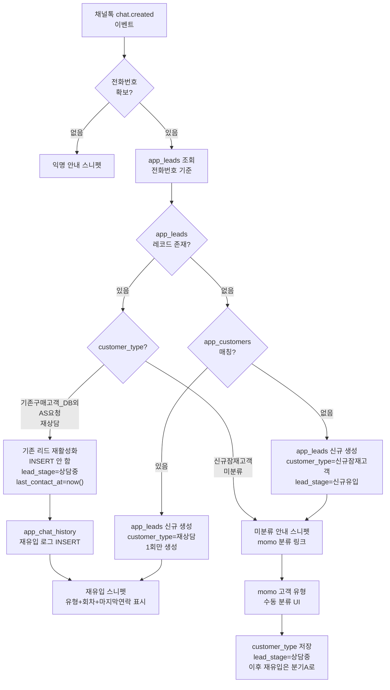

# 옴니채널 리드 육성 및 직원 KPI 평가 시스템 (플랜 v2)

## 기존 플랜 유지

아래 단계들(0~6단계, KPI 대시보드 등)은 이전 플랜 그대로 유지한다.

---

## 설계 원칙 수정 (v2 → v3)

### 원칙 1: 고객 식별은 전화번호 단일 키, 점포 무관 전사(全社) 조회

고객이 학성점에서 구매 후 삼산점으로 재문의하거나, 가격 비교 목적으로 여러 점포에 문의할 수 있다. `app_leads`·`app_customers` 조회 시 **`store_name` 조건을 걸지 않는다**. 전화번호만으로 전사 DB를 단일 검색한다.

- `store_name`은 "이 리드가 어느 점포에서 유입됐는지"를 기록하는 메타데이터로만 사용
- 고객 동일성 판단(기존 고객 여부, 재유입 여부)은 항상 **전화번호 단일 키** 기준
- 스니펫·momo UI에서 "이 고객이 학성점에서 구매한 이력이 있음"을 표시하되, 담당 점포 간 이력 공유 가능

### 원칙 2: 고객 데이터 최소화 — 이름 + 전화번호만

`contact_person`(고객사 담당자), `extra_assignee_ids`(복수 담당자 ID 배열) 등 불필요한 필드를 제거한다. 고객 식별에 필요한 것:

| 보존 | 제거 |
|---|---|
| `name` (고객 이름) | `contact_person` (고객사 담당자) |
| `phone` (전화번호, 식별 키) | `extra_assignee_ids` (복수 담당자 배열) |
| `assigned_employee_id` (담당 직원 FK) | `assigned_store` (store_name으로 통일) |

`lead_management.py` 수정: `contact_person` 입력 필드 제거, 테이블 컬럼 제거, 저장 로직에서 제거.

### 원칙 3: 담당 직원 선택은 드롭다운 (app_users 기반)

매출 등록 화면과 동일한 방식. `app_users` 테이블에서 직원 목록을 로드해 `st.selectbox`로 선택하고 `assigned_employee_id`에 저장한다. 현재 `lead_management.py`에서 텍스트 입력이나 채널톡 자동매핑에 의존하는 부분을 드롭다운으로 교체.

```python
# 매출 등록 화면의 기존 패턴 재사용
users = supa.table("app_users").select("id, name").order("name").execute().data or []
emp_options = {u["name"]: u["id"] for u in users}
selected_name = st.selectbox("담당 직원", list(emp_options.keys()))
assigned_employee_id = emp_options[selected_name]
```

### 원칙 4: Solapi 수신 웹훅 없이 상담 히스토리 유지 전략

Solapi `message-received` 웹훅을 제거한 상태에서 상담 이력을 유지하는 방법:

#### 채널별 이력 수집 경로

| 채널 | 방향 | 수집 방법 | 자동/수동 |
|---|---|---|---|
| ChannelTalk 웹챗 | 인바운드+아웃바운드 | `chat.closed` 웹훅 → `app_chat_history` | **자동** |
| KakaoTalk 친구톡/알림톡 아웃바운드 | 아웃바운드 | 발송 시 `app_chat_history` INSERT | **자동** |
| KakaoTalk 고객 답장 | 인바운드 | KakaoTalk 채널이 ChannelTalk에 연결되어 있어 ChannelTalk 웹챗으로 수신됨 → `chat.closed` 경로 | **자동** |
| SMS 아웃바운드 | 아웃바운드 | 발송 시 `app_chat_history` INSERT | **자동** |
| SMS 고객 답장 | 인바운드 | Solapi 수신 웹훅 없음 → **직원이 수동 메모** | 수동 |
| 전화 통화 | 양방향 | momo에서 직원이 통화 후 메모 입력 | 수동 |
| 오프라인 방문 | 양방향 | momo에서 직원이 방문 후 메모 입력 | 수동 |

#### 핵심 판단

- **KakaoTalk 답장은 실질적으로 자동 수집됨**: 에몬스의 KakaoTalk 채널이 ChannelTalk에 연결되어 있으므로, 고객이 카카오톡으로 답장하면 ChannelTalk 대화창으로 수신되고, 종료 시 `chat.closed` 웹훅이 전문을 저장한다. Solapi 수신 웹훅은 불필요.

- **SMS 답장이 유일한 공백**: 고객이 문자로 답장할 경우 자동 수집 불가. 하지만 실제로 SMS 수신 답장 빈도는 낮고, 중요한 대화는 ChannelTalk·KakaoTalk에서 이루어진다. momo의 "메모 추가" 기능으로 직원이 수동 기록.

- **아웃바운드 발송 이력**: `send_sms()`, `send_mms()`, `send_friendtalk()` 호출 시 `app_chat_history`에 즉시 INSERT. 발송 내용·수신자·발송 시각 기록.

#### 발송 시 자동 로그 패턴 (lead_manager.py)

```python
def _log_outbound_message(phone: str, channel: str, text: str, handled_by: str):
    """아웃바운드 메시지 발송 시 app_chat_history에 자동 기록."""
    supabase.table("app_chat_history").insert({
        "customer_phone": _normalize_phone(phone),
        "channel": channel,          # '친구톡_발송', '알림톡_발송', 'SMS_발송'
        "summary": text[:200],
        "full_text": text,
        "handled_by": handled_by,
    }).execute()
```

`send_friendtalk()`, `send_sms()` 등 발송 함수 내부에서 성공 시 이 함수를 호출하면 자동 누적.

---

## 추가: DB 외 기존 구매 고객 수동 분류 시스템

### 배경 및 문제

채널톡으로 유입되는 고객 중 `app_customers`에 없는 고객이 두 종류로 나뉜다.

- **진짜 신규**: 아직 구매한 적 없는 잠재 고객 → 기존대로 `1_신규유입` 리드로 자동 등록
- **DB 외 기존 구매 고객**: 2026년 4월 이전에 구매했지만 momo DB에 없는 고객 → 잘못된 자동 등록을 막고 **직원이 수동 분류**

현재 로직은 `app_customers` 미매칭 시 무조건 `신규유입`으로 등록하여, 기존 구매 고객을 신규 리드로 오분류하는 문제가 있다.

---

### 추가 1: `app_leads` 스키마 확장 (SQL)

`app_leads` 테이블에 고객 유형 컬럼 추가:

```sql
ALTER TABLE app_leads ADD COLUMN IF NOT EXISTS customer_type TEXT
  DEFAULT '신규잠재고객'
  CHECK (customer_type IN (
    '신규잠재고객',       -- 구매 이력 없는 신규
    '기존구매고객_DB외',  -- 2026-04 이전 구매, app_customers 미등록
    'AS요청',             -- 기존 구매 후 AS/문의 목적 재유입
    '재상담'              -- 기존 구매 고객의 신규 상담 유입
  ));

ALTER TABLE app_leads ADD COLUMN IF NOT EXISTS classification_memo TEXT;
  -- 직원이 분류 시 남기는 메모 (예: "2024년 킹덤 소파 구매, AS 문의")

ALTER TABLE app_leads ADD COLUMN IF NOT EXISTS classified_by TEXT;
  -- 분류한 직원 이름

ALTER TABLE app_leads ADD COLUMN IF NOT EXISTS classified_at TIMESTAMPTZ;
```

새 SQL 파일: `SUPABASE_APP_LEADS_CUSTOMER_TYPE.sql`

---

### 추가 2: ChannelTalk Snippet — 미분류 고객 분류 버튼

`api.py`의 `/channel-talk/custom-tab` 엔드포인트 수정.

**현재 로직:**
```
전화번호 있음 → app_customers 조회 → 있으면 기존 고객 스니펫, 없으면 리드 조회
```

**변경 로직:**

```
전화번호 있음
  ├─ app_customers 매칭 → 기존 고객 스니펫 (기존 그대로)
  └─ app_customers 미매칭
        ├─ app_leads에 customer_type 분류 완료 → 분류된 유형 + 상태 표시
        └─ app_leads 미분류 (customer_type = NULL 또는 '신규잠재고객' 상태)
              → 분류 안내 블록 표시:
                "⚠ momo DB에 구매이력 없음. 아래에서 고객 유형을 선택하세요."
                [기존구매고객(DB 외)] [AS 요청] [신규 잠재고객 유지]
```

채널톡 Snippet에서는 버튼 클릭 → momo 앱의 분류 화면 URL로 연결하는 방식이 현실적이다 (채널톡 Snippet은 POST 인터랙션이 제한적).

스니펫 출력 예시 (미분류 상태):
```
⚠ momo DB에 구매이력 없음
─────────────────────────────
이 고객은 채널톡으로 유입되었지만
app_customers에 구매기록이 없습니다.

2026년 4월 이전 구매 고객일 수 있습니다.
아래 링크에서 고객 유형을 분류해 주세요.

[momo에서 고객 분류하기 →]
─────────────────────────────
현재 상태: 미분류 (신규유입으로 임시 등록)
```

---

### 추가 3: momo Lead Management — 수동 고객 분류 UI

[`lead_management.py`](lead_management.py)의 리드 상세 패널에 "고객 유형 분류" 섹션 추가.

**분류 UI 구성:**

```
[고객 유형]
  ○ 신규 잠재고객 (구매 이력 없음)
  ● 기존 구매 고객 (DB 외, 2026년 4월 이전)
  ○ AS 요청 고객
  ○ 재상담 (기존 구매 후 신규 상담)

[분류 메모]  예: "2024년 킹덤 소파 구매, 배송 AS 문의"

[리드 단계]  ● 상담중  ○ 자료발송  ○ 계약완료  ○ 계약실패

[저장]
```

구현 포인트:
- `customer_type` 선택 → `app_leads.customer_type`, `classified_by`, `classified_at` 업데이트
- **`기존구매고객_DB외` 또는 `AS요청` 선택 시** `lead_stage`를 `'2_상담중'`으로 자동 설정 가능하게 옵션 제공
- 분류 완료 후 리드 목록에서 유형 아이콘으로 구분 표시

---

### 추가 4: lead_stage에 '상담중' 추가

현재 `lead_stage` ENUM:
```
'1_신규유입', '2_자료발송', '3_매장방문', '4_계약완료', '5_계약실패'
```

기존 구매 고객이나 AS 요청 고객은 "자료발송" 단계가 맞지 않는다. `'2_상담중'`을 추가하거나 기존 `'2_자료발송'`의 의미를 "상담중/자료발송"으로 확장한다.

**권장안 (기존 스키마 최소 변경):** `lead_stage` ENUM 값을 아래로 교체:
```sql
ALTER TABLE app_leads DROP CONSTRAINT IF EXISTS app_leads_lead_stage_check;
ALTER TABLE app_leads ADD CONSTRAINT app_leads_lead_stage_check
  CHECK (lead_stage IN (
    '1_신규유입',
    '2_상담중',       -- 기존 '2_자료발송'을 포함하여 확장
    '3_매장방문',
    '4_계약완료',
    '5_계약실패'
  ));
```

UI에서 드롭다운으로 단계 선택 가능.

---

### 추가 5: 재유입 고객 자동 재활성화 로직

**핵심 원칙: 한 번 분류된 고객은 재유입 시 새 리드를 만들지 않는다.**

`app_leads` 레코드는 **고객 1명당 1개**를 유지한다. 채팅이 새로 시작될 때마다 새 리드를 만드는 것이 아니라, 기존 레코드의 `lead_stage`를 `'2_상담중'`으로 업데이트하고 `last_contact_at`을 갱신한다. 상담 내용은 `app_chat_history`에 별도 누적한다.

#### 5-1. `app_leads`에 `last_contact_at` 컬럼 추가

```sql
ALTER TABLE app_leads ADD COLUMN IF NOT EXISTS last_contact_at TIMESTAMPTZ;
-- 채널톡 채팅이 열릴 때마다 자동 갱신, 최근 재유입 시점 추적
```

#### 5-2. `api.py` 채널톡 웹훅 — 재유입 판단 로직

채널톡 `chat.created` 이벤트 수신 시 아래 순서로 처리한다:

```
1. 전화번호 정규화
2. app_leads WHERE phone = normalized 조회 (최신 1건)

[분기 A] 기존 lead 존재 + customer_type IN ('기존구매고객_DB외', 'AS요청', '재상담')
   → 새 리드 생성 안 함
   → 기존 lead: lead_stage = '2_상담중', last_contact_at = now() 업데이트
   → app_chat_history에 채팅 시작 로그 INSERT (channel='채널톡_재유입')
   → 스니펫: 기존 customer_type 그대로 표시 + "재유입 N회차" 안내

[분기 B] 기존 lead 존재 + customer_type = '신규잠재고객'
   → 아직 분류 전이므로 미분류 안내 스니펫 표시 (추가 2와 동일)
   → last_contact_at만 갱신

[분기 C] app_leads 없음 + app_customers 있음 (app_customers 매칭)
   → 기존 플랜 로직 (구매 고객 스니펫)
   → app_leads에 customer_type='재상담'으로 신규 생성 (단 1회만)

[분기 D] app_leads 없음 + app_customers 없음 (완전 미지 고객)
   → customer_type='신규잠재고객'으로 리드 신규 등록
   → 미분류 안내 스니펫 표시
```

핵심: **분기 A에서 `INSERT`가 아닌 `UPDATE`만 수행** — 같은 고객의 재유입이 쌓여도 `app_leads` 레코드는 1개 유지.

#### 5-3. 스니펫 — 재유입 고객 표시 예시

```
🔄 재유입 고객 (기존구매고객)
─────────────────────────────
홍길동 / 010-1234-5678
분류: 기존구매고객_DB외 (2026-06-01 김직원 분류)
메모: 2024년 킹덤 소파 구매, AS 문의

이번 재유입: 3회차 (마지막: 2026-06-20)
현재 상태: 상담중 → 자동 업데이트됨
─────────────────────────────
[momo에서 전체 상담이력 보기 →]
```

재유입 횟수는 `app_chat_history`에서 `customer_phone` 기준 COUNT로 계산.

#### 5-4. `app_customers` 매칭 고객의 재유입 처리

2026년 4월 이후 구매 고객(app_customers에 있는 고객)이 채널톡으로 재유입 시:
- `app_leads`에 기존 레코드 있으면 → 분기 A와 동일하게 재활성화
- `app_leads` 없으면 → `customer_type='재상담'`으로 1회만 생성 (이후 재유입은 분기 A로 처리)

---

### 추가 6: 리드 목록 UI 시각적 구분

[`lead_management.py`](lead_management.py)의 리드 목록 테이블에 `customer_type` 뱃지 컬럼 추가:

| 고객 유형 | 표시 |
|---|---|
| 신규잠재고객 | `🆕 신규` |
| 기존구매고객_DB외 | `🔄 기존구매` |
| AS요청 | `🔧 AS` |
| 재상담 | `💬 재상담` |

필터 기능: 리드 목록에서 `customer_type`으로 필터링 가능하게 확장.

---

### 변경/추가 파일 요약 (추가분)

- `SUPABASE_APP_LEADS_CUSTOMER_TYPE.sql` (신규) — `customer_type`, `classification_memo`, `classified_by`, `classified_at` 컬럼 추가 마이그레이션
- [`api.py`](api.py) — `/channel-talk/custom-tab` 미분류 고객 안내 블록 추가, `chat.opened` 이벤트에서 재상담 탐지
- [`lead_management.py`](lead_management.py) — 리드 상세 패널에 고객 유형 분류 UI 추가, 목록에 `customer_type` 뱃지 및 필터 추가

---

### 플로우 다이어그램 — 재유입 포함 전체 로직



---

### 데이터 흐름 요약 — 고객 유형별 재유입 처리

| 재유입 상황 | 처리 방식 | app_leads 변화 |
|---|---|---|
| 분류된 고객(기존구매/AS/재상담) 재유입 | 기존 레코드 UPDATE만 | INSERT 없음, lead_stage=상담중, last_contact_at 갱신 |
| 미분류(신규잠재고객) 재유입 | 미분류 안내 스니펫 표시 | last_contact_at만 갱신 |
| app_customers 있음, app_leads 없음 | 재상담 리드 1회 생성 | INSERT 1회 후 이후 재유입은 UPDATE |
| 완전 미지 고객 | 신규유입 리드 생성 + 분류 요청 | INSERT 1회 |
