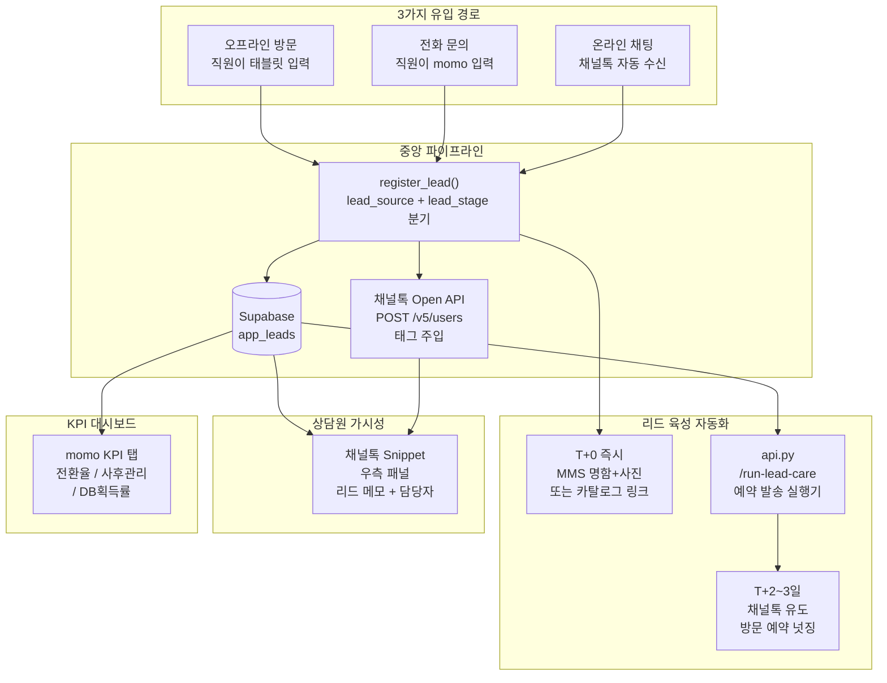

# 옴니채널 리드 육성 및 직원 KPI 평가 시스템

## 핵심 원칙

무분별한 문자 발송은 스팸이다. 이 시스템은 **리드의 온도(lead_stage)에 맞는 정교한 넛징**과 **직원 인센티브(KPI)와 연동된 입력 강제**를 통해 전환율을 높인다.

---

## 전체 아키텍처



---

## 핵심 설계 원칙: 전화번호 단일 식별자 방어 아키텍처

채널톡은 익명 유저 ID(`w_anom_1234`)가 세션마다 바뀌는 구조적 한계가 있다. 이 시스템은 **전화번호 하나만 확보되면 과거 모든 이력(카카오톡, 오프라인, 웹챗)을 Supabase에서 병합**하여 상담원에게 즉시 시각화한다. 채널톡의 세션 유실 한계를 우리 백엔드로 방어하는 구조다.

```mermaid
flowchart LR
    subgraph trigger [1단계 - 트리거]
        T1["서포트봇 폼\n전화번호 입력 요청"]
        T2["상담원 수동 입력\n우측 프로필란"]
        T3["기존 채널톡 유저\nmobileNumber 보유"]
    end

    subgraph pull [2단계 - PULL 조회"]
        P1["POST /channel-talk/custom-tab\nmobileNumber 추출"]
        P2["Supabase 병합 조회\napp_leads + app_chat_history"]
        P3["스니펫 렌더링\n상담원 화면"]
    end

    subgraph push [3단계 - PUSH 아카이빙]
        A1["chat.closed 웹훅 수신"]
        A2["채널톡 Open API\nGET /v5/chats/chatId/messages"]
        A3["Supabase\napp_chat_history 저장"]
    end

    T1 --> P1
    T2 --> P1
    T3 --> P1
    P1 --> P2 --> P3
    A1 --> A2 --> A3
    A3 --> P2
```

---

## 현황 파악 (기존 코드 기준)

- `app_leads` 테이블: 없음 — 신규 생성
- `전화/오프라인 등록` 메뉴: 없음 — `crm_automation.py`에 신규 섹션
- 채널톡 `v5/users` API 호출: 미구현 — `api.py`에 추가
- `send_sms()` / `send_mms()`: `solapi_sender.py`에 없음 — 추가 필요
- 스케줄러: 없음 — DB 예약 필드 + `/run-lead-care` 엔드포인트 패턴 유지
- KPI 대시보드: 없음 — `app.py` 신규 탭

---

## 0단계: Supabase `app_chat_history` 테이블 신설

신규 파일 `SUPABASE_APP_CHAT_HISTORY.sql` — 전화번호 기반 통합 상담 아카이브:

```sql
CREATE TABLE IF NOT EXISTS app_chat_history (
  id               BIGSERIAL PRIMARY KEY,
  customer_phone   TEXT NOT NULL,          -- 전화번호 (단일 식별자)
  channel          TEXT NOT NULL,          -- '채널톡_웹챗', '카카오톡', '오프라인_메모', '전화_통화'
  chat_id          TEXT,                   -- 채널톡 chatId (웹챗 한정)
  summary          TEXT,                   -- 상담 요약 또는 직원 메모
  full_text        TEXT,                   -- 대화 전문 (chat.closed 후 자동 수집)
  handled_by       TEXT,                   -- 담당 상담원 이름 또는 이메일
  created_at       TIMESTAMPTZ DEFAULT now()
);

CREATE INDEX IF NOT EXISTS app_chat_history_phone_idx   ON app_chat_history (customer_phone);
CREATE INDEX IF NOT EXISTS app_chat_history_created_idx ON app_chat_history (created_at DESC);
```

---

## 1단계: Supabase `app_leads` 고도화 스키마

신규 파일 `SUPABASE_APP_LEADS.sql`:

```sql
CREATE TABLE IF NOT EXISTS app_leads (
  id                   BIGSERIAL PRIMARY KEY,
  store_name           TEXT NOT NULL,
  phone                TEXT NOT NULL,
  name                 TEXT,
  memo                 TEXT,

  -- 유입 경로 (3가지로 엄격히 통제)
  lead_source          TEXT NOT NULL CHECK (lead_source IN (
                         '온라인_채널톡', '전화_문의', '오프라인_방문'
                       )),

  -- 리드 온도 (영업 파이프라인 단계)
  lead_stage           TEXT NOT NULL DEFAULT '1_신규유입' CHECK (lead_stage IN (
                         '1_신규유입', '2_자료발송', '3_매장방문', '4_계약완료', '5_계약실패'
                       )),

  -- 담당자 (KPI 핵심 기본키)
  assigned_employee_id BIGINT REFERENCES app_users(id),
  assigned_store       TEXT,

  -- 사후 관리
  next_contact_date    DATE,
  contact_memo         TEXT,         -- Follow-up 후 직원이 남기는 상담 메모
  followup_done        BOOLEAN DEFAULT FALSE,

  -- 자동화 상태
  nurturing_step       INT DEFAULT 0,       -- 0=미발송, 1=T+0 완료, 2=T+N 완료
  next_nurture_at      TIMESTAMPTZ,         -- 다음 예약 발송 시각
  ct_synced            BOOLEAN DEFAULT FALSE,

  -- 전환 추적 (구매 연결)
  converted_at         TIMESTAMPTZ,         -- 계약 완료 시각
  converted_order_id   BIGINT REFERENCES app_orders(id),  -- 연결된 주문 ID
  revenue_amount       NUMERIC(12,2),       -- 계약 금액 (KPI 금액 집계용)

  created_at           TIMESTAMPTZ DEFAULT now(),
  updated_at           TIMESTAMPTZ DEFAULT now()
);

CREATE INDEX IF NOT EXISTS app_leads_phone_idx    ON app_leads (phone);
CREATE INDEX IF NOT EXISTS app_leads_store_idx    ON app_leads (store_name);
CREATE INDEX IF NOT EXISTS app_leads_employee_idx ON app_leads (assigned_employee_id);
CREATE INDEX IF NOT EXISTS app_leads_stage_idx    ON app_leads (lead_stage);
CREATE INDEX IF NOT EXISTS app_leads_nurture_idx  ON app_leads (next_nurture_at)
  WHERE nurturing_step < 2 AND lead_stage NOT IN ('4_계약완료','5_계약실패');
```

---

## 2단계: `solapi_sender.py` MMS/SMS 추가

기존 `send_friendtalk()`, `send_alimtalk()` 옆에 추가:

```python
def send_sms(to_phone: str, text: str, *, timeout: float = 10.0) -> dict:
    """일반 SMS/LMS 단문 발송."""

def send_mms(to_phone: str, text: str, image_url: str, *, timeout: float = 15.0) -> dict:
    """MMS 이미지 첨부 발송 (오프라인 방문 명함+사진용).
    Solapi /messages/v4/send-many 의 'imageId' 파라미터 활용.
    """
```

발송 우선순위 (유입 경로별):
- 오프라인 방문: MMS(명함+사진) → SMS 폴백
- 전화/온라인: 친구톡 → 알림톡 → SMS 폴백

---

## 2.5단계: 채널톡 익명 고객 식별 및 통합 이력 조회 (Snippet 고도화)

### 전화번호 없는 익명 고객 처리

기존 `/channel-talk/custom-tab` 엔드포인트에 익명 분기 추가:

```python
@app.api_route("/channel-talk/custom-tab", methods=["POST", "PUT"])
async def handle_custom_tab(payload: dict):
    phone = payload.get("context", {}).get("profile", {}).get("mobileNumber")

    if not phone:
        # 전화번호 미확보 → 상담원에게 입력 요청 안내
        return {"snippet": {"version": "v0", "layout": [
            {"id": "anon-warn", "type": "text",
             "text": "익명 고객 — 우측 프로필에 연락처를 입력하면 momo DB와 연동됩니다."}
        ]}}

    cleaned = _normalize_phone(phone)
    # app_leads + app_chat_history 통합 조회 → 스니펫 렌더링
```

### 전화번호 확보 시 통합 이력 조회 및 스니펫 렌더링

```python
# app_chat_history SELECT (최신 3건)
history = supabase.table("app_chat_history") \
    .select("created_at, channel, summary") \
    .eq("customer_phone", cleaned) \
    .order("created_at", desc=True) \
    .limit(3).execute().data

# 스니펫 blocks 조립
blocks = [{"id": "id-header", "type": "text", "text": f"재상담 고객 식별 완료 — {cleaned}"}]
for i, rec in enumerate(history):
    blocks.append({
        "id": f"hist-{i}",
        "type": "text",
        "text": f"[{rec['created_at'][:10]} / {rec['channel']}] {rec['summary']}"
    })
# momo 매직링크 버튼
blocks.append({"id": "btn-momo", "type": "button", "label": "momo 전체 세일즈 일지 열기",
               "action": {"type": "link", "url": f"{MOMO_APP_URL}?phone={cleaned}&auth={token}"}})
```

스니펫 출력 예시:
```
재상담 고객 식별 완료 — 01012345678
─────────────────────────────────────
[2026-05-10 / 카카오톡]     토레도 소파 4인용 견적 문의
[2026-05-15 / 오프라인_메모] 매장 방문, 가죽 샘플 확인 후 고민 중
[2026-06-01 / 채널톡_웹챗]  배송 일정 문의
─────────────────────────────────────
[momo 전체 세일즈 일지 열기]
```

### `chat.closed` 웹훅 — 대화 전문 자동 아카이빙

`api.py`에 신규 엔드포인트 추가:

```python
@app.post("/channel-talk/webhook")
async def handle_ct_webhook(payload: dict):
    event = payload.get("event")
    if event != "chat.closed":
        return {"ok": True}

    chat_id = payload["chat"]["id"]
    phone   = payload.get("user", {}).get("mobileNumber", "")

    if not phone:
        return {"ok": True}  # 전화번호 없으면 저장 불필요

    # 채널톡 Open API로 대화 전문 수집
    # GET https://api.channel.io/v5/chats/{chat_id}/messages
    messages = await _fetch_ct_chat_messages(chat_id)
    full_text = "\n".join(f"[{m['author']}] {m['text']}" for m in messages)

    # Supabase app_chat_history 저장
    supabase.table("app_chat_history").insert({
        "customer_phone": _normalize_phone(phone),
        "channel":        "채널톡_웹챗",
        "chat_id":        chat_id,
        "full_text":      full_text,
        "summary":        full_text[:200],  # 앞 200자를 요약으로
        "handled_by":     payload.get("manager", {}).get("email", ""),
    }).execute()

    return {"ok": True}
```

채널톡 Developer Portal에서 `chat.closed` 웹훅 이벤트를 `/channel-talk/webhook`으로 등록 필요.

---

## 3단계: 옴니채널 유입 등록 로직

### 3-1. `api.py` — 채널톡 자동 수신 (온라인 유입)

기존 `/channel-talk/custom-tab` 웹훅에 리드 자동 등록 로직 추가:

```python
# 채널톡 대화 열릴 때 — 기존 구매 이력 없는 경우 자동으로 app_leads 등록
if not rows:  # app_customers 미매칭 시
    await _register_lead_from_channel_talk(
        phone=cleaned_phone, name=name_from_ct,
        lead_source="온라인_채널톡", store_name=CHANNEL_TALK_DEFAULT_STORE,
    )
```

채널톡 `v5/users` upsert 함수:

```python
async def _ct_upsert_user(phone: str, name: str, tags: list[str]) -> bool:
    """채널톡 Open API — 유저 프로필 upsert + 태그 주입.
    환경변수: CHANNEL_TALK_ACCESS_KEY, CHANNEL_TALK_ACCESS_SECRET
    POST https://api.channel.io/v5/users
    """
```

`render.yaml`에 추가:
- `CHANNEL_TALK_ACCESS_KEY`
- `CHANNEL_TALK_ACCESS_SECRET`

### 3-2. `crm_automation.py` — 수동 등록 UI (전화/오프라인)

CRM 탭에 "가망고객 등록" 섹션 신설:

```
[유입 경로 선택]  ○ 전화 문의   ● 오프라인 방문

전화번호 (필수): [010-____-____]
고객 성함 (선택): [         ]
상담 메모:        [토레도 소파 4인용 가격 및 재고 문의    ]
담당자:           [자동: 로그인 직원]
다음 연락 예정일: [2026-06-11]
MMS 즉시 발송:    [ON]

[가망고객 등록]
```

`register_lead()` 함수 (`crm_automation.py` 또는 별도 `lead_manager.py`):

```python
def register_lead(phone, name, memo, lead_source, store_name, employee_id,
                  next_contact_date, send_now=True):
    # 1. 전화번호 정규화
    # 2. Supabase app_leads INSERT
    # 3. 채널톡 v5/users upsert + 태그 주입 (비동기, 실패해도 계속)
    # 4. T+0 즉시 발송 (lead_source별 분기)
    # 5. T+N일 예약: next_nurture_at 설정
```

---

## 3.5단계: 매출 등록 시 리드 자동 전환 처리

`app.py`의 새 매출 등록 로직에 전화번호 기반 자동 클로즈 로직 추가:

```python
def _auto_close_lead(phone: str, order_id: int, revenue: float):
    """매출 등록 시 호출. app_leads에서 동일 전화번호의 활성 리드를 찾아 자동 클로즈."""
    normalized = _normalize_phone(phone)
    # app_leads WHERE phone = normalized AND lead_stage != '4_계약완료'
    # → lead_stage = '4_계약완료'
    #   converted_at = now()
    #   converted_order_id = order_id
    #   revenue_amount = revenue
```

매칭 우선순위: `lead_stage` 낮은 단계(신규) → 최근 생성순.
매칭 실패 시: 조용히 무시 (리드 등록 없이 구매한 고객도 있으므로).

---

## 4단계: 유입 경로별 넛징 시나리오

`lead_manager.py`에서 `lead_source`에 따라 발송 내용 분기:

### 오프라인 방문 시나리오

| 타이밍 | 발송 내용 | 수단 |
|---|---|---|
| T+0 즉시 | "오늘 방문 감사합니다. 담당자 OOO입니다. 보셨던 [제품명] 사진을 보내드립니다." + 매장/제품 사진 | MMS |
| T+3일 | "사이즈나 색상 결정에 어려움이 있으신가요? 채널톡으로 문의주시면 바로 답변드리겠습니다. [링크]" | SMS 또는 친구톡 |

### 전화/온라인 문의 시나리오

| 타이밍 | 발송 내용 | 수단 |
|---|---|---|
| T+0 즉시 | "문의하신 [제품명] 카탈로그 및 가격표 안내입니다. [PDF 링크]" | 알림톡 또는 친구톡 |
| T+2일 | "이번 주말 매장 방문 예약 시 VVIP 사은품 증정 혜택을 드립니다. [예약 링크]" | 친구톡 |

예약 발송 실행기 (`api.py`에 엔드포인트 추가):

```
GET /run-lead-care
  → app_leads WHERE nurturing_step < 2
              AND next_nurture_at <= now()
              AND lead_stage NOT IN ('4_계약완료','5_계약실패')
  → lead_source별 발송 함수 호출
  → nurturing_step += 1, next_nurture_at 갱신
```

GitHub Actions 또는 Render Cron으로 매일 오전 10시 실행.

---

## 5단계: 채널톡 Snippet 리드 메모 노출 확장

`api.py`의 `_build_ct_response()`를 확장 — `app_leads` 테이블도 조회:

```
에몬스모 고객정보
━━━━━━━━━━━━━━━━
박예린 (가망고객 — 오프라인 방문)
━━━━━━━━━━━━━━━━
유입 경로  | 오프라인 방문
상담 메모  | 토레도 소파 4인용 가격 문의
상담일     | 2026-06-07
담당자     | 김승찬 (울산점)
다음 연락  | 2026-06-11
━━━━━━━━━━━━━━━━
[momo 시스템에서 열기]
```

---

## 5.5단계: momo 고객 상세 화면 — 통합 상담 히스토리 UI

`app.py`의 고객 상세 화면(고객 정보 조회 시)에 **상담 이력** 섹션을 추가한다.  
`app_chat_history`를 `customer_phone`으로 조회하여 모든 채널의 대화를 한 화면에 표시.

### UI 구성

```
[고객 정보]  [주문 내역]  [상담 이력]  ← 탭 또는 섹션

━━━━━━━━━━━━━━━━━━━━━━━━━━━━━━━━━━━━
상담 이력 (총 4건)
━━━━━━━━━━━━━━━━━━━━━━━━━━━━━━━━━━━━
[+ 메모 직접 추가]  ← 직원이 전화 통화 후 수동 기록용

📅 2026-06-01  채널톡_웹챗  담당: 김상담
   배송 일정 문의 — 2주 소요 안내 후 종결
   ▼ 전체 대화 보기 (클릭하여 펼치기)

📅 2026-05-15  오프라인_메모  담당: 이매장
   매장 방문, 가죽 샘플 확인 후 고민 중

📅 2026-05-10  카카오톡  담당: 시스템
   토레도 소파 4인용 견적 문의

📅 2026-04-20  전화_통화  담당: 박직원
   색상 선택 도움 요청, 아이보리 추천
━━━━━━━━━━━━━━━━━━━━━━━━━━━━━━━━━━━━
```

### 구현 포인트

- **전화번호 기반 조회**: `app_chat_history.customer_phone = 고객 phone1`
- **채널 아이콘 구분**: 채널별 색상/아이콘으로 시각적 구분 (채널톡=파랑, 카카오=노랑, 오프라인=초록, 전화=회색)
- **전체 대화 펼치기**: `st.expander`로 `full_text` 숨김/표시
- **메모 직접 추가**: 직원이 전화 상담 후 수동으로 `app_chat_history`에 INSERT
  ```python
  # [+ 메모 추가] 버튼 → 폼 표시
  # 채널: '전화_통화' or '오프라인_메모'
  # summary: 직원 입력 텍스트
  # handled_by: 로그인 직원 이름
  ```
- **리드 연결 표시**: 동일 전화번호의 `app_leads` 레코드가 있으면 리드 단계도 함께 노출

---

## 6단계: KPI 대시보드 (`app.py` 신규 탭)

메인 탭 목록에 "세일즈 퍼포먼스" 탭 추가. `app_leads` + `app_orders` 집계 쿼리 기반:

### KPI 1 — 리드 전환율 (Lead Conversion Rate)

```
전환율 = count(lead_stage='4_계약완료') / count(*) × 100
         WHERE assigned_employee_id = 로그인 직원
```

기간 필터: 이번 달 / 최근 3개월 / 전체

### KPI 2 — 리드 매출 기여액 (Revenue Attribution)

```
기여 매출 = SUM(revenue_amount)
            WHERE assigned_employee_id = 로그인 직원
              AND lead_stage = '4_계약완료'
```

`converted_order_id`로 `app_orders`와 JOIN하여 상품명까지 확인 가능.

### KPI 3 — 평균 클로징 기간 (Time-to-Close)

```
평균 클로징 = AVG(converted_at - created_at)
              WHERE assigned_employee_id = 로그인 직원
                AND converted_at IS NOT NULL
```

영업 사이클 단축 여부를 직원별·채널별로 비교.

### KPI 4 — 사후 관리 성실도 (Follow-up Activity)

```
성실도 = count(followup_done=TRUE AND contact_memo IS NOT NULL) / count(*) × 100
```

기한 내 처리 = `next_contact_date` + 1일 이내에 `contact_memo`가 입력된 건

### KPI 5 — DB 획득률 (오프라인 전용)

```
DB 획득률 = count(lead_source='오프라인_방문') / 매장 일일 방문자 수 × 100
```

방문자 수는 직원이 하루 시작 시 수동 입력 (센서 데이터 미연동 시 대안).

### UI 구성 (`app.py`):

```
[내 성과]  [매장 전체]  [기간: 이번 달 v]

┌ 리드 전환율      32%   ████████░░  (목표: 40%)
├ 리드 매출기여    4,200만원
├ 평균 클로징      6.2일
├ 사후관리 성실도  78%   ███████░░░  (목표: 80%)
└ DB 획득률        45%   ████░░░░░░  (목표: 60%)

[리드 목록]
| 고객명 | 유입 경로 | 단계       | 계약금액   | 다음 연락 | 상태   |
| 박예린 | 오프라인  | 2_자료발송 | —          | 06-11    | 미처리 |
| 권가람 | 전화      | 4_계약완료 | 3,200,000원 | —        | 완료   |
```

---

## 주요 변경 파일 요약

- `SUPABASE_APP_LEADS.sql` (신규) — 고도화 스키마 + `converted_at`, `converted_order_id`, `revenue_amount`
- `SUPABASE_APP_CHAT_HISTORY.sql` (신규) — 전화번호 기반 통합 상담 아카이브
- `solapi_sender.py` — `send_sms()`, `send_mms()` 추가
- `api.py`:
  - `/channel-talk/custom-tab` — 익명 분기 + `app_chat_history` 통합 이력 조회
  - `/channel-talk/webhook` — `chat.closed` 이벤트 수신, 대화 전문 아카이빙
  - `_ct_upsert_user()`, `_register_lead_from_channel_talk()`, `/run-lead-care` 엔드포인트
- `lead_manager.py` (신규) — `register_lead()`, `_auto_close_lead()`, 넛징 시나리오 발송 함수
- `crm_automation.py` — 가망고객 등록 UI 섹션
- `app.py` — 매출 등록 시 `_auto_close_lead()` 호출 + 세일즈 퍼포먼스 KPI 탭 신설
- `render.yaml` — `CHANNEL_TALK_ACCESS_KEY`, `CHANNEL_TALK_ACCESS_SECRET` 추가

---

## 사전 준비 사항

| 항목 | 필요 작업 |
|---|---|
| 채널톡 Open API 키 | 채널톡 설정 > 개발자 > Open API에서 Access Key / Secret 발급 |
| Solapi MMS 설정 | Solapi 콘솔에서 발신 번호 등록 및 이미지 업로드 테스트 |
| 알림톡 템플릿 2종 | "오프라인 방문 감사" / "온라인 문의 카탈로그" 템플릿 카카오 심사 |
| Supabase SQL 실행 | `SUPABASE_APP_LEADS.sql`을 Supabase SQL 에디터에서 실행 |
| Render 환경변수 2개 | `CHANNEL_TALK_ACCESS_KEY`, `CHANNEL_TALK_ACCESS_SECRET` 추가 |
| 방문자 수 입력 UI | KPI 3(DB 획득률) 분모 — 매일 직원이 입력하는 `app_store_daily_visits` 테이블 신규 또는 수동 값 사용 |
