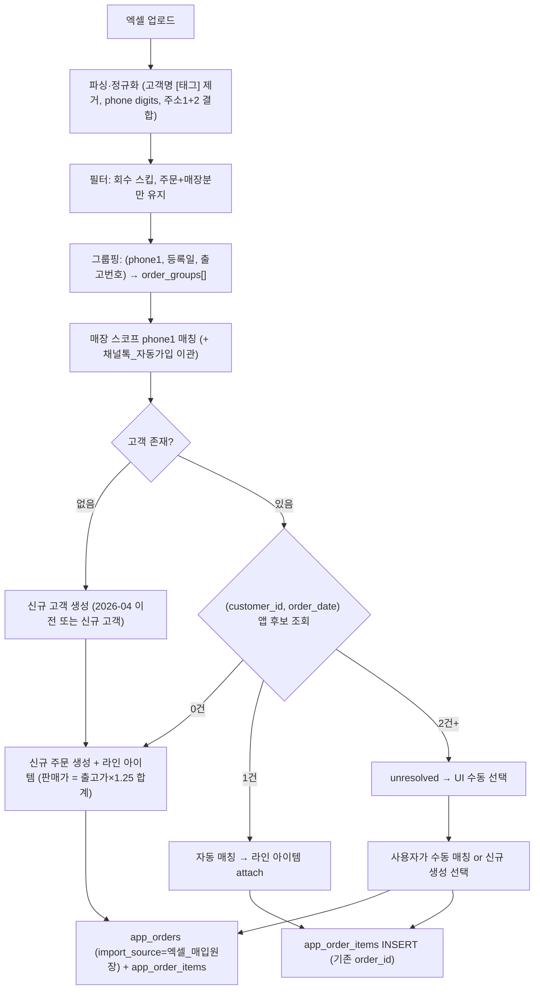

# 매입 원장 통합 임포트 · 최종 계획

## 배경
사용자가 제공한 [samples/legacy_purchase_sample.xlsx](samples/legacy_purchase_sample.xlsx) 는 매입 원장이지만 매출 주문 정보(고객·계약일·배송일·판매자)도 함께 담고 있어, 이 파일 하나로 매출 주문 + 라인 아이템을 동시에 생성/attach 할 수 있습니다.

- 파일 구조: 1,091행 × 40컬럼 (Row 0 제목, Row 1 헤더, Row 2 TOTAL, Row 3+ 데이터 1,088건)
- 매장: 100% "울산삼산리빙(법)" → UI 드롭다운으로 대상 매장 지정
- 2026-04 이전: 1건 (신규 생성), 2026-04 이후: 1,088건 (앱 매칭 시나리오)
- 주문구분 분포: 주문(1,058) / 매장분(15) / 회수(15)

## 확정된 정책 (사용자 결정)
1. 그룹핑 키: `(phone1 digits, 등록일, 출고번호)` 3튜플 = 1개 매출 주문
2. 마진 역산: `판매가 = 출고가 / (1 - 0.20) = 출고가 × 1.25` (기존 [legacy_import_service.py](legacy_import_service.py) L72 `compute_sale_price` 재사용)
3. 매칭 tolerance: 금액 무관. (customer_id, order_date) 후보가 1건이면 자동 매칭, 2건 이상은 unresolved → UI 수동 선택
4. 회수(15) 스킵, 매장분(15) 은 일반 주문과 동일 처리
5. 매장 스코프: UI 에서 매장 선택. 채널톡_자동가입 매장의 phone1 은 대상 매장으로 사전 이관 후 매칭

## 데이터 흐름

## 작업 목록

### 1. DB 스키마
- 새 파일 [SUPABASE_APP_ORDER_ITEMS.sql](SUPABASE_APP_ORDER_ITEMS.sql) 생성:
  - 컬럼: `id`, `order_id` (FK → app_orders), `product_code`(품번), `product_name`(품명), `quantity`(주문수), `unit_cost`(출고가), `line_cost`(주문금액), `vat`(부가세), `line_total`(합계), `item_note`(품목비고), `ship_number`(출고번호), `import_source`, `created_at`
  - 인덱스: `order_id`, `product_code`, `ship_number`
- 기존 [SUPABASE_APP_ORDERS_IMPORT_SOURCE.sql](SUPABASE_APP_ORDERS_IMPORT_SOURCE.sql) 은 이미 반영됨 (재사용)

### 2. 채널톡_자동가입 phone1 이관 유틸 (todo: channeltalk_merge)
- [api.py](api.py) L1130 `_ct_get_or_create_customer` 로직을 참고해, 임포트 커밋 직전 단계에 다음 헬퍼 추가:
  - 대상 매장의 phone1 digits set 을 계산
  - `store_name='채널톡_자동가입'` 에서 동일 digits 를 가진 customer 를 조회
  - 대상 매장에 phone1 이 없으면 store_name 을 대상 매장으로 UPDATE (이관)
  - 대상 매장에 이미 존재하면 채널톡_자동가입 레코드는 삭제 or 아카이브 (사용자 검토 후 결정)

### 3. 신규 서비스 모듈 [legacy_purchase_import_service.py](legacy_purchase_import_service.py)
- `parse_excel(bytes)`: 헤더 오프셋 (Row 1) 처리, TOTAL 행 자동 제거
- `auto_suggest_mapping`: 40개 컬럼 → 표준 필드 매핑
- `_clean_customer_name`: `홍기용[아너스빌]실측` → `홍기용` + 태그·접미사 저장
- `_normalize_row`: phone digits, 주소 결합, 날짜 파싱
- `_filter_rows`: 회수 스킵, 주문·매장분만 유지 (`주문상태` 는 취소가 없어 필터 미적용)
- `_group_orders`: `(phone1, 등록일, 출고번호)` 3튜플 그룹핑 → `OrderGroup { header, items[] }`
- `build_preview(df, mapping, store_name)`: 
  - 각 그룹에 대해 매장 스코프 phone1 매칭 → `existing_customer_id` or `new`
  - 매칭된 고객마다 (customer_id, order_date) 로 app_orders 후보 조회
  - 후보수 0/1/N 에 따라 `to_create` / `to_attach` / `unresolved` 로 분류
  - 그룹별 판매가 = sum(라인.출고가 × 라인.수량) × 1.25
- `commit_import(preview_result, ...)`:
  - Phase 1: 신규 고객 INSERT (기존 [legacy_import_service.py](legacy_import_service.py) L481 `load_existing_customer_phone_map` 재사용)
  - Phase 2: `to_create` 그룹 → app_orders INSERT (`import_source='엑셀_매입원장'`, `total_amount=판매가`, `cost_price=주문금액합`)
  - Phase 3: 모든 그룹 (create/attach) → app_order_items INSERT
  - Phase 4: unresolved 는 상태 저장만 하고 실제 INSERT 안 함

### 4. UI 섹션 (app.py 고객관리 탭)
[app.py](app.py) 의 `_render_legacy_order_bulk_import` 옆에 새 함수 `_render_legacy_purchase_bulk_import(db_filename)` 추가:
- 매장 선택 드롭다운 (자동으로 현재 스코프 매장 사용)
- 파일 업로드 + 매핑 확인 (`st.selectbox` 자동 제안)
- "미리보기" 버튼 → 다음 지표 표시:
  - 총 라인 / 유효 라인 / 회수 스킵 / 그룹(주문) 수
  - 신규 고객 / 기존 고객 매칭
  - 신규 주문 (to_create) / 자동 attach (to_attach 1건) / **unresolved** (다중 후보)
- unresolved 테이블: 그룹별로 후보 주문 목록 selectbox → 사용자가 하나 선택 or "신규 주문" 체크
- "확정 임포트" 버튼 → `commit_import` 호출, 진행률 표시

### 5. 주문 상세 화면 라인 아이템 표시 (todo: order_detail_lineitems)
- 주문 상세를 여는 기존 UI 위치에서 `app_order_items` 를 order_id 로 조회해 표시 (읽기 전용 테이블: 품명·품번·수량·출고가·주문금액·부가세·합계)

### 6. 검증
- 이 파일로 dry-run 미리보기 실행 → 그룹 수, 매칭 분포 리포트 저장
- 사용자 승인 후 커밋 임포트 실행
- 임포트 후 매장 대시보드에서 매출 총액 · 미수금이 왜곡되지 않았는지 확인 (총액이 판매가 = 출고가×1.25 로 저장되므로 실판매가와 차이가 있으면 사용자 통보)

## 남은 확인 (임포트 실행 시)
- 자동 매칭 후보가 예상보다 적을 경우, 앱에 저장된 `order_date` 표기(계약일 vs 발주일) 재검토 필요
- 채널톡_자동가입 매장에서 이관되는 실제 phone1 건수 파악 후 사용자에게 리포트