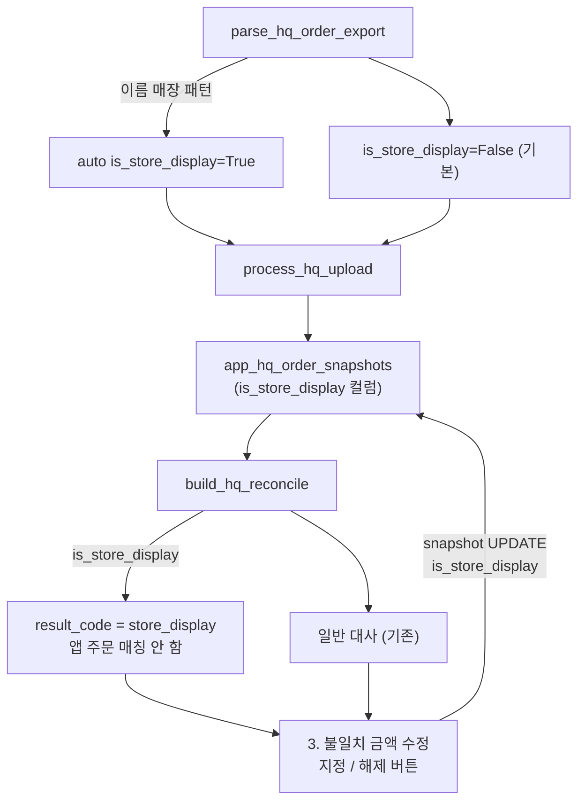

# 매장 전시 분류 + 3-탭 통합 UI

## 결정 사항

- 매장 전시 판별: **자동 (`XX점(법)`, `에몬스리빙XX(법)` 정규식) + 관리자 수동 재분류/해제**
- 재업로드해도 관리자가 지정한 분류가 유지되도록 스냅샷 컬럼에 저장
- 원가확정 / 전시판매 수동매칭 / 매장전시 지정·해제를 하나의 통합 메뉴에서 처리
- 탭 구조: **1. 새 파일 업로드 / 2. 원가 확인표 / 3. 불일치 금액 수정**
- 부가 설명 caption 최소화

## 데이터 흐름

## 파일별 변경

### [SUPABASE_APP_HQ_ORDER_UPLOADS.sql](SUPABASE_APP_HQ_ORDER_UPLOADS.sql)

- `app_hq_order_snapshots` 에 컬럼 추가:
  - `is_store_display BOOLEAN DEFAULT FALSE`
- 마이그레이션 스니펫 추가 (`ALTER TABLE app_hq_order_snapshots ADD COLUMN IF NOT EXISTS is_store_display BOOLEAN DEFAULT FALSE;`)
- 사용자에게 Supabase SQL 에디터에서 한 번 실행하도록 안내.

### [hq_order_reconcile_service.py](hq_order_reconcile_service.py)

- 상수 추가: `_STORE_DISPLAY_NAME_PATTERNS` 정규식 리스트
  - `re.compile(r".+점\s*\(법\)$")` (`울산삼산점(법)`, `울산학성점(법)`, 등)
  - `re.compile(r"^에몬스리빙.*\(법\)$")` (`에몬스리빙삼산(법)`)
  - `리빙(법)` 단독은 매칭에서 제외 (기존 전시판매 수동매칭 대상 유지)
- `_is_store_display(customer_name) -> bool` 헬퍼 추가
- `HQRow` 데이터클래스에 `is_store_display: bool = False` 추가
- `parse_hq_order_export`: 파싱 시 자동 감지 결과를 `is_store_display` 에 저장
- `process_hq_upload`:
  - 최초 INSERT payload 에 `is_store_display` 포함 (자동 감지값)
  - 이미 존재하는 스냅샷 UPDATE 시에는 `is_store_display` 를 **payload 에 넣지 않음** → 관리자 수동 지정값 보존
- `snapshots_to_hqrows`: 스냅샷의 `is_store_display` 를 `HQRow` 로 복사 (True 면 자동 감지 fallback 없이 True 유지). 스냅샷 컬럼이 없으면 이름 자동 감지로 fallback.
- `build_hq_reconcile`: 그룹 첫 row 의 `is_store_display=True` 면
  - 앱 주문 후보를 채우지 않음
  - `result_code="store_display"`, `result_label="매장 전시"`, `reason="매장 자체 전시분 (판매 아님)"`
  - `counts["store_display"]` 카운트
- `ReconcileRow`: `is_store_display: bool = False` 필드 추가
- `reconcile_to_dataframe`: 구분 열에 `"매장 전시"` 라벨 우선 표시. 나머지 컬럼 유지.
- `build_review_excel`: 시트 `"매장전시"` 추가.
- 신규 함수 `set_snapshot_store_display(client, db_filename, ship_number, order_date, value: bool) -> bool`
  - `(db_filename, ship_number, order_date)` 매칭해서 `is_store_display=value` UPDATE
  - True 로 하면 대사 재실행 시 매장 전시로 분류, False 로 하면 일반 대사 대상 복귀
- `__all__` 에 `set_snapshot_store_display` 추가

### [app.py](app.py) `_render_admin_hq_upload` (약 8302~ 재구성 이후 8580 근처)

`st.tabs(["🔎 저장된 대사 결과 조회", "📤 새 파일 업로드"])` 를
`st.tabs(["1. 새 파일 업로드", "2. 원가 확인표", "3. 불일치 금액 수정"])` 로 교체. 기본 활성 탭은 `2. 원가 확인표`.

각 탭 구현:

1. **1. 새 파일 업로드** — 기존 `_render_hq_new_upload` 재사용.
   - caption 최소화: 요약 1줄만.
   - 미리보기 표에서 컬럼도 최소한.
   - 저장 완료 후 `st.success("스냅샷 저장 완료.")` 만.
   - 저장 직후 대사표 요약(4개 카운터 + revised 상세)만 남기고 표는 표시하지 않음 (원가 확인표에서 봄).

2. **2. 원가 확인표** — 기존 `_render_hq_history_view` 를 얇게 유지.
   - 날짜 시작/종료 + 다시 조회 버튼 (기존과 동일).
   - 상단 카운터 카드 6개: 원가 일치 / 원가 불일치 / 원가 미입력 / 본사만 있음 / 전시판매 수동매칭 / **매장 전시**.
   - 결과 필터 라디오 7개: `전체, 원가 일치, 원가 불일치, 원가 미입력, 본사만 있음, 전시판매 수동매칭, 매장 전시`.
   - 검색창 유지.
   - 표 아래 caption / 확정 패널 호출 제거. 표만 보여줌.
   - 엑셀 다운로드는 유지.

3. **3. 불일치 금액 수정** — 신규 `_render_hq_edit_menu(db_filename, hq)`.
   - 2번 탭과 같은 날짜 범위(캐시 재사용) + 다시 조회 버튼.
   - 상단 라디오 5개 (수정 가능 상태만): `원가 불일치, 원가 미입력, 본사만 있음, 전시판매 수동매칭, 매장 전시`.
   - 선택된 상태의 행 목록 `selectbox` (라벨: `고객명 · 본사원가 · 전화 · 등록일`).
   - 선택 행 하나에 대해 상태별 액션 카드:
     - **원가 불일치 / 원가 미입력**: 기존 `_render_hq_cost_edit_panel` 로직을 인라인 이식 (일반원가/전시원가 확정 라디오 + 확정 버튼, 소액 보정 라디오 + 버튼). 성공 시 report row 갱신·`clear_data_cache()`·`st.rerun()`. **추가**: `"이 행을 매장 전시로 분류"` 버튼.
     - **본사만 있음**: `"이 행을 매장 전시로 분류"` 버튼 하나 (자동 hq_only → store_display).
     - **전시판매 수동매칭**: 기존 `_render_hq_display_manual_match` 로직 이식 (후보 앱 주문 selectbox + 매칭 버튼). **추가**: `"이 행을 매장 전시로 분류"` 버튼.
     - **매장 전시**: `"매장 전시 해제"` 버튼 하나 (재분류 취소 → False).
   - "매장 전시로 분류/해제" 클릭 시:
     - 대상 행의 `hq_ships` 첫 값 + `order_date` 로 `set_snapshot_store_display(...)` 호출.
     - 성공 시 report row `result_code/label/reason` 즉시 갱신, counts 재계산, `st.rerun()`.
   - 부가 caption 는 최소화.

- 기존 `_render_hq_cost_edit_panel` / `_render_hq_display_manual_match` 함수는 삭제하지 않고 남기되, 통합 메뉴에서만 호출하도록 `_render_hq_recon_table` 에서의 호출은 제거. 두 함수는 통합 메뉴 내부에서 상태별로 호출 가능.
- 실제로는 두 함수 자체를 그대로 재사용하되, "이 행을 매장 전시로 분류" 버튼은 통합 메뉴에서 추가로 표시.

### 부가 정리

- `_render_hq_recon_table` 은 표 + 카운터 + 필터/검색만 남기고 확정 패널 호출 제거.
- `st.caption(...)` 로 늘어진 문구 대부분 삭제. 남길 것은 각 탭 1줄 요약과 카운터 옆 표시 정도.

## Todos

- [ ] SQL 파일에 `is_store_display` 마이그레이션 추가 (사용자 실행 안내)
- [ ] 서비스: 자동 감지·`HQRow`/`ReconcileRow`·process/`snapshots_to_hqrows`/`build_hq_reconcile`/`reconcile_to_dataframe` 반영 + `set_snapshot_store_display` 신규
- [ ] app.py: 탭 구조 3개로 재편성 (1/2/3), caption 최소화
- [ ] app.py: 2. 원가 확인표에서 확정 패널 호출 제거, 매장 전시 카운터/필터 추가
- [ ] app.py: 3. 불일치 금액 수정 신규 함수 `_render_hq_edit_menu` (상태별 액션 + 매장 전시 지정/해제)
- [ ] 문법·린트 확인 → 커밋/푸시 (Korean conventional commit)