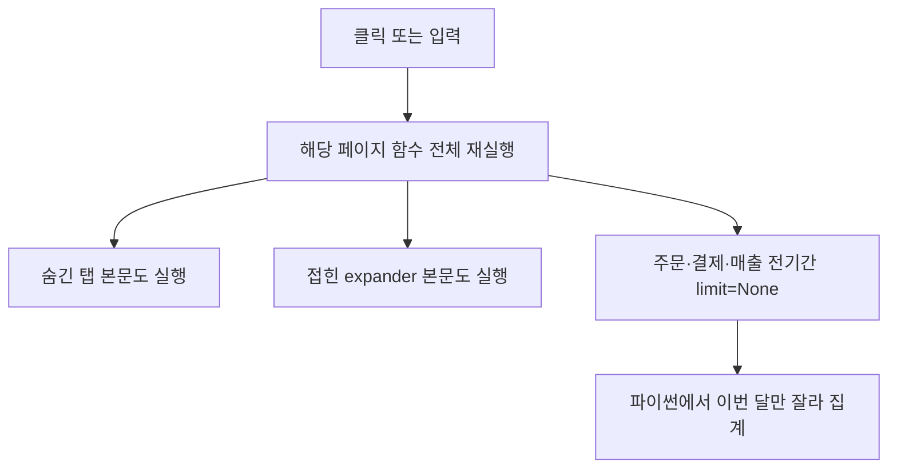

# 매출등록·결제변경·대시보드 속도

구조(Streamlit 단일 앱, Supabase)는 바꾸지 않습니다. 호스팅 이전이나 화면 재작성은 하지 않습니다. 숫자·저장 규칙·1/n 배분은 그대로 두고, **언제 조회하고 어디까지 다시 그리는지**만 바꿉니다.

이미 있는 것: 대시보드 월별 직원 평가 [`_render_kpi_section`](app.py)은 fragment, 결제변경 입력 [`_render_payment_change_verify_entry`](app.py)도 fragment, 주문/결제/매출 로더는 TTL 캐시. 느린 이유는 캐시가 있어도 **첫 로드와 저장 직후가 전기간**이고, fragment 밖 위젯은 페이지 전체를 다시 돌리기 때문입니다.

## 1. 클릭이 화면 전체를 다시 돌리지 않게

- 매출등록 [`render_new_sales`](app.py): 전화번호 `on_change`, 담당자 multiselect, 금액 입력은 `@st.fragment` 안으로 옮깁니다. 지금 전화 한 글자마다 페이지 전체(직원 명부, 특수등록, 잔금 검색)가 다시 실행됩니다. 저장 성공만 `st.rerun(scope="app")`.
- 결제변경: 폼 자체는 이미 fragment입니다. 부모 [`render_customer_balance`](app.py)의 탭 5개와 주문 expander가 문제입니다. Streamlit `st.tabs`/`st.expander`는 접혀 있어도 본문을 실행합니다. 사내업무 간트와 같이, 연 탭·연 주문만 본문을 실행합니다. 결제변경 폼은 그 주문을 연 뒤에만 호출합니다.
- 대시보드 [`render_dashboard`](app.py): 1번 KPI는 바로 그리고, 일별 차트·미수금·직원 일일·기간 통계·전시 검증·To-Do는 각 fragment로 격리합니다. 날짜·필터 변경이 1번 KPI와 전기간 로드를 다시 트리거하지 않게 합니다. 슈퍼관리자 [`_superadmin_tab1_integrated_dashboard`](app.py)도 같은 패턴입니다.

## 2. 한 화면에 Supabase를 여러 번 치지 않기

- 고객 잔금/결제변경: 주문마다 결제를 따로 읽지 않고, 그 고객 주문 id를 모아 `order_id IN (...)` 한 번으로 결제 목록을 가져옵니다. 이미 있는 [`_load_payments_by_order_ids_supabase`](app.py)를 재사용합니다.
- 매출등록 직원 목록: 사용자마다 `_get_supabase_user_store_ids`를 돌리지 않고, 이미 캐시된 매장 배정 명부 [`get_store_assigned_employee_names`](app.py)만 씁니다. 아래쪽 37465행이 이미 그 목록을 다시 읽고 있습니다.
- 대시보드 1번 KPI에 필요한 당일·당월 합계는 전기간 DataFrame을 받은 뒤 자르지 않습니다. 로더에 이미 있는 `start_date`/`end_date`로 **이번 달(차트 비교가 필요하면 최근 13개월)** 만 받습니다. 합계 공식이 같아서 화면 숫자는 유지됩니다.

## 3. 기본 조회 범위를 이번 달·이 매장으로

- [`render_dashboard`](app.py) 43569행과 슈퍼관리자 17806행의 `load_orders_cached` / `load_payments_cached` / `load_sales_cached(..., limit=None)` 가 전기간입니다. 대시보드 기본은 이번 달입니다. 일별 월비교 차트만 최근 13개월을 별도 캐시로 열고, 그 섹션을 연 뒤에만 로드합니다.
- 과거 기간 통계(5번)는 시작·종료일을 바꾼 뒤에만 그 구간을 조회합니다. 지금은 전기간을 메모리에 올려 두고 날짜로 자릅니다.
- 매출 저장 후 [`clear_data_cache`](app.py)는 매장·직원·고객 캐시까지 지웁니다. 매출 등록·결제 수정·결제변경 저장은 해당 매장의 주문·결제·매출 캐시만 지웁니다. 직원 명부·매장 목록은 유지합니다.

## 4. 위 세 가지 밖의 추가 수단

- 접힌 칸 본문 생략: 매출등록의 「특수 등록」「기존 주문 잔금 빠른 등록」은 expander라 접혀 있어도 검색·폼이 실행됩니다. 열기 버튼 뒤에만 렌더합니다.
- 결제변경 예정 탭(5번)은 그 탭을 연 뒤에만 [`_pcr_load_planned_orders`](app.py)를 호출합니다. 고객 검색 한 글자에도 지금 같이 돕니다.
- 대시보드에서 캐시에 이미 있는 DataFrame을 섹션마다 `.copy()` 하고 날짜를 다시 파싱하지 않습니다. 이번 달 슬라이스를 한 번만 만들어 1·2·3번에 넘깁니다.
- 매출등록 금액 칸의 `on_change` 콤마 포맷은 fragment 안에서만 돌게 해서, 포맷 한 번에 고객 검색 패널과 직원 조회가 다시 실행되지 않게 합니다.

검증: 매출 한 건 등록, 결제변경 요청 한 건, 대시보드 당월 합계·직원 1/n이 수정 전과 같은지 확인합니다. 바뀌는 것은 대기 시간입니다. 첫 진입(이번 달만)과 필터 변경(그 칸만)을 기준으로 봅니다.
