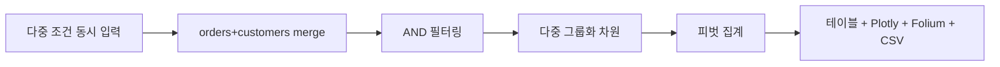

# 매출 다면 분석 섹션 (마케팅 인사이트 통합)

## 변경된 핵심 결정 (사용자 피드백 반영)

- 별도 메뉴 만들지 않음. 기존 「2. 마케팅 인사이트」 메뉴 맨 하단에 「다면 분석」 섹션으로 추가
- 한 번에 여러 조건을 동시 적용 (현재처럼 1조건/1결과가 아닌 N조건/1피벗)
- 그룹화 차원도 다중 선택 (예: 품목 × 건물유형 × 지역 동시 분해)
- 사용자 예시 시나리오: "6월 한 달간 울산 남구 문수로의 아파트에 판매한 제품별 수량/매출"

## 사용자 예시 매핑

### 시나리오 A — 지역 단계별로 좁히기

| 조건 | 입력 위치 |
|---|---|
| 6월 한 달 | 기간 date_input (시작/종료) |
| 울산 남구 | 시군구 multiselect |
| 문수로 | 도로명 multiselect (cascading) |
| 아파트 | 건물유형 multiselect (아파트/오피스텔/주택/상가) |
| 제품별 수량/매출 | 그룹화 차원에 "품목" + 측정값에 "건수/매출액" |

### 시나리오 B — 아파트명만으로 바로 검색 (지역 필터 비움)

| 조건 | 입력 위치 |
|---|---|
| 6월 한 달 | 기간 date_input |
| 시군구/법정동/도로명 | 모두 빈 상태 (전체 포함) |
| "○○아파트" | 건물명 검색 text_input (부분 일치, 대소문자/공백 무시) |
| 제품별 수량/매출 | 그룹 차원 = "품목", 측정값 = "건수/매출액" |

→ 결과: 해당 아파트명에 매칭되는 모든 고객의 6월 매출이 제품별로 집계되어 표·차트로 표시.

## 데이터 흐름

## 작업

### 1. DB 스키마 확장 (신규 파일)

`SUPABASE_APP_CUSTOMERS_REGION.sql`:

- `ALTER TABLE app_customers ADD COLUMN IF NOT EXISTS sigungu       TEXT;`
- `ALTER TABLE app_customers ADD COLUMN IF NOT EXISTS bname         TEXT;`
- `ALTER TABLE app_customers ADD COLUMN IF NOT EXISTS road_name     TEXT;`
- `ALTER TABLE app_customers ADD COLUMN IF NOT EXISTS building_name TEXT;`
- `sigungu`/`bname`/`road_name` 인덱스

건물유형은 `building_name`에서 정규식 분류(아파트/오피스텔/주택/상가/기타)로 derived 처리 (별도 컬럼 없음).

### 2. 카카오 지오코딩 응답 확장

`app.py:5564` `geocode_address_kakao_extended()`:

- 추가 반환: `sigungu`(region_2depth_name), `road_name`(road_address.road_name), `building_name`(road_address.building_name)
- 기존 `bname`(region_3depth_name)은 키 이름 통일

### 3. 등록 시 자동 저장

`app.py:2398` `_supabase_insert_customer()` payload에 `sigungu`/`bname`/`road_name`/`building_name` 포함.

### 4. 백필 스크립트 (신규)

`scripts/backfill_customer_region.py`:

- `sigungu IS NULL`인 고객 row 단위 카카오 지오코딩
- UPDATE: `sigungu`/`bname`/`road_name`/`building_name`/(lat·lon 누락 시)
- rate-limit 0.5초/req, 재시도 3회, 실패 로그

### 5. 마케팅 인사이트 함수에 「다면 분석」 섹션 추가

위치:
- `app.py:6496` `render_marketing_insights_tenant()` 맨 하단
- `app.py:6610` `render_marketing_insights_superadmin()` 맨 하단

UI 구성:

(a) 다중 조건 필터 (`st.expander("🔬 다면 분석 — 조건 자유 조합", expanded=True)` 안에 배치)

| 필터 | 위젯 | 비고 |
|---|---|---|
| 기간 | date_input 시작/종료 | 기본 최근 30일 |
| 매장 | multiselect | Superadmin만 노출 |
| 시군구 | multiselect | 데이터 distinct |
| 법정동(bname) | multiselect | 시군구 종속 cascading |
| 도로명 | multiselect | 법정동 종속 |
| **건물명/아파트명** | **text_input (부분 일치)** | **building_name ILIKE %입력값% — 단독 검색 가능** |
| 건물유형 | multiselect | building_name regex 분류 (아파트/오피스텔/주택/상가/기타) |
| 품목 카테고리 | multiselect | CATEGORY_OPTIONS |
| 방문 이유 | multiselect | VISIT_REASON_OPTIONS |
| 구매 이유 | multiselect | PURCHASE_REASON_OPTIONS |
| 담당 직원 | multiselect | 매장 직원 명단 |

모든 필터는 AND로 동시 적용. 미선택 시 해당 차원은 전체 포함.
- **건물명 검색**: 공백·대소문자 무시 + 부분 일치. 시군구/법정동/도로명 미입력 시에도 단독 동작 (전 매장의 동명 아파트 일괄 조회 가능).
- **건물유형**: building_name에 "아파트|APT" 등 키워드 매칭으로 동적 분류. 컬럼 추가 없이 derived.

(b) 그룹화 차원 (다중 선택)

- `st.multiselect("그룹화 차원 (최대 3개)", ["시간(월)", "시간(주)", "시간(일)", "매장", "시군구", "법정동", "도로명", "건물유형", "품목", "방문이유", "구매이유", "담당직원"])`
- 최대 3차원까지 동시 그룹

(c) 측정값 (다중 선택)

- 매출액 합계 (`total_amount` sum)
- 주문 건수 (`count`)
- 평균 매출액 (mean)
- 마진 합계 (`actual_margin` sum)
- 마진율 평균

(d) 시각화 출력 (탭으로 분리)

- 📊 피벗 테이블: `pandas.pivot_table` → `st.dataframe` (정렬·다운로드)
- 📈 차트: Plotly grouped bar (그룹 1차원=X, 2차원=color) / heatmap (2차원 매트릭스) / treemap (3차원 계층)
- 🗺️ 지도: Folium MarkerCluster (필터된 고객 lat/lon)
- 📥 다운로드: CSV/Excel 버튼

### 6. 캐싱

- `@st.cache_data(ttl=300, show_spinner=False)`로 매장별 orders+customers merge 결과 캐시
- 필터링/그룹화는 in-memory (pandas)

## 영향도 / 위험

- 컬럼 추가는 `IF NOT EXISTS` 무중단
- `_supabase_insert_customer` 수정은 신규 INSERT에만 영향, 기존은 백필
- 카카오 무료 일일 30만 호출 한도 내 안전
- 메뉴 라우팅 변경 없음 (기존 인사이트 메뉴 내부 확장)

## 산출 파일

- 신규: `SUPABASE_APP_CUSTOMERS_REGION.sql`
- 신규: `scripts/backfill_customer_region.py`
- 수정: `app.py`
  - `geocode_address_kakao_extended()` (5564~)
  - `_supabase_insert_customer()` (2398~)
  - `render_marketing_insights_tenant()` (6496~) — 맨 하단 다면 분석 섹션 추가
  - `render_marketing_insights_superadmin()` (6610~) — 동일 섹션 추가

## 메뉴 내 사용자 가이드 (caption)

- 위쪽 고정 차트는 핵심 인사이트(요약), 아래 「다면 분석」은 자유 조건 조합 도구
- 기간·지역·건물유형·품목·이유·직원을 동시에 좁히고, 그룹화 차원을 3개까지 선택해 매트릭스로 분해
- 데이터 기준: 주문 등록일(order_date), 매장 단위는 자기 매장 (Superadmin은 매장 multiselect)

## Phase 2 (본 plan 범위 외)

- 매장 교차 Heatmap
- 직원 KPI 연동 (employee_efficiency 메뉴)
- 지역 클러스터링(K-means)
- 매출 예측(시계열 모델)
