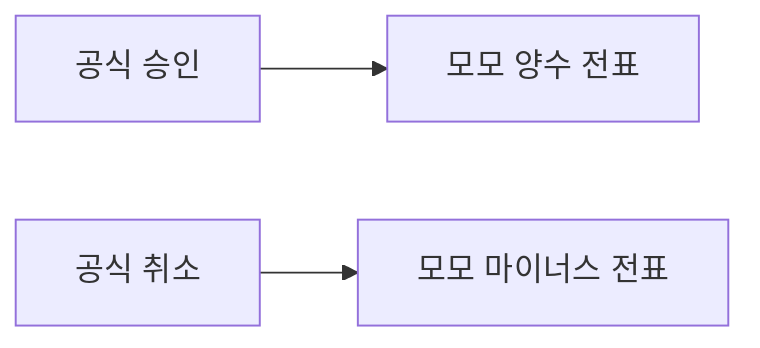

# 메인페이 결제·취소 쌍 매칭

업로드가 안 붙는 이유는 양식 컬럼보다 매칭 키가 금액뿐이기 때문이다. [`_ext_pay_match_mainpay`](app.py)는 절대금액과 가까운 날짜만 보고, 모모에 저장된 승인번호(`card_company`, 8자리)는 비교하지 않는다. 주문에 마이너스 전표가 하나라도 있으면 결제 행은 `erp_canceled_official_paid`(모모 취소·메인페이 결제)가 되고, 취소 행은 가까운 양수 전표에 `공식 취소 · ERP도 취소 흔적`으로 붙는다. 자동 생성된 마이너스 전표는 남는다.

온누리와 같이, 같은 승인번호의 결제완료는 양수 전표, 결제취소는 마이너스 전표에 각각 `matched_ok`로 붙인다. 날짜가 하루 달라도 승인번호가 같으면 짝을 맺는다. 메인페이를 취소하고 온누리로 바꾼 건이 이 경우다.

## 파서

[`_ext_pay_parse_mainpay_file`](app.py)와 [`_MAINPAY_HEADER_ALIASES`](app.py)를 이 양식이 들어오게 고친다.

- 상태 별칭에 `거래구분`, `매출구분`, `승인구분`을 넣는다. 지금은 `거래상태`만 봐서, 금액이 양수이고 구분이 `취소`인 행을 결제 행으로 읽는다.
- 날짜가 `YYYYMMDD`여도 `YYYY-MM-DD`로 읽는다. 지금 파서는 구분자 없는 8자리를 버리고 그 행을 통째로 건너뛴다.
- 승인번호는 숫자만 남겨 8자리로 맞춘다. 엑셀이 앞자리 0을 지워도 모모 입력(8자리)과 같게 맞춘다. 울산페이용 `_ext_pay_norm_approval6`은 쓰지 않는다. 8자리를 넣으면 끝 6자리만 남아 다른 승인번호가 된다.
- 금액이 음수이거나 상태에 `취소`가 있으면 취소 행으로 표시한다. 금액 부호는 원문 그대로 저장한다.

## 매칭

[`_ext_pay_match_mainpay`](app.py)에서 양수·음수 전표를 같은 금액 바구니에 넣지 않는다.

- 모모 승인번호는 `card_company`의 숫자 8자리다. 공식 행 `approval_code`와 절대금액이 같고, 부호가 맞는 전표만 후보로 둔다.
- 같은 승인번호·같은 절대금액에 공식 결제 1건, 공식 취소 1건, 모모 양수 1건, 모모 음수 1건이고 두 전표의 주문이 같으면 둘 다 `matched_ok`로 잠근다. 메모는 `공식 결제 · ERP 결제 (승인번호 쌍)`, `공식 취소 · ERP 상계 (승인번호 쌍)`.
- 남은 결제 행은 양수 전표만, 남은 취소 행은 음수 전표만 찾는다. 후보가 하나일 때만 확정한다.
- 취소 행에 대응하는 음수 전표가 없으면 `official_canceled`로 두고 합계에서 뺀다. 기존 `_ext_pay_cancel_without_momo` 규칙을 유지한다.
- 승인번호가 없는 행만 지금처럼 금액·날짜로 보고, 후보가 여럿이면 억지로 붙이지 않는다.

재연결 [`_ext_pay_relink_amount_and_near_date`](app.py)의 mainpay 분기도 `approval_code`가 아니라 `card_company`를 비교하고, 취소 행은 음수 전표만 고른다.

## 재매칭

`matched_ok`는 재매칭 때 유지된다. 메인페이 재매칭 시작 시 온누리와 같이 잠긴 쌍을 푼다.

- 취소 행이 양수 전표에 붙은 `matched_ok`를 지운다.
- 같은 승인번호·절대금액의 취소 행이 있는 결제 행의 `erp_canceled_official_paid`를 지운다.

그다음 매칭을 다시 돌리면 화면을 열거나 재검증을 누를 때 기존 건도 양수·음수에 다시 붙는다.
