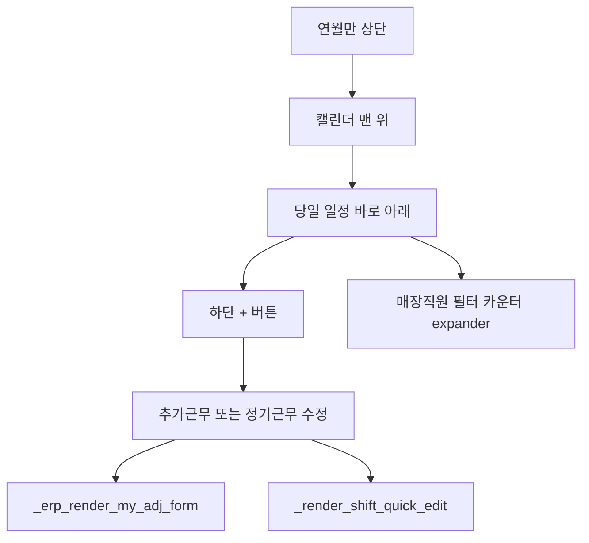

# 모바일 월별 근무 캘린더 + 버튼

## 문제

[`_erp_tab_calendar`](app.py) (`app.py` 약 18656행)는 칸마다 전 직원 배지·시간·메모를 HTML로 모두 그린다. 지금은 연·월·매장·직원 필터, 월 카운터, expander(정기 근무시간 수정 / 추가근무·휴가신청 / 엑셀)가 캘린더보다 위에 있어서, 모바일에서 당일 일정을 보려면 한참 내려가야 한다. 칸도 세로로 길어 보기 어렵고, 수정도 expander를 열어야 해서 손이 많이 간다.

기존 저장 로직은 이미 있다.

- 추가/휴가: [`_erp_render_my_adj_form`](app.py) — 날짜 기본값은 `today` (`my_new_date`)
- 정기근무 수정: `erp_shift_edit_id` → [`_render_shift_quick_edit`](app.py)

요청대로 **새 입력 폼을 만들지 않고** 이 팝업을 재사용한다.

## 범위

- 손대는 곳: [`app.py`](app.py)의 `_erp_tab_calendar`, `_inject_mobile_css`, `_erp_render_my_adj_form`의 날짜 기본값만
- 데스크톱 그리드(전 직원 배지)와 expander 기능은 유지하되, expander는 캘린더·당일 리스트 아래로 내린다
- 신규매출·결제·리드 페이지는 건드리지 않음

## 동작

0. **레이아웃: 캘린더를 맨 위**  
   `_erp_tab_calendar` 렌더 순서를 바꾼다. 제목 다음 연·월만 두고 바로 캘린더 + 당일 리스트. 매장·직원 필터, 월 카운터, 기존 expander, 엑셀은 그 아래로. 진입하면 스크롤 없이 오늘 칸과 오늘 일정이 보인다. 기본 선택일은 오늘(해당 월이 아니면 1일).

1. **모바일 그리드 축소**  
   칸 HTML에 상세 배지(`erp-cal-detail`)와 요약(`erp-cal-dot`, 건수)을 같이 넣고, [`_inject_mobile_css`](app.py) `@media (max-width: 768px)`에서 상세만 숨긴다. PC 칸은 지금처럼 배지 전체 표시.

2. **당일 리스트에서 바로 수정**  
   HTML 칸 클릭은 Streamlit에서 받기 어렵다. `erp_cal_selected_day`를 캘린더 바로 아래에 두고, 그 날의 shift / 근태 / 이벤트를 리스트로 보여 준다. 본인 정기근무 행에는 수정 버튼을 두어 기존 `_render_shift_quick_edit`를 연다. 추가/휴가는 하단 `+` 또는 리스트 옆 추가로 기존 `_erp_render_my_adj_form`을 연다. 날짜는 선택일.

3. **하단 +**  
   모바일에서만 고정 `+` 버튼(CSS `position: fixed`). 누르면 선택지 다이얼로그:
   - 추가근무·휴가신청 → 기존 `_adj_dialog` / `_erp_render_my_adj_form`. 날짜는 `erp_cal_selected_day`로 채움 (`st.session_state["my_new_date"]`).
   - 정기 근무시간 수정 → 그날 본인 shift가 1건이면 `erp_shift_edit_id`로 기존 수정 팝업. 여러 건이면 그날만 고르는 select 후 같은 팝업.

4. **데스크톱**  
   캘린더·당일 리스트를 위로 올리는 순서는 PC에도 적용한다. 칸 배지와 expander 기능은 유지한다. `+`는 768px 이하에서만 보이게 한다.

## 구현 순서

1. `_erp_tab_calendar`에서 캘린더 HTML·당일 리스트를 연·월 바로 아래로 이동. 카운터·expander·엑셀은 그 다음
2. 칸 HTML에 요약/상세 클래스 분리 + 모바일 CSS
3. 기본 선택일 = 오늘. 당일 리스트에서 본인 일정 수정 / `+`로 추가
4. `_erp_render_my_adj_form`은 `today` 대신 session의 선택일을 기본값으로만 사용. 저장 로직은 변경하지 않음

## 확인

- 모바일 진입 시 필터·expander를 내리지 않아도 캘린더와 오늘 일정이 바로 보이는지
- 당일 리스트 또는 `+`로 신청·수정이 열리는지
- 칸에 점/건수만 보이는지 (모바일)
- PC: 캘린더는 위, 칸 배지·expander 기능은 유지
- 신청 저장 후 캘린더 fragment가 그 날을 반영하는지
- 로그인/탭이 리셋되지 않는지 (기존처럼 fragment `st.rerun(scope="fragment")` 유지)
