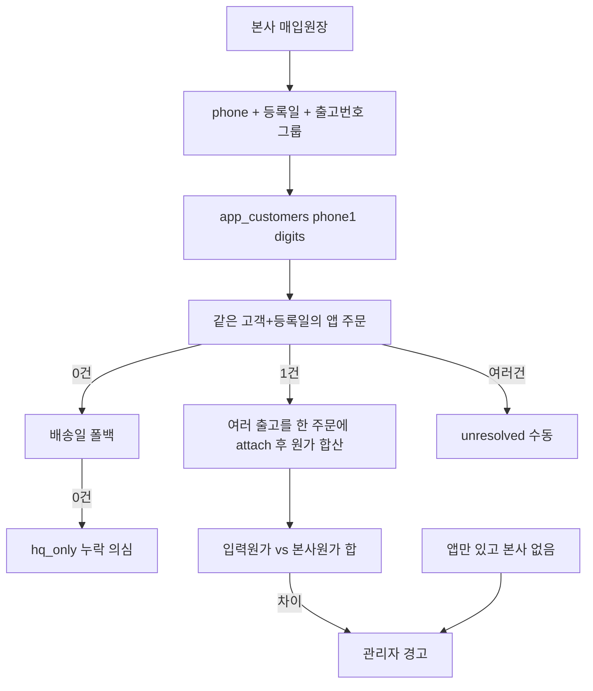
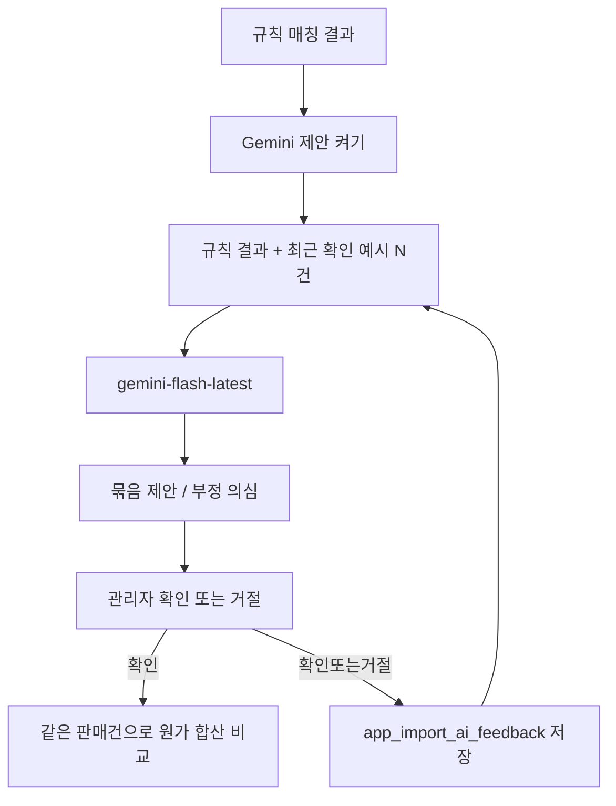

# 배송일 기준 원가 대사·부정 탐지

기존 플랜: [과거_데이터_통합_임포트_확장_67139003.plan.md](c:\Users\billy\.cursor\plans\과거_데이터_통합_임포트_확장_67139003.plan.md)

소스: **에몬스 본사 매입원장** (현재 [legacy_purchase_import_service.py](c:\Users\billy\OneDrive\바탕 화면\바탕화면 모음\emons-web-sales\legacy_purchase_import_service.py)와 동일 파일). 별도 물류 원장은 쓰지 않는다.

## 현재 구현과의 갭

이미 있는 것:
- 매입원장 임포트, 라인 저장(`app_order_items`), 채널톡 phone 이관
- 판매자 등록 주문은 `delivery_date` 필수, 원가는 `app_orders.cost_price` + `display_cost_amount`
- 헤더↔라인 정합성 리포트([app.py](c:\Users\billy\OneDrive\바탕 화면\바탕화면 모음\emons-web-sales\app.py) `_build_header_line_discrepancy_df`) — **자동 알림 없음**
- 관리자 알림: `_insert_fraud_alert_to_admins` / `_insert_admin_alert`

빠진 것 (이번 추가):
- 후보 매칭이 **`(customer_id, order_date)`만** 사용. 등록일 미스일 때만 배송일 폴백
- `to_attach`는 라인만 붙이고 **헤더 원가·판매가를 절대 안 바꿈** — 차이는 계산만 하고 경고
- 미리보기 표가 `to_attach`에도 **판매가(역산)** 을 보여 줌 → 입력 판매가가 있으면 숨겨야 함
- 분할 배송(출고번호·배송일만 다름)을 한 주문으로 **합산 비교**하는 규칙 없음
- 본사에만 / 앱에만 있는 배송 완료 건 탐지 없음

## 시나리오 4 (플랜에 추가할 본문)

대상: `import_source IS NULL`(판매자 직접 입력) 이고 `delivery_date`가 오늘 이전인 주문.

### 어디서 보는가 (관리자 창)

구현 후 보는 위치는 아래 세 곳. 일반 직원 매출 등록 화면에는 넣지 않는다.

- **고객 및 잔금 관리 → 1. 일반 고객 → 「매입 원장 통합 임포트」 expander**  
  임포트 미리보기·확정 직후 원가 대사 표(입력원가/본사원가/차이). 매장 관리자·최고 관리자가 파일을 올리는 창.
- **사이드바 벨 알림 (매장 관리자·최고 관리자)**  
  임계 초과 시 `_insert_fraud_alert_to_admins` (`notif_type=admin_alert`). 로그인 배너 + 벨 목록.
- **마케팅 인사이트 → 「배송일 원가 대사」 expander** (매장 인사이트 + 최고관리자 인사이트)  
  기간=배송일로 재조회. 기존 「헤더 ↔ 라인 정합성」 옆에 둔다. 관리자 설정 허브에는 넣지 않음.
- **고객 검색 → 해당 주문 상세 원가 패널**  
  그 주문 한 건의 입력원가/본사원가/차이.

### 추정 판매가 — 입력 판매가가 있으면 숨김 (현재 미반영 → 반드시 반영)

검증 결과: **지금 코드·기존 플랜은 이 요구를 충족하지 않는다.**

- [legacy_purchase_import_service.py](c:\Users\billy\OneDrive\바탕 화면\바탕화면 모음\emons-web-sales\legacy_purchase_import_service.py) `preview_to_dataframe` 이 모든 행에 `판매가(역산)` 을 넣음 (`compute_sale_price`, 마진 20%)
- `to_attach` 커밋은 헤더 `total_amount`를 안 바꾸지만, **화면에는 역산 판매가가 그대로 보임**

규칙:
- 앱에 `total_amount`가 이미 있으면 미리보기·대사 표·알림에 **판매가(역산) 컬럼을 넣지 않음**. 대신 **입력판매가**만 표시
- 본사원가와 비교하는 숫자는 원가만. `sale_mismatch`는 본사 파일에 실제 판매가(`line_total` 등)가 있을 때만. 역산값과 비교하지 않음
- `to_create`(앱에 판매가 없음)만 역산 판매가 허용 (신규 완납 저장용, 기존과 동일)

### 매칭 키 (등록일 우선, 배송일은 폴백)

배송일만으로 붙이면 한 주문의 분할 배송이 쪼개진다. [legacy_purchase_import_service.py](c:\Users\billy\OneDrive\바탕 화면\바탕화면 모음\emons-web-sales\legacy_purchase_import_service.py) `build_preview`:

1. 출고번호가 이미 있으면 skip
2. `(customer_id, 등록일=order_date)` 후보 1건 → `to_attach` (배송일이 달라도 이 주문에 붙임)
3. 0건이면 `(customer_id, delivery_date)` 정확 일치
4. 그래도 0건이면 배송완료 주문 중 **|배송일 차이| ≤ 2일** 최근접 1건, 2건 이상이면 `unresolved`
5. 그래도 0건 → `hq_only`

### 분할 배송·분할 주문 합산

본사 파일 그룹핑은 유지: `(전화, 등록일, 출고번호)`. 출고가 두 번이면 그룹 2개.

**케이스 A — 한 판매 주문, 배송만 나뉨** (소파 8/2 + 식탁 8/30, 앱 주문 1건)

- 등록일이 같으면 그룹 2개가 **같은 앱 주문에 모두 attach**
- **본사원가 = 두 그룹 `line_cost` 합**. 입력원가(헤더 1개)와 **한 번만** 비교
- 배송일이 달라도 주문을 쪼개지 않음. 대사 표에 배송일을 `2026-08-02 / 2026-08-30` 으로 병기

**케이스 B — 앱에 주문이 이미 2건** (붙박이 실측 1 + 시공 1)

- 앱 주문 단위로 각각 매칭·비교. **두 주문의 원가를 합치지 않음**
- 본사도 등록일/출고가 2개면 각각 대응. 한쪽만 맞으면 다른 쪽은 `본사만`/`앱만`

**케이스 C — 등록일도 출고번호도 다른데 판매자는 한 주문으로 입력**

- 등록일 매칭이 0건이면 배송일 폴백으로 같은 주문에 붙일 수 있음
- 그래도 안 붙으면 `unresolved` (수동으로 같은 주문 지정) → 지정 후 본사원가 합산

합산 비교는 **앱 `order_id` 단위**. 계약 단위로 실측+시공 두 주문을 자동 합산하지 않음.

### 원가 임포트 규칙 (헤더 덮어쓰지 않음)

- `to_attach`: 지금과 같이 `app_order_items`만 INSERT. `cost_price` / `total_amount` / 결제는 유지 (증거 보존)
- 비교용으로 커밋 결과에 `seller_cost = cost_price + display_cost_amount`, `hq_cost = sum(line_cost)` 를 남김
- 고객/주문 상세의 기존 라인 아이템·원가 검증 패널이 본사 원가를 보여 줌

### 차이·누락·부정 탐지

커밋 후(또는 미리보기) 분류. 임계값 기본: **|원가차이| ≥ 10,000원 또는 상대 5%** (미리보기에서 조정 가능).

- `cost_mismatch`: 양쪽 매칭됐는데 판매자 원가 ≠ 본사 원가 → 입력 실수 또는 원가 조작
- `sale_mismatch`: 입력판매가(`total_amount`)와 본사 파일의 **실제 판매가 컬럼** 합이 임계 초과일 때만. 역산 판매가와는 비교하지 않음
- `hq_only`: 본사 배송 그룹에 대응 앱 주문 없음 → 매출 누락
- `app_only`: 기간 내 직접등록·배송완료인데 본사 그룹에 전화+배송일 없음 → 허위 입력 또는 본사 미반영
- `delivery_gap`: ±1~2일로 붙인 건 — 경고 수준 info

헤더 원가 0이고 본사 원가만 있으면 `cost_mismatch`가 아니라 **원가 미입력**으로 별도 표시 (부정과 구분).

### 원가 차이 표기 (판매자 입력 vs 본사 파일)

헤더 `cost_price`는 바꾸지 않는다. 두 숫자를 **나란히** 두고 차이만 표시한다.

- **입력원가** = 판매자가 넣은 `cost_price + display_cost_amount` (앱 주문 헤더, 그대로 유지)
- **본사원가** = 임포트 파일 라인 `sum(line_cost)` (주문에 붙은 `app_order_items`)
- **원가차이** = 입력원가 − 본사원가 (음수면 판매자가 본사보다 낮게 입력)

**1) 매입 임포트 미리보기·확정 결과 표** (주 화면)

컬럼: 고객명 / 전화 / 배송일 / 담당 / 입력원가 / 본사원가 / 원가차이 / 결과

결과 라벨·행 색:

- `원가 일치` — |차이|가 임계 미만. 일반 행
- `원가 불일치` — |차이| ≥ 1만원 또는 5%. **빨간 행**. 예: 입력 450,000 / 본사 500,000 / 차이 −50,000
- `원가 미입력` — 입력원가 0, 본사원가 > 0. **노란 행** (부정과 구분)
- `본사만 있음` — 앱 주문 없음. 입력원가 공란
- `앱만 있음` — 본사 파일 없음. 본사원가 공란

상단 배지: `원가 불일치 N건 · 원가 미입력 N건 · 본사만 N건 · 앱만 N건`

**2) 관리자 알림** (`_insert_fraud_alert_to_admins`, warning)

문구 예: `주문 #756 유민종 김진근 — 입력원가 450,000원 vs 본사원가 500,000원 (차이 -50,000원, -10%) · 배송 2026-08-02`

원가 미입력은 warning, 불일치(임계 초과)는 warning, |차이|≥20% 또는 5만원 이상은 critical.

**3) 주문 상세 원가 패널**

기존 `_render_order_cost_verify` 아래에 한 줄 추가. 입력원가 / 본사원가 / 차이를 숫자로 보여주고, 불일치면 빨간 caption. 판매자 헤더 숫자는 수정하지 않음.

**4) 관리자 「배송일 원가 대사」 리포트**

기간=배송일. 위와 같은 표로 재조회. 자동 보정 버튼 없음.

### 관리자 경고 채널

신규 `alert_type`: `import_cost_mismatch` / `import_cost_blank` / `import_hq_only` / `import_app_only` / `import_sale_mismatch`

자동으로 판매자 원가·매출을 고치지 않는다.

## 시나리오 5: Gemini로 분할 주문 합산 제안 + 부정 의심 (관리자 확인 후 학습)

가능함. **모델 파인튜닝은 하지 않는다.** `gemini-flash-latest`는 이 프로젝트에서 REST `generateContent`만 쓰고 있고([product_taxonomy_service.py](c:\Users\billy\OneDrive\바탕 화면\바탕화면 모음\emons-web-sales\product_taxonomy_service.py) `classify_with_gemini`, secrets `[gemini] api_key`), 커스텀 학습 API가 없다.

학습은 **관리자가 확인/거절한 묶음을 DB에 쌓고, 다음 호출 프롬프트에 few-shot으로 넣는 방식**이다. 붙박이 실측+시공처럼 반복되는 패턴은 예시가 늘수록 같은 실수를 덜 한다.

적용 모드: **제안만. 관리자가 확인한 묶음만 합산.** 자동 합산 없음. 부정 의심도 확정이 아니라 검토 큐.

### 호출

- 키: 기존 `st.secrets["gemini"]["api_key"]` / `GEMINI_API_KEY`. 없으면 버튼 비활성
- 모델: `gemini-flash-latest` (품목 분류와 동일 엔드포인트)
- 대상: 규칙으로 `unresolved` / `hq_only` / `app_only` / `cost_mismatch` 인 건 + 같은 전화의 근접 주문(등록일·배송일 ±30일, 품목명)
- 출력 JSON만: `merges[{order_ids, hq_keys, reason, confidence}]`, `fraud_flags[{order_id, type, reason, confidence}]`
- 임포트 미리보기에 **「Gemini 분할·이상 제안」** 버튼 (품목 분류 버튼과 같은 UX)

### 합산 제안 예 (붙박이)

같은 고객, 품목에 실측/시공/붙박이, 등록일이 가깝고 판매가+원가를 더하면 본사 한 건과 맞으면 `merges`로 제안. 관리자가 확인하면 그 `order_id`들을 **가상 한 건**으로 입력원가·입력판매가·본사원가를 합쳐 한 줄 비교. 헤더 두 건을 한 row로 합치지는 않음 (주문 삭제/병합 DDL 없음).

### 부정 의심 (찾아가는 방법)

규칙은 1차, Gemini는 2차 설명.

규칙 1차 (항상):
- 입력원가 ≪ 본사원가 (임계 초과)
- 앱만 있음 (본사 출고 없음)
- 본사만 있음 (매출 누락)
- 같은 전화에 소액 주문이 과도하게 많음

Gemini 2차 (제안 문구만):
- 실측/시공을 쪼개 마진을 가린 것으로 보임
- 입력원가만 비정상적으로 낮음
- 본사 없는 배송완료 + 담당자 편중

알림은 `import_ai_review`. **유죄 확정 아님.** 관리자 거절 시 같은 패턴을 거절 예시로 넣어 오탐을 줄임.

### 학습 테이블 `SUPABASE_APP_IMPORT_AI_FEEDBACK.sql`

- `kind`: `merge` | `fraud`
- `payload` JSON (주문 id, 본사 키, 사유)
- `decision`: `accepted` | `rejected`
- `decided_by`, `decided_at`, `db_filename`

다음 Gemini 호출 때 최근 수락 8건 + 거절 4건을 프롬프트에 첨부. 모델 가중치는 안 바뀌고, **이 매장 패턴에 맞춘 예시가 늘어 에러가 줄어듦.**

## 입력 시스템 무중단 (필수)

이 빌드는 **조회·임포트 대사·관리자 제안**만 추가한다. 지금 쓰는 매출 입력은 멈추거나 필드가 바뀌지 않는다.

건드리지 않음:
- 신규 매출 등록 폼·저장 (`delivery_date` date_input, `order_payload` INSERT, `_insert_order_supabase`)
- 결제 추가/수정/삭제, 외부결제 대사
- 주문 수정 저장, 잔금·마진 재계산 공식
- `commit_import`의 헤더 불변 규칙 (`cost_price` / `total_amount` / 결제 미변경)

추가만 함:
- 매입 임포트 **미리보기 옆** 대사 표·Gemini 버튼 (expander 안, 기본 꺼짐)
- 마케팅 인사이트 expander
- 관리자 벨 알림 (저장 성공 후에만)
- `app_import_ai_feedback` 테이블 (`IF NOT EXISTS`). SQL 미실행이어도 매출 입력은 동작. Gemini 확인만 저장 실패

매칭 보강은 `(고객, 등록일)` 1건 → `to_attach` 기존 분기를 **그대로 두고** 그 뒤에만 폴백을 붙인다. 일상 입력과 무관한 **원장 파일을 다시 올릴 때**만 붙는 주문이 늘 수 있다.

## 기존 플랜 문서 정리 (md 업데이트 시)

문서 상단 “현재 상태”를 코드에 맞게 고친다.
- `legacy_import_service.py` / `_render_legacy_order_bulk_import`는 **없음**
- 매입 임포트·`app_order_items`·채널톡 이관은 **이미 구현**
- 시나리오 1~3은 유지하되 “완료/잔여”를 표시
- **시나리오 4·5**와 아래 todos를 추가

구현 시 건드리는 파일:
- [legacy_purchase_import_service.py](c:\Users\billy\OneDrive\바탕 화면\바탕화면 모음\emons-web-sales\legacy_purchase_import_service.py) — 등록일 우선 매칭, 분할 배송 합산, 대사 dataclass
- [app.py](c:\Users\billy\OneDrive\바탕 화면\바탕화면 모음\emons-web-sales\app.py) — 경고 표, 알림, Gemini 제안 UI
- [product_taxonomy_service.py](c:\Users\billy\OneDrive\바탕 화면\바탕화면 모음\emons-web-sales\product_taxonomy_service.py) 와 같은 Gemini REST 헬퍼 (신규 소함수 또는 기존 호출 재사용)
- `SUPABASE_APP_IMPORT_AI_FEEDBACK.sql` 신규 (사용자가 Supabase에서 실행)

## 성공 기준

- 이미 입력된 주문이 본사 등록일과 같으면(배송일이 달라도) 라인 attach + 본사원가 합산 후 차이 시 관리자 알림
- 입력판매가가 있는 행에 판매가(역산)가 보이지 않음
- 본사만 / 앱만 건이 표와 알림으로 보임
- 판매자 `cost_price`·`total_amount`는 변경되지 않음
- 기존 `(customer_id, order_date)` 매칭·출고번호 중복 스킵은 유지
- Gemini는 제안만 하고, 확인한 묶음만 합산 비교. 확인/거절이 다음 제안에 반영됨
- 부정 의심은 검토 알림이며 자동 확정하지 않음
- 신규매출·결제·주문수정 저장 경로 미변경. 입력 화면 동작 유지
