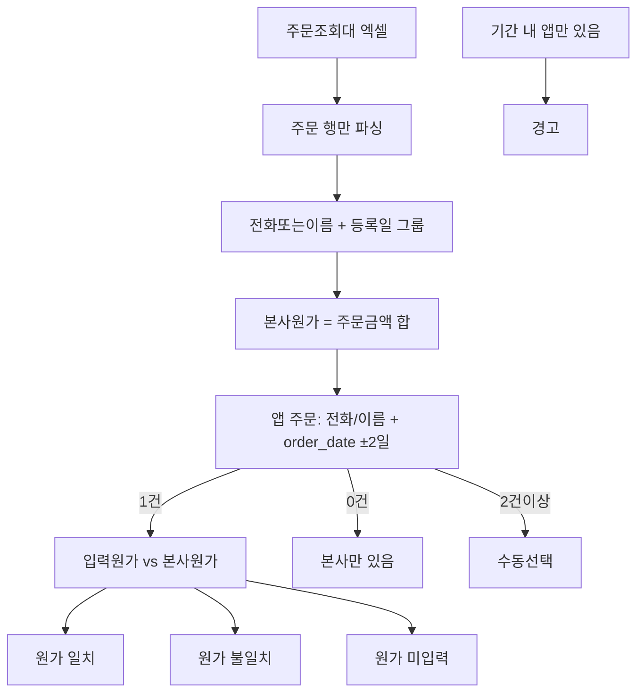

# 본사 주문조회 원가·부정 대사

## 양식 (스크린샷 + `Excel_20260917150016.csv`)

본사 ERP **주문조회(대)_emsf**. 라인 아이템이 아니라 **출고(헤더) 1행 = 1건**.

쓸 컬럼:

- 식별: `전화1` (주), `고객명` (전화 없을 때), `등록일` (없으면 `계약일`)
- 본사원가: `주문금액` (VAT 별도). `부가세`는 검증용(주문금액×10% 근사)
- 보조: `출고번호`, `판매계약번호`, `판매자(대)`, `배송일`, `주문구분`
- 스킵: 1행 제목, `합계=TOTAL` 행, `주문구분`이 `주문`이 아닌 행(회수 등)

`합계` = 주문금액+부가세 (본사 공급가+VAT). **매장 판매가(`app_orders.total_amount`)와 다른 정의**라 판매가 직접 비교는 하지 않는다. 몰래 추가 품목은 본사 `주문금액`이 커지거나 본사에만 행이 생기는 쪽으로 잡는다.

## 이미 있는 것 / 이번 갭

이미 있음 ([legacy_purchase_import_service.py](legacy_purchase_import_service.py), [import_cost_reconcile.py](import_cost_reconcile.py)):

- 매입 **라인** 임포트, 전화+등록일 ±2일 매칭 (`MATCH_WINDOW_DAYS=2`)
- 입력원가 vs 라인원가합, `hq_only` / `app_only`
- 헤더 원가 미변경

없음:

- 이 **주문조회(대)** 파서
- 출고 여러 행을 `(전화, 등록일)`로 합산한 뒤 앱 주문 1건과 비교
- 판매일 기준 기간 리포트 (기존 매장 리포트는 배송일)
- **주기 업로드 이력·중복 스킵**
- **본사 파일 간 감/증액 delta 감지 + 앱 원가 반영 여부 대사**
- 관리자 사이드바의 전용 메뉴 (지금은 매장 화면 expander 뿐)

## 매칭·판정

- 전화: 숫자만. 없으면 `NAME:` + 고객명 정규화 (기존 identity와 동일)
- 날짜: 그룹 키는 본사 `등록일`. 앱 후보는 `order_date` ±2일. 1건이면 자동, 2건+는 추천+수동
- 같은 고객·같은 날 출고 여러 건은 **본사원가 합산** 후 앱 1건과 비교 (분할 출고)
- 입력원가(본사 ERP 대사) = `cost_price`만. `display_cost_amount`(전시원가)는 더하지 않음. 앞으로 본사 ERP 출고에 전시품 원가가 없음.
- 같은 고객·같은 주문이어도 **일반원가와 전시원가를 한 숫자로 합치지 않고** 본사원가와 각각 비교한다.
- 전시품 판매액(`display_sales_amount`)은 `total_amount`에 포함되어 **전체 매출·KPI에는 반드시 남김**.
- 임계: 기존 `COST_ABS_THRESHOLD=10000`, `COST_PCT_THRESHOLD=5%`
- 부가 의심(표시만): 입력판매가 ≤ 본사원가, 또는 마진율 5% 미만 → `마진 이상` (헤더 금액은 안 고침)

결과 코드:

- `ok` / `cost_mismatch` / `cost_blank`
- `hq_only`: 본사 출고 있는데 창 안 앱 주문 없음 → 미등록·현금 누락 의심
- `app_only`: 기간 안 판매자 입력 주문인데 본사 그룹 없음 → 전시/중고이거나 본사 미등록
- `unresolved`: 창 안 앱 주문 2건+
- `hq_revised`: 이전 업로드 대비 **본사 주문금액이 감/증액**되었는데 앱 `cost_price`는 그대로 → 원가 재입력 필요
- `hq_cancelled`: 이전 업로드에 있던 출고번호가 이번 파일에서 `주문상태=취소`이거나 사라짐 (매장 데이터 확인)

전시(고객명 `리빙(법)`, 주문구분 매장분)는 집계에서 빼거나 별도 표시.

## 전시품 판매 원가 분리 (강미양 유형)

앞으로 본사 ERP 주문조회에는 전시품 원가가 없다. 앱에서 전시판매 원가를 일반원가에 섞으면 대사만 어긋나고, 매출에서 빼면 안 된다.

- 신규매출: 품목에 `전시품`이 있으면 **전시품 판매 전용 입력 구간**(판매가·원가)을 일반제품 칸과 분리해 보여 준다. 값은 기존 컬럼 `display_sales_amount` / `display_cost_amount`에만 저장. 일반 `cost_price`에 넣지 않음.
- 저장 판매금액 = 일반 판매가 + 전시 판매가 (`total_amount`). 대시보드·직원 매출·KPI 전시점수 경로를 바꾸지 않아 **전체 매출에 전시판매가 포함**된다.
- 마진 계산은 지금처럼 `total_amount - cost_price - display_cost_amount` (매장 마진용). 본사 대사만 전시원가를 뺀다.
- HQ `_seller_cost` = `cost_price` only. 대사표·비교 창에 **일반원가 / 일반원가차이**와 **전시원가 / 전시원가차이**를 따로 둔다. 같은 고객이라도 합산 한 줄로 비교하지 않는다.
- 관리자 최종 입력: ERP 파일 등록에서 **일반원가** 또는 **전시원가** 중 하나를 고른 뒤 확인. 선택한 금액이 본사 대사 기준 `cost_price`가 된다.
  - 일반원가: `cost_price` 확정. `display_cost_amount`는 전시장 마진용으로 유지.
  - 전시원가: `cost_price` ← 전시원가, `display_cost_amount` ← 0 (잘못 전시칸에 넣은 본사 원가를 일반원가로 옮김). 전시 **판매가**는 `total_amount`에 남겨 매출은 유지.
  - 마진만 `_recalc_order_actual_margin_supabase`. `sales` / 결제는 안 건드림.

## 신규매출 최초 입력 — 전시 원가 필수·이중 검증

에러를 줄이려면 **처음 신규매출을 넣을 때** 전시 원가를 일반제품 원가와 다른 칸에 넣게 하고, 그 칸을 필수로 막는다. [app.py](app.py) 신규매출(약 31223·31494행)에 이미 전시원가>0 검사가 있으나, 일반 칸에 섞어 넣는 실수는 막지 못한다.

입력 UI:

- 품목에 `전시품`이 있을 때만 **분리된 필수 구간** “전시품 판매가 * / 전시품 원가 *”. 일반제품 칸과 헤더·캡션을 다르게 (“이 원가는 본사 ERP 대사에 넣지 않음”).
- `전시품`만 선택: 일반 판매가·일반 원가는 0으로 두고 비활성(또는 입력 시 저장 차단). 원가는 전시 칸에만.
- `전시품`+다른 품목: 일반 판매가>0이면 일반원가 필수, 전시 판매가·전시 원가 둘 다 필수.

저장 검증을 **같은 함수로 두 번** 한다 (버튼 직후 + `app_orders` INSERT 직전). 하나라도 실패하면 저장하지 않는다.

- 전시품 포함인데 전시 판매가≤0 또는 전시 원가≤0 → 차단
- 전시품만인데 일반 원가>0 → 차단 (“전시 원가는 전시품 칸에 입력”)
- 일반 판매가>0 인데 일반 원가≤0 → 차단 (기존)
- 전시 원가와 일반 원가가 같은 양수 → 차단 (한 금액을 두 칸에 넣은 실수)
- 빈칸·`0`·콤마만 있는 값은 미입력

기존 주문 일괄 수정은 이번 범위가 아니다. 검증 대상은 최초 신규매출 등록이다.

## 주기 업로드 · 중복 스킵 · delta 감지

새 테이블 (SQL 파일은 커밋 시 생성):

- `app_hq_order_uploads` — 업로드 이력. `id, db_filename, uploaded_by, filename, row_count, hq_amount_sum, uploaded_at`
- `app_hq_order_snapshots` — 출고 단위 스냅샷. `**(db_filename, ship_number)` UNIQUE**. 컬럼: `ship_number, contract_no, phone1_digits, customer_name, order_date, delivery_date, order_amount, vat, total_amount, order_status, employee_names, source_upload_id, first_seen_at, last_seen_at, prev_order_amount, prev_order_status`

동작 (`process_hq_upload(file)`):

1. 파일 파싱 → 행마다 `ship_number` (없으면 `contract_no` fallback, 그것도 없으면 `NAME:+등록일` 임시키)
2. 각 행에 대해 스냅샷 upsert:
  - **없던 출고**: INSERT, `_row_status=new`
  - **있는 출고, 값 동일**: `_row_status=dup` (스킵 대상, `last_seen_at`만 갱신)
  - **있는 출고, `order_amount` 또는 `order_status` 변경**: `prev_`*에 이전 값 저장 후 UPDATE, `_row_status=revised`, delta = 지금 − 이전
3. 이번 업로드 파일에 **없는데 스냅샷에 있는** 출고는 표시만 (`_row_status=missing`) — 취소 의심
4. `_row_status`별로 대사 표에 색상·필터

앱 원가 반영 확인 (revised 행):

- 매칭된 앱 주문의 **일반원가(`cost_price`)** 가 최신 본사원가와 일치 → `revised_ok` (전시원가는 이 판정에 더하지 않음)
- 다르면 → `revised_pending` (관리자 알림)

계약 변경 대응 (감/증액):

- 매장에서 `app_orders.total_amount` 를 감/증액하면 → 앱 delta = 지금 total − 이전 total
- 본사 delta = revised 스냅샷 delta (원가 기준)
- 두 delta 모두 있을 때만 정상 계약 변경. 한쪽만 있으면 `contract_change_gap` 경고

주의:

- 기본 write는 스냅샷 UPSERT. 관리자 예외 write는 (1) 일반/전시 중 최종 입력원가 확정 (2) 소액 차이에서 본사원가 적용. 둘 다 매칭 1건의 `cost_price`(및 마진)만. `total_amount` / `sales` / `app_payments`는 안 건드림.
- 캐시: 업로드 시 대사 캐시만 무효화

## ERP 메뉴 — 일반/전시 분리 비교 + 최종 입력 + 소액 수정

관리자 전용, [app.py](app.py) `_render_admin_hq_upload` 대사표 아래. 같은 고객·같은 주문이어도 금액을 합치지 않는다.

비교(항상 두 줄):

- 일반원가 `cost_price` vs 본사원가 → 일반원가차이
- 전시원가 `display_cost_amount` vs 본사원가 → 전시원가차이

최종 입력(라디오, 주문 1건, 확인 후):

- **일반원가**: `cost_price`를 본사 대사 확정값으로 둠. 전시원가 컬럼은 유지.
- **전시원가**: 전시원가를 `cost_price`로 옮기고 `display_cost_amount=0`. 전시판매가는 매출에 유지.

소액 보정(추가로, `|본사원가 − 지금 cost_price|`가 1~20,000원):

- **본사원가 적용**: `cost_price`를 본사원가로 UPDATE 후 마진 재계산.
- 2만원 초과·본사만 있음·주문 2건 합산은 비교만.

## 관리자 메뉴 "ERP 파일 등록"

라우팅 (사이드바):

- 최고관리자·매장 관리자 전용 항목 추가 `active_admin_page="hq_upload"` — 기존 `delete_requests` 라우팅과 동일 패턴 ([app.py](app.py) 라인 36980 근방).
- 매장 선택 드롭다운 (본사 파일이 다매장 혼재 가능 — 자동 매핑은 `db_filename` 지정)

화면:

1. **업로드**: 엑셀/CSV 드롭 + 매장 선택. `process_hq_upload` 실행 후 결과 요약 (new / dup / revised / missing)
2. **업로드 이력** 표 (`app_hq_order_uploads`) — 파일명·행수·합계·업로더
3. **대사 표** (이번 업로드 기준, 필터 = new · revised · missing · hq_only · cost_mismatch)
4. 엑셀 다운로드 (revised 시트 · 미매칭 시트 · 원가불일치 시트)
5. 스냅샷 upsert 외에, **소액 원가차이 수정**만 예외로 앱 일반원가를 관리자가 고를 수 있다 (아래 절).

## 구현 (저장 경로 금지)

신규 [hq_order_reconcile_service.py](hq_order_reconcile_service.py) (파싱·그룹·매칭·판정·스냅샷·업로드 이력). 기존 `commit_import` / 신규매출 / 결제 CRUD / 주문수정 저장은 **열지 않음**. 주문·원가 UPDATE 없음. write 는 `app_hq_order_uploads`, `app_hq_order_snapshots` 두 신규 테이블 upsert 뿐.

핵심 함수:

- `parse_hq_order_export(file)` — 제목행·TOTAL 스킵, 헤더 별칭(`등록일`,`전화1`,`주문금액`,`출고번호`,`판매계약번호`,`주문상태`,…)
- `process_hq_upload(client, db_filename, rows, uploaded_by)` — 스냅샷 upsert + delta, 반환 `{new,dup,revised,missing}` 및 각 리스트
- `group_hq_orders(snapshots)` — `(identity, 등록일)` (revised 는 `_row_status=revised`로 그대로 유지)
- `build_hq_reconcile(groups, orders_by_cid, prev_orders_index)` — ±2일 매칭 + `hq_revised`/`hq_cancelled`/`contract_change_gap` 판정
- `reconcile_dataframe` / `build_review_excel`

SQL: 신규 [SUPABASE_APP_HQ_ORDER_UPLOADS.sql](SUPABASE_APP_HQ_ORDER_UPLOADS.sql) 로 두 테이블 + `(db_filename, ship_number)` UNIQUE + RLS 열림.

UI:

- 관리자 사이드바 "ERP 파일 등록" 라우팅 신규 (`active_admin_page="hq_upload"`) — [app.py](app.py) 라인 36980 근방의 `delete_requests` 패턴 재사용.
- 기존 [app.py](app.py) 고객 및 잔금 관리 매입 원장 expander 아래에도 참조용 대사 expander 유지 (읽기 전용).

기간 재조회: [import_cost_reconcile.build_store_reconcile_report](import_cost_reconcile.py)는 배송일 유지. 주문조회 대사는 **업로드 파일의 등록일 범위**로만 앱 주문을 본다 (별도 기간 리포트는 후속).

## 검증

- 샘플: `Downloads/Excel_20260917150016.csv` (엄희선 주문금액 304,000 등)
- 전화+등록일 1건 → 자동, 2건 → 수동, 0건 → 본사만 있음
- TOTAL·회수행 제외
- 같은 파일 2회 업로드 → 2회차는 전부 `dup`, 스냅샷·주문·매출·결제 무변경
- 특정 출고번호의 `주문금액`을 100만→80만으로 손수 바꿔 다시 업로드 → `revised`, delta=-200,000, 앱 원가 변경 없으면 `revised_pending`
- 앱에서 그 주문 `total_amount`를 감액한 뒤 재업로드 → `contract_change_gap` 해소되고 `ok`
- 미리보기·업로드 모두 주문/결제 UPDATE 로그 없음

