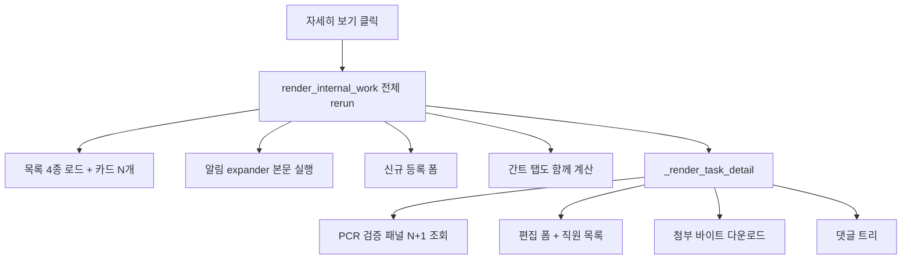

# 사내업무창 속도 개선

이미 된 것: TTL 캐시(Phase A), 접힌 카드는 상세 미실행(Phase B), 결제변경 입력 폼 fragment(D-1).  
남은 병목은 **버튼 한 번에 사내업무판 전체가 rerun**되고, 펼친 상세가 **검증·폼·첨부·댓글을 한 번에** 가져오는 구조다.



대상: [app.py](app.py) `render_internal_work`, `_render_task_card`, `_render_task_detail`, `_render_payment_change_verify_panel` / [task_board.py](task_board.py) `clear_task_caches`.

---

## 1. rerun 격리 (체감 가장 큼)

자세히 보기 토글이 목록·알림·등록폼·간트까지 다시 돌지 않게 한다.

- `_render_task_detail`을 `@st.fragment`로 감싼다. 카드의 토글 버튼은 **fragment 안에서** 열림 상태를 바꾸게 해서, 펼침/접힘/저장 실패가 아닌 입력은 fragment만 rerun.
- 저장·삭제·검증 완료처럼 목록 배지/상태가 바뀌는 동작만 `st.rerun()`으로 상위 갱신.
- 알림 expander([app.py](app.py) 약 29794행)도 fragment + 접힘 시 본문 skip. 지금은 `st.expander`라 접혀 있어도 `load_my_notifications_cached`와 행 위젯이 매번 돈다.
- 간트 탭은 `st.session_state`로 "한 번 클릭한 뒤에만" `_render_task_gantt` 실행. Streamlit 탭은 숨겨도 본문이 실행된다.

UX는 지금 목록+자세히 보기 유지. Slack 창은 이번 범위에 넣지 않는다(창만 바꾸면 속도는 그대로다).

---

## 2. 상세 단계 로드

펼친 직후 한 화면에 다 그리지 않는다.

1. 즉시: 제목, 상태, 설명, 담당/마감 (이미 카드/task dict에 있음)
2. 다음: 결제변경이면 `_render_payment_change_verify_panel` (일반 업무는 지금처럼 task_type으로 즉시 return)
3. 그다음: 편집 폼. `_internal_work_employee_options`는 상세마다 `_get_supabase_users_list`를 다시 돈다 → `render_internal_work`에서 한 번 만들어 넘기거나 `@st.cache_data` 헬퍼로 고정
4. 마지막: 첨부·댓글. `_render_attachment_inline`은 썸네일 클릭 전에 Storage GET을 하지 않음 (파일명/용량만)

검증 패널 내부 N+1은 `_pcr_bulk_verify` / `_pcr_bulk_payment_dates`로 payment_id IN 1회씩 ([기존 플랜 Phase C](docs/plans/사내업무_결제변경_속도_최적화_4f9c79c5.plan.md)).

---

## 3. 목록 진입 쿼리 줄이기

`render_internal_work` 한 번에 겹치는 호출을 합친다.

- `load_pending_payment_verifications`가 뱃지와 강제포함에서 **두 번** 호출됨 → 한 번만
- 매장명 `app_stores` 조회는 세션/기존 스토어 캐시 재사용
- `maybe_run_due_soon_batch` / 친구톡 재시도는 세션당 1회로 유지·확인 (이미 날짜 가드 있음)
- 목록 합성(`load_tasks_cached` + confidential + assigned + pending PCR)은 유지하되, pending PCR id가 이미 tasks에 있으면 `load_task_by_id` skip

---

## 4. 캐시 무효화 쪼개기

[task_board.py](task_board.py) `clear_task_caches()`가 댓글 1건에도 목록·알림·PCR 캐시를 전부 지운다.

- `clear_task_list_caches()`
- `clear_task_detail_caches(task_id)` — 댓글/첨부/활동만
- `clear_notification_caches()`

댓글/첨부 저장은 detail만, 상태 변경은 list+pending PCR, 알림 읽음은 알림만.

---

## 5. 설명란 UX (빈 칸 + 세로 스크롤)

대상은 사내업무 **자세히 보기 편집 폼의 `설명` textarea**다.  
위치: [app.py](app.py) `_render_task_detail` 의 `st.text_area("설명", ..., key=f"et_desc_{tid}")`.  
라벨이 `설명`이고 오른쪽에 `Press Ctrl+Enter to submit form`이 보이는 그 칸이다. PCR `변경 사유`나 Slack 이력 박스가 아니다.

지금은 [task_board.py](task_board.py) `create_payment_change_request`가 `description`에 아래를 자동으로 넣어서, 설명란에 그대로 보인다.

```
결제변경 유형: 온누리 결제변경
고객: ...
원본 결제: 1,641,000원 / 체크카드 / ...
```

- 생성 시 `description`은 **빈 값**으로 저장한다. 유형·고객·원본/변경·미검증은 위쪽 검증 표에만 둔다. 설명란은 사용자가 직접 쓸 빈 칸.
- 이미 저장된 자동 설명은 일괄 삭제하지 않는다. 새로 등록되는 건부터 빈 칸. 편집 폼은 `value=task.get("description") or ""` 유지.
- 이 `설명` textarea는 높이 확보(약 10줄) + `overflow-x: hidden`, `overflow-y: auto`, `white-space: pre-wrap`, `word-break: break-word`. 긴 줄은 가로 스크롤이 아니라 아래로 내려가게 한다.

---

## 검증

기능(등록·자세히 보기·저장·댓글·첨부·결제변경 검증/반려)은 그대로.

측정: 자세히 보기 첫 클릭 / 두 번째 클릭 / 알림 읽음 / 댓글 저장 후 목록 복귀. 목표 — 첫 펼침에서 제목·설명이 바로 보이고, 첨부/검증은 그 뒤에 붙는다. 목록 rerun은 저장·상태변경 때만.

기존 지속 문서 [docs/plans/사내업무_결제변경_속도_최적화_4f9c79c5.plan.md](docs/plans/사내업무_결제변경_속도_최적화_4f9c79c5.plan.md)의 C/D2/D3/E와 맞춰 진행한다.
