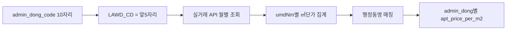

# 핵심상권 + 아파트 실거래가 가중 평가 플랜

선행 플랜([핵심상권_선정_3단계_8ac14057.plan.md](c:\Users\billy\.cursor\plans\핵심상권_선정_3단계_8ac14057.plan.md))의 4단계 UI를 유지한 채, **3단계(핵심 타겟) 직후·렌더 전**에 가중치 입력을 넣고, 렌더 시 국토부 실거래가를 행정동 KPI에 합산한다.

## 목표

- 행정동별 평가에 **아파트 매매 실거래가(㎡단가)** 축을 추가
- 사용자가 **핵심타겟 weight / 아파트 실거래가 weight** 를 직접 입력
- 기존 침투율(X축)은 유지하고, Y축을 단순 타겟 밀집도 대신 **가중 매력도**로 교체해 A/B/C/D를 재계산

## 불러올 API (확정)

### 1순위 — 국토교통부 아파트 매매 실거래가 상세 자료

| 항목 | 내용 |
|------|------|
| 포털 | [data.go.kr 15126468](https://www.data.go.kr/data/15126468/openapi.do) |
| 서비스 | `RTMSDataSvcAptTradeDev` |
| 엔드포인트 | `https://apis.data.go.kr/1613000/RTMSDataSvcAptTradeDev/getRTMSDataSvcAptTradeDev` |
| 방식 | GET, 응답 XML(기본) — 파싱은 `xml.etree` / `xmltodict` |
| 필수 파라미터 | `serviceKey`, `LAWD_CD`(법정동코드 **앞 5자리**=시군구), `DEAL_YMD`(계약년월 `YYYYMM`) |
| 선택 | `pageNo`, `numOfRows`(페이지네이션 필수 — 거래 많은 구는 다건) |
| 주요 응답 필드 | `dealAmount`(만원), `excluUseAr`(전용면적㎡), `umdNm`(법정동명), `aptNm`, `buildYear`, `dealYear/Month/Day`, `floor` |

인증키: data.go.kr **일반 인증키**. 기존 `[population_api]` 키와 동일 계정이면 활용신청만 추가하면 됨. secrets는 `[apt_trade_api] service_key` 우선, 없으면 `[population_api]` / `[elevator_api]` 폴백(인구 API와 동일 패턴).

### 보조(신청만 권장, 코드 필수는 아님)

- [국토교통부_아파트 매매 실거래가 자료 15126469](https://www.data.go.kr/data/15126469/openapi.do) — 상세본과 동일 계열, 필드가 더 단순한 목록형. 상세본(Dev)만으로 충분.
- 분양권전매 API는 본 범위에서 제외(매매 실거래만).

### 중요 제약 (행정동 조인)

국토부 API는 **법정동·시군구(LAWD_CD 5자리)** 단위이지, 카카오 **행정동 10자리** 단위가 아니다.



조인 규칙(구현 확정):

1. `LAWD_CD = admin_dong_code[:5]` 로 시군구 조회
2. 거래 건별 `price_per_m2 = dealAmount * 10000 / excluUseAr` (원/㎡; UI는 만원/㎡로 표시 가능)
3. `umdNm` 정규화(공백·'동' 접미 처리) 후 같은 시군구 내 `admin_dong_name`과 매칭
4. 매칭 실패 시 해당 시군구 **전체 거래 중앙값**을 폴백(매칭 불가로 표기)
5. 조회 창: 분석 인구 기준월(`yyyymm`) 포함 **직전 3개월** `DEAL_YMD`를 합쳐 중앙값·건수 산출 (표본 안정)

## UI 변경 ([dong_commercial_map.py](dong_commercial_map.py))

기존 단계 유지 + 가중치 블록 삽입:

1. 매장·기간  
2. 핵심상권(시·군·동)  
3. 핵심 타겟 연령대  
4. **NEW — 평가 가중치**  
   - 슬라이더 2개(0~100, step 5): `핵심타겟 weight`, `아파트 실거래가 weight`  
   - 합이 100이 되도록 연동(한쪽 변경 시 나머지 = 100 − 값). 기본 **70 / 30**  
   - caption: `매력도 = wT×정규화(타겟밀집도) + wA×정규화(아파트㎡단가)`  
5. 상권 맵 렌더링  

캐시 키에 `w_target`, `w_apt`, 실거래 창(개월 수) 포함.

## 점수·사분면 수식

선택 행정동 집합 안에서 min-max 정규화(0~1):

- `dens_n = (target_density − min) / (max − min)` (분모 0이면 0.5)
- `price_n` = 동일 방식 (`apt_price_per_m2`)

```
attractiveness = (w_target/100)*dens_n + (w_apt/100)*price_n
```

- **X축**: 기존 `penetration_rate`(침투율) 유지  
- **Y축**: `attractiveness`(가중 매력도)로 교체  
- `assign_quadrant`는 Y를 `attractiveness` 중앙값 기준으로 고/저 판정하도록 확장(또는 `assign_quadrant_weighted`)  
- 표/툴팁/PDF에 `apt_price_per_m2`, `apt_deal_count`, `w_target`, `w_apt`, `attractiveness` 컬럼 추가

가중치만 바꾸면 실거래 API 재호출 없이 session_state KPI에서 즉시 재계산(연령대 변경과 동일 UX).

## 데이터·캐시

신규 테이블 `app_dong_apt_trade_cache` (인구 캐시와 대칭):

- PK: `(admin_dong_code, yyyymm_end, window_months)`
- 컬럼: `median_price_per_m2`, `deal_count`, `match_level`(`umd`|`sgg_fallback`), `updated_at`

함수(인구 bulk와 동일 패턴):

- `fetch_apt_trades_sgg(lawd_cd, deal_ymd)` — 페이지네이션
- `aggregate_apt_price_by_umd(...)` → umd별 중앙값
- `map_umd_to_admin_dongs(...)` → 행정동 지표
- `fetch_apt_price_bulk(client, admin_codes, yyyymm, window=3)` — DB 캐시 우선 + 시군구 단위 병렬 호출(동마다 API를 치지 않음)

연동 진단 패널에 실거래 API 연결 테스트(샘플 `LAWD_CD=11110`, 최근 확정월) 추가.

## 파일 터치포인트

| 파일 | 내용 |
|------|------|
| [dong_commercial_map.py](dong_commercial_map.py) | API·집계·가중치 UI·KPI/사분면·표·진단 |
| `SUPABASE_APP_DONG_APT_TRADE_CACHE.sql` | 캐시 테이블 DDL |
| `.streamlit/secrets.toml` 예시 | `[apt_trade_api] service_key` |
| docs/plans / Cursor plan | 본 Phase를 마스터·핵심상권 플랜에 링크 |

## 구현 순서

1. secrets + 실거래 API 클라이언트(페이지네이션·XML 파싱·기간 폴백)  
2. 시군구→umd→행정동 매핑·캐시 테이블  
3. 가중치 UI + `attractiveness` KPI + 사분면 Y축 교체  
4. 표/지도 호버/PDF 반영 + 진단 테스트  
5. 스모크: 울산 중구 선택, weight 100/0 vs 0/100 시 순위·사분면 변화 확인

## 검증

1. data.go.kr에서 15126468 활용신청 후 키로 샘플 구(`11110`)·월 조회 성공  
2. 선택 행정동에 `apt_price_per_m2`·건수 표시(매칭 실패 시 sgg 폴백 표시)  
3. weight 70/30 → 50/50 → 0/100 변경 시 API 재호출 없이 매력도·A/B/C/D 갱신  
4. 침투율 X축은 weight와 무관하게 유지  
5. 거래 0건 동은 price=NaN → 정규화에서 제외하거나 0 처리 후 UI에 `실거래 없음` 표기
