# 온누리/울산페이 외부파일 매칭 검증

## 목적

직원이 신규고객 매출로 입력한 **온누리(전자)** / **울산페이(앱의 지역화폐)** 결제를, 가맹점 포털에서 받은 공식 내역과 대조해 미입력·허위입력·결제 후 임의취소를 찾는다.

온누리 파일 형식은 첨부 캡처 기준. 울산페이 파일은 이후 제공되면 같은 파이프라인에 파서만 추가한다.

## 확정 규칙

- 대상 결제: **신규고객 매출**로 넣은 건만. 수단은 `온누리`(지류 제외), `지역화폐`(울산페이).
- 검증 시작일: 관리자가 설정. **기본값 2026-08-01**. 그 이전 결제·파일 행은 매칭하지 않음.
- 온누리 식별: **결제일 + 구매자 전화번호 뒤 4자리 + 금액**. 같은 날 동일 뒤4·동일 금액이 둘 이상이면 **거래시간**으로 구분.
- 거래상태: `결제완료` / `취소`(및 유사 문구)를 분리. `정산상태`(정산예정/정산중/정산완료)는 참고 열 + 심각도.
- 재업로드: 공식 행 **지문(fingerprint) UNIQUE**. 이미 있는 행은 insert하지 않고, 이미 매칭된 쌍은 다시 만들지 않음.
- 집계/KPI/결제 저장 로직은 변경하지 않음. 입력 스탬프와 검증 UI만 추가.

## 현재 시스템과의 관계

신규 매출 온누리는 [`app.py`](app.py)에서 `onnuri_approval_code`에 **승인번호 뒤 4자리**를 넣는다. 공식 파일의 식별자는 **전화번호 뒤 4자리**이므로, 매칭은 승인번호가 아니라 **고객 `phone1` 뒤 4자리**를 쓴다.

```27899:27916:app.py
                onnuri_code = None
                if method and "온누리" in str(method) and "지류" not in str(method):
                    ...
                    onnuri_code = re.sub(r"\D", "", raw) or None
                _insert_payment_supabase(..., "onnuri_approval_code": onnuri_code, ...)
```

신규고객 여부: 주문에 `entry_source='new_customer_sale'`를 저장(앞으로). 2026-08-01 이후 기존 건은 **해당 고객의 첫 주문**이면 신규고객 매출로 본다.

## 데이터

[`SUPABASE_APP_EXTERNAL_PAY_MATCH.sql`](SUPABASE_APP_EXTERNAL_PAY_MATCH.sql)

- `app_external_pay_settings`: `verify_from_date` (기본 2026-08-01)
- `app_external_pay_batches`: 업로드 1회 (source=`onnuri`|`ulsanpay`, 파일명, 업로더, 매장 `db_filename`, 파싱 건수)
- `app_external_pay_rows`: 공식 1행
  - `source`, `db_filename`, `tx_date`, `tx_time`, `phone_last4`, `amount`, `tx_status`, `settle_status`, `buyer_name_masked`, `raw_json`
  - `fingerprint` UNIQUE: `source|db_filename|tx_date|tx_time|phone_last4|amount|tx_status`
- `app_external_pay_matches`: `row_id` UNIQUE → `payment_id` (한 공식 행은 결제 1건만)
- `app_orders.entry_source` TEXT (없으면 추가)

같은 날짜 파일을 다시 올려도 fingerprint가 같으면 skip. 매칭 테이블의 `row_id` UNIQUE로 재매칭 중복 방지.

## 온누리 파서 (캡처 컬럼)

엑셀/CSV. 헤더 별칭 허용.

| 파일 | 저장 |
|------|------|
| 거래일자 `YYYY.MM.DD` | `tx_date` |
| 거래시간 `HH:MM:SS` | `tx_time` |
| 구매자전화번호 `010****2414` | 숫자만 뒤 4자리 → `phone_last4` |
| 결제금액(원) | `amount` |
| 거래상태 | `tx_status` (`결제완료` / `취소` 등) |
| 정산상태 | `settle_status` |
| 구매자명 | `buyer_name_masked` |

`tx_date < verify_from_date` 행은 적재하지 않음.

## 매칭

ERP 후보: `payment_date >= verify_from`, 수단 온누리(전자) 또는 지역화폐, 금액>0, 신규고객 매출, 아직 match 없는 `app_payments`.

온누리 키: `(payment_date, customer.phone1 뒤4, amount)`.

```mermaid
flowchart TD
  upload[Admin_upload_xlsx] --> parse[Parse_onnuri_rows]
  parse --> dedup[Fingerprint_upsert_skip_dup]
  dedup --> match[Match_date_phone4_amount]
  erp[NewCustomer_payments] --> match
  match --> ok[matched_ok]
  match --> cancelFlag[official_cancel_or_erp_cancel]
  match --> erpOnly[erp_only]
  match --> fileOnly[official_only]
```



결과 코드:

- `matched_ok`: 공식 `결제완료` + ERP 양수 결제 1:1
- `official_canceled`: 공식 `취소`인데 ERP에 같은 키 양수 결제가 남아 있음 (임의취소 의심)
- `erp_canceled_official_paid`: 공식은 `결제완료`(특히 정산완료)인데 ERP는 상계/결제취소 (정산 후 취소 의심)
- `erp_only`: ERP만 있음 (파일 누락 또는 허위입력)
- `official_only`: 공식 `결제완료`만 있음 (미입력)
- `ambiguous`: 같은 날·뒤4·금액이 2건 이상이고 시간으로도 못 가림

취소 판정: 공식 `거래상태`에 `취소` 포함. ERP 취소는 같은 주문·같은 날·같은 수단의 음수 전표 또는 `app_payment_history.action_type` in (`결제취소`, `결제변경`).

## 관리자 UI

[`render_admin_settings`](app.py)에 **「9. 온누리/울산페이 대사」** 추가 (`store_admin`/`superadmin`).

1. 검증 시작일 저장 (기본 2026-08-01)
2. 매장 선택, 출처(온누리 / 울산페이), 파일 업로드
3. 온누리: 파싱 → 신규 N / 중복 skip M → 자동 매칭
4. 결과 표: 날짜, 뒤4, 금액, 공식상태, 정산, ERP 결제ID/고객, 결과코드. 필터: 미결·취소의심만
5. 울산페이: 「파일 형식 등록 전」안내. 업로드 비활성. 샘플 오면 파서만 추가

## 구현 순서

1. SQL + `entry_source` 컬럼
2. 신규고객 저장 시 `entry_source='new_customer_sale'` ([`app.py`](app.py) 신규 주문 INSERT)
3. 온누리 파서·fingerprint upsert·매칭 함수
4. 관리자 설정 UI
5. 울산페이 스텁
6. 검증: 같은 파일 두 번 업로드 시 행/매칭 증가 없음. 공식 취소 vs ERP 잔존 결제 플래그. 시작일 이전 행 제외.

## 나중에 (울산페이 파일)

캡처를 받으면 `source=ulsanpay` 파서만 추가. 매칭 키는 파일 컬럼에 맞춰 확정 (승인번호 6자리 또는 전화번호).
