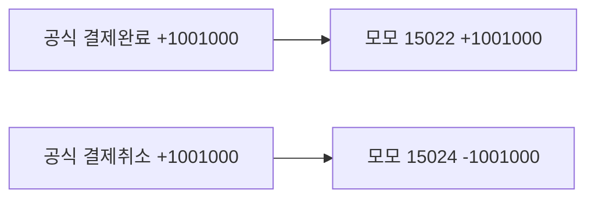

# 온누리 결제·취소 쌍 매칭

## 이 건에서 실제로 일어난 일

주문 10406 (황연서, 2026-09-06, 뒤4 9226) 모모 결제:

- 15022: 온누리 +1,001,000
- 15024: 온누리 -1,001,000 (상계)

공식 원장도 같은 날·같은 금액으로 두 줄이다.

- 결제완료 → 화면 결과 **온누리만 있음**
- 결제취소 → 화면 결과 **금액일치**

말이 바뀐 것이 아니라, 취소 행이 양수 결제 15022를 먼저 가져갔다. 결제완료 행에 붙일 모모 결제가 남지 않은 상태다.

## 원인 — [app.py](app.py) `_ext_pay_match_onnuri` (약 4209행)

- 매칭 후보는 `amount > 0` 만 넣는다. 상계 전표 15024는 처음부터 대상이 아니다.
- 1차 패스는 그 주문에 음수 결제가 있으면 결제완료 행을 확정하지 않고 넘긴다 (`neg_orders` 이면 continue, 약 4306행).
- 2차에서 취소 행도 양수 금액 `(날짜, 뒤4, 1,001,000)` 으로 찾으므로 양수 결제 15022와 붙고, `금액일치`(공식 취소·ERP도 취소 흔적)가 된다.

## 매칭 방법

같은 날짜·뒤4·절대금액에 공식 결제완료 1건과 공식 결제취소 1건이 있고, 모모에도 양수 1건과 음수 1건이 있으면 짝을 고정한다.

- 결제완료 행 → 양수 결제, `matched_ok`, 메모 `공식 결제 · ERP 결제`.
- 결제취소 행 → 음수 상계 전표, `matched_ok`, 메모 `공식 취소 · ERP 상계`.
- 두 결제 ID를 모두 사용 처리해서 이후 다른 행이 가져가지 못하게 한다.
- 음수 전표는 기존 양수 후보 목록에는 넣지 않고, 이 쌍 매칭에서만 조회한다. 취소 행만 있는 경우(모모 잔존)의 기존 분기는 유지한다.
- 공식에는 결제완료만 있고 모모에만 상계가 있는 경우도 지금처럼 `모모 취소·온누리 결제`로 둔다. 이번 변경은 공식 쪽에 결제와 취소가 둘 다 있는 쌍만 대상이다.

구현 위치는 1차 패스 앞, [app.py](app.py) 약 4272행. 재매칭은 기존 `_ext_pay_rematch_open_rows` 가 `official_only` 를 다시 태우므로 별도 배치 작업은 없다. 화면에서 온누리 재검증을 한 번 실행하면 주문 10406의 결제완료 행이 `금액일치`로 바뀐다.
