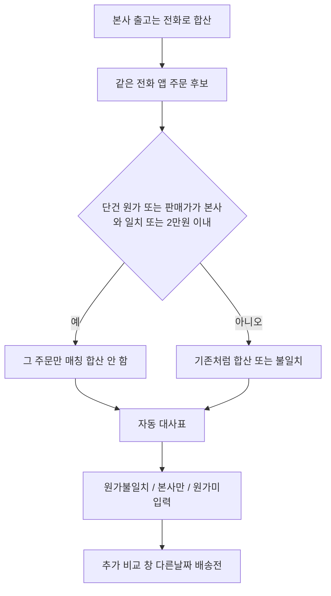

# 원가차이 기존주문 비교 창

## 왜 지금 안 보이나

자동 대사는 [hq_order_reconcile_service.py](hq_order_reconcile_service.py)의 `_fetch_orders_by_identity`가 **파일 등록일 범위 ±30일** 안의 `app_orders`만 가져옵니다. 그다음 같은 전화 주문을 **전부 합산**해 본사원가와 한 줄로 비교합니다.

그래서 아래는 자동 표에서 빠지거나, 합산 때문에 원인 파악이 안 됩니다.

- 신규 매출을 본사 등록일과 **다른 날**로 넣은 주문 (30일 밖이면 `본사만 있음`)
- 같은 전화의 **배송 전** 주문 (`delivery_date`는 조회만 하고 쓰이지 않음)
- 자동 합산에 옛 주문까지 들어가 **원가 불일치**가 된 경우 (건별 원가가 안 보임)

대표 사례(엄희선 `01020201653`):

- 단건 `#10176`: 본사원가 334,000 = 입력원가 334,000, 입력판매가 403,000 → 원가 일치
- 합산 `#9972,#10176`: 입력원가 2,999,200 / 입력판매가 2,803,000 → 원가 불일치

같은 고객의 이전 주문(`#9972`)을 붙이면 이미 맞던 단건이 깨집니다. 본사 출고는 전화로 합산하되, **앱 주문은 단건이 이미 맞으면 합치지 않습니다.**

매입 임포트의 수동 선택 UI([app.py](app.py) 33138 근처)는 주문에 라인을 **붙이는** 기능이라 재사용하지 않습니다. 이번 창은 비교만 합니다.

## 자동 매칭: 단건이 맞으면 앱주문 합산 금지

[hq_order_reconcile_service.py](hq_order_reconcile_service.py) `build_hq_reconcile`의 전화 그룹 처리만 바꿉니다. 본사 출고 합산은 유지합니다.

소액 임계: `SINGLETON_ABS_THRESHOLD = 20_000` (1~2만원). 기존 `COST_ABS_THRESHOLD=10_000` / 5%는 **최종 결과 라벨**용으로 그대로 둡니다.

같은 전화 앱 후보 `orders`와 본사원가 `hq_cost`, 본사 합계 `hq_total`(주문금액+부가세)에 대해:

1. 각 후보의 입력원가 = `_seller_cost` (**`cost_price`만**, 전시원가 제외), 입력판매가 = `total_amount` (전시판매 포함, 매출용)
2. 단건이 **쓸 만하면** 그 주문만 고른다. 조건은 OR
   - `|입력원가 − 본사원가| <= 20,000`
   - `|입력판매가 − 본사원가| <= 20,000` 또는 `|입력판매가 − 본사 합계| <= 20,000`
3. 그런 단건이 여러 개면 본사 등록일에 가장 가까운 `order_date` 1건 (같으면 id 작은 쪽)
4. 단건이 없으면 지금처럼 후보 원가·판매가를 합산해 비교 (분할 입력·배송 전+당일)
5. 고르지 않은 같은 전화 주문은 자동 행에 넣지 않음. 사유 예: `단건 매칭 #10176 (합산 안 함)`
6. 고르지 않은 주문은 아래 비교 창에만 보여 이전 계약/배송 전 건과 구분

캡션([app.py](app.py) 8099 근처)도 “같은 전화면 무조건 합산”이 아니라 “단건이 맞으면 그 주문만, 안 맞을 때만 합산”으로 고칩니다.

## 전시품 판매: 원가는 대사에서 제외, 매출에는 포함

강미양처럼 전시품 판매로 넣은 건, 앞으로 본사 ERP 출고에 원가가 없다. 앱 일반원가에 섞이면 대사만 틀린다. 매출에서 빼면 안 된다.

이미 신규매출([app.py](app.py) 약 31223행)은 품목에 `전시품`이 있을 때 `display_sales_amount` / `display_cost_amount` 칸이 있다. 다만 일반 원가와 한 덩어리로 보이고, HQ `_seller_cost`가 둘을 더한다.

바꿀 것:

- 신규매출: `전시품` 선택 시 **별도 필수 구간** “전시품 판매 — 본사 ERP 원가 제외, 전체 매출에는 포함”. 전시 판매가·전시 원가 `*` 필수. 일반제품 원가 칸과 분리.
- 저장 규칙은 유지: `total_amount` = 일반 판매가 + 전시 판매가, `cost_price` = 일반 원가만, `display_*` = 전시만. 대시보드·KPI 매출 경로는 수정하지 않음.
- 최초 등록 이중 검증 (버튼 직후 + INSERT 직전, 동일 함수):
  - 전시품 포함 + 전시 판매가/원가 ≤0 → 저장 불가
  - 전시품만 + 일반 원가>0 → 저장 불가 (일반 칸에 전시 원가를 넣은 경우)
  - 일반 판매가>0 + 일반 원가≤0 → 저장 불가
  - 일반 원가와 전시 원가가 같은 양수 → 저장 불가
  - `전시품`만이면 일반 판매가·원가 칸 비활성(0)
- 매장 마진은 지금처럼 `total_amount - cost_price - display_cost_amount`.
- [hq_order_reconcile_service.py](hq_order_reconcile_service.py) `_seller_cost` = `cost_price`만. 같은 고객이라도 대사표에 일반원가차이·전시원가차이를 **별도 열**로 두고 합산하지 않음.
- 단건 매칭: 일반원가 또는 전시원가 중 하나가 본사원가와 2만원 이내면 그 주문만 고르고 합산하지 않음.
- 판매가 비교는 `total_amount`(매출, 전시 포함). 기존에 칸을 잘못 쓴 건 자동 이전하지 않고 관리자 최종 입력으로 옮김.

하지 않는 것: 전시판매를 매출 집계·직원 실적에서 빼기, 전시 전용 신규 테이블.

## 후보를 찾는 방법

새 함수 `fetch_phone_order_candidates(client, db_filename, phone_digits, hq_cost, hq_date)`를 [hq_order_reconcile_service.py](hq_order_reconcile_service.py)에 둡니다. 기존 `_phone_match_key` / 매장 고객 스캔을 재사용합니다.

조회 범위 (자동 대사 ±30일과 분리):

- 같은 매장 + 같은 전화(phone1/phone2 마지막 10자리)
- **등록일 1년** 안 주문 + **배송일이 비었거나 오늘 이후인 주문은 날짜 무관**으로 포함
- `order_date`, `delivery_date`, `cost_price`, `display_cost_amount`, `total_amount`, `import_source`, `employee_names`

행마다 표시할 값:

- 일반원가 / 일반원가차이 = `cost_price` − 본사원가
- 전시원가 / 전시원가차이 = `display_cost_amount` − 본사원가 (같은 고객이어도 일반과 합치지 않음)
- 전시판매가 = `display_sales_amount` (참고). `total_amount`에 포함되어 매출 집계는 그대로
- 배송 전: `delivery_date` 없음 또는 오늘보다 뒤
- 출처: `import_source`가 비면 **신규매출**, `엑셀_매입원장`이면 임포트
- 등록일 간격: 본사 등록일(그룹 시작일)과의 일수

추천(표시만, 저장 없음):

- 단건: `|입력원가 − 본사원가|`가 기존 임계(1만원 또는 5%) 안이면 강조
- 복수: 후보가 8건 이하면 부분집합 합이 본사원가에 가장 가까운 조합을 한 줄로 안내 (다른 날짜 분할 입력·배송 전+당일 입력)

자동 대사는 위 단건 우선 규칙을 씁니다. 이 창은 단건으로 남긴 나머지·날짜가 먼 주문·배송 전 주문을 추가로 보는 용도입니다.

## UI 위치

[app.py](app.py) `_render_admin_hq_upload`의 원가 대사표(약 8156행) 바로 아래.

- 대상: `cost_mismatch` / `hq_only` / `cost_blank` 만. 원가 일치는 열지 않음
- 상단: 해당 행을 고르는 selectbox (고객명 · 전화 · 본사원가 · 결과). 한 번에 expander를 수십 개 열지 않음
- 본문: 본사 출고 요약(출고번호, 등록일 구간, 본사원가) + 후보 주문 표
- 캡션: 비교 창 자체는 주문을 수정하지 않음. 소액 차이는 아래 선택 수정에서만 반영.
- 후보 0건: 그 전화로 1년/배송 전 주문이 없다는 안내

고객및잔금의 `_render_hq_upload_reference`는 이번엔 건드리지 않습니다.

## ERP 파일 등록 — 일반/전시 분리 비교 + 최종 입력

대사표·비교 창과 같은 메뉴. 관리자만. 매칭 앱 주문 **1건**.

비교: 본사원가 대비 일반원가차이, 전시원가차이를 나란히 보여 준다.

최종 입력(라디오 + 확인):

- **일반원가**: `cost_price`를 대사 확정값으로 둠. `display_cost_amount` 유지.
- **전시원가**: `cost_price` ← 전시원가, `display_cost_amount` ← 0. 전시판매가·`total_amount`는 그대로(매출 유지).
- 이후 `_recalc_order_actual_margin_supabase`.

소액 보정: 확정 후 `|본사원가 − cost_price|`가 1~20,000원이면 **본사원가 적용**을 추가로 고를 수 있다.

2만원 초과·본사만 있음·주문 2건 합산은 비교만. 적용 후 해당 행과 요약을 다시 그린다.

## 하지 않는 것

- 아래 예외 외의 `app_orders` / `sales` / `app_payments` UPDATE. 허용: 관리자가 고른 일반/전시 최종 입력을 `cost_price`에 반영(전시면 display→0), 소액이면 본사원가로 `cost_price` 수정, 마진 재계산.
- 자동 매칭을 비교 창에서 고른 결과로 다시 쓰는 기능 (원하면 다음 단계)
- 전시판매액을 대시보드·KPI 전체 매출에서 제외
- 새 Supabase 테이블
- 본사 출고(같은 전화 여러 출고번호) 합산 해제 — 출고 쪽 합산은 유지

## 확인

- 엄희선: `#10176`만 매칭, 본사원가 334,000 / 입력원가 334,000 / 입력판매가 403,000, 결과 원가 일치. `#9972`는 합산되지 않고 비교 창에만 보임
- 단건 원가 차이가 2만원 이내면 합산하지 않고 그 주문만 사용
- 단건이 모두 2만원을 넘을 때만 같은 전화 앱 주문을 합산
- 같은 전화를 다른 등록일로 넣은 신규 주문이 30일 밖이어도 창에 나오고, 입력원가와 본사원가 차이가 보임
- 배송일 없는(또는 미래) 주문이 창 상단에 보임
- 저장 & 대사 후에도 주문 원가 컬럼은 그대로
- 전시품 포함 신규 주문: `total_amount`에 전시판매가 포함되어 매출 합계가 줄지 않음
- 같은 고객 한 주문에 일반원가·전시원가가 같이 있어도 대사표에 두 차이가 따로 보임
- 관리자가 전시원가를 최종 입력하면 `cost_price`로 옮겨지고 전시판매·전체 매출은 줄지 않음
- 신규매출: 전시품만 넣고 일반원가에만 숫자를 넣거나 전시원가를 비우면 저장이 안 됨. 전시+일반을 같은 금액으로 두 칸에 넣어도 저장이 안 됨
- 소액 차이 단건: 본사원가 적용 시 `cost_price`만 바뀌고 판매가·매출원장은 그대로. 2.5만원 차이·합산 행에는 수정 버튼 없음.
