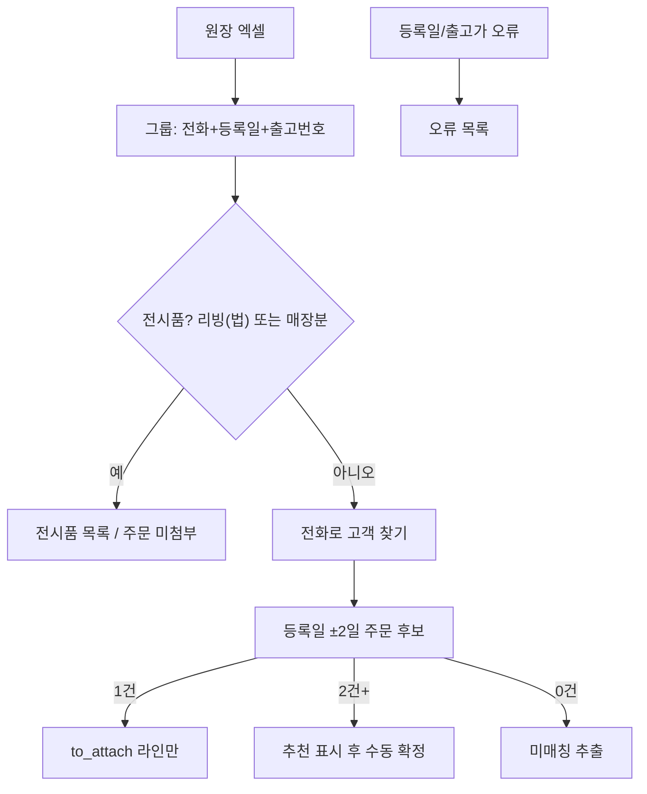

# 원장 임포트 매칭 보강 (전시품·±2일·미매칭 추출)

## 목적

모모에 이미 있는 주문에 **세부 품목(라인)** 을 붙이는 것이 1순위다. 원가 한 줄만 있는 주문을, 원장 품목과 같이 보게 한다.

매칭 키는 사용자가 지정한 대로 **고객 전화1 + 등록일(판매일) ±1~2일** 이다. 기존 주문 헤더·잔금·결제는 그대로 둔다 (`commit_import`의 `to_attach` 비덮어쓰기 유지).

## 지금 코드의 빈틈

[`legacy_purchase_import_service.py`](legacy_purchase_import_service.py) `build_preview` (약 848–888행):

- 앱 후보는 **(customer_id, order_date) 날짜 정확 일치**만 본다.
- ±2일은 **배송일 폴백**에만 있다. 등록일이 하루라도 어긋나면 후보 0건 → 지금 로직은 `to_create`(신규 주문)로 가서 **모모 주문이 있는데도 중복 주문이 생길 수 있다.**
- `울산삼산리빙(법)` 은 전화가 없으면 `NAME:` 키로 **신규 고객/주문**이 된다. 전시품인데 주문처럼 들어간다.
- `group_orders`의 파싱 실패 행은 통계만 올리고 **목록으로 안 남긴다.**
- 후보 2건+ 는 [`app.py`](app.py) 수동 selectbox가 이미 있다. 기본값이 `(신규 주문으로 등록)` 이라 실수로 분기가 난다.

## 1고객 2주문 시뮬레이션

같은 전화 `010-1111-2222`, 원장 등록일 `2026-08-15`, 출고가 합 160만(판매가 역산 200만)인 그룹이 있다고 가정한다.

- 모모 주문 A: 등록일 `2026-08-14`, 판매가 320만 (소파)
- 모모 주문 B: 등록일 `2026-08-16`, 판매가 190만 (매트리스)

둘 다 ±2일 안에 들어 **자동 attach 하지 않는다.** 점수: 날짜 간격(둘 다 1일) + |원장판매가 − 주문판매가| → B가 가깝다. UI 기본 선택을 B로 두고, 사람이 확정한다. A에 붙이거나 신규로 빼는 것도 가능하다.

출고번호가 다른 원장 그룹 2개가 같은 전화를 쓰면, 그룹이 이미 갈라져 있으므로 각각 위와 같이 후보를 고른다. 한 그룹이 두 주문에 쪼개져 붙지는 않는다 (라인 단위 분할은 이번 범위 밖).

## 분류 규칙

- **전시품** (`display`): 고객명 정규화 후 `리빙(법)` 포함, 또는 주문구분 `매장분`. 전화가 있어도 주문 매칭하지 않음. 미리보기/다운로드에만 `전시품`으로 남김. `commit_import`는 `invalid`와 같이 INSERT 안 함.
- **자동 첨부** (`to_attach`): 전화로 고객이 있고, 등록일 ±2일 후보가 **정확히 1건**.
- **수동** (`unresolved`): 같은 창에 후보 2건+. 추천(날짜 간격 작음 → 판매가 차이 작음 → id)을 selectbox 기본값으로. 확정 전엔 attach/create 안 함.
- **미매칭** (`unresolved` 또는 새 상태 `no_match`): 고객은 있는데 ±2일 후보 0건. **신규 주문을 자동 만들지 않음.** 목록에서 주문 고르거나 `신규`를 고를 수 있게 함. (모모에 없는 과거 건은 여기서 신규)
- **신규 고객** (`to_create`): 앱에 그 전화가 없을 때만. 지금처럼 주문+완납 결제 생성.
- **오류**: 등록일 파싱 실패, 출고가 없음, 전화·이름 둘 다 없음. 그룹에 넣지 말고 `skipped_rows`로 모아 다운로드.

배송일 폴백은 등록일 창에서 0건일 때만 보조로 유지한다. 그래도 2건+면 수동.

## 손댈 곳

- [`legacy_purchase_import_service.py`](legacy_purchase_import_service.py)
  - 전시품 판별, `group_orders`가 스킵 행을 반환
  - `_order_date_window_candidates(cid, order_date, ±2)` 추가 후 `build_preview`에서 정확 일치 대신 이 창을 1순위로
  - 후보 2건+에 `recommended_order_id` + `reason` (예: 등록일 1일차, 금액차 10만)
  - `preview_to_dataframe` / 다운로드용 프레임: 전시품 · 미매칭 · 오류 · 수동필요
- [`app.py`](app.py) `_render_legacy_purchase_bulk_import`
  - 미리보기 지표에 전시품/미매칭/오류 건수
  - 수동 목록 기본값을 추천 주문으로
  - `st.download_button`으로 미매칭+전시품+오류 엑셀
- `commit_import`: `display`/`no_match`(미확정)는 스킵. **to_attach 시 주문/결제 UPDATE 없음**은 유지.

엑셀 업로더는 지금처럼 `.xlsx`만. PDF 파싱은 넣지 않는다.

## 확인

- 울산삼산리빙(법)·매장분: 주문/고객 INSERT 0, 목록에 전시품으로 남음
- 전화+등록일 하루 차이, 후보 1건: 자동 attach, 기존 판매가/잔금 불변
- 같은 전화에 주문 2건(±2일): 추천이 기본, 확정 전 커밋 안 됨
- 미매칭/오류 엑셀에 고객명·전화·등록일·출고번호·품목 수·원가·사유가 들어감
