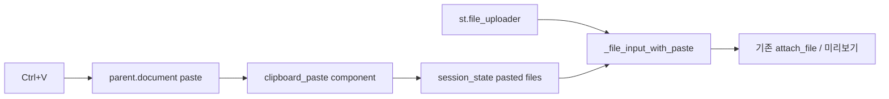

# 이미지 Ctrl+V 첨부

## 왜 지금 안 되는가

[`st.file_uploader`](app.py)는 파일 선택·드래그앤드롭만 받습니다. Streamlit 1.54에는 클립보드 paste API가 없습니다. 저장 경로([`task_board.attach_file`](task_board.py))는 이미 `.name` / `.getvalue()` 만 있으면 되므로, **입력단만** 바꾸면 됩니다.

## 접근

새 pip 패키지 없이, 이 앱이 이미 쓰는 `window.parent` iframe 패턴으로 커스텀 컴포넌트를 추가합니다.

1. 정적 프론트 [`clipboard_paste/index.html`](clipboard_paste/index.html) + `components.declare_component` (npm 빌드 없음)
2. paste 시 이미지만 가로채고, 텍스트 붙여넣기는 `preventDefault` 하지 않음
3. 여러 업로더가 한 화면에 있으면: 붙여넣기 바를 **클릭한 칸**이 수신 대상. 클릭 전이면 **마지막으로 렌더된** 칸
4. 붙여넣은 이미지는 `session_state[key]`에 누적, 업로더 파일과 합쳐 미리보기·저장

## 헬퍼 ([`app.py`](app.py))

`_PastedUpload`: `name`, `type`, `size`, `getvalue()`, `read()`, `seek()` — `UploadedFile`과 동일 인터페이스.

`_file_input_with_paste(label, *, key, accept_multiple_files=True, type=None)`:
- 기존 `st.file_uploader` 유지
- 바로 아래 붙여넣기 바 (높이 ~56px): 「이미지를 복사한 뒤 이 칸을 클릭하고 Ctrl+V」
- 반환: 업로더 + 붙여넣기 파일 리스트 (단일 모드는 첫 파일 또는 `None`)
- 캡션에 붙여넣기 개수, 「붙여넣기 지우기」 버튼

미리보기(`_render_upload_preview`)는 합쳐진 리스트를 그대로 사용.

## 연결 지점 (이미지 첨부만)

다중 파일:
- 새 업무 등록 `nt_files`
- 업무 본문 첨부 `_task_files`
- 댓글 `_render_comment_input`
- 결제변경 증빙 PCR
- 게시물/댓글 `np_files`, `_post_files`, 게시판 댓글 업로더

단일 이미지 (`type=["png","jpg","jpeg",...]`):
- 온누리 영수증 사진 2곳
- 결제 변경 영수증 `receipt_upload`

엑셀·문서 전용 업로더(VOC xlsx 등)는 제외.

## 컴포넌트 JS 요지

- `streamlit:componentReady` / `setComponentValue` postMessage (기존 Streamlit 프로토콜)
- `parent.document`에 paste 리스너 1회 등록, 대상 key는 클릭 시 `parent.__emonsPasteActive = key`
- `clipboardData.items` 중 `image/*` → PNG/JPEG bytes → base64 JSON `{name, mime, b64}`
- 파일명: `paste_YYYYMMDD_HHMMSS.png` (또는 clipboard MIME에 맞춤)
- 동일 이벤트 중복 전송 방지(timestamp)

## 검증

- 카카오톡 이미지 복사 → 새 업무 첨부 칸 클릭 → Ctrl+V → 미리보기 → 저장 후 기존과 동일하게 Storage 업로드
- 설명 칸에 텍스트 Ctrl+V는 그대로 입력
- 파일 선택과 붙여넣기 동시 첨부
- 두 업로더가 보이면 클릭한 쪽에만 들어감
