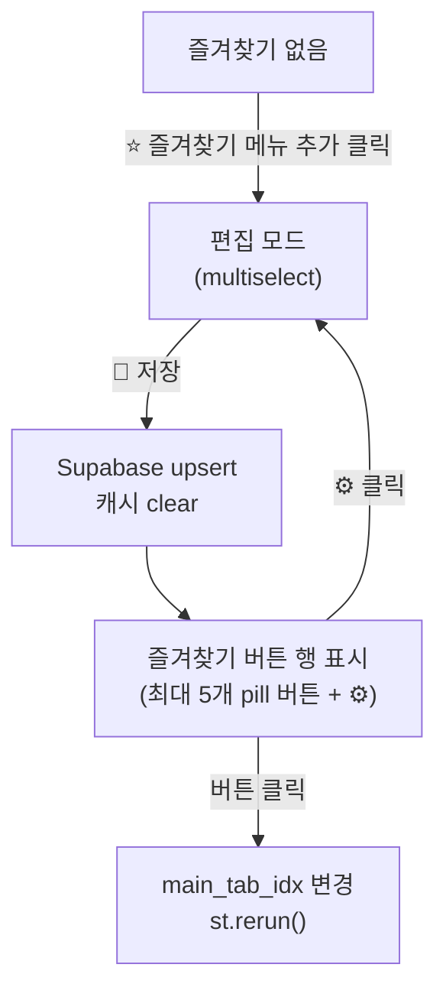

# 즐겨찾기 메뉴 커스터마이즈 기능

## 구현 범위

대상: 일반/매장관리자(`main_menu_select`) 및 superadmin(`superadmin_menu_select`) 두 메뉴 모두 적용.

## 1. DB 마이그레이션 (Supabase SQL)

신규 파일 `SUPABASE_USER_PREFERENCES.sql`을 Supabase SQL Editor에서 실행:

```sql
CREATE TABLE IF NOT EXISTS app_user_preferences (
  username   TEXT PRIMARY KEY,
  fav_menus  JSONB NOT NULL DEFAULT '[]'
);
ALTER TABLE app_user_preferences ENABLE ROW LEVEL SECURITY;
CREATE POLICY "allow_all" ON app_user_preferences FOR ALL USING (true) WITH CHECK (true);
```

## 2. 헬퍼 함수 추가 ([app.py](app.py))

약 `_current_username()` 함수(3278행) 근처에 추가:

```python
@st.cache_data(ttl=300, show_spinner=False)
def _get_user_fav_menus(username: str) -> list[str]:
    cli, err = get_supabase_client()
    if err or not cli:
        return []
    try:
        r = cli.table("app_user_preferences").select("fav_menus").eq("username", username).execute()
        return list((r.data or [{}])[0].get("fav_menus") or []) if r.data else []
    except Exception:
        return []

def _save_user_fav_menus(username: str, menus: list[str]) -> None:
    cli, err = get_supabase_client()
    if err or not cli:
        return
    try:
        cli.table("app_user_preferences").upsert(
            {"username": username, "fav_menus": menus}
        ).execute()
    except Exception:
        pass
    _get_user_fav_menus.clear()
```

## 3. 즐겨찾기 UI 렌더 함수 추가

메뉴 selectbox 직전에 삽입할 공용 렌더러:

```python
def _render_fav_menu_bar(username: str, tab_labels: list[str], tab_idx_key: str) -> None:
    favs = _get_user_fav_menus(username)
    edit_key = f"fav_edit_mode_{username}"

    # ── 바로가기 버튼 행 ──
    if favs:
        btn_cols = st.columns(len(favs) + 1)
        for i, label in enumerate(favs):
            if label in tab_labels and btn_cols[i].button(label, key=f"fav_btn_{i}_{label}"):
                st.session_state[tab_idx_key] = tab_labels.index(label)
                st.rerun()
        if btn_cols[-1].button("⚙️", key=f"fav_edit_toggle_{username}", help="즐겨찾기 편집"):
            st.session_state[edit_key] = not st.session_state.get(edit_key, False)
            st.rerun()
    else:
        if st.button("⭐ 즐겨찾기 메뉴 추가", key=f"fav_add_{username}"):
            st.session_state[edit_key] = True
            st.rerun()

    # ── 편집 모드: multiselect + 저장 ──
    if st.session_state.get(edit_key):
        new_favs = st.multiselect(
            "즐겨찾기 메뉴 선택 (최대 5개)",
            tab_labels, default=[f for f in favs if f in tab_labels],
            max_selections=5, key=f"fav_select_{username}",
        )
        c1, c2 = st.columns([1, 4])
        if c1.button("💾 저장", key=f"fav_save_{username}", type="primary"):
            _save_user_fav_menus(username, new_favs)
            st.session_state[edit_key] = False
            st.rerun()
        if c2.button("취소", key=f"fav_cancel_{username}"):
            st.session_state[edit_key] = False
            st.rerun()
```

## 4. 기존 메뉴 selectbox 앞에 삽입

### main() (약 27708행, [app.py](app.py))

```python
# 기존 "📱 메뉴 선택" 라벨 바로 아래, selectbox 바로 위에 삽입
_render_fav_menu_bar(user["username"], tab_labels, "main_tab_idx")
```

### render_superadmin() (약 21896행, [app.py](app.py))

```python
_render_fav_menu_bar(
    st.session_state.current_user["username"],
    _SUPERADMIN_MENUS, "superadmin_menu_idx"
)
```

## UI 흐름



## 변경 파일 요약

- `SUPABASE_USER_PREFERENCES.sql` — 신규 SQL 마이그레이션 (Supabase에서 직접 실행)
- `app.py` — `_get_user_fav_menus`, `_save_user_fav_menus`, `_render_fav_menu_bar` 함수 추가 + `main()`, `render_superadmin()` 2곳에 한 줄씩 삽입
