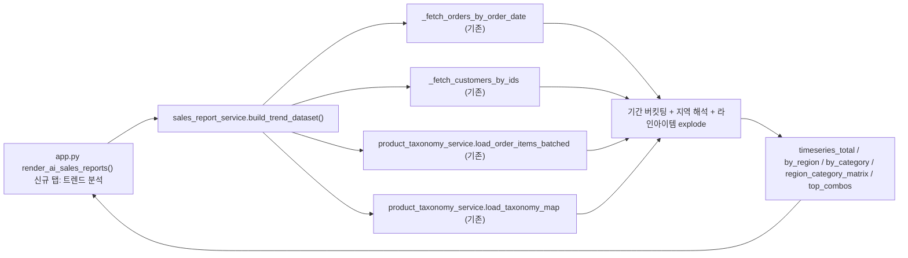

# 지역×품목 트렌드 분석 기능 추가

## 1. 데이터 실측 조사 결과 (Supabase 직접 조회)

| 매장 (db_filename) | 주문 수 | 기간 | 특이사항 |
|---|---|---|---|
| store_1.db (울산삼산점) | 704건 | 2025-08 ~ 2026-07 | 최근 데이터만 존재 |
| store_2.db (울산학성점) | 7,198건 | 2016-03 ~ 2026-07 | **2016~2019 대량 임포트 + 2025~2026 최근 데이터** (2020~2024 공백) — 트렌드 분석의 핵심 대상 |
| store_3.db (양산평산점, 비활성) | 362건 | 2025-05 ~ 2026-06 | 최근 데이터만 |

**고객 지역 필드(`app_customers`) 커버리지** — 카카오 지오코딩 파생 필드:

| 매장 | 고객수 | address | sigungu | bname | lat/lon |
|---|---|---|---|---|---|
| store_1 | 697 | 98% | 80% | 0% | 75% |
| store_2 | 5,150 | 99.9% | **4%** | 0% | 21% |
| store_3 | 308 | 99.7% | 14% | 0% | 60% |

`bname`(법정동)은 전체 매장에서 0% — 지오코딩이 채우지 않는 필드. `sigungu`는 store_2(과거 대량 임포트)에서 4%만 채워져 있어, 이 필드에만 의존하면 트렌드 분석 대상 데이터의 96%가 "지역 미기입"이 된다. 반면 `address`는 99%+ 채워져 있음.

→ **이미 `sales_report_service.py`의 `group_by_region`(501-546행)과 `_extract_region_from_address`(32-46행)가 "sigungu 있으면 사용, 없으면 주소에서 `~구/~군` 정규식 추출" 하이브리드 로직을 구현해 두었음.** 사용자가 선택한 하이브리드 방식과 정확히 일치하므로 이 로직을 그대로 재사용한다.

**품목 분류(`app_product_taxonomy`) 커버리지**:
- `app_order_items` 전체 35,606행 중 92.1%가 분류 테이블에 매칭됨 (미분류 7.9%)
- distinct 품목명 3,527개 중 739개(21%) 미분류 — 대부분 저빈도 품목(long-tail)
- "기타" 카테고리는 37개뿐으로 분류 품질 양호

→ 품목 대분류 축은 기존 taxonomy 인프라(`product_taxonomy_service.load_taxonomy_map`, `load_order_items_batched`)로 충분히 커버 가능.

**기존 인프라 재사용 가능 지점**:
- [sales_report_service.py](sales_report_service.py) `_fetch_orders_by_order_date(store_keys, start, end)` (175행) — order_date 기준 주문 조회, 이미 다매장(`store_key="all"`) 지원
- [sales_report_service.py](sales_report_service.py) `_fetch_customers_by_ids(customer_ids)` (284행) — 매장 무관 고객 조회 (지역 필드 포함)
- [sales_report_service.py](sales_report_service.py) `_extract_region_from_address` / `group_by_region` 의 하이브리드 지역 해석 로직
- [product_taxonomy_service.py](product_taxonomy_service.py) `load_order_items_batched(client, order_ids)` (649행), `load_taxonomy_map(client)` (89행)
- [app.py](app.py) `render_ai_sales_reports()` (24390행) — 기존 "🆕 새 리포트 생성"/"📂 저장된 리포트"/"🏢 건물명 별칭 관리" 3탭 구조에 새 탭 추가
- [app.py](app.py) `_render_ai_sales_reports_new` (24416행)의 기간·매장 선택 UX 패턴 (24421-24453행) 그대로 재사용

## 2. 확정된 설계 결정 (사용자 확인 완료)

- **진입점**: 신규 좌측 메뉴가 아니라, 기존 "📊 AI 세일즈 리포트" 안에 새 탭으로 추가
- **지역 기준**: 하이브리드 (sigungu 있으면 사용, 없으면 주소 정규식 fallback) — 이미 구현된 로직 재사용

## 3. 아키텍처



## 4. 구현 계획

### 4.1 `sales_report_service.py` — 신규 함수 `build_trend_dataset`

```python
def build_trend_dataset(
    store_key: str, start: date, end: date, granularity: str = "auto", top_n: int = 8,
) -> dict:
```

처리 단계:
1. `store_key` → `_store_keys_and_names` (397행, 기존)로 db_filename 목록 확정
2. `_fetch_orders_by_order_date(store_keys, start, end)` 로 주문 조회 (order_date, total_amount, customer_id 등)
3. `granularity == "auto"` 시 기간 길이로 버킷 단위 결정: `<=90일 → 주별`, `90~1095일 → 월별`, `>1095일 → 연도별` (수동 오버라이드 가능)
4. 지역 해석: `_fetch_customers_by_ids`로 고객 조회 후, `group_by_region`과 동일한 sigungu→address fallback 로직으로 주문별 `_region` 컬럼 부여 (건별로, Top-N 집계 전 단계에서 필요하므로 이 부분은 `group_by_region` 내부 로직을 함수로 분리해 재사용 — `_resolve_region_series(orders_df, customers_df)` 헬퍼 신규 추출)
5. 라인아이템 explode: `load_order_items_batched(client, order_ids)` 로 `app_order_items` 조회 → `product_name`을 `load_taxonomy_map` 결과로 카테고리 매핑 (미매칭 시 `"미분류"`) → order의 period/region을 라인에 붙여 `line_total` 기준 집계
6. 산출:
   - `timeseries_total`: `[{period, sales, count}]` (전체 추이)
   - `timeseries_by_region`: `[{period, region, sales}]` — 전체 기간 매출 기준 Top(N-1) 지역 + "기타"
   - `timeseries_by_category`: `[{period, category, sales}]` — Top(N-1) 대분류 + "기타" (line_total 기준)
   - `region_category_matrix`: 전체 기간 지역×대분류 교차 매출 피벗 (`list[dict]` 또는 `DataFrame.to_dict`)
   - `top_combos`: 지역×대분류 조합 매출 Top 15
   - `meta`: `{region_resolved_pct, category_resolved_pct, order_count, line_item_count, granularity_used}`

### 4.2 `app.py` — `render_ai_sales_reports()` (24390행) 에 탭 추가

```python
tab_new, tab_saved, tab_trend, tab_alias = st.tabs(
    ["🆕 새 리포트 생성", "📂 저장된 리포트", "📈 트렌드 분석", "🏢 건물명 별칭 관리"]
)
...
with tab_trend:
    _render_ai_sales_reports_trend(srs)
```

신규 함수 `_render_ai_sales_reports_trend(srs)`:
- 기간·매장 선택 UI는 `_render_ai_sales_reports_new`(24421-24453행)의 `st.date_input`/`st.selectbox` 패턴 그대로 재사용 (기본값: 선택 매장의 최초 주문일 ~ 오늘 — "과거부터 현재까지"에 부합)
- 버킷 단위 선택: `st.selectbox("집계 단위", ["자동", "주별", "월별", "연도별"])`
- 색상 기준 선택: `st.radio("멀티 라인 기준", ["지역별", "품목 대분류별"])` + Top N 슬라이더(5~10)
- 조회 버튼 클릭 시 `srs.build_trend_dataset(...)` 호출, 결과는 `_render_ai_sales_reports_new`와 동일한 fingerprint 패턴(24457-24476행)으로 `st.session_state` 캐시
- 렌더링:
  1. 전체 추이 라인차트 (`px.line`, `timeseries_total`)
  2. 멀티 시리즈 라인차트 (선택한 색상 기준으로 `timeseries_by_region` 또는 `timeseries_by_category`, `px.line(color=...)`)
  3. 지역×품목 교차 히트맵 (`region_category_matrix`, `px.imshow` 또는 그라디언트 스타일 `st.dataframe`)
  4. Top 조합 랭킹 표 (`top_combos`)
  5. 데이터 커버리지 캡션: `meta.region_resolved_pct`, `meta.category_resolved_pct` 노출 — 예: "지역 인식률 96% (카카오 지오코딩 4% + 주소 추출 92%) · 품목 분류율 92%"

## 5. 검증 계획

- 울산학성점(store_2.db) 2016-01 ~ 2019-12 (대량 임포트 구간)과 2025-01 ~ 오늘 (최근 구간) 두 케이스로 조회해, 버킷팅·지역 해석·카테고리 매핑이 정상 동작하는지 확인
- 전 매장 통합(`store_key="all"`) 조회 시에도 정상 동작 확인
- 지역/카테고리 커버리지 캡션 수치가 실제 데이터와 합리적으로 맞는지 확인 (예: store_2는 지역 인식률이 4%(sigungu)+90%대(주소추출) 조합으로 90%대 이상 나와야 함)
