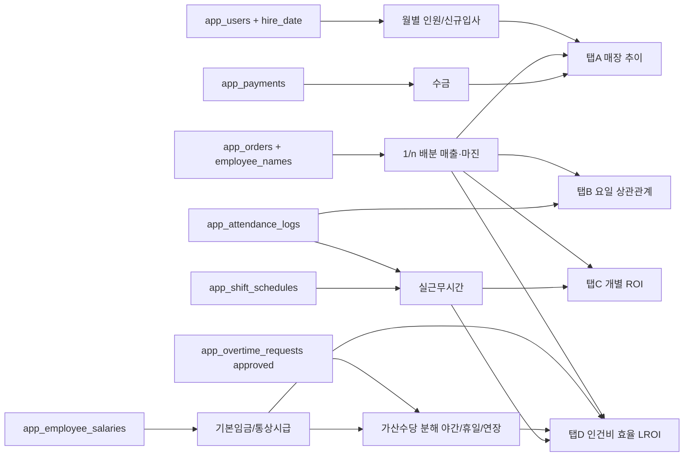

## 1. 데이터 모델 변경

### 1-1. `app_users.hire_date` 추가
- 파일: `SUPABASE_APP_TABLES.sql` 또는 새 `SUPABASE_APP_USERS_HIREDATE.sql` (멱등 ALTER)
- SQL:
  - `ALTER TABLE app_users ADD COLUMN IF NOT EXISTS hire_date DATE;`
  - `CREATE INDEX IF NOT EXISTS idx_app_users_hire_date ON app_users(hire_date);`
- `_supabase_run_app_tables_sql` ([app.py:531](app.py)) 실행 목록에 추가하여 앱 부팅 시 자동 적용.
- 마이그레이션: `app_leave_grants.hire_date` 값이 있고 `app_users.hire_date`가 NULL이면 1회 백필 (앱 부팅 또는 관리 페이지 버튼).

### 1-2. 직원 마스터 UI에 입사일 입력
- `render_employee_management()` ([app.py:10306](app.py)) — superadmin: 신규 등록 폼에 `st.date_input("입사일")` 추가 + 기존 직원 목록 행마다 입사일 인라인 수정 가능.
- `render_store_admin_employees()` ([app.py:11376](app.py)) — store_admin: 본인 매장 직원의 입사일 편집 허용.

### 1-3. `app_employee_salaries` 신규 테이블

새 파일: `SUPABASE_APP_EMPLOYEE_SALARIES.sql` (멱등 DDL)

```sql
CREATE TABLE IF NOT EXISTS app_employee_salaries (
  id BIGSERIAL PRIMARY KEY,
  db_filename TEXT NOT NULL,
  employee_name TEXT NOT NULL,
  salary_type TEXT NOT NULL CHECK (salary_type IN ('monthly','hourly')),
  monthly_salary BIGINT,           -- salary_type='monthly'일 때 사용
  hourly_wage    BIGINT,           -- salary_type='hourly'일 때 사용
  effective_from DATE NOT NULL DEFAULT CURRENT_DATE,
  updated_by TEXT,
  updated_at TIMESTAMPTZ DEFAULT now(),
  UNIQUE (db_filename, employee_name)
);
ALTER TABLE app_employee_salaries ENABLE ROW LEVEL SECURITY;
CREATE POLICY "Allow all" ON app_employee_salaries FOR ALL USING (true) WITH CHECK (true);
```

- 본 플랜에서는 이력 관리를 단순화 (UNIQUE로 단일 행 UPSERT). `effective_from`은 향후 이력 확장을 위해 컬럼만 유지.
- `_supabase_run_app_tables_sql` ([app.py:531](app.py))에 추가하여 자동 실행.

## 2. 사이드바 / 라우팅

- "ERP" 섹션 아래에 신규 버튼 추가: `📈 인력 효율 분석` → `st.session_state["active_admin_page"] = "employee_analytics"`
- 위치: [app.py:16486](app.py) 부근 (`🗓️ 근태 관리` 버튼 아래).
- 라우팅 분기: [app.py:16531](app.py) 부근에 `if active_admin_page == "employee_analytics": render_employee_analytics()` 추가.
- 권한: `store_admin`, `superadmin`만 접근. `user` 역할에는 사이드바 버튼 비표시 + `render_employee_analytics()` 진입 시 role 재검사 후 차단.

## 3. 새 함수 `render_employee_analytics()`

새 함수를 `render_erp_attendance` 근처 (`app.py` 9956 부근)에 배치하고, 다음 4개 탭으로 구성. 함수 시작부에서 role 검증:

```python
role = (st.session_state.get("current_user") or {}).get("role")
if role not in ("store_admin", "superadmin"):
    st.error("접근 권한이 없습니다. 매장 관리자 이상만 이용 가능합니다.")
    return
```

### 탭 A: 매장별 인원수 & 효율 추이 (월별)

- **데이터 소스**
  - 인원수: 월 1일 기준 `app_users.hire_date <= 해당월말 AND (퇴사일 없음 OR 퇴사일 >= 해당월초)` 카운트 (퇴사일은 이번 범위 밖이라 우선 입사일만 사용)
  - 신규 입사: `hire_date`가 해당 월에 속하는 직원 수
  - 매출/마진: 기존 `_kpi_employee_totals_from_sales_slice` ([app.py:15093](app.py)) 월 단위 집계
  - 수금: `_aggregate_cash_collected_by_employee` ([app.py:1931](app.py))
- **표시 항목 (라인/막대 차트 + 표)**
  - 월별 총 인원수, 신규 입사자 수, 총 매출, 총 마진, 인당 매출, 인당 마진, 인당 수금
- **필터**: 매장 선택 (superadmin은 전체 가능), 기간 (최근 6/12/24개월)
- **엑셀 다운로드** 제공

### 탭 B: 요일/근무 인원 vs 매출 상관관계

- **데이터 소스**
  - 요일별 평균 근무 인원: `app_attendance_logs` 의 정상 출근(`work_type='정상근무'` 또는 `leave_deduction < 1`) 카운트를 요일별 평균
  - 데이터 부족 시 폴백: `app_shift_schedules`의 계획 근무 인원
  - 요일별 평균 매출: `app_orders.order_date` 의 요일 분포 × 평균 일매출
- **표시 항목**
  - 요일별 막대(좌: 평균 매출, 우: 평균 인원) 이중축
  - 산점도: 일자별 (근무인원, 일매출) + 추세선
  - 피어슨 상관계수 (numpy/pandas로 계산)
- **인사이트 텍스트**: "X요일은 인원 대비 매출 효율이 평균보다 N% 낮음/높음" 자동 코멘트
- **데이터 한계 주석**: 현재 시:분 단위 매출이 없어 요일 단위로 분석한다는 안내

### 탭 C: 직원 개별 ROI (실근무 대비 실적)

- **데이터 소스**
  - 분자(매출/마진): 기존 KPI 1/n 배분 결과 ([app.py:15093](app.py))
  - 분모(실근무 시간): `app_attendance_logs.end_time - start_time - 휴게(고정 1h)` 합계, `leave_deduction`만큼 차감. 데이터 부족 시 `app_shift_schedules` 합계로 폴백, 그것도 없으면 "표준일수 × 9시간"으로 폴백
- **핵심 지표 (직원별 표)**
  - 실근무시간(h), 매출(원), 마진(원), 시간당 매출, 시간당 마진, 수금/시간
  - 매장 평균 대비 효율(%), 매장 내 순위
- **시각화**: 산점도 (실근무시간 vs 매출), 매장 평균선 표시
- **재배치 추천 카드**: "효율 상위 N명 / 하위 N명" 자동 추출
- **엑셀 다운로드** 제공

### 탭 D: 급여 / 인건비 효율 (store_admin/superadmin 전용)

#### D-1. 직원 급여 입력 UI

- 매장 직원 목록을 표(`st.data_editor`)로 출력하고 다음 컬럼 편집:
  - `salary_type` (selectbox: `monthly` / `hourly`)
  - `monthly_salary` (월급제 시)
  - `hourly_wage` (시급제 시)
  - `effective_from` (날짜)
- 저장 버튼 → `app_employee_salaries` UPSERT (UNIQUE 충돌 시 UPDATE), 캐시 무효화.

#### D-2. 근로기준법 가산수당 계산 (월별)

대상 월·매장·직원을 선택하면 아래 절차로 자동 계산:

1. **통상시급 산출**
   - `monthly`: `통상시급 = monthly_salary / 209`
   - `hourly`: `통상시급 = hourly_wage`
2. **추가근무 데이터 수집**: `app_overtime_requests` 중 `status='approved'` AND `request_date`가 대상 월에 속하는 행만.
3. **시간대 분해 (요청 1건당)**
   - `extra_start`~`extra_end` 사이를 1분 단위로 분류:
     - **야간 구간**(22:00~06:00 다음날): 야간 가산 대상
     - **휴일 여부**: 해당 `request_date`가 `_erp_is_weekend_or_holiday()` true면 휴일근로
     - 휴일·평일 모두 8시간 한도 트래킹 (월 누적 아닌 일 단위)
4. **수당 계산식 (모두 가산분만, 1.0배의 기본임금은 월급에 포함된 것으로 가정하되 시급제는 별도 가산)**
   - 평일 연장(표준 퇴근 이후 추가): `시간 × 통상시급 × 0.5` (가산분)
   - 야간 추가: `야간시간 × 통상시급 × 0.5`
   - 휴일근로: 8시간 이내 `시간 × 통상시급 × 0.5`, 초과분 `시간 × 통상시급 × 1.0`
   - 시급제는 기본임금 자체도 별도 지급해야 하므로 `시급제 추가 임금 = 시간 × 시급 × (1.5 또는 2.0)` 로 총액 계산 (월급제는 가산분만).
5. **출력 표 컬럼** (직원별)
   - 통상시급, 월급/시급, 평일연장(분/금액), 야간(분/금액), 휴일(분/금액), 가산수당 합계
   - 매출 1/n, 마진 1/n
   - 총 인건비 = 기본급(월급제는 monthly_salary, 시급제는 hourly_wage × 실근무시간) + 가산수당 합계
   - **LROI(Labor ROI) = 매출 / 총 인건비**, **마진/인건비 비율**
6. **요약 카드**: 매장 전체 인건비 총합, 매출 총합, 인건비율(=인건비/매출), 마진율, 평균 LROI.
7. **엑셀 다운로드** 제공.

#### D-3. 한계·가정 안내 메시지

탭 상단에 caption으로 명시:
- 5인 이상 사업장 기준으로 가산수당 일률 적용 (5인 미만 매장의 경우 실제 의무 아님)
- 야간 22:00~06:00, 휴일은 `_ERP_KR_HOLIDAYS` + 주말 기준
- `app_overtime_requests`의 `status='approved'` 건만 인정
- 실제 임금 지급은 4대보험·세금 공제 별도 (본 화면은 총지급액 기준)

## 4. 공통 헬퍼

새로 추가할 함수 (모두 `@st.cache_data(ttl=300)` 적용):

- `_emp_analytics_load_users(db_filename)` → 매장 직원 목록 + hire_date
- `_emp_analytics_load_salaries(db_filename)` → 직원별 급여 정보
- `_emp_analytics_headcount_by_month(db_filename, months)` → 월별 인원/신규입사 DataFrame
- `_emp_analytics_worked_hours(db_filename, period_start, period_end)` → 직원별 실근무시간 (attendance → shift → fallback)
- `_emp_analytics_dow_summary(db_filename, period_start, period_end)` → 요일별 매출/인원/효율
- `_payroll_compute_extra_pay(db_filename, year, month)` → 직원별 가산수당 dict 반환
  - 내부 헬퍼: `_payroll_split_night_minutes(start_dt, end_dt)` (22:00~06:00 야간 구간 분 추출)

저장/입사일/급여 변경 시 캐시 무효화: `_emp_analytics_*.clear()`.

## 5. 성능 / 캐시

- 모든 신규 조회 함수는 `@st.cache_data(ttl=300)` 사용.
- 기간 슬라이딩 시 매번 Supabase 왕복 방지를 위해 (db_filename, period_start, period_end) 키로 캐시.
- `hire_date` 편집 후 `_emp_analytics_load_users.clear()` 호출.

## 6. 데이터 흐름



## 7. 검증 / 성공 기준

- `app_users.hire_date`, `app_employee_salaries` 자동 마이그레이션 후 직원 마스터 화면에서 입사일·급여 입력·수정 가능.
- "인력 효율 분석" 페이지를 `user` 권한이 접근하면 차단 메시지 표시, store_admin/superadmin은 4개 탭 모두 정상 렌더.
- 탭 A: 매장 선택 시 최근 12개월 인원/매출/마진/인당 지표가 표/차트로 출력. 신규 입사 직원이 hire_date 기준 그 달에 +1 카운트.
- 탭 B: 요일별 평균 매출·평균 인원이 이중축 차트로 보이고, 상관계수가 표시됨. attendance 데이터 0건이면 shift 폴백, 둘 다 0이면 안내 메시지.
- 탭 C: 직원별 시간당 매출·마진 표 출력, 매장 평균선 포함 산점도, 엑셀 다운로드 동작.
- 탭 D:
  - 직원 급여 입력 후 즉시 표 반영, 같은 직원 재저장 시 UPSERT (중복 행 생성 안 됨).
  - 야간(22~06) 추가근무 1건을 approved 처리하면 야간 가산이 0.5배로 별도 계산됨.
  - 토요일 추가근무 1건을 approved 처리하면 휴일근로로 분류되어 0.5배(8h이하)/1.0배(8h초과) 가산 적용.
  - 월급제 직원의 통상시급 = monthly_salary / 209로 표 표기.
  - LROI(매출/인건비), 마진/인건비, 인건비율(인건비/매출)이 매장 합계 카드에 표시.
  - 엑셀 다운로드 동작.
- 모든 조회 캐시 적용 + 입사일·급여·승인된 추가근무 변경 시 캐시 무효화.