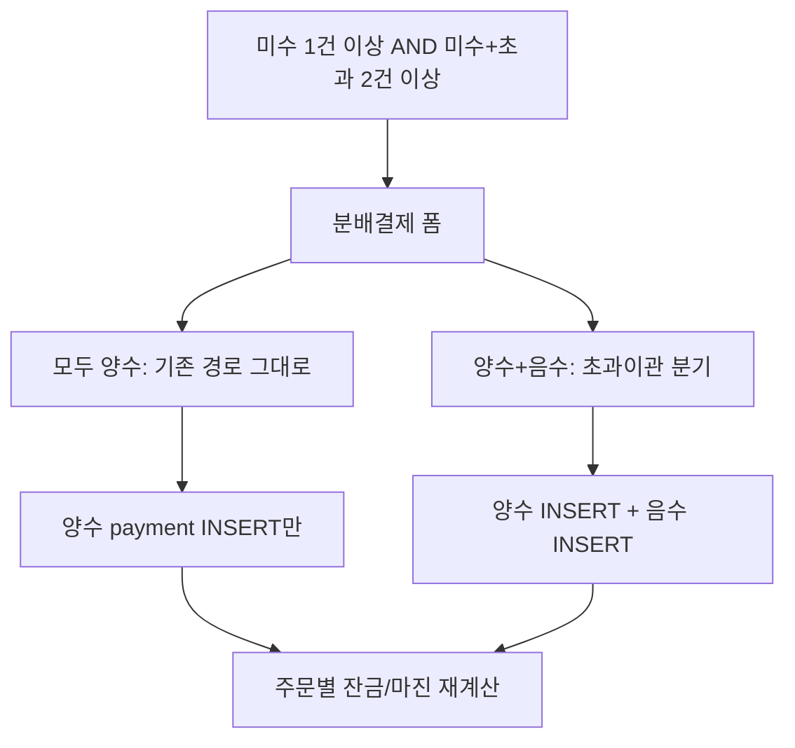

# 초과+미수 조합에서도 분배결제

## 현재 막히는 지점

[`app.py`](app.py) 잔금 추가 결제 구간은 **잔금 > 0인 주문이 2건 이상**일 때만 분배결제 expander를 연다.

```41157:41167:app.py
orders_with_balance = orders[orders["balance"] > 0]
orders_overpaid = orders[orders["balance"] <= 0]
...
if len(orders_with_balance) >= 2 and _split_role in ("store_admin", "superadmin"):
```

변가현 케이스(#10285 잔금 +17,000 / #10284 초과 -17,000)는 미수 주문이 1건이라 칸 자체가 없다.

[`_multi_order_split_payment_ui`](app.py) 도 양수 입금만 가정한다.

- 배분 기본값·합계 파서가 `_format_number_comma` / `_parse_comma_to_int` 라 **마이너스를 숫자로 바꿔 버린다** (`-17,000` → `17,000`)
- 등록 가드: `alloc_total <= 0` / `actual_paid_int <= 0` 이면 차단
- 저장 루프: `alloc_amt <= 0` 이면 skip

기존 2건 이상 미수 + 신규 입금 분배는 그대로 두고, **미수 1건 이상 + (미수+초과) 합계 2건 이상**일 때만 초과 주문을 목록에 넣고 음수 배분을 허용한다.



## 변경 범위 (이 두 곳만)

- 노출 조건 + 전달 DataFrame: [`app.py`](app.py) 약 41163–41167
- 폼/검증/저장: [`_multi_order_split_payment_ui`](app.py) 약 37483–37706

건드리지 않음: `_insert_payment_supabase`, 단건 잔금 결제, 결제변경, KPI/1n 분배, 스키마.

음수 결제행 INSERT는 결제변경 취소와 같은 기존 `app_payments.amount` 음수 패턴을 재사용한다.

## 1. 칸이 뜨는 조건만 넓히기

```python
_split_df = pd.concat(
    [orders_with_balance, orders[orders["balance"] < 0]],
    ignore_index=True,
)
if (
    len(orders_with_balance) >= 1
    and len(_split_df) >= 2
    and _split_role in ("store_admin", "superadmin")
):
    _multi_order_split_payment_ui(db_filename, _split_df, ...)
```

- 미수 2건 이상: 지금과 동일 (초과 0이면 `_split_df == orders_with_balance`)
- 미수 1 + 초과 1: 새로 표시
- 초과만 2건, 미수 0: 여전히 숨김
- 완납(잔금 0)은 목록에 넣지 않음

권한(`store_admin` / `superadmin`)은 유지.

## 2. 폼: 초과 주문은 부호 있는 배분

초과 행(잔금 < 0)만 배분 입력에 `_format_signed_number_comma` + 로컬 signed parse를 쓴다. 미수 행은 기존 unsigned 파서 유지.

- 미수 기본값: 잔금 전액 (기존)
- 초과 기본값: **0** (실수로 초과가 더 늘어나지 않게)
- 캡션: 초과 주문은 `-17,000`처럼 음수를 넣으면 그 금액만큼 해당 주문에서 빼고, 미수 주문 +금액으로 옮긴다
- 음수는 **잔금 < 0인 주문에서만**, 그리고 `|배분| <= |초과잔금|` 일 때만 허용 (이 케이스에서는 -17,000까지만)

기존 `_format_number_comma` / `_parse_comma_to_int` 전역 동작은 변경하지 않는다.

## 3. 검증: 기존 양수 경로는 그대로

등록 버튼을 두 갈래로만 나눈다.

**A. 기존 (음수 배분 없음)**  
지금과 동일: 실입금 > 0, 배분 합계 > 0, 합계 == 실입금, `alloc_amt <= 0` skip, 온누리/지역화폐 중복 검사 유지.

**B. 초과이관 (양수 1건 이상 + 음수 1건 이상)**  
- 합계 == 실입금 (신규 돈 없으면 둘 다 0: `+17,000` + `-17,000` = `0`)
- 실입금 0 허용
- `alloc_total <= 0` 가드는 이 분기에서만 건너뜀
- 온누리 식별자/중복 검사는 **실입금 > 0일 때만** (이관만 할 때는 신규 온누리 건이 아님)
- 음수 행 fee는 기존 `_payment_fee_amount`가 `amount <= 0`이면 0 반환하므로 그대로 사용

## 4. 저장

양수/음수 모두 `_insert_payment_supabase` (또는 기존 SQLite INSERT) 후 주문별 `_recalc_order_actual_margin_*`.

- 이력 `action_type`: 양수는 기존 `"분배결제(복수주문)"`, 음수는 `"분배결제(초과이관)"` 만 구분
- 성공 토스트: 이관이면 `미수 n건 / 이관 n건` 정도로만 표시

변가현 예시 결과:

- #10284 `-17,000` 결제행 → 잔금 0
- #10285 `+17,000` 결제행 → 잔금 0
- 신규 입금 없음, 고객 순잔금 변화 없음

## 5. 안내 문구

앱 내 FAQ 「복수 주문 분배 결제」([`app.py`](app.py) 약 35197–35222)에 한 줄 추가: 미수+초과면 실입금 0, 초과 주문에 음수 배분으로 이관 가능.

## 검증

- 기존: 미수 2건, 실입금 100만, 70/30 분배 → 양수 2행만 INSERT
- 신규: 미수 +17,000 / 초과 -17,000, 실입금 0, 배분 +17,000 / -17,000 → 잔금 둘 다 0
- 초과 주문에 -18,000 입력 → 차단
- 미수 1건만 있는 고객 → 분배결제 칸 없음 (기존과 동일)
