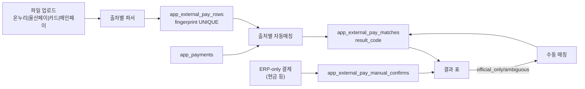

## 배경

`_render_external_pay_admin_section` ([app.py](app.py):29406)은 라디오 2개(`onnuri`/`ulsanpay`)로 파일 업로드 → 파싱 → ERP 결제 매칭을 실행한다. 현재 두 출처 모두 `_is_new_customer_sale` ([app.py](app.py):3326, 3640) 로 후보 결제를 **신규고객 매출**로만 좁힌다. 카드 매출은 재구매 포함 전체 고객이 대상이므로 이 필터를 우회하는 별도 경로가 필요하다.

사용자 확정 사항
- 출처는 2개 추가: `card` (신용/체크카드 통합), `mainpay` (메인페이 단독)
- 카드 매칭 키: **매입일자(±2일) + 카드사(정규화) + 절대금액**. 승인번호는 있으면 후보 좁히는 서브키
- 매칭 안 되는 ERP 결제(현금 수금 등)는 별도 섹션에서 **수동 매칭** 지원

## 스키마 변경 (SQL 1건, 멱등)

[SUPABASE_APP_EXTERNAL_PAY_MATCH.sql](SUPABASE_APP_EXTERNAL_PAY_MATCH.sql) 에 아래 ALTER 를 추가한다. 마이그레이션은 `IF NOT EXISTS` 로 안전 재실행.

- `app_external_pay_rows`
  - `ADD COLUMN IF NOT EXISTS card_company TEXT` — 정규화된 카드사명 (신한/KB/우리/…)
  - `ADD COLUMN IF NOT EXISTS card_kind TEXT` — 신용/체크 구분 (표시용)
  - `CREATE INDEX IF NOT EXISTS idx_ext_rows_card ON app_external_pay_rows (db_filename, source, tx_date, card_company, amount)`
- `app_external_pay_matches`
  - `result_code` 신규 값 사용: `manual_matched`, `manual_confirmed` (스키마 변경 없음, 값만 추가)
- 신규 테이블 `app_external_pay_manual_confirms` — 파일 대응 행이 없는 ERP 결제(현금 등)의 수기 확인 스탬프
  ```sql
  CREATE TABLE IF NOT EXISTS app_external_pay_manual_confirms (
    id BIGSERIAL PRIMARY KEY,
    db_filename TEXT NOT NULL,
    source TEXT NOT NULL,        -- 'cash' | 'transfer' | 'card' | 'mainpay' | 'onnuri' | 'ulsanpay'
    payment_id BIGINT NOT NULL,
    note TEXT,
    confirmed_by TEXT,
    confirmed_at TIMESTAMPTZ DEFAULT now(),
    UNIQUE (db_filename, payment_id)
  );
  ```

## 파서 신설 — [app.py](app.py) `# 외부 결제내역 대사` 섹션에 추가

기존 `_ext_pay_parse_onnuri_file` / `_ext_pay_parse_ulsanpay_file` 옆에 아래 2개 파서를 추가. 컬럼 별칭 dict 형태는 `_ULSANPAY_HEADER_ALIASES` ([app.py](app.py):2174) 와 동일 규약.

- `_CARD_HEADER_ALIASES`: `tx_date`(매입일자/거래일시), `amount`(매입금액/지급금액 중 매입금액 우선), `approval_code`(승인번호), `card_company`(카드사/제휴카드사), `card_kind`(카드종류), `tx_status`(거래상태/취소)
- `_MAINPAY_HEADER_ALIASES`: `tx_date`, `amount`(결제금액/승인금액), `approval_code`, `tx_status`
- `_CARD_COMPANY_NORM`: dict 매핑 (`신한/신한카드/BC신한 → 신한`, `KB국민/국민 → KB국민`, `우리/우리카드 → 우리`, `BC/BC카드 → BC`, `삼성/삼성카드 → 삼성`, `현대/현대카드 → 현대`, `롯데/롯데카드 → 롯데`, `하나/하나카드 → 하나`, `NH농협/농협 → 농협`, 기타는 원문 유지). 매칭 시 양쪽을 이 함수로 정규화 후 비교
- `_ext_pay_parse_card_file(uploaded_file)`, `_ext_pay_parse_mainpay_file(uploaded_file)`: 반환 형식은 기존 파서와 동일 `(rows, error_or_None)`. 각 row에 `card_company`, `card_kind` 필드 포함
- `_ext_pay_fingerprint` ([app.py](app.py):2273) 확장: source가 `card`면 마지막에 `|card_company_norm|approval_code` 를 붙여 지문 중복 방지

## 매칭 함수 신설

`_ext_pay_match_ulsanpay` ([app.py](app.py):3558) 를 기본 골격으로 아래 2개 함수 신설:

- `_ext_pay_match_card(db_filename, verify_from, matched_by)`
  - ERP 후보: `app_payments.payment_method IN ('신용카드','체크카드')` (verify_from 이후, 이미 매칭된 payment_id 제외). **신규고객 필터 제거**
  - 인덱싱: `(card_company_norm, abs(amount))` 로 dict 구성
  - 매칭 로직:
    1. 동일 카드사·동일 금액 후보 중 매입일자 gap 최소인 결제 1개 선택 (`_ext_pay_date_gap_note` 재사용)
    2. 승인번호가 양쪽에 있으면 서브키로 1건 확정 (Excel 앞자리 0 유실 대비 `_ext_pay_approval_alts` 활용)
    3. 후보 0건 → `official_only`, 취소 상태면 `official_canceled`
    4. 후보 다수 → `ambiguous`, 최소 id 임시 매칭
    5. 취소 대응: `neg_orders` 로직 ([app.py](app.py):3679) 을 그대로 이식하여 `erp_canceled_official_paid` 판정
- `_ext_pay_match_mainpay(db_filename, verify_from, matched_by)`
  - ERP 후보: `payment_method = '메인페이'`
  - 인덱싱: `(abs(amount),)` 만. 승인번호가 양쪽에 있으면 서브키로 확정
  - 나머지 로직은 카드와 동일

`_ext_pay_relink_amount_and_near_date` ([app.py](app.py):2788) 에 `source in ("card","mainpay")` 분기 추가하여 재조회 시 근사일 재연결도 지원.

`_ext_pay_source_from_method` ([app.py](app.py):2933) 확장:
- `신용카드`/`체크카드` → `card`, `메인페이` → `mainpay`. 결제 수정 후 `_ext_pay_rematch_after_payment_change` 가 자동 발동되도록.

## 수동 매칭 UI/서비스

두 가지 케이스를 지원한다.

1. **공식 행 ↔ ERP 결제 수동 매칭** (자동 매칭 실패 행)
   - `_ext_pay_manual_link(db_filename, source, row_id, payment_id, matched_by, note)` — `app_external_pay_matches` 를 upsert (row_id UNIQUE), `result_code='manual_matched'`
   - UI: 결과 표에서 `결과 in ('official_only','ambiguous','amount_mismatch')` 인 행 옆에 "수동 매칭" 팝오버. 팝오버 내 검색 필드로 매장·기간·금액·카드사로 ERP 결제 후보 조회 → 라디오 선택 → 저장
2. **ERP-only(현금·계좌이체 등) 수기 확인**
   - `_ext_pay_manual_confirm(db_filename, source, payment_id, note, confirmed_by)` — `app_external_pay_manual_confirms` insert (payment_id UNIQUE)
   - `_ext_pay_list_matches_df` ([app.py](app.py):3970) 의 ERP-only 섹션에서 `manual_confirms` 를 로드하여 확인된 건은 `결과='manual_confirmed'` 로 표시하고 상단 카운트에서 제외

## UI 개편 — `_render_external_pay_admin_section`

라디오 옵션 확장 후 파서·매칭 함수 매핑을 dict 로 정리:

```
src_labels = {
    "onnuri":   "온누리 (디지털)",
    "ulsanpay": "울산페이",
    "card":     "신용/체크카드",
    "mainpay":  "메인페이",
}
_parse_fn_by = {"onnuri": _ext_pay_parse_onnuri_file, "ulsanpay": _ext_pay_parse_ulsanpay_file,
                "card":   _ext_pay_parse_card_file,   "mainpay":  _ext_pay_parse_mainpay_file}
_match_fn_by = {..., "card": _ext_pay_match_card, "mainpay": _ext_pay_match_mainpay}
```

- 상단 제목: "8. 온누리 / 울산페이 / 카드매출 외부파일 대사" 로 변경 ([app.py](app.py):29869)
- 사이드바 진입 힌트 문구 ([app.py](app.py):31153) 도 카드 매칭 키 안내 추가
- 검증 결과 표는 소스에 따라 컬럼 세트 다르게 노출:
  - card: `매입일자 / ERP일자 / 카드사 / 승인번호 / 매입금액 / ERP금액 / 카드종류 / 결과 / 고객명 / 담당매니저 / 메모 / 액션`
  - mainpay: `매입일자 / ERP일자 / 승인번호 / 매입금액 / ERP금액 / 결과 / 고객명 / 담당매니저 / 메모 / 액션`
- 결과 표 아래 신설 `##### ERP-only (수기 확인 필요)` 섹션: 매장 verify_from 이후 payment_method 별(현금(수금)/계좌이체/카드/메인페이) 미매칭 결제 리스트 + "현금 수금으로 확인" 버튼

## 데이터 흐름 요약



## 검증 시나리오

1. 빈 카드 파일 업로드 → 헤더 매핑 실패 시 정확한 오류 메시지 노출
2. 동일 파일 재업로드 → fingerprint 중복 skip 카운트 확인
3. 자동매칭 케이스: 매입일자 +1일 gap 케이스에서 `date_gap_note` 메모 출력
4. `official_only` 행 → 수동 매칭 팝오버에서 특정 payment 지정 → 결과 표에서 `manual_matched` 로 갱신
5. 현금 수금 결제 → ERP-only 섹션 노출 → "현금 수금으로 확인" 클릭 → 카운트에서 제외
6. 결제 수정 (금액 변경) → `_ext_pay_rematch_after_payment_change` 에 `card/mainpay` 소스 포함되어 자동 재매칭

## 범위 밖 (이번 플랜 제외)

- 신규 결제수단 추가 (`PAYMENT_METHOD_OPTIONS` 변경 없음)
- KPI/매출 집계 로직 변경 없음
- 온누리지류(종이 상품권)는 이번 스코프 아님 — 별도 파일 포맷/승인 흐름이 다름
