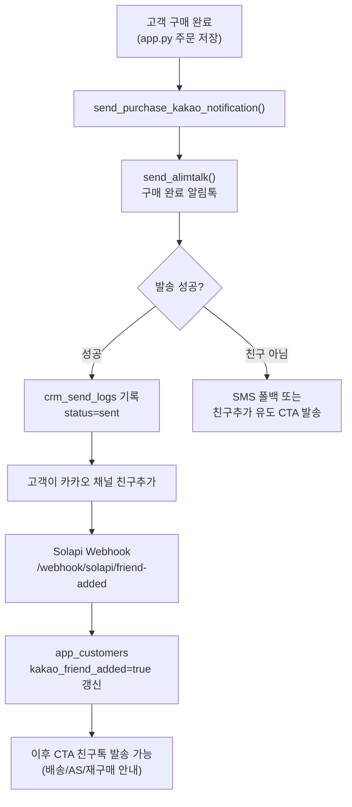

# 카카오채널 고객 연동 플랜

## 현황 분석

### 기존 자산 (활용 가능)
- [solapi_sender.py](solapi_sender.py): Solapi HMAC 인증, 친구톡(CTA) 1건 발송 기능 완비
- [crm_automation.py](crm_automation.py): `app_customers` + `app_orders` 조인, Solapi payload 빌더, 채널 ID(`pf_id`) 설정 구조 존재
- [api.py](api.py): `/webhook/solapi/friend-added` 엔드포인트 이미 구현 (전화번호로 `app_users.kakao_friend_added=true` 패치)
- `app_customers` 테이블: `id, name, phone1, store_name` 등 고객 정보 보유. 단, `kakao_friend_added` 컬럼 없음

### 현재 한계
- `app_customers`에 카카오 채널 친구추가 여부 컬럼 없음
- 구매 직후 자동 친구추가 유도 메시지 발송 로직 없음
- 알림톡(ATA) 템플릿 승인 기반 발송 코드 없음 (CRM은 CTA 광고 친구톡만 지원)
- 고객 DB와 카카오 채널 구독자 간 동기화 UI 없음

---

## 카카오채널 연동 방식 (기술 결정)

```
메시지 유형 선택 기준:
  ATA(알림톡)  → 채널 친구 여부 불문, 템플릿 사전 승인 필요, 마케팅 아님
  CTA(친구톡)  → 채널 친구만 수신, 템플릿 불필요, 광고 표시 필요
```

구매 직후 첫 안내: **ATA 알림톡** (친구 여부 무관, 비용 저렴)  
이후 재구매/AS/배송 안내: **CTA 친구톡** (채널 구독자 대상)

---

## 구현 단계

### Step 1: DB 마이그레이션 (Supabase SQL Editor)

`app_customers` 테이블에 카카오 관련 컬럼 추가:

```sql
ALTER TABLE app_customers
  ADD COLUMN IF NOT EXISTS kakao_friend_added BOOLEAN DEFAULT FALSE,
  ADD COLUMN IF NOT EXISTS kakao_friend_added_at TIMESTAMPTZ,
  ADD COLUMN IF NOT EXISTS kakao_user_key TEXT;

CREATE INDEX IF NOT EXISTS idx_app_customers_kakao
  ON app_customers(store_name, kakao_friend_added);
```

### Step 2: api.py 웹훅 확장

기존 `/webhook/solapi/friend-added`는 `app_users`만 갱신함.  
고객 테이블(`app_customers`)도 동시 갱신하도록 확장:

```python
# phone 매칭으로 app_customers 도 업데이트 (기존 app_users 갱신 코드 아래에 추가)
resp2 = await client.patch(
    _supa_url("app_customers") + f"?phone1=eq.{digits}",
    headers=headers,
    json={"kakao_friend_added": True,
          "kakao_friend_added_at": datetime.utcnow().isoformat()},
)
```

### Step 3: solapi_sender.py 확장 - 알림톡(ATA) 발송 함수 추가

기존 `send_friendtalk()` (CTA) 외에 `send_alimtalk()` 함수 추가:

```python
def send_alimtalk(
    to_phone: str,
    template_code: str,   # 카카오 사전 승인 템플릿 코드
    variables: dict,      # {변수명: 값}
    *,
    pf_id: str | None = None,
    fallback_sms_text: str | None = None,
) -> dict:
    # type: "ATA", kakaoOptions: {pfId, templateCode, variables}
    # fallback sms: disableSms=False 이면 Solapi가 자동 SMS 대체
```

### Step 4: crm_automation.py 확장 - 구매 직후 발송 트리거

`_send_purchase_notification()` 함수를 추가하여,  
신규 주문 등록 시점(`app.py`의 주문 저장 직후)에서 호출:

```python
def send_purchase_kakao_notification(
    customer_id: int,
    order_info: dict,   # {name, category, total_amount, delivery_date}
    template_code: str, # Solapi 등록 알림톡 템플릿 코드
) -> dict:
    # app_customers에서 phone1 조회
    # send_alimtalk() 호출
    # 결과를 crm_send_logs 테이블에 기록
```

### Step 5: crm_send_logs 테이블 신설 (발송 이력 관리)

```sql
CREATE TABLE IF NOT EXISTS crm_send_logs (
  id BIGSERIAL PRIMARY KEY,
  customer_id BIGINT REFERENCES app_customers(id),
  store_name TEXT,
  order_id BIGINT,
  send_type TEXT,        -- 'alimtalk' | 'friendtalk' | 'sms'
  template_code TEXT,
  status TEXT,           -- 'sent' | 'failed' | 'skipped' | 'not_friend'
  msg_id TEXT,
  error TEXT,
  sent_at TIMESTAMPTZ DEFAULT NOW()
);
```

### Step 6: app.py - 주문 등록 직후 자동 발송 연동

주문 저장 성공 시점에 `send_purchase_kakao_notification()` 호출 추가.  
해당 위치는 `app.py`의 주문 저장 처리 블록 (`app_orders` INSERT 직후).

### Step 7: CRM 메뉴 - 카카오 채널 동기화 현황 탭 추가

`crm_automation.py`의 `render_crm_menu()` 내에 탭 추가:

- **채널 친구 현황**: `app_customers` 기준 매장별 친구추가 완료/미완료 현황 표
- **미친구 고객 대상 발송**: 미친구 고객 필터 후 친구추가 유도 CTA 메시지 발송
- **발송 이력 조회**: `crm_send_logs` 조회, Excel 다운로드

---

## 카카오 채널 사전 준비 사항 (운영자 처리 필요)

카카오 비즈니스 채널 설정은 코드로 처리되지 않으며, 아래는 수동 처리가 필요함:

- **카카오 비즈니스 채널 개설**: [https://business.kakao.com](https://business.kakao.com) 에서 채널 개설 및 심사
- **Solapi 채널 연동**: Solapi 대시보드에서 카카오 채널 연결 → `pf_id` (발신 프로필 ID) 획득
- **알림톡 템플릿 등록 및 승인**: 구매 완료 / 배송 안내 등 템플릿을 Solapi에 등록 후 카카오 심사 (2~5 영업일)
- **Solapi Webhook 등록**: Solapi 콘솔 > 웹훅 설정 > 친구추가 이벤트 URL = `https://<서버주소>/webhook/solapi/friend-added`
- **secrets.toml 업데이트**:

```toml
[solapi]
api_key = "..."
api_secret = "..."
sender = "01012345678"
pf_id = "_카카오채널pfId_"
purchase_template_code = "KA01TP..."   # 구매 완료 알림톡 템플릿 코드
```

---

## 전체 데이터 흐름



---

## 파일별 변경 요약

- [solapi_sender.py](solapi_sender.py): `send_alimtalk()` 함수 추가
- [api.py](api.py): `/webhook/solapi/friend-added`에서 `app_customers` 갱신 로직 추가
- [crm_automation.py](crm_automation.py): `send_purchase_kakao_notification()` + CRM 동기화 현황 탭 추가
- [app.py](app.py): 주문 저장 직후 `send_purchase_kakao_notification()` 호출 추가
- SQL 신규: `app_customers` 컬럼 추가, `crm_send_logs` 테이블 생성
