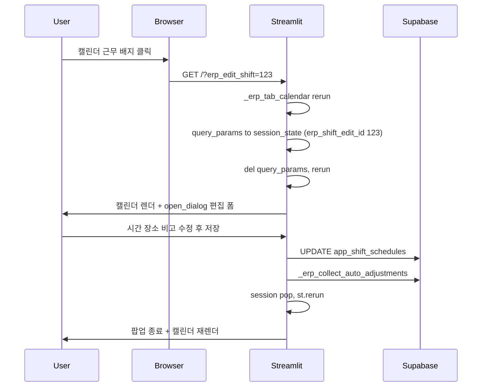

# 캘린더 근무 클릭 → 팝업 편집

## 배경 / 목표

- 현재 [app.py](app.py) 의 `_erp_tab_calendar` (L12885 `@st.fragment`) 는 근무 계획을 순수 HTML `<table>` 로 렌더링해 배지 자체는 클릭 불가.
- 편집은 캘린더 하단 `등록된 근무일 수정 / 삭제` expander (L13521-13920) 에서 매장·직원을 선택 후 연필 버튼으로만 가능.
- 사용자 요구: 캘린더의 근무 배지(예: `울산삼산점 최지빈 10:00~19:30`) 클릭 → 팝업이 뜨고 그 자리에서 수정 저장.

## 접근 방식

Streamlit 위젯은 HTML `<table>` 안에 삽입 불가능하므로, **HTML `<a href="?erp_edit_shift=<id>">` 링크 + `st.query_params` 감지** 방식을 사용. `<a>` 클릭 시 URL 파라미터가 바뀌면 Streamlit 이 자동 rerun 하고, 함수 시작부에서 쿼리 파라미터를 세션 상태로 승격한 뒤 `ui_dialogs.open_dialog` 로 편집 팝업을 노출.

- **범위 (기본값)**: shift_schedules 배지만 클릭 가능. 근태 로그(추가근무·회의·조퇴·여름휴가·포상 등) 배지는 손대지 않음 (승인 흐름에서 생성되므로 캘린더에서 직접 수정 대상 아님).
- **권한 (기본값)**: 관리자(`store_admin`/`superadmin`) 는 모두 편집. 일반 유저는 본인 근무만 링크 활성화 — 타 직원 배지는 커서·링크 없이 표시.
- 기존 하단 expander(L13524 `등록된 근무일 수정 / 삭제`) 는 **유지** (일괄 삭제·다중 직원 관리·새 날짜 추가 용도).

## 수정 지점 (파일 1개)

[app.py](app.py) `_erp_tab_calendar` 만 편집.

### 1. 쿼리 파라미터 → 세션 승격 (함수 진입부, L12889 `import calendar` 직후)

```python
try:
    _qp_edit_val = st.query_params.get("erp_edit_shift")
    if _qp_edit_val:
        try:
            st.session_state["erp_shift_edit_id"] = int(_qp_edit_val)
        except (TypeError, ValueError):
            pass
        del st.query_params["erp_edit_shift"]
except Exception:
    pass
```

두 번 rerun 이 발생하지만(쿼리 세팅 후 삭제 반영) 세션 값이 유지되어 팝업은 정상 노출.

### 2. 근무 배지에 `<a>` 래핑 (기존 L13282-13288 근무 계획 렌더링)

권한이 있고 shift `id` 가 있을 때만 링크를 씌우고, 그 외에는 기존 `<div>` 유지:

```python
_is_admin_cal = role in ("store_admin", "superadmin")
_can_edit = _is_admin_cal or (emp == me_name)
_shift_id = sh.get("id")
_open_tag = (
    f"<a href='?erp_edit_shift={_shift_id}' target='_self' "
    f"style='display:block; text-decoration:none; cursor:pointer;' "
    f"title='클릭하여 이 근무일 수정'>"
    if (_can_edit and _shift_id) else "<div>"
)
_close_tag = "</a>" if (_can_edit and _shift_id) else "</div>"
```

### 3. 편집 팝업 렌더러 신설 (`_erp_tab_calendar` 내부 로컬 함수)

기존 하단 expander 의 인라인 편집 폼(L13693-13786)을 참조해 동일 로직으로 작성:

- 대상 필드: 출/퇴근 시각(`_erp_time_input_30min`), 근무 장소(`work_location_name` selectbox + 기타 텍스트 입력), 비고(`note`)
- 저장: `_erp_update_row("app_shift_schedules", _sid, {...})` + `_erp_collect_auto_adjustments(...)` (표준 시간과의 차이 자동 신청)
- 권한 재검증(URL 조작 방지): 본인 근무 또는 관리자 아닌 경우 편집 폼 대신 안내 메시지
- 저장/취소 후 `session_state.pop("erp_shift_edit_id")` + `st.rerun()` 로 팝업 종료

### 4. 팝업 트리거 (캘린더 HTML 렌더링 직후, L13345 `st.markdown(...)` 다음)

```python
_edit_id_popup = st.session_state.get("erp_shift_edit_id")
if _edit_id_popup:
    _target = next(
        (s for s in all_shifts_for_rules if int(s.get("id") or 0) == _edit_id_popup),
        None,
    )
    if _target:
        from ui_dialogs import open_dialog as _open_dialog
        _open_dialog(
            f"근무일 수정 — {str(_target.get('shift_date') or '')[:10]} · {_target.get('employee_name') or ''}",
            lambda tgt=_target: _render_shift_quick_edit(tgt),
            width="medium",
        )
    else:
        st.session_state.pop("erp_shift_edit_id", None)
```

## 동작 흐름



## 검증 기준

- 관리자 계정으로 아무 근무 배지 클릭 → 팝업 열림 → 시간 수정 → 저장 → 팝업 닫힘 + 캘린더 즉시 반영.
- 일반 유저 계정에서 본인 배지 클릭 → 팝업 열림 · 편집 가능. 다른 직원 배지 클릭 → 아무 동작 없음(링크 자체가 렌더되지 않음).
- 팝업 안 `취소` 클릭 시 URL/세션 초기화 후 캘린더로 복귀.
- 표준 근무시간과 다르게 저장하면 `[정기근무일정] 상단` 에 연장/추가근무 자동 신청 후보가 뜬다 (기존 `_erp_collect_auto_adjustments` 호출 유지).
- 팝업 취소·닫힘 후 URL 에 `?erp_edit_shift=` 잔재가 남지 않는다.

## 리스크 / 대응

- **`<a href>` 로 인한 full-page rerun (fragment scope 이탈)**: `_erp_tab_calendar` 는 `@st.fragment` 이지만 쿼리 파라미터 변경은 스크립트 전체 rerun 을 트리거. `erp_main_tab_label` 세션 값 덕분에 대시보드 탭으로 복귀는 유지됨. 스크롤 위치는 초기화될 수 있음(현행 편집 흐름과 동등).
- **쿼리 파라미터 잔재로 중복 팝업 오픈**: 함수 진입부에서 `del st.query_params["erp_edit_shift"]` 로 즉시 제거하고 세션 값만 사용 → 안전.
- **비-근무 계획(로그·이벤트) 배지 오해**: 이번 변경은 shift_schedules 배지에만 `<a>` 적용. 로그/이벤트/인원 부족 표시는 현행 그대로.
- **`ui_dialogs` 미지원 환경**: `open_dialog` 가 자동으로 `st.expander` 폴백(Phase 1~3 과 동일).

## 롤아웃

1. 위 4개 변경을 한 커밋(`feat: 캘린더 근무 배지 클릭 즉시 편집 팝업`)으로 반영.
2. 배포 후 관리자/일반 계정 각각 QA 시나리오 실행.
3. 문제 없으면 다음 개선(예: 배지에 mini 아이콘 인디케이터, 근태 로그도 클릭 확장) 을 후속 티켓으로 논의.