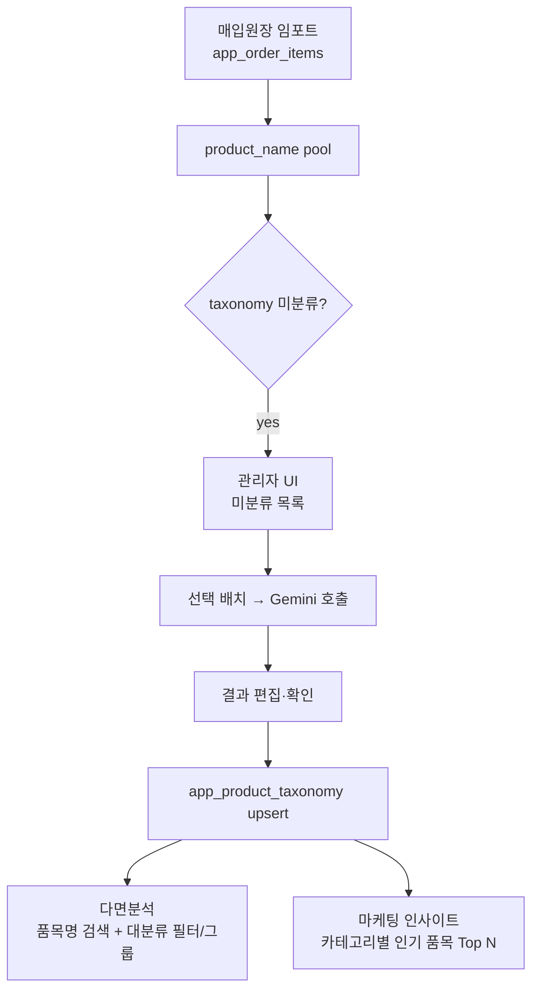

# 품목 taxonomy · 라인검색 · 카테고리 인기품목

## 결정 사항 (확정)

- **taxonomy 스키마**: 대분류 1필드(`category`) — 값 도메인은 기존 `CATEGORY_OPTIONS` 재사용 (`옷장 / 식탁 / 자녀방 / 침대 / SSDS침대 / 서재_학생 / 소파 / 소품 / 전시품 / 기타`)
- **Gemini 실행**: 관리자 UI 배치 실행 전용 ("품목 분류 관리" 메뉴). 미분류만 대상.
- **분류 저장 단위**: `product_name`(문자열) 기준. 동일 이름 다른 코드는 같은 분류로 간주.

## 데이터 흐름



## 파일 변경 범위

- 신규: [SUPABASE_APP_PRODUCT_TAXONOMY.sql](SUPABASE_APP_PRODUCT_TAXONOMY.sql), [product_taxonomy_service.py](product_taxonomy_service.py)
- 수정: [app.py](app.py) — 관리자 메뉴 렌더, `_render_multi_dim_analysis` 다면분석 필터·그룹, `_render_marketing_multi_period_comparison` 카테고리 인기품목 섹션

## 1. 스키마

[SUPABASE_APP_PRODUCT_TAXONOMY.sql](SUPABASE_APP_PRODUCT_TAXONOMY.sql):

```sql
CREATE TABLE IF NOT EXISTS app_product_taxonomy (
  product_name TEXT PRIMARY KEY,
  category     TEXT NOT NULL,
  source       TEXT NOT NULL DEFAULT 'gemini',  -- gemini | manual | override
  confidence   REAL,
  updated_by   TEXT,
  updated_at   TIMESTAMPTZ DEFAULT now(),
  CHECK (category IN ('옷장','식탁','자녀방','침대','SSDS침대','서재_학생','소파','소품','전시품','기타'))
);
CREATE INDEX IF NOT EXISTS idx_taxonomy_category ON app_product_taxonomy(category);
```

동일 문자열이 여러 db_filename(매장) 에 걸쳐 등장해도 하나의 분류로 통합됨. 필요 시 미래에 매장별 override 컬럼 추가 가능(범위 밖).

## 2. 서비스 모듈 [product_taxonomy_service.py](product_taxonomy_service.py)

```python
CATEGORIES = ["옷장","식탁","자녀방","침대","SSDS침대","서재_학생","소파","소품","전시품","기타"]

def load_taxonomy_map(client) -> dict[str, str]:
    # SELECT product_name, category FROM app_product_taxonomy (page 1000)

def find_unclassified_product_names(client, *, db_filename: Optional[str]=None, limit: int=2000) -> list[str]:
    # 1) app_order_items 에서 distinct product_name (db_filename 필터 옵션)
    # 2) taxonomy 에 없는 것만 반환 (빈도 desc)

def classify_with_gemini(names: list[str], api_key: str, model: str = "gemini-flash-latest", batch: int = 30) -> dict[str, tuple[str, float]]:
    # 프롬프트: 아래 가구 품목명을 정확히 하나의 카테고리로 분류. JSON 만 반환.
    # 카테고리 목록/가이드 예시(디망스 침대 세트 사례 포함) 을 시스템 프롬프트에 하드코딩.
    # 반환: {name: (category, confidence)}. 실패 항목은 '기타' + 0.0

def upsert_classifications(client, mapping: dict[str,str], *, source: str, updated_by: str) -> int:
    # UPSERT (batch 100)
```

Gemini 프롬프트 요지:
- role: 가구 매장 매입원장 품목명을 하나의 대분류로 분류하는 분류기
- allowed categories 목록 명시 + 각 카테고리 예시
- 힌트: `SSDS침대` = SSDS 브랜드/모델의 침대류(부속·확장 포함), 일반 `침대`와 구분. 협탁·서랍장·머리판·확장쿠션 등 세트 부속은 침대 세트면 `침대`(또는 `SSDS침대`) 아래로 흡수. 거울·수납함·확장쿠션 단품 성격은 `소품`.
- 출력: `{"품목명": "카테고리"}` JSON only

## 3. 관리자 UI ("품목 분류 관리")

[app.py](app.py) 사이드바 관리자 섹션에 신규 페이지 렌더 함수 `_render_product_taxonomy_admin()` 추가. 슈퍼관리자 또는 매장관리자 접근 허용.

- 상단: 통계 (총 product_name 종수 / 분류 완료 / 미분류)
- 필터: `db_filename`(선택 시 해당 매장 라인만), 검색어(부분일치), 카테고리 미지정만 보기
- **미분류 리스트**: `st.data_editor` 로 편집 가능 (`product_name`, 빈도, `category` 컬럼) + 다중 선택 체크박스
  - [Gemini 자동 분류] 버튼: 선택된 행만 배치 호출(진행 스피너 + 결과 카테고리 자동 채움) → 사용자 재확인 후 [저장] 클릭 시 upsert
  - [수동 저장]: 카테고리 직접 편집 후 [저장] 만으로도 반영 (`source='manual'`)
- **분류된 리스트**: 조회·재분류(카테고리 override, `source='override'`) 가능

캐시는 `@st.cache_data(ttl=180)` 로 `load_taxonomy_map` 및 `find_unclassified_product_names` 결과 저장. 저장 성공 후 캐시 무효화 처리.

## 4. 다면분석 확장 [app.py](app.py) `_render_multi_dim_analysis`

**세션 상태**: 진입 시 taxonomy_map 을 `st.cache_data` 로 로드(전 사용자 공유). merged 는 order-level 이므로 line-item 은 **폼 제출 후에만** 로드.

### 4.1 폼 필터 (7368 이하 블록에 삽입)

- 신규 텍스트 입력 `f_product_query`: "품목명 포함 검색 (라인 기반)" — 공백 구분 다중 키워드 AND 매칭
- 신규 multiselect `f_tax_cat`: "품목 대분류(자동분류)" — CATEGORIES 목록

세션 저장 dict `_mdim_query` 에 `f_product_query`, `f_tax_cat` 추가.

### 4.2 필터 적용 (7461 라인 이후)

`f_product_query` 또는 `f_tax_cat` 활성 시에만:

```python
oid_list = fdf["id"].tolist()  # order_id
# batch in_ (200개씩) → app_order_items 조회
items = load_order_items_batched(client, oid_list, columns="order_id, product_name")
items["_tax_cat"] = items["product_name"].map(tax_map).fillna("기타")

matched_oids = items
if f_product_query:
    kw = [w.strip() for w in f_product_query.split() if w.strip()]
    mask = pd.Series(True, index=matched_oids.index)
    for w in kw:
        mask &= matched_oids["product_name"].fillna("").str.contains(w, case=False, na=False)
    matched_oids = matched_oids[mask]
if f_tax_cat:
    matched_oids = matched_oids[matched_oids["_tax_cat"].isin(f_tax_cat)]

fdf = fdf[fdf["id"].isin(matched_oids["order_id"].unique())]
```

### 4.3 그룹화 차원 추가

`dim_map` 에 두 개 신설:

```python
"품목명(라인)": "_line_product_name",
"품목 대분류": "_line_tax_cat",
```

이 두 차원 중 하나라도 선택되면 groupby 이전 단계에서 fdf 를 **line-level 로 explode** (order 1건 → 라인 N건). 매출(`metric`) 계산은 explode 시 `line_total` (VAT 포함) 을 사용. 없으면 `line_cost` fallback.

### 4.4 결과 표시

- 표에 "품목명(라인)" 컬럼 노출 시 각 셀은 실제 product_name (분석 대상 로우가 line-level 인 경우)
- CSV 다운로드 동일 스키마

## 5. 마케팅 인사이트: 카테고리별 인기 품목 [app.py](app.py) `_render_marketing_multi_period_comparison`

기존 "③ 카테고리별 인기 품목 (Top 10)" (7856 라인) 는 `orders.category` 콤마 분리 기반 → **주문 헤더 카테고리 건수** 를 보여줌. 이걸 유지하고 그 아래에 **④ 카테고리 대분류 × 라인 품목명 Top N** 신규 섹션 추가:

```python
# taxonomy join
items_a = fetch_items_for_orders(period_a_order_ids)  # order_id, product_name, quantity, line_total
items_a["대분류"] = items_a["product_name"].map(tax_map).fillna("기타")
rank_a = items_a.groupby(["대분류","product_name"]).agg(
    판매수량=("quantity","sum"), 매출=("line_total","sum"), 라인수=("product_name","count")
).reset_index()
# 대분류별 Top 5 라인
top_per_cat = rank_a.sort_values(["대분류","매출"], ascending=[True,False]).groupby("대분류").head(5)
st.dataframe(top_per_cat, hide_index=True, ...)
```

- 기간 B 도 동일 계산 후 병렬 표시(2열).
- 카테고리 셀렉트박스(전체/특정 대분류) 로 필터. 미분류(`기타`) 는 상단 경고와 "품목 분류 관리로 이동" 링크.
- 최대 400 주문까지만 한 번에 로드(성능 상한); 초과 시 안내 문구.

## 6. 배치 로드 헬퍼

[product_taxonomy_service.py](product_taxonomy_service.py) 또는 [app.py](app.py) 내부 재사용:

```python
def load_order_items_batched(client, order_ids: list[int], columns: str) -> pd.DataFrame:
    # in_ chunk=200, page 1000
```

이미 유사 패턴이 `legacy_purchase_import_service._page_select` 에 있으므로 그 패턴을 참고해 별도 함수로 노출.

## 7. 캐시 · 무효화

- `load_taxonomy_map`: `@st.cache_data(ttl=300)` (key: 없음, 전역)
- `find_unclassified_product_names(db_filename)`: `@st.cache_data(ttl=120)`
- 저장 성공 시 `st.cache_data.clear()` 는 광범위 → `load_taxonomy_map.clear()`, `find_unclassified_product_names.clear()` 개별 clear 로 최소 무효화.

## 8. 검증

- 스키마: 신규 카테고리 값 CHECK 위반이 잡히는지
- taxonomy 미존재 상태에서 다면분석 진입: 새 필터가 미노출 아니라 표시되되 "미분류 다수" 배너
- 관리자 UI 배치:
  - 3~5개 sample 미분류 선택 → Gemini 호출 → 각 항목이 CATEGORIES 안 값으로 채워짐
  - 저장 후 다면분석에서 즉시 필터/그룹 반영(캐시 clear 이후)
- 다면분석: `f_product_query="디망스 협탁"` 검색 시 order/customer 결과가 라인아이템 매칭에 근거하는지
- 마케팅 인사이트: 대분류별 Top 5 라인 랭킹 매출 합계가 기간 총매출과 대략 일치

## 범위 밖 (명시)

- 세트 그룹(`product_group`), 세트 내 역할(`role`) 필드 (요청상 대분류 1개만)
- 매장별 override (전역 taxonomy 하나로 통일)
- 매입원장 임포트 커밋 시 자동 Gemini 호출 (관리자 배치 전용)
- 다면분석 CSV 에 line-level explode 여부 옵션화 (기본은 line 그룹화 차원 선택 시에만 explode)
